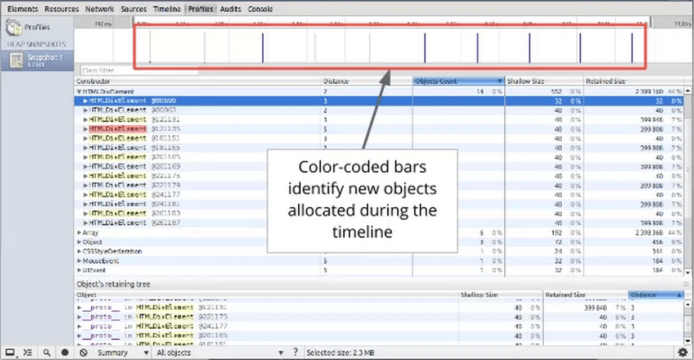

project_path: /web/tools/_project.yaml
book_path: /web/tools/_book.yaml
description: Use the allocation profiler tool to find objects that aren't being properly garbage collected, and continue to retain memory.

{# wf_updated_on: 2015-07-08 #}
{# wf_published_on: 2015-04-13 #}

# How to Use the Allocation Profiler Tool {: .page-title }


Use the allocation profiler tool to find objects that aren't being properly garbage collected, and continue to retain memory.

## How the tool works

The **allocation profiler** combines the detailed snapshot information of the
[heap profiler](/web/tools/chrome-devtools/profile/memory-problems/heap-snapshots)
with the incremental updating and tracking of the
[Timeline panel](/web/tools/chrome-devtools/profile/evaluate-performance/timeline-tool).
Similar to these tools, tracking objects’ heap allocation involves starting a recording,
performing a sequence of actions, then stop the recording for analysis.

The tool takes heap snapshots periodically throughout the recording (as frequently as every 50 ms!) and one final snapshot at the end of the recording.

Note: The number after the @ is an object ID that persists among multiple snapshots taken. This allows precise comparison between heap states. Displaying an object's address makes no sense, as objects are moved during garbage collections.

## Enable allocation profiler

To begin using the allocation profiler:

1. Make sure you have the latest [Chrome Canary](https://www.google.com/intl/en/chrome/browser/canary.html).
2. Open the Developer Tools and click on the gear icon in the lower right.
3. Now, open the Profiler panel, you should see a profile called "Record Heap Allocations"

## Read a heap allocation profile

The heap allocation profile shows where objects are being created and identifies the retaining path.
In the snapshot below, the bars at the top indicate when new objects are found in the heap.

The height of each bar corresponds to the size of the recently allocated objects,
and the color of the bars indicate whether or not those objects are still live in the final heap snapshot.
Blue bars indicate objects that are still live at the end of the timeline,
Gray bars indicate objects that were allocated during the timeline,
but have since been garbage collected:

In the snapshot below, an action was performed 10 times.
The sample program caches five objects, so the last five blue bars are expected.
But the leftmost blue bar indicates a potential problem.

You can then use the sliders in the timeline above to zoom in on that particular snapshot
and see the objects that were recently allocated at that point:

Clicking on a specific object in the heap will show its retaining tree in the bottom portion of the heap snapshot. Examining the retaining path to the object should give you enough information to understand why the object was not collected, and you can make the necessary code changes to remove the unnecessary reference.

## View memory allocation by function {: #allocation-profiler }

You can also view memory allocation by JavaScript function. See
[Investigate memory allocation by function](index#allocation-profile) for
more information.
