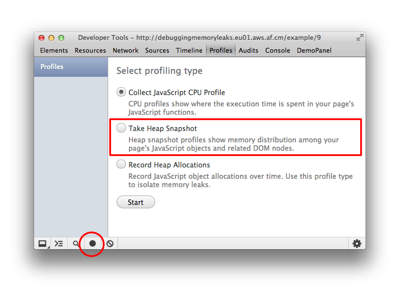
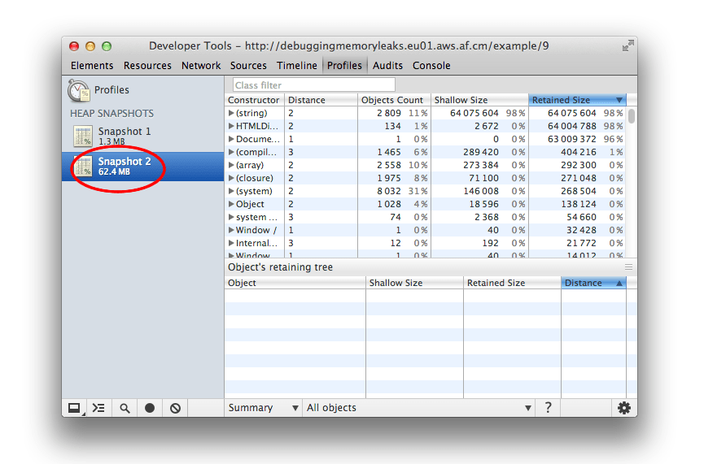
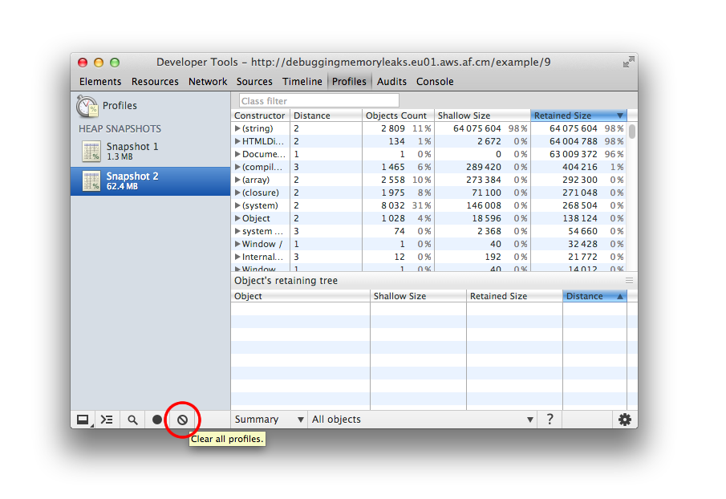
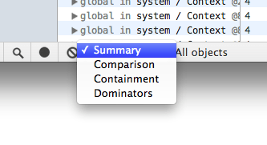
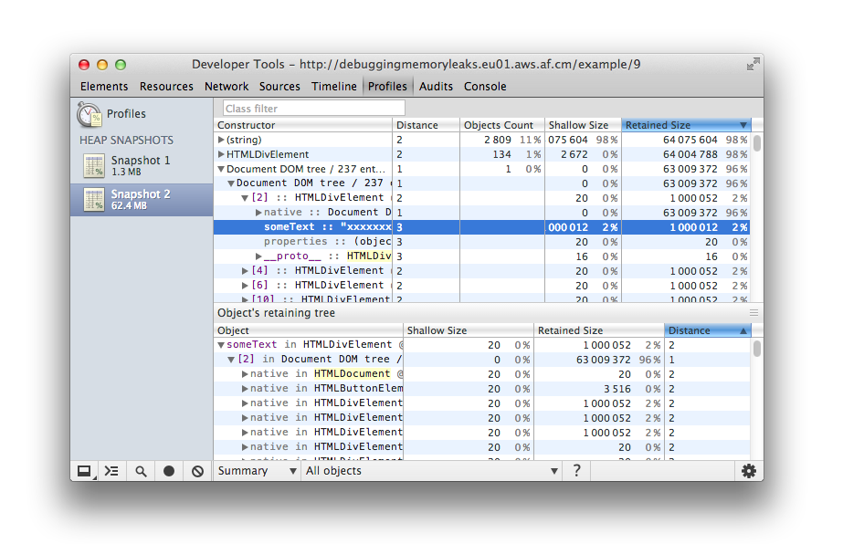
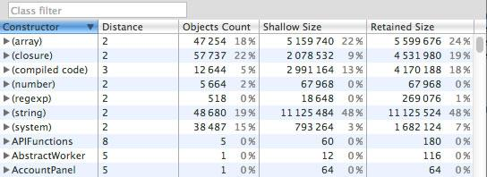
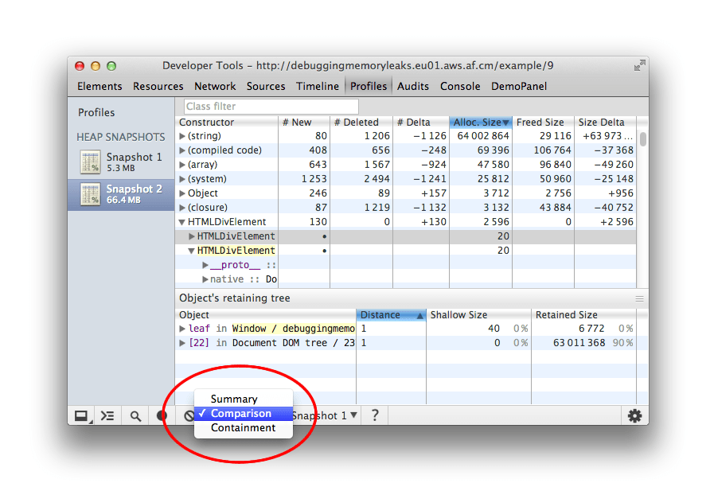
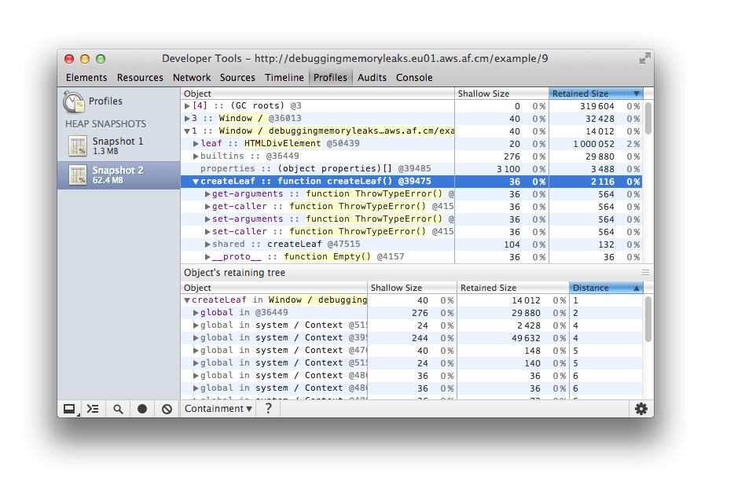
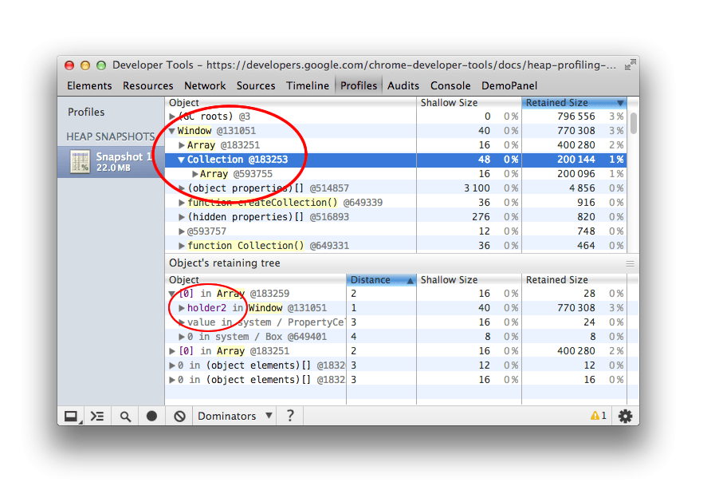
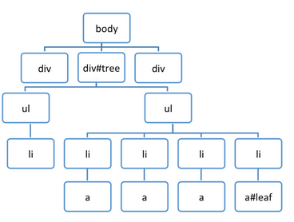

project_path: /web/tools/_project.yaml
book_path: /web/tools/_book.yaml
description: Learn how to record heap snapshots with the Chrome DevTools heap profiler and find memory leaks.

{# wf_updated_on: 2017-07-24 #}
{# wf_published_on: 2015-06-08 #}

# How to Record Heap Snapshots {: .page-title }



Learn how to record heap snapshots with the Chrome DevTools heap profiler and find memory leaks.

The Chrome DevTools heap profiler shows memory distribution
by your page's JavaScript objects and related DOM nodes
(see also [Objects retaining tree](/web/tools/chrome-devtools/profile/memory-problems/memory-101#objects-retaining-tree)).
Use it to take JS heap snapshots, analyze memory graphs,
compare snapshots, and find memory leaks.

## Take a snapshot

On the Profiles panel, choose **Take Heap Snapshot**, then click **Start** or press Cmd + E or Ctrl + E:

**Snapshots** are initially stored in the renderer process memory.
They are transferred to the DevTools on demand, when you click on the snapshot icon to view it.

After the snapshot has been loaded into DevTools and has been parsed,
the number below the snapshot title appears and shows the total size of the
[reachable JavaScript objects](/web/tools/chrome-devtools/profile/memory-problems/memory-101#object-sizes):

Note: Only reachable objects are included in snapshots. Also, taking a snapshot always starts with a garbage collection.

## Clear snapshots

Remove snapshots (both from DevTools and renderers memory) by pressing the Clear all profiles icon:

Closing the DevTools window will not delete profiles from the renderers memory. When reopening DevTools, all previously taken snapshots will reappear in the list of snapshots.

<strong>Example:</strong> Try out this example of <a href="https://github.com/GoogleChrome/devtools-docs/blob/master/docs/demos/memory/example3.html">scattered objects</a> and profile it using the Heap Profiler. You should see a number of (object) item allocations.

## View snapshots

View snapshots from different perspectives for different tasks.

**Summary view** shows objects grouped by the constructor name. Use it to hunt down objects (and their memory use) based on type grouped by constructor name. It's particularly helpful for
[tracking down DOM leaks](/web/tools/chrome-devtools/profile/memory-problems/memory-diagnosis#narrow-down-causes-of-memory-leaks).

**Comparison view** displays difference between two snapshots. Use it to compare two (or more) memory snapshots of before and after an operation. Inspecting the delta in freed memory and reference count lets you confirm the presence and cause of a memory leak.

**Containment view** allows exploration of heap contents. It provides a better view of object structure, helping analyze objects referenced in the global namespace (window) to find out what is keeping them around. Use it to analyze closures and dive into your objects at a low level.

**Dominators view** shows the
[dominators tree](/web/tools/chrome-devtools/profile/memory-problems/memory-101#dominators)
and can be useful to find accumulation points.
This view helps confirm that no unexpected references to objects are still hanging around and that deletion/garbage collection is actually working.

To switch between views, use the selector at the bottom of the view:

Note: Not all properties are stored on the JavaScript heap. Properties implemented using getters that execute native code aren't captured. Also, non-string values such as numbers are not captured.

### Summary view

Initially, a snapshot opens in the Summary view, displaying object totals, which can be expanded to show instances:

Top-level entries are "total" lines. They display:

* **Constructor** represents all objects created using this constructor.
* **Number of object instances** is displayed in the # column.
* **Shallow size** column displays the sum of shallow sizes of all objects created by a certain constructor function. The shallow size is the size of memory held by an object itself (generally, arrays and strings have larger shallow sizes). See also [Object sizes](/web/tools/chrome-devtools/profile/memory-problems/memory-101#object-sizes).
* **Retained size** column displays the maximum retained size among the same set of objects. The size of memory that can be freed once an object is deleted (and this its dependents made no longer reachable) is called the retained size. See also [Object sizes](/web/tools/chrome-devtools/profile/memory-problems/memory-101#object-sizes).
* **Distance** displays the distance to the root using the shortest simple path of nodes.

After expanding a total line in the upper view, all of its instances are displayed. For each instance, its shallow and retained sizes are displayed in the corresponding columns. The number after the @ character is the objects’ unique ID, allowing you to compare heap snapshots on per-object basis.

Remember that yellow objects have JavaScript references on them and red objects are detached nodes which are referenced from one with a yellow background.

**What do the various constructor (group) entries in the Heap profiler correspond to?**

* **(global property)** – intermediate objects between a global object (like 'window') and an object referenced by it. If an object is created using a constructor Person and is held by a global object, the retaining path would look like [global] > (global property) > Person. This contrasts with the norm, where objects directly reference each other. We have intermediate objects for performance reasons. Globals are modified regularly and property access optimizations do a good job for non-global objects aren't applicable for globals.

* **(roots)** – The root entries in the retaining tree view are the entities that have references to the selected object. These can also be references created by the engine for its own purposes. The engine has caches which reference objects, but all such references are weak and won't prevent an object from being collected given that there are no truly strong references.

* **(closure)** – a count of references to a group of objects through function closures

* **(array, string, number, regexp)** – a list of object types with properties which reference an Array, String, Number or regular expression.

* **(compiled code)** – simply, everything related to compiled code. Script is similar to a function but corresponds to a &lt;script&gt; body. SharedFunctionInfos (SFI) are objects standing between functions and compiled code. Functions are usually have a context, while SFIs do not.

* **HTMLDivElement**, **HTMLAnchorElement**, **DocumentFragment** etc – references to elements or document objects of a particular type referenced by your code.

<strong>Example:</strong> Try this <a href="https://developer.chrome.com/devtools/docs/heap-profiling-summary">demo page</a> to understand how the Summary view can be used.

### Comparison view

Find leaked objects by comparing multiple snapshots to each other. To verify that a certain application operation doesn't create leaks (for example, usually a pair of direct and reverse operations, like opening a document, and then closing it, should not leave any garbage), you may follow the scenario below:

1. Take a heap snapshot before performing an operation.
2. Perform an operation (interact with a page in some way that you believe to be causing a leak).
3. Perform a reverse operation (do the opposite interaction and repeat it a few times).
4. Take a second heap snapshot and change the view of this one to Comparison, comparing it to snapshot 1.

In the Comparison view, the difference between two snapshots is displayed. When expanding a total entry, added and deleted object instances are shown:

<strong>Example:</strong> Try this <a href="https://developer.chrome.com/devtools/docs/heap-profiling-comparison">demo page</a> to get an idea how to use snapshot comparison for detecting leaks.

### Containment view

The Containment view is essentially a "bird's eye view" of your application's objects structure. It allows you to peek inside function closures, to observe VM internal objects that together make up your JavaScript objects, and to understand how much memory your application uses at a very low level.

The view provides several entry points:

* **DOMWindow objects** are objects considered as "global" objects for JavaScript code.
* **GC roots** are the actual GC roots used by VM's garbage. GC roots can be comprised of built-in object maps, symbol tables, VM thread stacks, compilation caches, handle scopes, global handles.
* **Native objects** are browser objects "pushed" inside the JavaScript virtual machine to allow automation, for example, DOM nodes, CSS rules.

  <strong>Example:</strong> Try this <a href="https://developer.chrome.com/devtools/docs/heap-profiling-containment">demo page</a> for finding out how to explore closures and event handlers using the view.

<strong>A tip about closures</strong>

It helps a lot to name the functions so you can easily distinguish between closures in the snapshot. For example, this example does not use named functions:

    function createLargeClosure() {
      var largeStr = new Array(1000000).join('x');
    
      var lC = function() { // this is NOT a named function
        return largeStr;
      };
    
      return lC;
    }
    

Whilst this example does:

    function createLargeClosure() {
      var largeStr = new Array(1000000).join('x');
    
      var lC = function lC() { // this IS a named function
        return largeStr;
      };
    
      return lC;
    }
    

    <strong>Examples:</strong>
    Try out this example of <a href="https://github.com/GoogleChrome/devtools-docs/blob/master/docs/demos/memory/example7.html">why eval is evil</a> to analyze the impact of closures on memory. You may also be interested in following it up with this example that takes you through recording <a href="https://github.com/GoogleChrome/devtools-docs/blob/master/docs/demos/memory/example8.html">heap allocations</a>.

### Dominators view

The [Dominators](/web/tools/chrome-devtools/profile/memory-problems/memory-101#dominators) view shows the dominators tree for the heap graph.
It looks similar to the Containment view, but lacks property names.
This is because a dominator of an object may lack direct references to it;
the dominators tree is not a spanning tree of the graph.
But this only serves for good,
as helps us to identify memory accumulation points quickly.

<strong>Note:</strong> In Chrome Canary, Dominators view can be enabled by going to Settings > Show advanced heap snapshot properties and restarting the DevTools.

    <strong>Examples:</strong>
    Try this <a href="https://developer.chrome.com/devtools/docs/heap-profiling-dominators">demo</a> to train yourself in finding accumulation points. Follow it up with this example of running into <a href="https://github.com/GoogleChrome/devtools-docs/blob/master/docs/demos/memory/example10.html">retaining paths and dominators</a>.

## Look up color coding

Properties and property values of objects have different types and
are colored accordingly. Each property has one of four types:

* **a: property** — regular property with a name, accessed via the . (dot) operator, or via [ ] (brackets) notation, e.g. ["foo bar"];
* **0: element** — regular property with a numeric index, accessed via [ ] (brackets) notation;
* **a: context var** - variable in a function context, accessible by its name from inside a function closure;
* **a: system prop** - property added by the JavaScript VM, not accessible from JavaScript code.

Objects designated as `System `do not have a corresponding JavaScript type. They are part of JavaScript VM's object system implementation. V8 allocates most of its internal objects in the same heap as the user's JS objects. So these are just v8 internals.

## Find a specific object

To find an object in the collected heap you can search using <kbd><kbd class="kbd">Ctrl</kbd> + <kbd class="kbd">F</kbd></kbd> and give the object ID.

## Uncover DOM leaks

The heap profiler has the ability to reflect bidirectional dependencies
between browser native objects (DOM nodes, CSS rules) and JavaScript objects.
This helps to discover otherwise invisible leaks happening
due to forgotten detached DOM subtrees floating around.

DOM leaks can be bigger than you think.
Consider the following sample - when is the #tree GC?

      var select = document.querySelector;
      var treeRef = select("#tree");
      var leafRef = select("#leaf");
      var body = select("body");
    
      body.removeChild(treeRef);
    
      //#tree can't be GC yet due to treeRef
      treeRef = null;
    
      //#tree can't be GC yet due to indirect
      //reference from leafRef
    
      leafRef = null;
      //#NOW can be #tree GC
    

`#leaf` maintains a reference to it's parent (parentNode) and recursively up
to `#tree`, so only when leafRef is nullified is the WHOLE tree under
`#tree` a candidate for GC.

    <strong>Examples:</strong>
    Try out this example of <a href="https://github.com/GoogleChrome/devtools-docs/blob/master/docs/demos/memory/example6.html">leaking DOM nodes</a> to understand where DOM nodes can leak and how to detect them. You can follow it up by also looking at this example of <a href="https://github.com/GoogleChrome/devtools-docs/blob/master/docs/demos/memory/example9.html">DOM leaks being bigger than expected</a>.

To read more about DOM leaks and memory analysis fundamentals checkout
[Finding and debugging memory leaks with the Chrome DevTools](http://slid.es/gruizdevilla/memory) by Gonzalo Ruiz de Villa.

    <strong>Example:</strong>
    Try this <a href="https://developer.chrome.com/devtools/docs/heap-profiling-dom-leaks">demo</a> to play with detached DOM trees.

