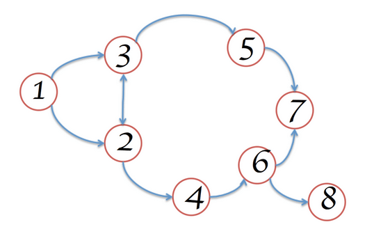
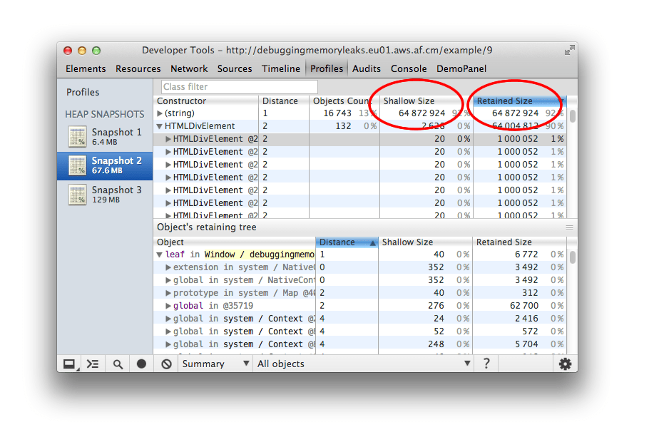
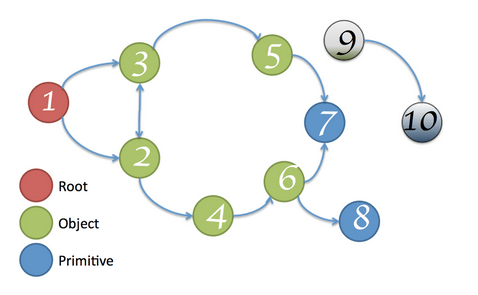
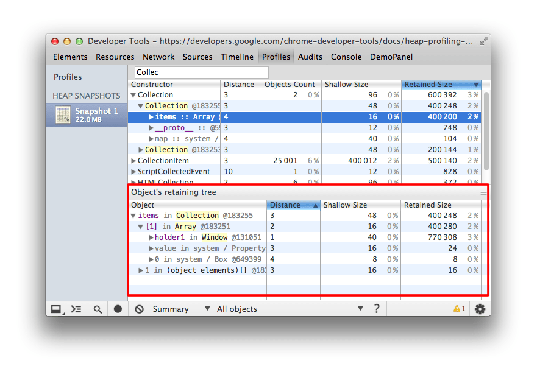
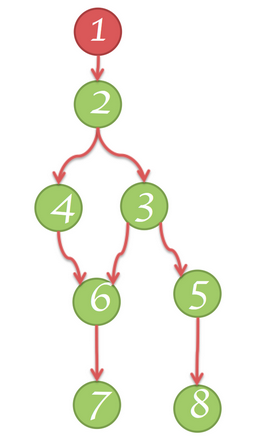
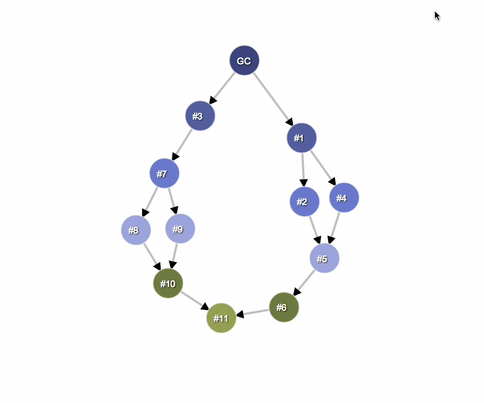

project_path: /web/tools/_project.yaml
book_path: /web/tools/_book.yaml
description: This section describes common terms used in memory analysis, and is applicable to a variety of memory profiling tools for different languages.

{# wf_updated_on: 2015-05-18 #}
{# wf_published_on: 2015-05-18 #}

# Memory Terminology {: .page-title }



This section describes common terms used in memory analysis, and is applicable to a variety of memory profiling tools for different languages.

The terms and notions described here refer to the
[Chrome DevTools Heap Profiler](/web/tools/chrome-devtools/profile/memory-problems/heap-snapshots).
If you have ever worked with either the Java, .NET, or some other memory profiler, then this may be a refresher.

## Object sizes

Think of memory as a graph with primitive types (like numbers and strings) and objects (associative arrays). It might visually be represented as a graph with a number of interconnected points as follows:

An object can hold memory in two ways:

* Directly by the object itself.

* Implicitly by holding references to other objects, and therefore preventing those objects from being automatically disposed by a garbage collector (**GC** for short).

When working with the Heap Profiler in DevTools (a tool for investigating memory issues found under "Profiles"), you will likely find yourself looking at a few different columns of information. Two that stand out are <strong>Shallow Size</strong> and <strong>Retained Size</strong>, but what do these represent?

### Shallow size

This is the size of memory that is held by the object itself.

Typical JavaScript objects have some memory reserved for their description and for storing immediate values. Usually, only arrays and strings can have a significant shallow size. However, strings and external arrays often have their main storage in renderer memory, exposing only a small wrapper object on the JavaScript heap.

Renderer memory is all memory of the process where an inspected page is rendered: native memory + JS heap memory of the page + JS heap memory of all dedicated workers started by the page. Nevertheless, even a small object can hold a large amount of memory indirectly, by preventing other objects from being disposed of by the automatic garbage collection process.

### Retained size

This is the size of memory that is freed once the object itself is deleted along with its dependent objects that were made unreachable from **GC roots**.

**GC roots** are made up of *handles* that are created (either local or global) when making a reference from native code to a JavaScript object outside of V8. All such handles can be found within a heap snapshot under **GC roots** > **Handle scope** and **GC roots** > **Global handles**. Describing the handles in this documentation without diving into details of the browser implementation may be confusing. Both GC roots and the handles are not something you need to worry about.

There are lots of internal GC roots most of which are not interesting for the users. From the applications standpoint there are following kinds of roots:

* Window global object (in each iframe). There is a distance field in the heap snapshots which is the number of property references on the shortest retaining path from the window.

* Document DOM tree consisting of all native DOM nodes reachable by traversing the document. Not all of them may have JS wrappers but if they have the wrappers will be alive while the document is alive.

* Sometimes objects may be retained by debugger context and DevTools console (e.g. after console evaluation). Create heap snapshots with clear console and no active breakpoints in the debugger.

The memory graph starts with a root, which may be the `window` object of the browser or the `Global` object of a Node.js module. You don't control how this root object is GC'd.

Whatever is not reachable from the root gets GC.

Note: Both the Shallow and Retained size columns represent data in bytes.

## Objects retaining tree

The heap is a network of interconnected objects. In the mathematical world, this structure is called a *graph* or memory graph. A graph is constructed from *nodes* connected by means of *edges*, both of which are given labels.

* **Nodes** (*or objects*) are labelled using the name of the *constructor* function that was used to build them.
* **Edges** are labelled using the names of *properties*.

Learn [how to record a profile using the Heap Profiler](/web/tools/chrome-devtools/profile/memory-problems/heap-snapshots).
Some of the eye-catching things we can see
in the Heap Profiler recording below include distance:
the distance from the GC root.
If almost all the objects of the same type are at the same distance,
and a few are at a bigger distance, that's something worth investigating.

## Dominators

Dominator objects are comprised of a tree structure because each object has exactly one dominator. A dominator of an object may lack direct references to an object it dominates; that is, the dominator's tree is not a spanning tree of the graph.

In the diagram below:

* Node 1 dominates node 2
* Node 2 dominates nodes 3, 4 and 6
* Node 3 dominates node 5
* Node 5 dominates node 8
* Node 6 dominates node 7

In the example below, node `#3` is the dominator of `#10`, but `#7` also exists in every simple path from GC to `#10`. Therefore, an object B is a dominator of an object A if B exists in every simple path from the root to the object A.

## V8 specifics

When profiling memory, it is helpful to understand why heap snapshots look a certain way. This section describes some memory-related topics specifically corresponding to the **V8 JavaScript virtual machine** (V8 VM or VM).

### JavaScript object representation

There are three primitive types:

* Numbers (e.g., 3.14159..)
* Booleans (true or false)
* Strings (e.g., 'Werner Heisenberg')

They cannot reference other values and are always leafs or terminating nodes.

**Numbers** can be stored as either:

* an immediate 31-bit integer values called **small integers** (*SMIs*), or
* heap objects, referred to as **heap numbers**. Heap numbers are used for storing values that do not fit into the SMI form, such as *doubles*, or when a value needs to be *boxed*, such as setting properties on it.

**Strings** can be stored in either:

* the **VM heap**, or
* externally in the **renderer’s memory**. A *wrapper object* is created and used for accessing external storage where, for example, script sources and other content that is received from the Web is stored, rather than copied onto the VM heap.

Memory for new JavaScript objects is allocated from a dedicated JavaScript heap (or **VM heap**). These objects are managed by V8's garbage collector and therefore, will stay alive as long as there is at least one strong reference to them.

**Native objects** are everything else which is not in the JavaScript heap. Native object, in contrast to heap object, is not managed by the V8 garbage collector throughout its lifetime, and can only be accessed from JavaScript using its JavaScript wrapper object.

**Cons string** is an object that consists of pairs of strings stored then joined, and is a result of concatenation. The joining of the *cons string* contents occurs only as needed. An example would be when a substring of a joined string needs to be constructed.

For example, if you concatenate **a** and **b**, you get a string (a, b) which represents the result of concatenation. If you later concatenated **d** with that result, you get another cons string ((a, b), d).

**Arrays** - An Array is an Object with numeric keys. They are used extensively in the V8 VM for storing large amounts of data. Sets of key-value pairs used like dictionaries are backed up by arrays.

A typical JavaScript object can be one of two array types used for storing:

* named properties, and
* numeric elements

In cases where there is a very small number of properties, they can be stored internally in the JavaScript object itself.

**Map** - an object that describes the kind of object and its layout. For example, maps are used to describe implicit object hierarchies for [fast property access](/v8/design.html#prop_access).

### Object groups

Each native objects group is made up of objects that hold mutual references to each other. Consider, for example, a DOM subtree where every node has a link to its parent and links to the next child and next sibling, thus forming a connected graph. Note that native objects are not represented in the JavaScript heap — that's why they have zero size. Instead, wrapper objects are created.

Each wrapper object holds a reference to the corresponding native object, for redirecting commands to it. In its own turn, an object group holds wrapper objects. However, this doesn't create an uncollectable cycle, as GC is smart enough to release object groups whose wrappers are no longer referenced. But forgetting to release a single wrapper will hold the whole group and associated wrappers.

