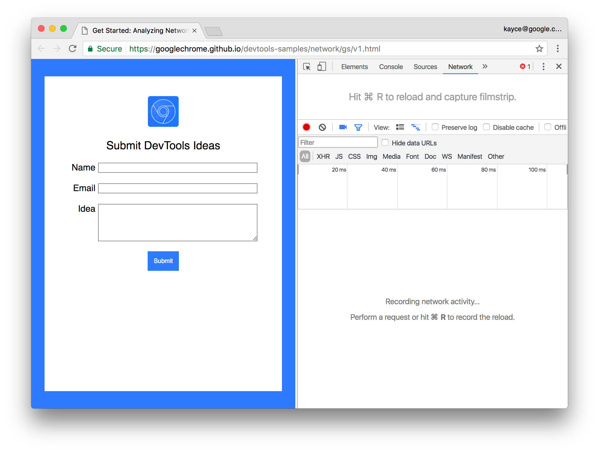
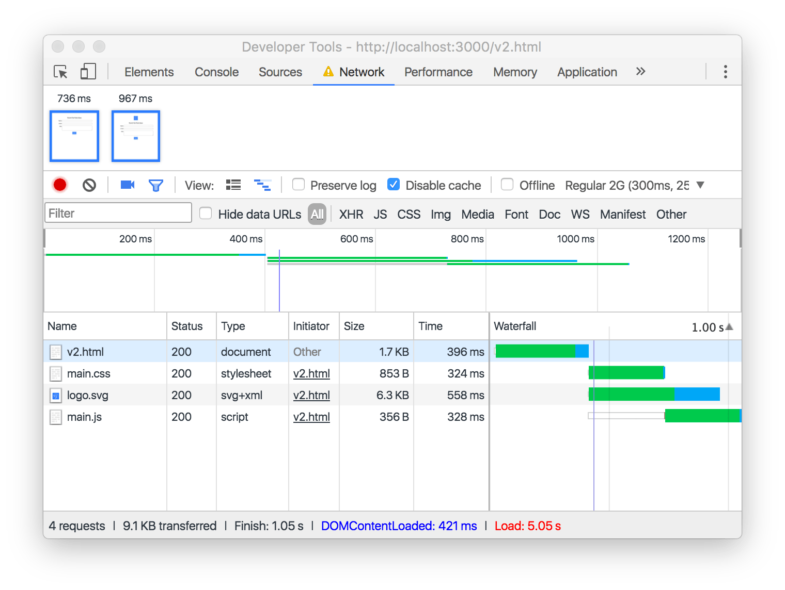

project_path: /web/tools/_project.yaml
book_path: /web/tools/_book.yaml
description: Get started analyzing network performance.

{# wf_updated_on: 2017-03-30 #}
{# wf_published_on: 2017-01-17 #}

# Get Started with Analyzing Network Performance in Chrome DevTools {: .page-title }



Learn how to use the Chrome DevTools Network panel to understand why a page
loads slowly in this step-by-step, interactive tutorial.

## Step 1: Set up DevTools {: #set-up }

Suppose that you're receiving reports from mobile users that a particular page
on your site is slow. Your job is to make the page fast.

1. Click **Open Slow Page**. The page opens in a new tab.

     <a href="https://googlechrome.github.io/devtools-samples/network/gs/v1.html"
       target="devtools" class="gc-analytics-event" rel="noopener noreferrer"
       data-category="DevTools / Network / Get Started"
       data-label="Slow Page Opened">
       <button>Open Slow Page</button>
     </a>

1. While the page is in focus, press
   <kbd>Command</kbd>+<kbd>Option</kbd>+<kbd>I</kbd> (Mac) or
   <kbd>Control</kbd>+<kbd>Shift</kbd>+<kbd>I</kbd> (Windows, Linux) to
   open DevTools on the page.

1. In DevTools, click the **Network** tab.

     <figure>
       
       <figcaption>
         <b>Figure 1</b>. The Chrome DevTools Network panel, opened next to
         the slow page that you're going to diagnose.
       </figcaption>
     </figure>

     <aside class="note">
       <b>Note:</b> For the rest of the screenshots, DevTools is <a
       href="/web/tools/chrome-devtools/ui#placement" target="_blank">
       undocked to a separate window</a>, so that you can see its contents
       better.
     </aside>

1. Enable **Capture Screenshots** ![Capture
   Screenshots][screenshots]{:.devtools-inline}, which turns blue when enabled.
   DevTools captures screenshots during the page load.

## Step 2: Emulate a mobile user's experience {: #emulate }

Testing network performance on a laptop or desktop can be deceiving. Your
internet connection is much faster than a mobile user's, and your browser
caches resources from previous visits.

1. Check the **Disable Cache** checkbox. When this
   checkbox is enabled, DevTools doesn't serve any resources from the cache.
   This more accurately emulates what first-time users experience when they
   view your page.

1. From the dropdown menu that currently says **No Throttling**, select
   **Regular 2G**. DevTools throttles the network connection to simulate a
   regular 2G experience. This is how mobile users experience your site
   in places with poor connections.

<figure>
  
  <figcaption>
    <b>Figure 2</b>. The Chrome DevTools Network panel, set up to emulate
    a mobile user's experience. Screenshots, cache
    disabling, and throttling are outlined in blue, from left to right,
    respectively.
  </figcaption>
</figure>

This is a worst-case setup. If you can get your page
loading fast on this setup, it'll be fast for all your users!

[screenshots]: imgs/capture-screenshots.png

## Step 3: Analyze requests {: #analyze }

Figure out what's making the page slow by reloading the page and analyzing
the requests that come in.

### Part A: Find render-blocking scripts

When the browser encounters a `<script>` tag, it must pause rendering and
execute the script immediately. Find scripts that aren't needed for page load
and mark them asynchronous or defer their execution to speed up load time.

1. Press <kbd>Command</kbd>+<kbd>R</kbd> (Mac) or
   <kbd>Control</kbd>+<kbd>R</kbd> (Windows, Linux) to reload the page.
   On a good Wi-Fi connection, the page takes more than 10 seconds to load
   completely.

     <figure>
       
       <figcaption>
         <b>Figure 3</b>. The Chrome DevTools Network panel, after reloading
         the page.
       </figcaption>
     </figure>

1. Note the value for [`DOMContentLoaded`][DOMContentLoaded] in the [Summary
   pane](reference#summary), on the bottom of the Network panel.
   You should see a value of at least 4 seconds. When you see this event
   firing late like this, be on the lookout for scripts that are delaying
   the main document's load and parse.

1. Click **main.js** to investigate that request further. DevTools shows a
   set of new tabs that provide more information about this request.

1. Click the **Preview** tab to view the request's source code. You can
   see that the script just hangs for 4000ms.
   By marking this script with the `async` attribute and moving
   it to the bottom of the document's `<body>`, the page
   can load without waiting for the script.

     <figure>
       
       <figcaption>
         <b>Figure 4</b>. Viewing the source code for <code>main.js</code> in
         the Preview pane.
       </figcaption>
     </figure>

See [Parser-blocking versus asynchronous JavaScript][async] to learn more
about render-blocking scripts.

### Part B: Find large requests

When the page loaded, did you notice that the DevTools logo took a long
time to load? It's not blocking the load, but it's making the page *appear*
slow. Users like it when pages *appear* fast.

1. Click **Close** ![Close][close]{:.devtools-inline} so that you can see
   the [**Requests pane**](reference#requests) again.

1. Double-click on the top-left screenshot.

1. Press your right-arrow key to scan through the set of screenshots. The
   time below the screenshot indicates when the screenshot was taken. The
   screenshot takes multiple seconds to load. That means it's probably
   too large of a file.

1. Click anywhere outside of the screenshot to minimize it.

1. Hover over the [Waterfall](reference#waterfall) for the `logo-1024px.png`
   request. The request spends most of its time
   downloading the image. This confirms that the image is too large.

     <figure>
       
       <figcaption>
         <b>Figure 5</b>. The waterfall for <code>logo-1024px.png</code>.
       </figcaption>
     </figure>

[DOMContentLoaded]: https://developer.mozilla.org/en-US/docs/Web/Events/DOMContentLoaded

[async]: /web/fundamentals/performance/critical-rendering-path/adding-interactivity-with-javascript#parser_blocking_versus_asynchronous_javascript

[close]: imgs/close.png 

## Step 4: Verify fixes on updated page {: #verify }

You're just about done. Suppose now that you've already made two changes to
the page:

* You moved the script to the bottom of the `<body>` and marked it `async`
  to prevent it from blocking the page load.
* You converted the logo to SVG to reduce its size.

All that's left to do is to test out the updated page to verify that your
fixes do indeed make the page load faster.

1. Click **Open Fast Page**. The fixed page opens in a new tab.

     <a href="https://googlechrome.github.io/devtools-samples/network/gs/v2.html"
       target="devtools" class="gc-analytics-event" rel="noopener noreferrer"
       data-category="DevTools / Network / Get Started"
       data-label="Fast Page Opened">
       <button>Open Fast Page</button>
     </a>

1. Set up DevTools the same as before. Screenshots and cache disabling should
   be on, and network throttling should be set to **Regular 2G**.
1. Reload the page. The page loads much faster.

     <figure>
       
       <figcaption>
         <b>Figure 6</b>. A recording of the page's load, after applying the
         fixes. The page used to take about 10 seconds to appear visually
         complete. Now it only takes about 1 second.
       </figcaption>
     </figure>

<aside class="note">
  <b>Note</b>: Although the page loads much faster, it's still unusable for
  about 5 seconds. This is because it still runs the script that hangs
  the main thread of the page.
</aside>

## Next Steps {: #next-steps }

Good job. You are now a bona fide expert in the Chrome DevTools Network
panel. Well... maybe not an expert. You do have an excellent foundation
of skills and knowledge, though.

* See <a class="gc-analytics-event" data-category="DevTools / Network /
  Get Started" data-label="Next Steps / CRP"
  href="/web/fundamentals/performance/critical-rendering-path">Critical
  Rendering Path</a> to learn more about the theory of lightning-fast page
  loading.
* See <a class="gc-analytics-event" data-category="DevTools / Network /
  Get Started" data-label="Next Steps / Issues Guide" href="issues">Network
  Issues Guide</a> to learn how to spot more network issues.
* See <a class="gc-analytics-event" data-category="DevTools / Network /
  Get Started" data-label="Next Steps / Reference" href="reference">Network
  Panel Reference</a> for a comprehensive list of Network panel features.
