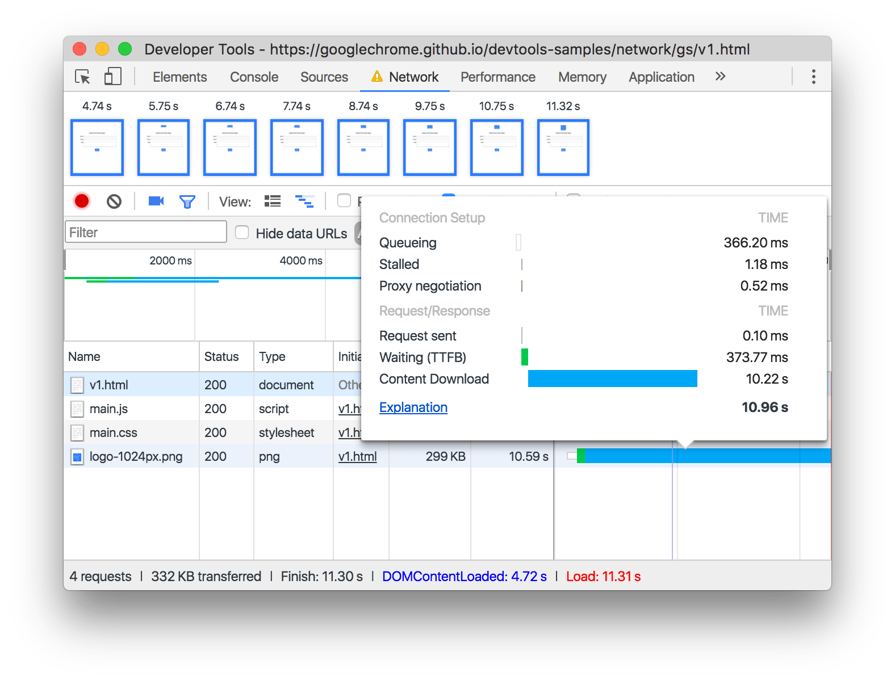

project_path: /web/_project.yaml
book_path: /web/tools/_book.yaml
description: Get started analyzing network performance.

{# wf_updated_on: 2016-12-15 #}
{# wf_published_on: 2016-12-15 #}

# Get Started with Analyzing Network Performance in Chrome DevTools {: .page-title }



This step-by-step, interactive tutorial teaches you the basics of analyzing
network performance in the Chrome DevTools Network panel.

## Step 1: Open DevTools

Whenever you want to analyze network performance, you always need to have
DevTools open.

1. Press <kbd>Command</kbd>+<kbd>Shift</kbd>+<kbd>I</kbd> (Mac) or
   <kbd>Control</kbd>+<kbd>Shift</kbd>+<kbd>I</kbd> (Windows, Linux) to
   open DevTools, right here on this page. DevTools opens with the last panel
   that you used in focus.
1. Click the **Network** tab.

     <figure>
       
       <figcaption>
         <b>Figure 1</b>. The Chrome DevTools Network panel, opened on this
         very page. It's an interactive tutorial!
       </figcaption>
     </figure>

<aside class="note">
  <b>Note:</b> For the rest of the screenshots, DevTools is undocked to a
  separate window, so that you can see its contents better.
</aside>

## Step 2: Simulate a mobile user's experience

When you iterate on a page during development, the network performance that
you see can be deceivingly fast: your browser is probably caching resources
that have been recently requested, and your internet connection is probably
faster than a mobile user's. The **Disable Cache** and **Network Throttling**
features can help you simulate how mobile users experience your site on their
first visit.

1. On the Network panel, there's a dropdown menu that currently says
   **No throttling**. Select **Regular 2G** from this menu to better
   simulate a mobile user's connection.

1. Check the **Disable Cache** checkbox to better simulate how long requests
   take to finish when a user visits your site for the first time.

     <figure>
       
       <figcaption>
         <b>Figure 1</b>. The Network panel, with the Disable Cache and
         Network Throttling features outlined in blue.
       </figcaption>
     </figure>

## Step 3: Analyze requests

DevTools is all set up, and now comes the useful part: analyzing requests.

1. Click **Download Resources**. On the Network panel, you can see that
   DevTools detects three requests.

     
     <button>Download Resources</button>
     
     

     <figure>
       
       <figcaption>
         <b>Figure 1</b>. The Network panel after making requests.
         Three requests should have been made: <code>logo-1024px.png</code>,
         <code>template.html</code>, and <code>template.js</code>.
       </figcaption>
     </figure>

     <aside class="note">
       <b>Tip:</b> You don't need to have the Network panel
       in focus in order for DevTools to detect network activity. So long
       as DevTools is open, it records all network activity in the Network
       panel, no matter what panel you have in focus.
     </aside>

1. Hover over the **Waterfall** for **logo-1024px.png**. DevTools shows you
   a detailed breakdown of the request's activity.

     <figure>
       
       <figcaption>
         <b>Figure 1</b>. A detailed timing breakdown for the
         <b>logo-1024px.png</b> request.
       </figcaption>
     </figure>

1. Click **logo-1024px.png**. DevTools shows you various tabs that can tell
   you more about that request.

     <figure>
       
       <figcaption>
         <b>Figure 1</b>. Tabs that can show you more details about the
         <code>logo-1024px.png</code> request.
       </figcaption>
     </figure>

## Bonus: Analyze page load and capture screenshots

Page load performance is a key element in whether users perceive your page
as fast or slow. When you reload a page with the Network panel open, DevTools
records all of the requests that are made during the page load. Better yet,
you can capture screenshots and analyze how the page appears during the load.

1. Set the network throttling menu back to
   **No Throttling**. Recall that it's currently set to **Regular 2G**.

1. Uncheck **Disable Cache**.

     <aside class="note"><b>Note:</b> You can leave throttling and cache
       disabling on, if you prefer. The page will just take longer to load.
       Apparently this site needs to be optimized for 2G!
     </aside>

1. Click **Capture Screenshots**
   ![Capture Screenshots][screenshots]{:.devtools-inline}. It turns blue
   to show that the feature is enabled.
1. Press <kbd>Command</kbd>+<kbd>R</kbd> (Mac) or
   <kbd>Control</kbd>+<kbd>R</kbd> (Windows, Linux). The page reloads.
   You can see all the requests that were made during the page load on the
   Network panel. Near the top of the Network panel you can see thumbnails.
   These screenshots show how the page looked to the user at that moment in
   time.

     <aside class="note"><b>Note:</b> You must have the Network panel open
       in order to capture requests and screenshots on page load.</aside>

1. Double-click on a thumbnail to view a larger version of that screenshot.

     <figure>
       
       <figcaption>
         <b>Figure 1</b>. Viewing a screenshot that was captured during page
         load.
       </figcaption>
     </figure>

[screenshots]: imgs/capture-screenshots.png

## Next steps

When it comes to the basics of analyzing network performance, that's about
it!

* Learn how to spot common network issues or optimization opportunities
  in [Network Issues Guide](issues).
* The Network panel, and DevTools in general, has an intimidating amount of
  features. Check out [Network Panel Reference](reference) for a comprehensive
  list, if you dare.
