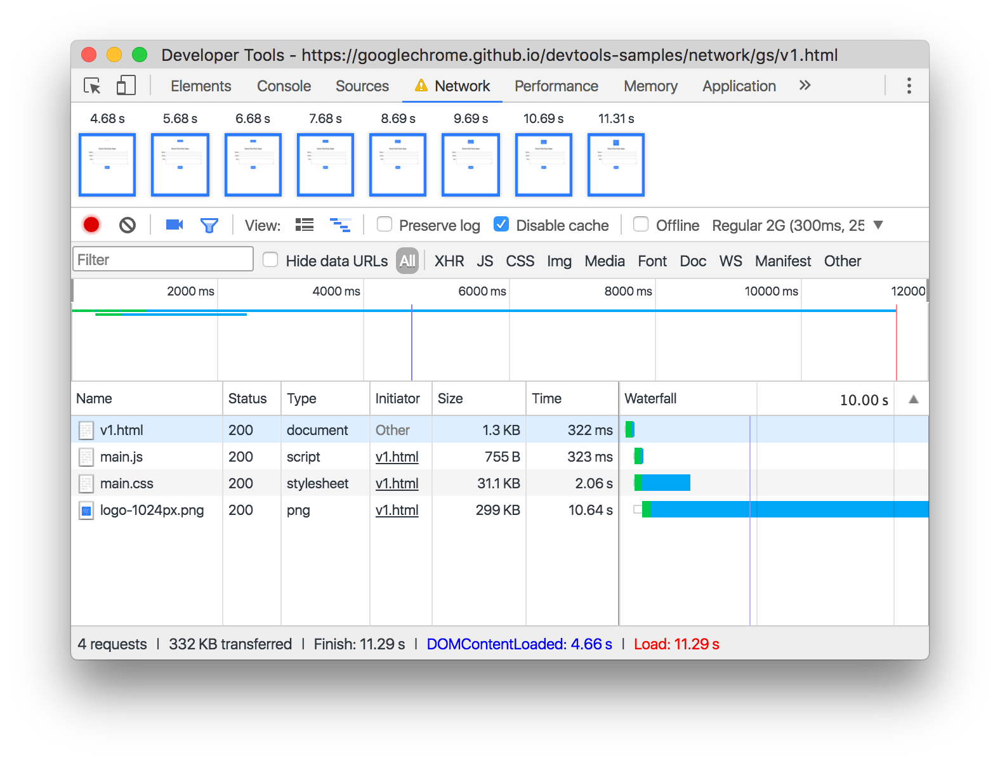
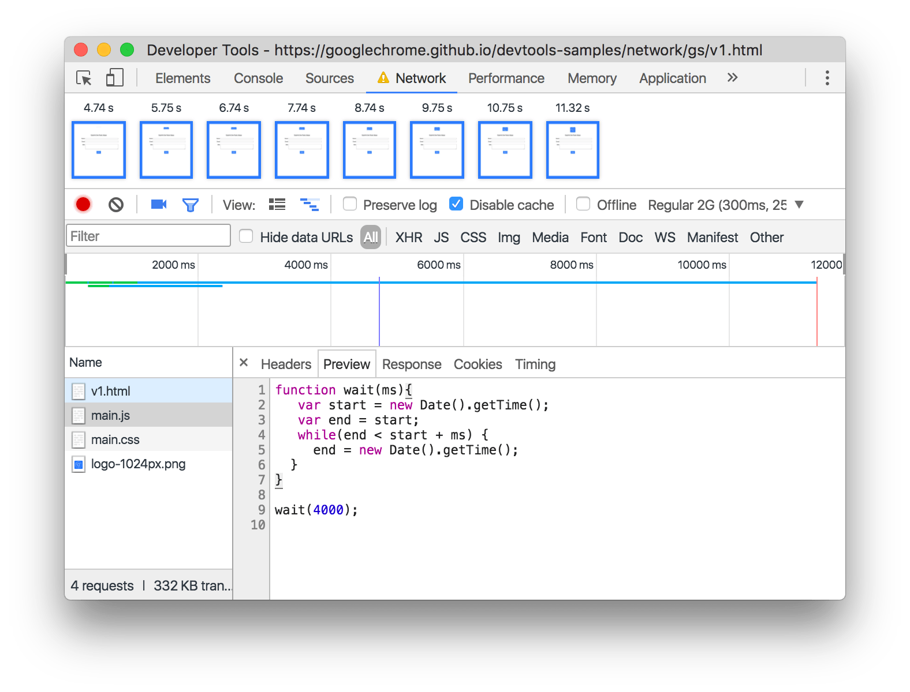

project_path: /web/_project.yaml
book_path: /web/tools/_book.yaml
description: Get started analyzing network performance.

{# wf_updated_on: 2016-12-15 #}
{# wf_published_on: 2016-12-15 #}

# Get Started with Analyzing Network Performance in Chrome DevTools {: .page-title }



In this step-by-step, interactive tutorial, you learn how to use the Chrome
DevTools Network panel to understand why a particular web page is loading
slowly. The general workflow that you learn is helpful for analyzing network
performance on any web page.

## Step 1: Set up DevTools {: #set-up }

Suppose that you're receiving reports from mobile users that a particular web
page is slow. Your job is to make the page fast.

Follow along with the instructions below to open DevTools on the page that
your users are reporting is slow.

1. Click **Open Slow Page**. The page opens in a new tab.

     <a href="https://googlechrome.github.io/devtools-samples/network/gs/v1.html"
       target="devtools" class="gc-analytics-event" rel="noopener noreferrer"
       data-category="DevTools / Network / Get Started"
       data-label="Slow Page Opened">
       <button>Open Slow Page</button>
     </a>

1. While the page is in focus, press
   <kbd>Command</kbd>+<kbd>Shift</kbd>+<kbd>I</kbd> (Mac) or
   <kbd>Control</kbd>+<kbd>Shift</kbd>+<kbd>I</kbd> (Windows, Linux) to
   open DevTools on the page.

1. In DevTools, click the **Network** tab.

     <figure>
       
       <figcaption>
         <b>Figure 1</b>. The Chrome DevTools Network panel, opened on the slow
         page that you're going to diagnose.
       </figcaption>
     </figure>

     <aside class="note">
       <b>Note:</b> For the rest of the screenshots, DevTools is undocked to a
       separate window, so that you can see its contents better.
     </aside>

1. Enable **Capture Screenshots** ![Capture
   Screenshots][screenshots]{:.devtools-inline}. It turns blue when it's
   enabled. While DevTools reloads the page, it captures screenshots so
   that you can see how the page load progresses over time.

## Step 2: Emulate a mobile user's experience {: #emulate }

When you test the page on your laptop or desktop, the network performance
that you see can deceive you. Your browser is probably caching resources from
previous visits to the page, and your internet connection is likely much
faster than a mobile user's. The **Disable Cache** and **Network Throttling**
features of DevTools can help you simulate how mobile users actually
experience your site.

1. Check the **Disable Cache** checkbox. When this
   checkbox is enabled, DevTools doesn't serve any resources from the cache.
   This more accurately emulates what first-time users experience when they
   view your page.

1. From the dropdown menu that currently says **No Throttling**, select
   **Regular 2G**. DevTools throttles the network connection to simulate a
   regular 2G experience. This is how mobile users experience your site
   in places with poor connections.

After setting up screenshots, cache disabling, and throttling, your
DevTools window should look like the screenshot below.

<figure>
  
  <figcaption>
    <b>Figure 2</b>. The Chrome DevTools Network panel, after setting
    up screenshots, cache disabling, and throttling. Screenshots, cache
    disabling, and throttling are outlined in blue, from left to right,
    respectively.
  </figcaption>
</figure>

This is a worst-case network emulation setup. If you can get your page
loading fast on this setup, then it'll be fast for all of your users!

[screenshots]: imgs/capture-screenshots.png

## Step 3: Analyze requests {: #analyze }

DevTools is all set up, and now it's time to figure out what's making the page
slow by reloading the page and analyzing the requests that come in.

1. Press <kbd>Command</kbd>+<kbd>R</kbd> (Mac) or
   <kbd>Control</kbd>+<kbd>R</kbd> (Windows, Linux) to reload the page.
   On a good Wi-Fi connection, the page takes more than 10 seconds to load
   completely.

     <figure>
       
       <figcaption>
         <b>Figure 3</b>. The Chrome DevTools Network panel, after reloading
         the page.
       </figcaption>
     </figure>

1. Note the value for [`DOMContentLoaded`][DOMContentLoaded] in the [Summary
   pane](reference#summary). The `DOMContentLoaded` event indicates when
   the initial HTML document was completely loaded and parsed, without waiting
   for stylesheets, images, or subframes. You should see a value of at least
   4 seconds. The fact that `DOMContentLoaded` is taking so long to fire
   probably means that there's a script that's delaying the main document's
   load and parse.

1. Click **main.js** to investigate that request further. DevTools shows a
   set of new tabs that provide more information about this request.

1. Click the **Preview** tab to view the request's source code. You can
   see that the script just hangs for 4000ms. This is the first candidate for
   optimization. By marking this script with the `async` attribute and moving
   it to the bottom of the document's `<body>`, the page
   can load without waiting for the script. See [Parser-blocking versus
   asynchronous JavaScript][async] for more information.

     <figure>
       
       <figcaption>
         <b>Figure 4</b>. Viewing the source code for <code>main.js</code> in
         the Preview pane.
       </figcaption>
     </figure>

As the page loaded, you might have noticed that the DevTools logo took a long
time to load. It's not blocking the page load, but it's making the load appear
slow. This image could be another candidate for optimization and is worth
investigating further.

1. Click **Close** ![Close][close]{:.devtools-inline} so that you can see
   the [**Requests pane**](reference#requests) again.

1. Double-click on the top-left screenshot.

1. Press your right-arrow key to scan through the set of screenshots. The
   time below the screenshot indicates when the screenshot was taken. The fact
   that the screenshot takes multiple seconds to load probably indicates that
   it is too large of a file.

1. Click anywhere outside of the screenshot to minimize it.

1. Look at the [Waterfall](reference#waterfall) for the `logo-1024px.png`
   request. It's taking a suspiciously long time. Hover over the request's
   waterfall to investigate it further. By viewing the waterfall, you are able
   to determine that most of the request is spent downloading the image. This
   confirms that the image is too large.

     <figure>
       
       <figcaption>
         <b>Figure 5</b>. The waterfall for <code>logo-1024px.png</code>.
       </figcaption>
     </figure>

That was a useful analysis! By using the Network panel, you were able to
find two causes for the slow page load:

* A render-blocking script.
* A large image.

[DOMContentLoaded]: https://developer.mozilla.org/en-US/docs/Web/Events/DOMContentLoaded

[async]: /web/fundamentals/performance/critical-rendering-path/adding-interactivity-with-javascript#parser_blocking_versus_asynchronous_javascript

[close]: imgs/close.png 

## Step 4: Verify fixes on updated page {: #verify }

You're just about done. Suppose now that you've already made two changes to
the page:

* You moved the script to the bottom of the `<body>` and marked it `async`
  to prevent it from blocking the page load.
* You converted the logo to SVG to reduce its size.

All that's left to do is to test out the updated page to verify that your
fixes do indeed make the page load faster.

1. Click **Open Fast Page**. The fixed page opens in a new tab.

     <a href="https://googlechrome.github.io/devtools-samples/network/gs/v2.html"
       target="devtools" class="gc-analytics-event" rel="noopener noreferrer"
       data-category="DevTools / Network / Get Started"
       data-label="Fast Page Opened">
       <button>Open Fast Page</button>
     </a>

1. Set up DevTools the same as before. Screenshots and cache disabling should
   be on, and network throttling should be set to **Regular 2G**.
1. Reload the page. The page loads much faster.

     <figure>
       
       <figcaption>
         <b>Figure 6</b>. A recording of the page's load, after applying the
         fixes. Whereas the page used to take about 10 seconds to appear
         visually complete, it now takes only about 1 second.
       </figcaption>
     </figure>

<aside class="note">
  <b>Note</b>: Although the page loads much faster, it's still unusable for
  about 5 seconds. This is because it still has the silly script that hangs
  for 4 seconds. While that script is running, the main thread of the page is
  busy.
</aside>

## Next Steps {: #next-steps }

Good job. You are now a bona fide expert in the Chrome DevTools Network
panel. Well, maybe not an expert, but you do have an excellent foundation
of skills and knowledge.

* See <a class="gc-analytics-event" data-category="DevTools / Network /
  Get Started" data-label="Next Steps / CRP"
  href="/web/fundamentals/performance/critical-rendering-path">Critical
  Rendering Path</a> to learn more about the theory of how to make pages
  load fast.
* See <a class="gc-analytics-event" data-category="DevTools / Network /
  Get Started" data-label="Next Steps / Issues Guide" href="issues">Network
  Issues Guide</a> to learn how to spot more network issues.
* See <a class="gc-analytics-event" data-category="DevTools / Network /
  Get Started" data-label="Next Steps / Reference" href="issues">Network
  Panel Reference</a> for a comprehensive list of Network panel features.
