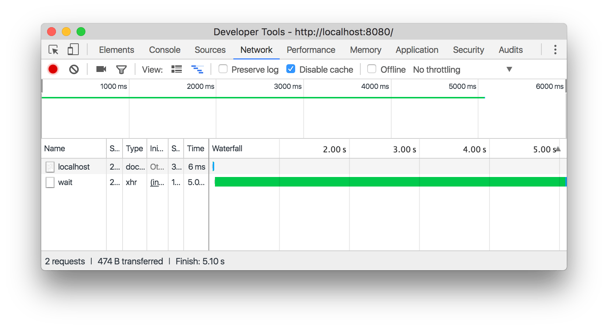

project_path: /web/tools/_project.yaml
book_path: /web/tools/_book.yaml
description: Learn how to detect network issues in the Network panel of Chrome DevTools.

{# wf_published_on: 2016-12-28 #}
{# wf_updated_on: 2016-12-28 #}

# Network Issues Guide {: .page-title }




This guide shows you how to detect network issues or optimization opportunities
in the Network panel of Chrome DevTools.

See [Get Started](../network-performance) to learn the basics of the Network
panel.

## Queued or stalled requests {: #queued-or-stalled-requests }

**Symptoms**

Six requests are downloading simultaneously. After that, a series of requests
are queued or stalled. Once one of the first six requests finishes, one
of the requests in the queue starts.

<figure>
  
  <figcaption>
    <b>Figure 1</b>. An example of a queued or stalled series of requests
    in the Network panel. In the <b>Waterfall</b>, you can see that the
    first six requests for <code>logo-1024px.png</code> start
    simultaneously. The subsequent requests are stalled until one of the
    original six finishes.</figcaption>
</figure>

**Causes**

Too many requests are being made on a single domain. On HTTP/1.0 or HTTP/1.1
connections, Chrome allows a maximum of six simultaneous TCP connections per
host.

**Fixes**

* Implement domain sharding if you must use HTTP/1.0 or HTTP/1.1.
* Use HTTP/2. Don't use domain sharding with HTTP/2.
* Remove or defer unnecessary requests so that critical requests can download
  earlier.

## Slow Time To First Byte (TTFB) {: #slow-ttfb }

**Symptoms**

A request spends a long time waiting to receive the first byte
from the server.

<figure>
  
  <figcaption>
    <b>Figure 2</b>. An example of a request with a slow Time To First Byte.
    The long, green bar in the <b>Waterfall</b> indicates that the
    <code>wait</code> request was waiting a long time.
</figure>

**Causes**

* The connection between the client and server is slow.
* The server is slow to respond. Host the server locally to determine if it's
  the connection or server that is slow. If you still get a slow TTFB when
  service locally, then the server is slow.

**Fixes**

* If the connection is slow, consider hosting your content on a CDN or
  changing hosting providers.
* If the server is slow, consider optimizing database queries, implementing
  a cache, or modifying your server configuration.

## Slow content download {: #long-content-download }

**Symptoms**

A request takes a long time to download.

<figure>
  
  <figcaption>
    <b>Figure 3</b>. An example of a request that takes a long time to
    download. The long, blue bar in the <b>Waterfall</b> next to
    <code>elements-panel.png</code> means it took a long time
    to download.
</figure>

**Causes**

* The connection between the client and server is slow.
* A lot of content is being downloaded.

**Fixes**

* Consider hosting your content on a CDN or changing hosting providers.
* Send fewer bytes by optimizing your requests.

## Contribute knowledge

Got a network issue that should be added to this guide?

* Send a tweet to [@ChromeDevTools][tweet].
* Start a mailing list thread by emailing
  `google-chrome-developer-tools@googlegroups.com`.
* [Open an issue][issue] on the docs repo.

[tweet]: https://twitter.com/intent/tweet?text=@ChromeDevTools%20[Network%20Issues%20Guide%20Suggestion]
[issue]: https://github.com/google/WebFundamentals/issues/new?title=[DevTools%20Network%20Issues%20Guide%20Suggestion]
