project_path: /web/_project.yaml
book_path: /web/tools/_book.yaml
description: A comprehensive reference of Chrome DevTools Network panel features.

{# wf_updated_on: 2016-12-22 #}
{# wf_published_on: 2015-04-13 #}

[ui]: #ui-overview
[requests]: #requests
[overview]: #overview

# Network Panel Reference {: .page-title }



This page is a comprehensive reference of Network panel features.

Note: This tutorial is based on Chrome 57, which is currently
[Canary](https://www.google.com/chrome/browser/canary.html).

<figure>
  
  <figcaption><b>Figure 1</b>. The Chrome DevTools Network panel.</figcaption>
</figure>

## Controls pane {: #controls }

Use the Controls pane to change how the Network panel looks and records
network activity.

<figure>
  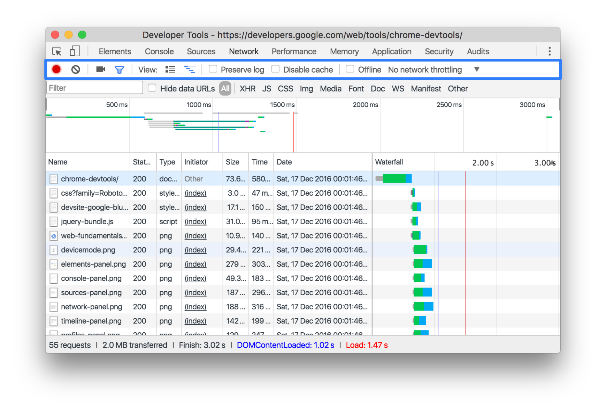
  <figcaption>
    <b>Figure 2</b>. The Controls pane, outlined in blue.
  </figcaption>
</figure>

### Start or stop recording {: #record }

By default, so long as DevTools is open, it records all network activity that
it detects. However, DevTools does not record network activity that occurred
before you opened it.

To stop recording:

* Click **Record** ![Record][record]{:.devtools-inline}.
* Press <kbd>Command</kbd>+<kbd>E</kbd> (Mac) or <kbd>Control</kbd>+<kbd>E</kbd>
  (Windows, Linux).

Click or press again to turn recording back on.

[record]: imgs/record-on.png

### Clear requests {: #clear }

Click **Clear** ![Clear][clear]{:.devtools-inline} to clear the [Requests
Table](#requests). DevTools clears all previously detected requests from the
table.

[clear]: imgs/clear-requests.png

### Capture screenshots during page load {: #screenshots }

DevTools can capture screenshots during page loads. This is useful for
analyzing what users see as they wait for your page to load.

To capture screenshots on your next page load:

1. Click **Capture screenshots**
   ![Capture screenshots][capture]{:.devtools-inline}.
1. While the Network panel is still in focus, press
   <kbd>Command</kbd>+<kbd>R</kbd> (Mac) or
   <kbd>Control</kbd>+<kbd>R</kbd> (Windows, Linux) to reload the page.

<figure>
  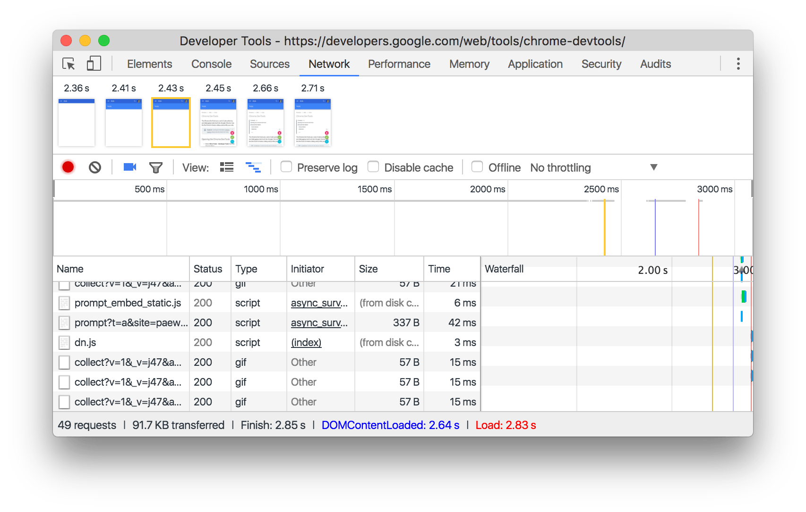
  <figcaption>
    <b>Figure 3</b>. Hovering over a screenshot. The yellow, vertical line
    in the Overview pane and the Waterfall represent the time at which the
    screenshot was captured.
  </figcaption>
</figure>

Click a screenshot's thumbnail to filter out any requests that occurred after
the screenshot was captured.

Double-click a thumbnail to zoom in on it.

[capture]: imgs/capture-screenshots.png

### Show or hide the Filters pane

By default, DevTools shows the [Filters pane](#filters).

Click **Filter** ![Filter][filter]{: .devtools-inline } to hide it.

Click again to re-show it.

[filter]: imgs/filters.png

### Use large or small request rows {: #request-rows }

By default, DevTools uses small rows in the [Requests pane](#requests).

<figure>
  
  <figcaption>
    <b>Figure 4</b>. Small request rows in the Requests pane.
  </figcaption>
</figure>

Click **Use large request rows** ![Use large request
rows][large]{:.devtools-inline} to use large rows, instead.

<figure>
  
  <figcaption>
    <b>Figure 5</b>. Large request rows in the Requests pane.
  </figcaption>
</figure>

Click it again to revert back to the small rows.

[large]: imgs/large-resource-rows-button.png

### Show or hide the Overview pane

By default, DevTools shows the [Overview pane](#overview).

Click **Hide overview** ![Hide overview][hide]{:.devtools-inline} to hide it.

<figure>
  
  <figcaption>
    <b>Figure 6</b>. The Network panel with the Overview pane hidden.
  </figcaption>
</figure>

Click again to show it.

[hide]: imgs/hide-overview.png

### Preserve log {: #preserve-log }

By default, requests are cleared from the [Requests pane](#requests) on each
page load.

Check the **Preserve log** checkbox to preserve all requests across page loads.
DevTools continues to preserve all requests until you disable the
**Preserve Log** checkbox.

### Disable cache

While developing a page, you probably reload it repeatedly. This can make
your page load performance appear deceptively fast because the browser serves
resources from its cache on repeat visits.

To experience your page like first-time users experience it, enable the
**Disable Cache** checkbox.

### Simulate offline

There is a new class of web apps, called [Progressive Web Apps][pwa], which can
function offline with the help of [service workers][sw]. When you're building
this type of app, it's useful to be able to quickly simulate a device that
has no data connection.

Check the **Offline** checkbox to simulate a completely offline network
experience.

[pwa]: /web/progressive-web-apps/
[sw]: /web/fundamentals/getting-started/primers/service-workers

### Simulate network throttling

Use the **Network Throttling** menu to simulate how your page loads in areas
with poor connectivity.

<figure>
  
  <figcaption>
    <b>Figure 7</b>. The network throttling menu, highlighted in blue.
  </figcaption>
</figure>

You can select from a variety of presets, such as Regular or Good 2G. You
can also add your own custom presets by opening the Network Throttling menu
and selecting **Custom** > **Add**.

DevTools displays a warning icon next to the **Network** tab to
remind you that throttling is enabled.

## Filters pane {: #filters }

Use the Filters pane to filter out requests from the [Requests pane](#requests).

<figure>
  
  <figcaption>
    <b>Figure 8</b>. The Filters pane, outlined in blue.
  </figcaption>
</figure>

### Filter requests by properties

Use the **Filter** text field to filter requests by properties, such as
the domain or size of the request.

<figure>
  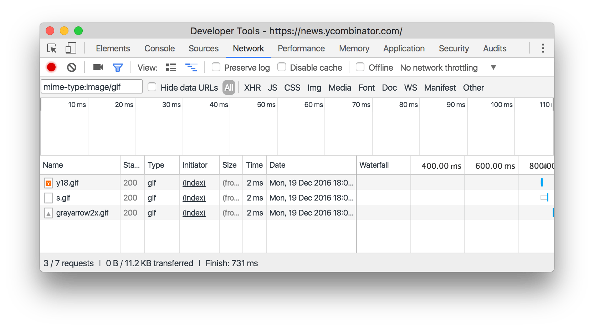
  <figcaption>
    <b>Figure 9</b>. Using the Filters text field to display GIFs only.
  </figcaption>
</figure>

You can use multiple properties simultaneously by separating each property
with a space. For example, `mime-type:image/gif larger-than:1K` displays
all GIFs that are larger than one kilobyte. These multi-property filters
are equivalent to AND operations. OR operations are currently
not supported.

Below is a complete list of supported properties.

* `domain`. Only display resources from the specified domain. You can use
  a wildcard character (`*`) to include multiple domains. For example, `*.com`
  displays resources from all domain names ending in `.com`. DevTools
  populates the autocomplete dropdown menu with all of the domains
  it has encountered.
* `has-response-header`. Show the resources that contain the specified
  HTTP response header. DevTools populates the autocomplete dropdown with
  all of the response headers that it has encountered.
* `is`. Use `is:running` to find `WebSocket` resources.
* `larger-than`. Show resources that are larger than the specified size,
  in bytes. Setting a value of `1000` is equivalent to setting a value of `1k`.
* `method`. Show resources that were retrieved over a specified HTTP method
  type. DevTools populates the dropdown with all of the HTTP methods it
  has encountered.
* `mime-type`. Show resources of a specified MIME type. DevTools populates the
  dropdown with all MIME types it has encountered.
* `mixed-content`. Show all mixed content resources (`mixed-content:all`) or
  just the ones that are currently displayed (`mixed-content:displayed`).
* `scheme`. Show resources retrieved over unprotected HTTP (`scheme:http`)
  or protected HTTPS (`scheme:https`).
* `set-cookie-domain`. Show the resources that have a `Set-Cookie` header
  with a `Domain` attribute that matches the specified value. DevTools
  populates the autocomplete with all of the cookie domains that it has
  encountered.
* `set-cookie-name`. Show the resources that have a `Set-Cookie` header
  with a name that matches the specified value. DevTools populates the
  autocomplete with all of the cookie names that it has encountered.
* `set-cookie-value`. Show the resources that have a `Set-Cookie` header
  with a value that matches the specified value. DevTools populates the
  autocomplete with all of the cookie values that it has encountered.
* `status-code`. Only show resources whose HTTP status code match the
  specified code. DevTools populates the autocomplete dropdown menu with all
  of the status codes it has encountered.

### Hide data URLs 

[Data URLs][data-uris] are small files embedded into other documents. Any
request that you see in the [Requests pane](#requests) that starts with
`data:` is a data URL.

Check the **Hide data URLs** checkbox to hide these requests.

[data-uris]: https://developer.mozilla.org/en-US/docs/Web/HTTP/Basics_of_HTTP/Data_URIs

### Filter requests by type

To filter requests by request type, click the **XHR**, **JS**, **CSS**,
**Img**, **Media**, **Font**, **Doc**, **WS** (WebSocket), **Manifest**, or
**Other** (any other type not listed here) buttons.  

To enable multiple type filters simultaneously, hold <kbd>Command</kbd>
(Mac) or <kbd>Control</kbd> (Windows, Linux) and then click.

<figure>
  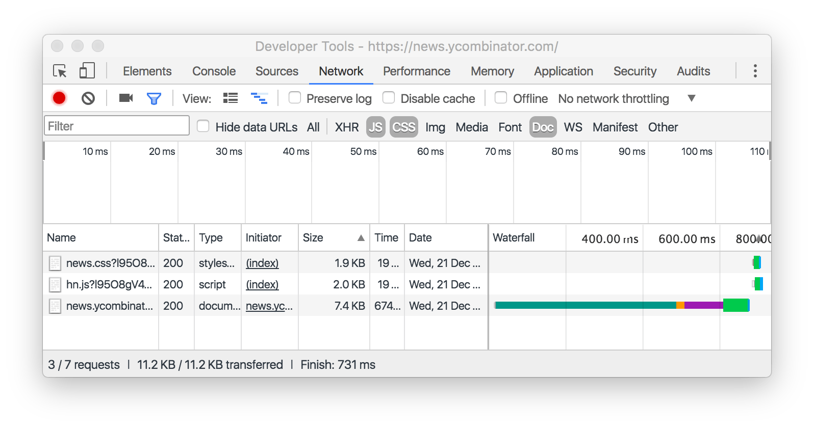
  <figcaption>
    <b>Figure 10</b>. Using the Type filters to display JS, CSS, and Doc[ument]
    resources.
  </figcaption>
</figure>

## Overview pane {: #overview }

<figure>
  
  <figcaption>
    <b>Figure 11</b>. The Filters pane, outlined in blue.
  </figcaption>
</figure>

### View load events {: #load }

The blue vertical bar in the Overview pane represents the `DOMContentLoaded`
event, and the red vertical bar represents the `load` event.

If you have [Preserve log](#preserve-log) enabled, you'll see multiple
`DOMContentLoaded` and `load` events, one for each page that you've visited.

### Filter requests by time

Click and drag left or right on the Overview pane to only display requests
that were active during that time frame. The filter is inclusive. Any request
that was active during the highlighted time is shown.

<figure>
  
  <figcaption>
    <b>Figure 12</b>. Using the Overview filter to only display requests that
    were active around 2500ms.
  </figcaption>
</figure>

## Requests pane {: #requests }

Use the Requests pane to analyze individual requests.

<figure>
  
  <figcaption>
    <b>Figure 13</b>. The Filters pane, outlined in blue.
  </figcaption>
</figure>

The Requests pane displays the following columns by default:

* **Name**. The filename of, or an identifier for, the resource.
* **Status**. The HTTP status code.
* **Type**. The MIME type of the requested resource.
* **Initiator**. The following objects or processes can initiate requests:
    * **Parser**. Chrome's HTML parser.
    * **Redirect**. An HTTP redirect.
    * **Script**. A JavaScript function.
    * **Other**. Some other process or action, such as navigating to a page
      via a link or entering a URL in the address bar.
* **Size**. The combined size of the response headers
  plus the response body, as delivered by the server.
* **Time**. The total duration, from the start of the request to the
  receipt of the final byte in the response.
* [**Waterfall**](#waterfall). A visual breakdown of each request's activity.

### Show or hide columns {: #columns }

Right-click the header of the Requests table and select an option
to hide or show it. Currently displayed options have checkmarks next to them.

### Add custom columns {: #custom-columns }

Right-click the header of the Requests table, hover over
**Response Headers**, and select **Manage Header Columns** to add a custom
header to the Requests table.

### Waterfall {: #waterfall }

Like the [Overview pane][overview], the **Waterfall** column in the
Requests pane shows a graphical breakdown of each request's activity.

<figure>
  
  <figcaption>
    <b>Figure 14</b>. The Waterfall column of the Requests pane.
  </figcaption>
</figure>

The blue, vertical line represents the `DOMContentLoaded` event, and the red,
vertical line represents the `load` event.

#### View timing breakdown {: #timing-breakdown }

The color-coding of each request corresponds to its activity. Hover over a
request to view a breakdown.

<figure>
  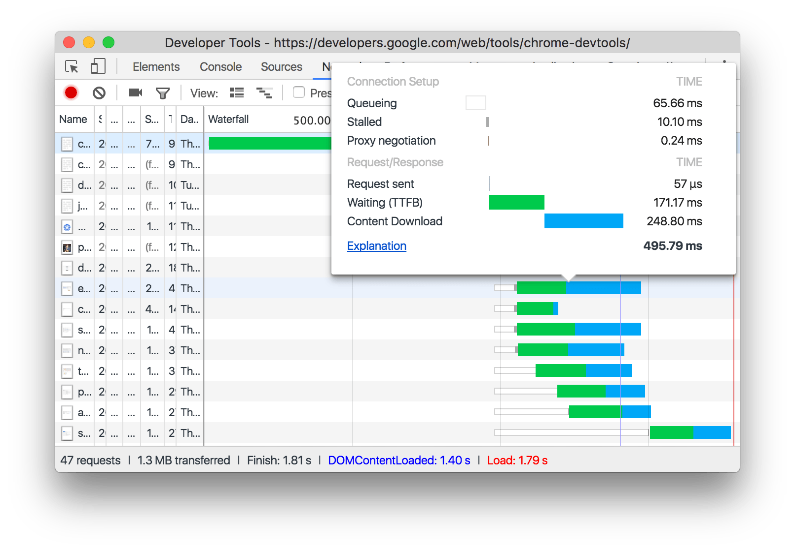
  <figcaption>
    <b>Figure 15</b>. Hovering over a request in the Waterfall column.
  </figcaption>
</figure>

See [Timing tab](#timing) for more information on the activity phases. This
view is equivalent to the Timing tab.

#### Sort by activity phase {: #sort-by-activity }

To change how the Waterfall sorts requests, right-click the header of the
Requests table, hover over **Waterfall**, and select one of the following
options:

* **Start Time**. The first request that was initiated is at the top.
* **Response Time**. The first request that started downloading is at the top.
* **End Time**. The first request that finished is at the top.
* **Total Duration**. The request with the shortest connection setup and
  request / response is at the top.
* **Latency**. The request that waited the shortest time for a response is
  at the top.

These descriptions assume that each respective option is ranked from shortest
to longest. Clicking on the **Waterfall** column's header reverses the order.

<figure>
  
  <figcaption>
    <b>Figure 16</b>. Sorting the Waterfall by total duration. The lighter
    portion of each bar is time spent waiting. The darker portion is time
    spent downloading bytes.
  </figcaption>
</figure>

### View initiators and dependencies {: #initiators-dependencies }

Hold <kbd>Shift</kbd> and hover over a request to view its initiators and
dependencies.

When the Requests table is ordered chronologically, the first
green request above the request that you're hovering over is the initiator
of the dependency. If there's another green request above that, that higher
request is the initiator of the initiator. And so on.

Red requests are dependencies of the request you're hovering over.

<figure>
  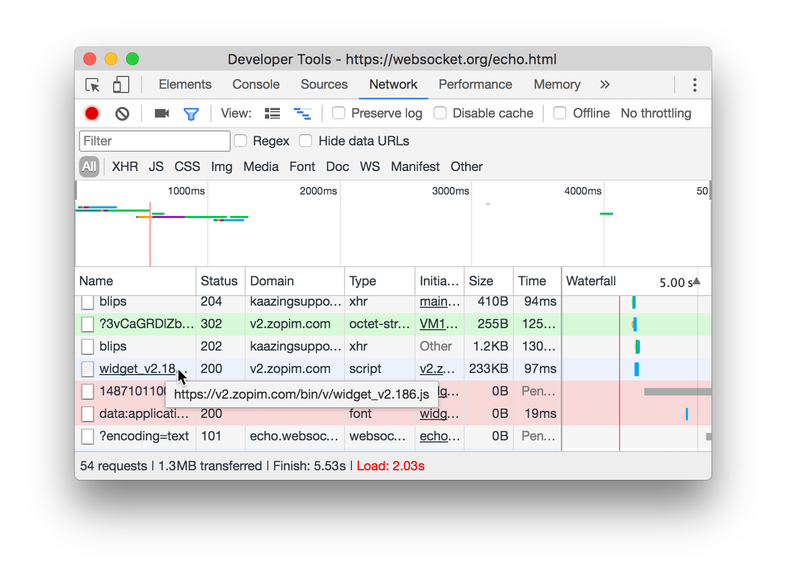
  <figcaption>
    <b>Figure 17</b>. Viewing a request's initiators and dependencies. The
    blue request is being hovered over, but the mouse icon is missing from
    the screenshot. The green request is the initiator of the blue request.
    The red requests are dependencies of the blue request.
  </figcaption>
</figure>

### Copy one or all requests {: #copy }

Under the **Name** column of the Requests table, right-click a request,
hover over **Copy**, and select one of the following options:

* **Copy Link Address**. Copy the request's URL to the clipboard.
* **Copy Response**. Copy the response body to the clipboard.
* **Copy as cURL**. Copy the request as a cURL command.
* **Copy All as cURL**. Copy all requests as a chain of cURL commands.
* **Copy All as HAR**. Copy all requests as HAR data.

### Open request

Under the **Name** column of the Requests table, right-click a request
and select one of the following options:

* **Open in Sources Panel**. Open the request in the Sources panel of DevTools.
* **Open in New Tab**. Open the request in a new Chrome tab.

### Save request as HAR with content {: #save-as-har }

Under the **Name** column of the Requests table, right-click a request
and select **Save as HAR with Content**.

### Clear browser cache {: #clear-cache}

Right-click any request's name and select **Clear Browser Cache**.

### Clear browser cookies {: #clear-cookies }

Right-click any request's name and select **Clear Browser Cookies**.

### Replay XHR request

Right-click a request and select **Replay XHR** to replay the request.
This option is only available on requests that were initiated via XHR.

### View details {: #details }

Under the **Name** column, click a resource's URL to view its details.

<figure>
  
  <figcaption>
    <b>Figure 18</b>. Clicking on the Name column, outlined in blue, shows a
    request's details.
  </figcaption>
</figure>

DevTools shows four new tabs within the Requests pane: 

* Headers
* Preview
* Response
* Cookies
* Timing

#### Headers tab {: #headers }

The Headers tab shows read-only information about the HTTP request and
response.

<figure>
  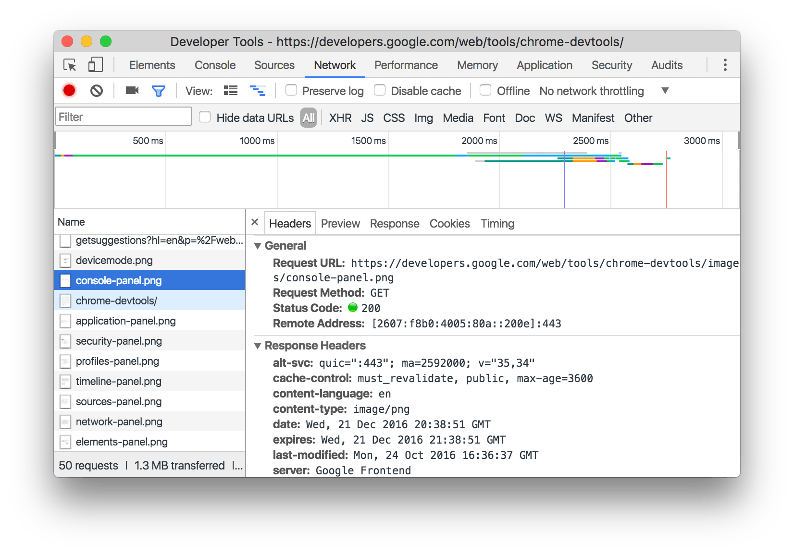
  <figcaption>
    <b>Figure 19</b>. The Headers tab of the Requests pane.
  </figcaption>
</figure>

##### View header source

Click **view source** next to the **Request Header** or **Response Header**
sections to view the source of that header. After clicking, **view source**
changes to **view parsed**. Click **view parsed** to revert to the default
view.

<figure>
  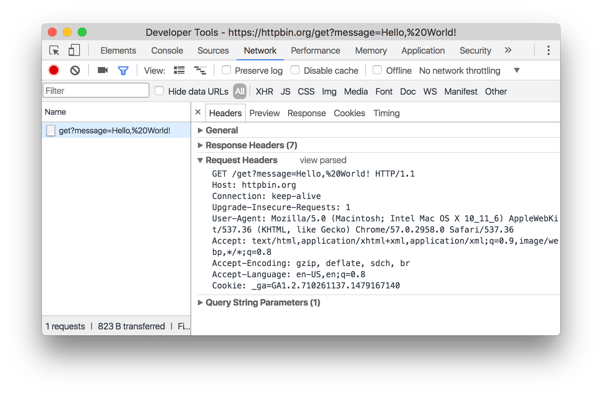
  <figcaption>
    <b>Figure 20</b>. The Request Headers section, in source view.
  </figcaption>
</figure>

The main differences between the source view and the parsed view are:

* The source view displays the headers in monospaced font, while the parsed
  view formats the headers in sans serif font, with the header names in bold.
* The parsed view sorts the header names alphabetically, while the source view
  shows the header names in the order they were received.

##### View query string parameters source

Click **view source** next to the **Query String Parameters** section to view
the query string parameters, as they were sent over the URL.

<figure>
  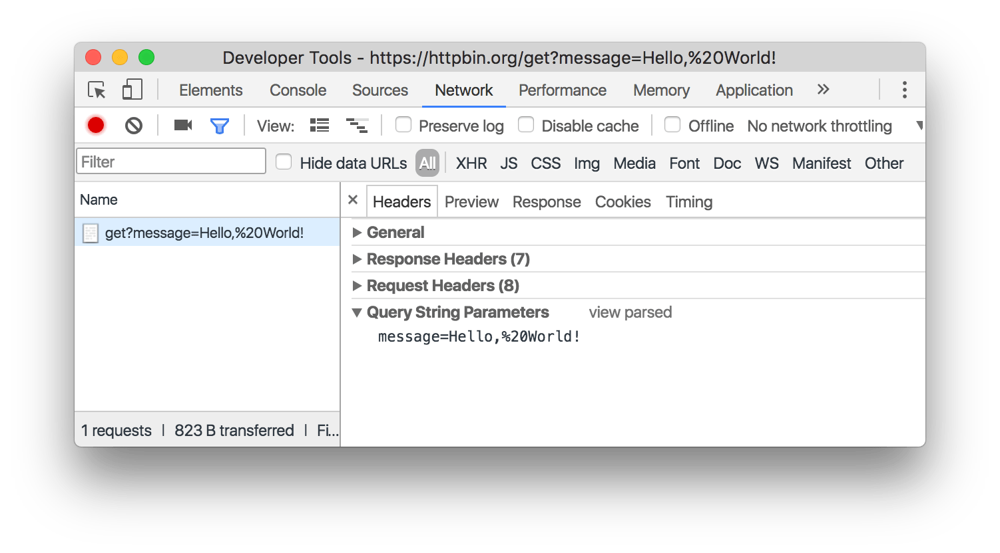
  <figcaption>
    <b>Figure 21</b>. The Query String Parameters section after enabling source
    view.
  </figcaption>
</figure>

##### View URL-encoded query string parameters 

Click **view URL encoded** to view query string parameters with URL encodings
preserved.

<figure>
  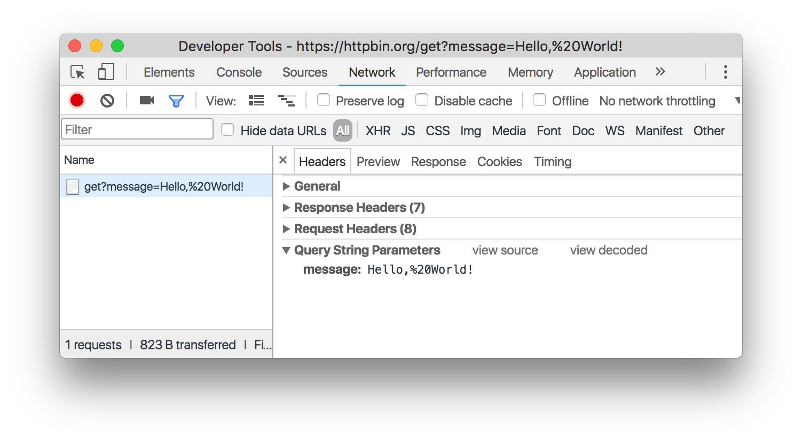
  <figcaption>
    <b>Figure 22</b>. The Query String Parameters section after enabling
    URL-encoded view.
  </figcaption>
</figure>

#### Preview tab {: #preview }

The Preview tab shows a preview of the HTTP response body, if any. This is
useful for viewing images.

<figure>
  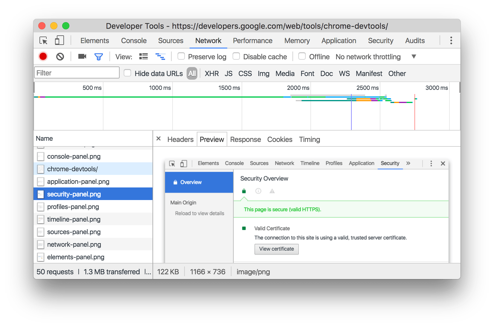
  <figcaption>
    <b>Figure 23</b>. The Preview tab of the Requests pane.
  </figcaption>
</figure>

#### Response tab {: #response }

The Response tab shows the HTTP response body, if any.

<figure>
  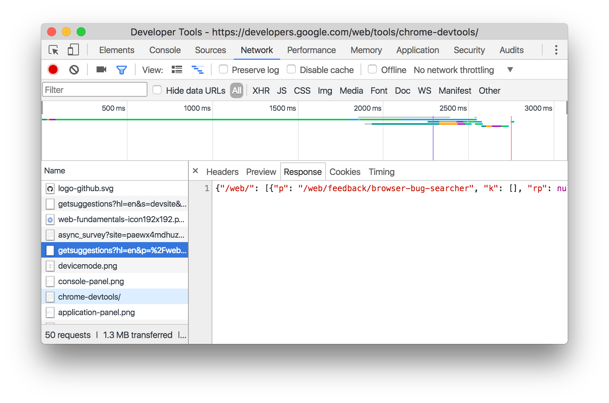
  <figcaption>
    <b>Figure 24</b>. The Response tab of the Requests pane.
  </figcaption>
</figure>

#### Cookies tab {: #cookies }

The Cookies tab shows a more-conveniently-formatted table of cookies that
were sent in the request's HTTP header, if any.

<figure>
  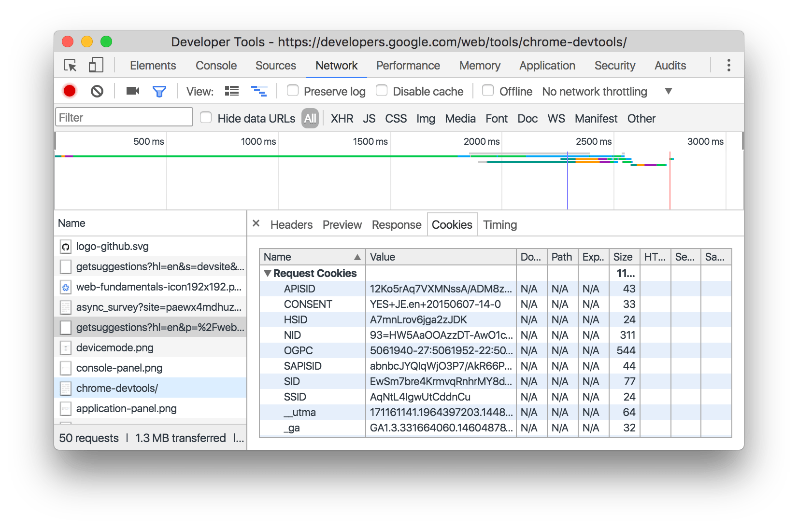
  <figcaption>
    <b>Figure 24</b>. The Cookies tab of the Response pane.
  </figcaption>
</figure>

See [Fields](/web/tools/chrome-devtools/manage-data/cookies#fields) for a
description of each of the columns.

#### Timing tab {: #timing }

The Timing tab shows a detailed breakdown of the time spent in the various
download phases.

<figure>
  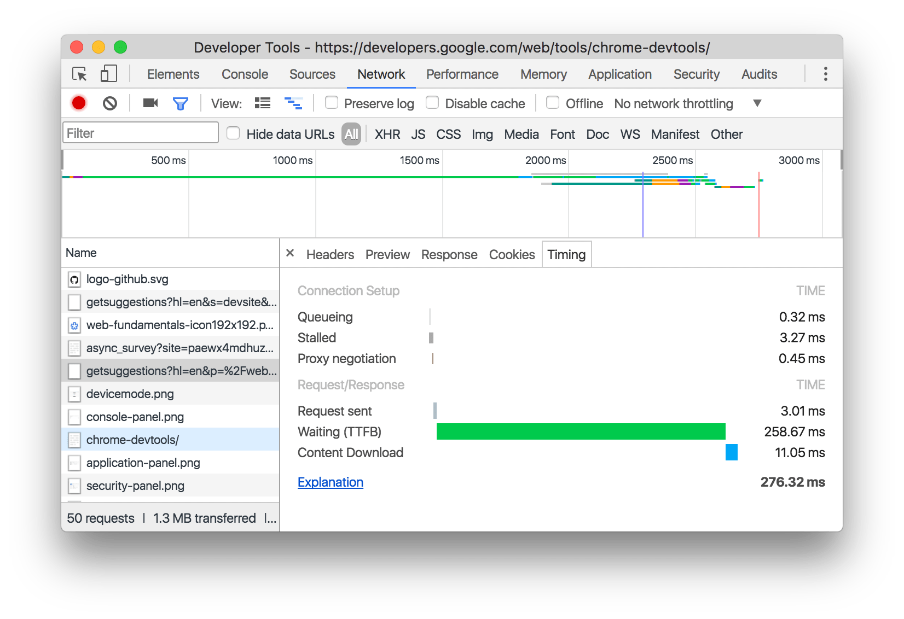
  <figcaption>
    <b>Figure 25</b>. The Timing tab of the Requests pane.
  </figcaption>
</figure>

Here's more information about each of the phases:

* **Queueing**. The browser queues requests when:
    * There are higher priority requests.
    * There are already six TCP connections open for this origin, which is
      the limit. Applies to HTTP/1.0 and HTTP/1.1 only.
* **Stalled**. The request could be stalled for any of the reasons described
  in **Queueing**.
* **DNS Lookup**. The browser is resolving the request's IP address.
* **Proxy negotiation**. The browser is negotiating the request with a [proxy
  server](https://en.wikipedia.org/wiki/Proxy_server).
* **Request sent**. The request is being sent.
* **Waiting (TTFB)**. The browser is waiting for the first byte of a response.
  TTFB stands for Time To First Byte.
* **Content Download**. The browser is receiving the response.

See [View timing breakdown](#timing-breakdown) for another way to access
this view.

#### Frames tab {: #frames }

The Frames tab shows information about WebSocket frames. This tab is only
available when the selected request is a WebSocket connection.

<figure>
  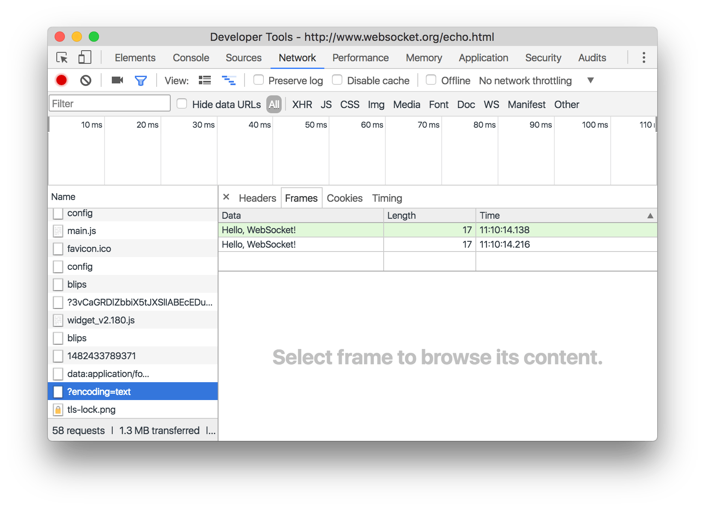
  <figcaption>
    <b>Figure 26</b>. The Frames tab of the Requests pane.
  </figcaption>
</figure>

The table contains three columns:

* **Data**. The message payload. If the message is plain text, it's
  displayed here. For binary opcodes, this column displays the opcode's
  name and code. The following opcodes are supported:
    * Continuation Frame
    * Binary Frame
    * Connection Close Frame
    * Ping Frame
    * Pong Frame
* **Length**. The length of the message payload, in bytes.
* **Time**. The time when the message was received or sent.

Messages are color-coded according to their type:

* Outgoing text messages are light-green.
* Incoming text messages are white.
* WebSocket opcodes are light-yellow.
* Errors are light-red.

Notes about current implementation:

* To refresh the table after new messages arrive, re-click the
  name of the WebSocket connection request under the **Name** column of the
  Requests pane.
* Only the last 100 messages are displayed.

## Summary pane {: #summary }

From left to right, the Summary pane shows you:

* The total number of requests.
* The total download size for all of the requests.
* The time at which the last request finished.
* The time of the `DOMContentLoaded` event.
* The time of the `load` event.

<figure>
  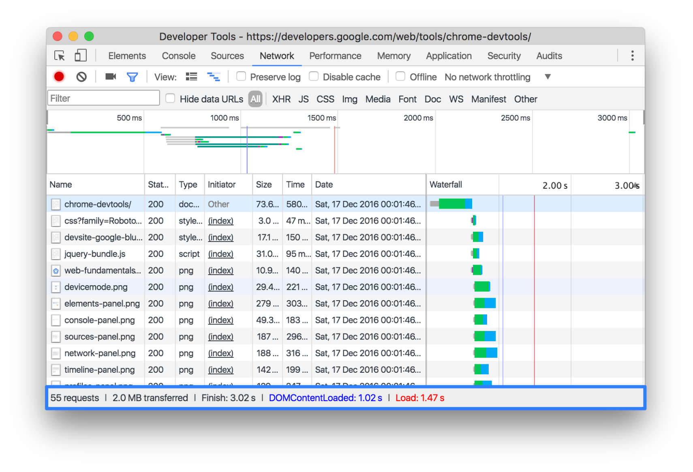
  <figcaption>
    <b>Figure 27</b>. The Filters pane, outlined in blue.
  </figcaption>
</figure>

## Network Conditions drawer

While working in other DevTools panels, you can access network features from
the Network Conditions drawer, including:

* Disabling the browser cache.
* Throttling the network.
* Overriding the user agent.

To open the Network Conditions drawer:

1. Press <kbd>Command</kbd>+<kbd>Shift</kbd>+<kbd>P</kbd> (Mac) or
   <kbd>Control</kbd>+<kbd>Shift</kbd>+<kbd>P</kbd> (Windows, Linux)
   to open the Command Menu.
1. Type `Network Conditions`.
1. Press <kbd>Enter</kbd>.

<figure>
  
  <figcaption>
    <b>Figure 28</b>. The Network Conditions drawer.
  </figcaption>
</figure>
