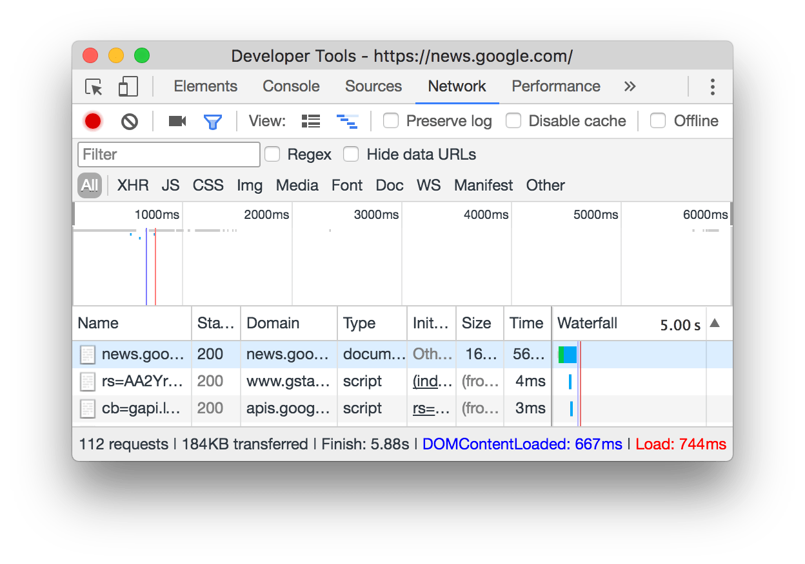
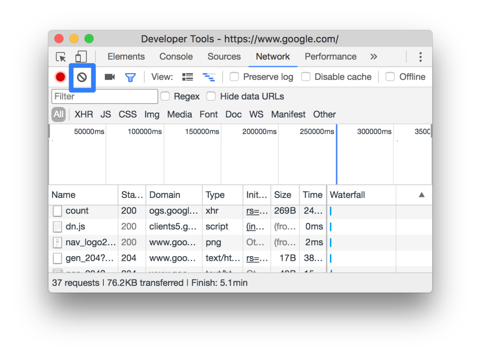
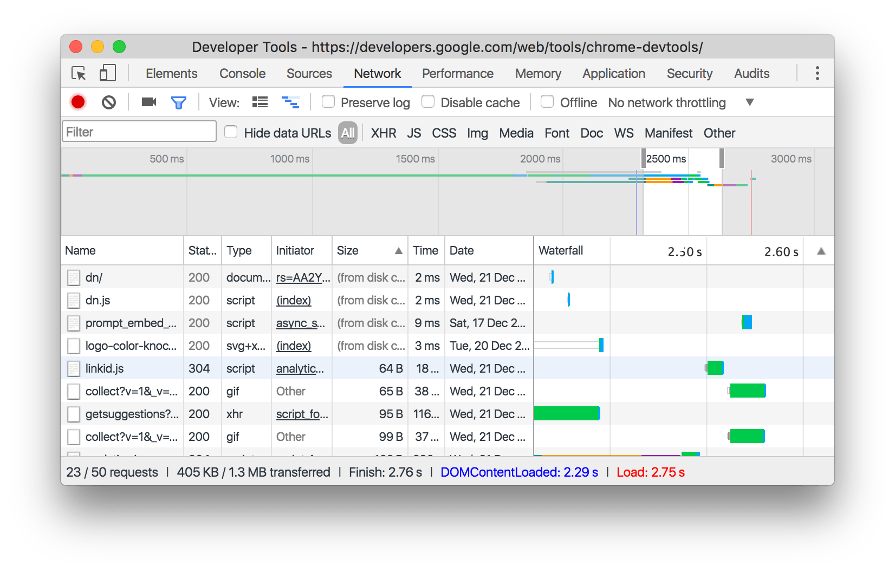
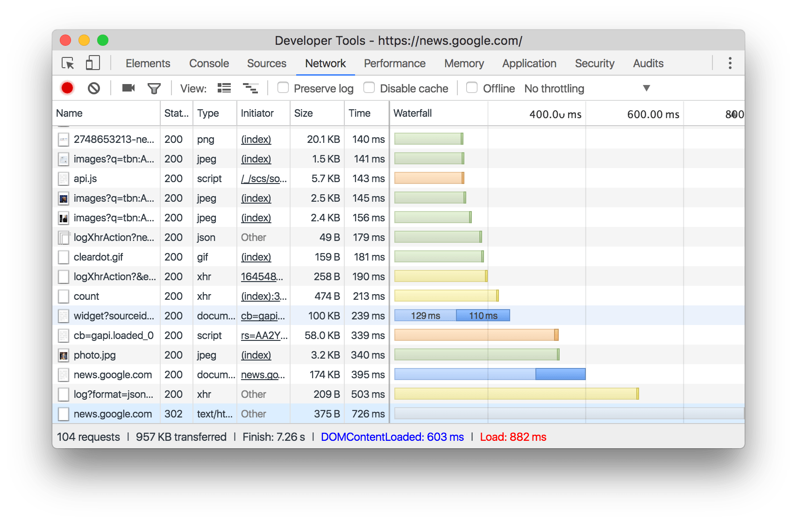
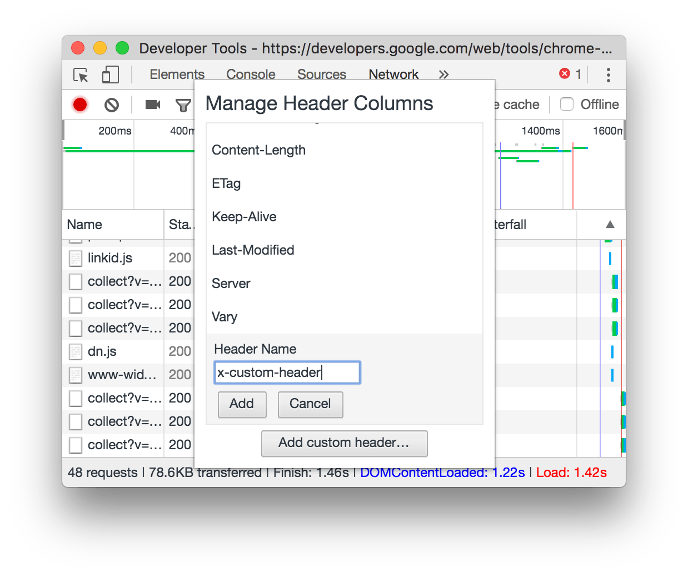
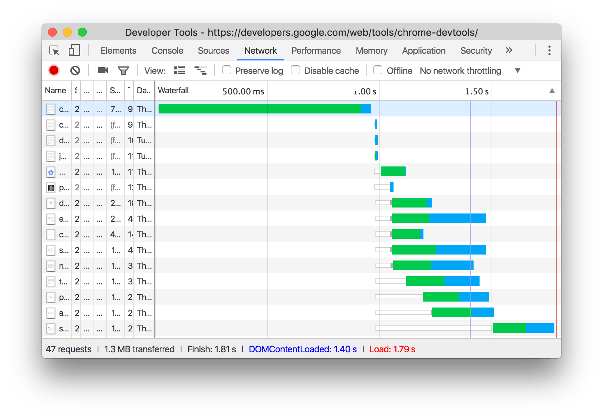

project_path: /web/tools/_project.yaml
book_path: /web/tools/_book.yaml
description: A comprehensive reference of Chrome DevTools Network panel features.

{# wf_updated_on: 2017-07-25 #}
{# wf_published_on: 2015-04-13 #}



[ui]: #ui-overview
[requests]: #requests
[overview]: #overview

# Network Analysis Reference {: .page-title }



Discover new ways to analyze how your page loads in this comprehensive
reference of Chrome DevTools network analysis features.

Note: This reference is based on Chrome 58. If you use another version
of Chrome, the UI and features of DevTools may be different. Check
`chrome://help` to see what version of Chrome you're running.

## Record network requests {: #record }

By default, DevTools records all network requests in the Network panel,
so long as DevTools is open.

<figure>
  
  <figcaption>
    <b>Figure 1</b>. The Network panel
  </figcaption>
</figure>

### Stop recording network requests {: #stop-recording }

To stop recording requests:

* Click **Stop recording network log** {: .devtools-inline } on the Network panel. It
  turns grey to indicate that DevTools is no longer recording requests.
* Press <kbd>Command</kbd>+<kbd>E</kbd> (Mac) or
  <kbd>Control</kbd>+<kbd>E</kbd> (Windows, Linux) while the Network panel
  is in focus.

### Clear requests {: #clear }

Click **Clear** ![Clear][clear]{:.devtools-inline} on the Network panel
to clear all requests from the Requests table.

<figure>
  
  <figcaption>
    <b>Figure 2</b>. Clear, outlined in blue
  </figcaption>
</figure>

[clear]: imgs/clear-requests.png

### Save requests across page loads {: #preserve-log }

To save requests across page loads, check the **Preserve log** checkbox
on the Network panel. DevTools saves all requests until you disable
**Preserve log**.

<figure>
  
  <figcaption>
    <b>Figure 3</b>. The Preserve Log checkbox, outlined in blue
  </figcaption>
</figure>

### Capture screenshots during page load {: #screenshots }

Capture screenshots to analyze what users see as they wait for your page to
load.

To enable screenshots, click **Capture screenshots** ![Capture
screenshots][capture]{: .devtools-inline } on the Network panel. It turns
blue when enabled.

Reload the page while the Network panel is in focus to capture screenshots.

Once captured, you can interact with screenshots in the following ways:

* Hover over a screenshot to view the point at which that screenshot was
  captured. A yellow line appears on the Overview pane.
* Click a screenshot's thumbnail to filter out any requests that occurred
  after the screenshot was captured.
* Double-click a thumbnail to zoom in on it.

<figure>
  
  <figcaption>
    <b>Figure 4</b>. Hovering over a screenshot. The yellow, vertical line
    in the Overview pane and the Waterfall represent the time at which the
    screenshot was captured.
  </figcaption>
</figure>

[capture]: imgs/capture-screenshots.png

### Replay XHR request {: #replay-xhr }

To replay an XHR request, right-click the request in the Requests table
and select **Replay XHR**.

<figure>
  
  <figcaption>
    <b>Figure 5</b>. Selecting Replay XHR
  </figcaption>
</figure>

## Change loading behavior

### Emulate a first-time visitor by disabling the browser cache {: #disable-cache}

To emulate how a first-time user experiences your site, check the **Disable
cache** checkbox. DevTools disables the browser cache. This more accurately
emulates a first-time user's experience, because requests are served from
the browser cache on repeat visits.

<figure>
  
  <figcaption>
    <b>Figure 6</b>. The Disable Cache checkbox, outlined in blue
  </figcaption>
</figure>

#### Disable the browser cache from the Network Conditions drawer {: #disable-cache-network-conditions }

If you want to disable the cache while working in other DevTools panels, use
the Network Conditions drawer.

1. Open the [Network Conditions drawer](#network-conditions).
1. Check or uncheck the **Disable cache** checkbox.

### Manually clear the browser cache {: #clear-cache}

To manually clear the browser cache at any time, right-click anywhere
in the Requests table and select **Clear Browser Cache**.

<figure>
  
  <figcaption>
    <b>Figure 7</b>. Selecting Clear Browser Cache
  </figcaption>
</figure>

### Emulate offline {: #offline }

There's a new class of web apps, called [Progressive Web Apps][pwa], which can
function offline with the help of [service workers][sw]. When you're building
this type of app, it's useful to be able to quickly simulate a device that
has no data connection.

Check the **Offline** checkbox to simulate a completely offline network
experience.

<figure>
  
  <figcaption>
    <b>Figure 8</b>. The Offline checkbox, outlined in blue
  </figcaption>
</figure>

[pwa]: /web/progressive-web-apps/
[sw]: /web/fundamentals/getting-started/primers/service-workers

### Emulate slow network connections {: #throttling }

Emulate 2G, 3G, and other connection speeds from the **Network Throttling**
menu.

<figure>
  
  <figcaption>
    <b>Figure 9</b>. The Network Throttling menu, outlined in blue
  </figcaption>
</figure>

You can select from a variety of presets, such as Regular or Good 2G. You
can also add your own custom presets by opening the Network Throttling menu
and selecting **Custom** > **Add**.

DevTools displays a warning icon next to the **Network** tab to
remind you that throttling is enabled.

#### Emulate slow network connections from the Network Conditions drawer {: #throttling-network-conditions }

If you want to throttle the network connection while working in other DevTools
panels, use the Network Conditions drawer.

1. Open the [Network Conditions drawer](#network-conditions).
1. Select your desired connection speed from the **Network Throttling** menu.

### Manually clear browser cookies {: #clear-cookies }

To manually clear browser cookies at any time, right-click anywhere in the
Requests table and select **Clear Browser Cookies**.

<figure>
  
  <figcaption>
    <b>Figure 10</b>. Selecting Clear Browser Cookies
  </figcaption>
</figure>

### Override the user agent {: #user-agent }

To manually override the user agent:

1. Open the [Network Conditions drawer](#network-conditions).
1. Uncheck **Select automatically**.
1. Choose a user agent option from the menu, or enter a custom one in the
   text box.

## Filter requests {: #filter }

### Filter requests by properties {: #filter-by-property }

Use the **Filter** text box to filter requests by properties, such as
the domain or size of the request.

If you can't see the text box, the Filters pane is probably hidden.
See [Hide the Filters pane](#hide-filters).

<figure>
  
  <figcaption>
    <b>Figure 11</b>. The Filters text box, outlined in blue
  </figcaption>
</figure>

You can use multiple properties simultaneously by separating each property
with a space. For example, `mime-type:image/gif larger-than:1K` displays
all GIFs that are larger than one kilobyte. These multi-property filters
are equivalent to AND operations. OR operations are currently
not supported.

Below is a complete list of supported properties.

* `domain`. Only display resources from the specified domain. You can use
  a wildcard character (`*`) to include multiple domains. For example, `*.com`
  displays resources from all domain names ending in `.com`. DevTools
  populates the autocomplete dropdown menu with all of the domains
  it has encountered.
* `has-response-header`. Show the resources that contain the specified
  HTTP response header. DevTools populates the autocomplete dropdown with
  all of the response headers that it has encountered.
* `is`. Use `is:running` to find `WebSocket` resources.
* `larger-than`. Show resources that are larger than the specified size,
  in bytes. Setting a value of `1000` is equivalent to setting a value of `1k`.
* `method`. Show resources that were retrieved over a specified HTTP method
  type. DevTools populates the dropdown with all of the HTTP methods it
  has encountered.
* `mime-type`. Show resources of a specified MIME type. DevTools populates the
  dropdown with all MIME types it has encountered.
* `mixed-content`. Show all mixed content resources (`mixed-content:all`) or
  just the ones that are currently displayed (`mixed-content:displayed`).
* `scheme`. Show resources retrieved over unprotected HTTP (`scheme:http`)
  or protected HTTPS (`scheme:https`).
* `set-cookie-domain`. Show the resources that have a `Set-Cookie` header
  with a `Domain` attribute that matches the specified value. DevTools
  populates the autocomplete with all of the cookie domains that it has
  encountered.
* `set-cookie-name`. Show the resources that have a `Set-Cookie` header
  with a name that matches the specified value. DevTools populates the
  autocomplete with all of the cookie names that it has encountered.
* `set-cookie-value`. Show the resources that have a `Set-Cookie` header
  with a value that matches the specified value. DevTools populates the
  autocomplete with all of the cookie values that it has encountered.
* `status-code`. Only show resources whose HTTP status code match the
  specified code. DevTools populates the autocomplete dropdown menu with all
  of the status codes it has encountered.

### Filter requests by type {: #filter-by-type }

To filter requests by request type, click the **XHR**, **JS**, **CSS**,
**Img**, **Media**, **Font**, **Doc**, **WS** (WebSocket), **Manifest**, or
**Other** (any other type not listed here) buttons on the Network panel.

If you can't see these buttons, the Filters pane is probably hidden.
See [Hide the Filters pane](#hide-filters).

To enable multiple type filters simultaneously, hold <kbd>Command</kbd>
(Mac) or <kbd>Control</kbd> (Windows, Linux) and then click.

<figure>
  
  <figcaption>
    <b>Figure 12</b>. Using the Type filters to display JS, CSS, and Doc[ument]
    resources.
  </figcaption>
</figure>

### Filter requests by time {: #filter-by-time }

Click and drag left or right on the Overview pane to only display requests
that were active during that time frame. The filter is inclusive. Any request
that was active during the highlighted time is shown.

<figure>
  
  <figcaption>
    <b>Figure 13</b>. Filtering out any requests that weren't active around
    2500ms
  </figcaption>
</figure>

### Hide data URLs

[Data URLs][data-uris] are small files embedded into other documents. Any
request that you see in the Requests table that starts with
`data:` is a data URL.

Check the **Hide data URLs** checkbox to hide these requests.

<figure>
  
  <figcaption>
    <b>Figure 14</b>. The Hide Data URLs checkbox
  </figcaption>
</figure>

[data-uris]: https://developer.mozilla.org/en-US/docs/Web/HTTP/Basics_of_HTTP/Data_URIs

## Sort requests

By default, the requests in the Requests table are sorted by initiation
time, but you can sort the table using other criteria.

### Sort by column {: #sort-by-column }

Click the header of any column in the Requests to sort requests by that
column.

### Sort by activity phase {: #sort-by-activity }

To change how the Waterfall sorts requests, right-click the header of the
Requests table, hover over **Waterfall**, and select one of the following
options:

* **Start Time**. The first request that was initiated is at the top.
* **Response Time**. The first request that started downloading is at the top.
* **End Time**. The first request that finished is at the top.
* **Total Duration**. The request with the shortest connection setup and
  request / response is at the top.
* **Latency**. The request that waited the shortest time for a response is
  at the top.

These descriptions assume that each respective option is ranked from shortest
to longest. Clicking on the **Waterfall** column's header reverses the order.

<figure>
  
  <figcaption>
    <b>Figure 15</b>. Sorting the Waterfall by total duration. The lighter
    portion of each bar is time spent waiting. The darker portion is time
    spent downloading bytes.
  </figcaption>
</figure>

## Analyze requests {: #analyze }

So long as DevTools is open, it logs all requests in the Network panel.
Use the Network panel to analyze requests.

### View a log of requests {: #requests }

Use the Requests table to view a log of all requests made while DevTools
has been open. Clicking or hovering over requests reveals more information
about them.

<figure>
  
  <figcaption>
    <b>Figure 16</b>. The Requests table, outlined in blue
  </figcaption>
</figure>

The Requests table displays the following columns by default:

* **Name**. The filename of, or an identifier for, the resource.
* **Status**. The HTTP status code.
* **Type**. The MIME type of the requested resource.
* **Initiator**. The following objects or processes can initiate requests:
    * **Parser**. Chrome's HTML parser.
    * **Redirect**. An HTTP redirect.
    * **Script**. A JavaScript function.
    * **Other**. Some other process or action, such as navigating to a page
      via a link or entering a URL in the address bar.
* **Size**. The combined size of the response headers
  plus the response body, as delivered by the server.
* **Time**. The total duration, from the start of the request to the
  receipt of the final byte in the response.
* [**Waterfall**](#waterfall). A visual breakdown of each request's activity.

#### Add or remove columns {: #columns }

Right-click the header of the Requests table and select an option
to hide or show it. Currently displayed options have checkmarks next to them.

<figure>
  
  <figcaption>
    <b>Figure 17</b>. Adding a column to the Requests table.
  </figcaption>
</figure>

#### Add custom columns {: #custom-columns }

To add a custom column to the Requests table, right-click the header of the
Requests table and select **Response Headers** > **Manage Header Columns**.

<figure>
  
  <figcaption>
    <b>Figure 18</b>. Adding a custom column to the Requests table.
  </figcaption>
</figure>

### View the timing of requests in relation to one another {: #waterfall }

Use the Waterfall to view the timing of requests in relation to one another.
By default, the Waterfall is organized by the start time of the requests.
So, requests that are farther to the left started earlier than those that
are farther to the right.

See [Sort by activity phase](#sort-by-activity) to see the different ways
that you can sort the Waterfall.

<figure>
  
  <figcaption>
    <b>Figure 19</b>. The Waterfall column of the Requests pane.
  </figcaption>
</figure>

### Analyze the frames of a WebSocket Connection {: #frames }

To view the frames of a WebSocket connection:

1. Click the URL of the WebSocket connection, under the **Name** column
   of the Requests table.
1. Click the **Frames** tab. The table shows the last 100 frames.

To refresh the table, re-click the name of the WebSocket connection under the
**Name** column of the Requests table.

<figure>
  
  <figcaption>
    <b>Figure 20</b>. The Frames tab, outlined in blue
  </figcaption>
</figure>

The table contains three columns:

* **Data**. The message payload. If the message is plain text, it's
  displayed here. For binary opcodes, this column displays the opcode's
  name and code. The following opcodes are supported: Continuation Frame,
  Binary Frame, Connection Close Frame, Ping Frame, and Pong Frame.
* **Length**. The length of the message payload, in bytes.
* **Time**. The time when the message was received or sent.

Messages are color-coded according to their type:

* Outgoing text messages are light-green.
* Incoming text messages are white.
* WebSocket opcodes are light-yellow.
* Errors are light-red.

### View a preview of a response body {: #preview }

To view a preview of a response body:

1. Click the URL of the request, under the **Name** column of the Requests
   table.
1. Click the **Preview** tab.

This tab is mostly useful for viewing images.

<figure>
  
  <figcaption>
    <b>Figure 21</b>. The Preview tab, outlined in blue
  </figcaption>
</figure>

### View a response body {: #response }

To view the response body to a request:

1. Click the URL of the request, under the **Name** column of the Requests
   table.
1. Click the **Headers** tab.

<figure>
  
  <figcaption>
    <b>Figure 22</b>. The Response tab, outlined in blue
  </figcaption>
</figure>

### View HTTP headers {: #headers }

To view HTTP header data about a request:

1. Click on the URL of the request, under the **Name** column of the Requests
   table.
1. Click the **Headers** tab.

<figure>
  
  <figcaption>
    <b>Figure 23</b>. The Headers tab, outlined in blue
  </figcaption>
</figure>

#### View HTTP header source {: #header-source }

By default, the Headers tab shows header names alphabetically. To view the
HTTP header names in the order they were received:

1. Open the **Headers** tab for the request you're interested in. See
   [View HTTP headers](#headers).
1. Click **view source**, next to the **Request Header** or **Response
   Header** section.

### View query string parameters {: #query-string }

To view the query string parameters of a URL in a human-readable format:

1. Open the **Headers** tab for the request you're interested in. See
   [View HTTP headers](#headers).
1. Go to the **Query String Parameters** section.

<figure>
  
  <figcaption>
    <b>Figure 24</b>. The Query String Parameters section, outlined in blue
  </figcaption>
</figure>

#### View query string parameters source {: #query-string-source }

To view the query string parameter source of a request:

1. Go to the Query String Parameters section. See [View query string
   parameters](#query-string).
1. Click **view source**.

#### View URL-encoded query string parameters {: #query-string-encodings }

To view query string parameters in a human-readable format, but with
encodings preserved:

1. Go to the Query String Parameters section. See [View query string
   parameters](#query-string).
1. Click **view URL encoded**.

### View cookies {: #cookies }

To view the cookies sent in a request's HTTP header:

1. Click the URL of the request, under the **Name** column
   of the Requests table.
1. Click the **Cookies** tab.

See [Fields](/web/tools/chrome-devtools/manage-data/cookies#fields) for a
description of each of the columns.

<figure>
  
  <figcaption>
    <b>Figure 25</b>. The Cookies tab, outlined in blue
  </figcaption>
</figure>

### View the timing breakdown of a request {: #timing }

To view the timing breakdown of a request:

1. Click the URL of the request, under the **Name** column of the Requests
   table.
1. Click the **Timing** tab.

See [Preview a timing breakdown](#timing-preview) for a faster way to
access this data.

See [Timing breakdown phases explained](#timing-explanation) for more
information about each of the phases that you may see in the Timing tab.

<figure>
  
  <figcaption>
    <b>Figure 26</b>. The Timing tab, outlined in blue
  </figcaption>
</figure>

Here's more information about each of the phases.

See [View timing breakdown](#timing-breakdown) for another way to access
this view.

#### Preview a timing breakdown {: #timing-preview }

To view a preview of the timing breakdown of a request, hover over
the request's entry in the **Waterfall** column of the Requests table.

See [View the timing breakdown of a request](#timing) for a way to access
this data that does not require hovering.

<figure>
  
  <figcaption>
    <b>Figure 27</b>. Previewing the timing breakdown of a request
  </figcaption>
</figure>

#### Timing breakdown phases explained {: #timing-explanation }

Here's more information about each of the phases you may see in the Timing
tab:

* **Queueing**. The browser queues requests when:
    * There are higher priority requests.
    * There are already six TCP connections open for this origin, which is
      the limit. Applies to HTTP/1.0 and HTTP/1.1 only.
    * The browser is briefly allocating space in the disk cache
* **Stalled**. The request could be stalled for any of the reasons described
  in **Queueing**.
* **DNS Lookup**. The browser is resolving the request's IP address.
* **Proxy negotiation**. The browser is negotiating the request with a [proxy
  server](https://en.wikipedia.org/wiki/Proxy_server).
* **Request sent**. The request is being sent.
* **ServiceWorker Preparation**. The browser is starting up the service worker.
* **Request to ServiceWorker**. The request is being sent to the service
  worker.
* **Waiting (TTFB)**. The browser is waiting for the first byte of a response.
  TTFB stands for Time To First Byte. This timing includes 1 round trip of latency
  and the time the server took to prepare the response.
* **Content Download**. The browser is receiving the response.
* **Receiving Push**. The browser is receiving data for this response via HTTP/2
  Server Push.
* **Reading Push**. The browser is reading the local data previously received.

### View initiators and dependencies {: #initiators-dependencies }

To view the initiators and dependencies of a request, hold <kbd>Shift</kbd>
and hover over the request in the Requests table. DevTools colors initiators
green, and dependencies red.

<figure>
  
  <figcaption>
    <b>Figure 28</b>. Viewing the initiators and dependencies of a request
  </figcaption>
</figure>

When the Requests table is ordered chronologically, the first
green request above the request that you're hovering over is the initiator
of the dependency. If there's another green request above that, that higher
request is the initiator of the initiator. And so on.

### View load events {: #load }

DevTools displays the timing of the `DOMContentLoaded` and `load` events in
multiple places on the Network panel. The `DOMContentLoaded` event is colored
blue, and the `load` event is red.

<figure>
  
  <figcaption>
    <b>Figure 29</b>. The locations of the <code>DOMContentLoaded</code> and
    <code>load</code> events in the Network panel
  </figcaption>
</figure>

### View the total number of requests {: #total-number }

The total number of requests is listed in the Summary pane, at the bottom of
the Network panel.

Caution: This number only tracks requests that have been logged since DevTools
was opened. If other requests occurred before DevTools was opened, those
requests aren't counted.

<figure>
  
  <figcaption>
    <b>Figure 30</b>. The total number of requests since DevTools was opened
  </figcaption>
</figure>

### View the total download size {: #total-size }

The total download size of requests is listed in the Summary pane, at the
bottom of the Network panel.

Caution: This number only tracks requests that have been logged since DevTools
was opened. If other requests occurred before DevTools was opened, those
requests aren't counted.

<figure>
  
  <figcaption>
    <b>Figure 31</b>. The total download size of requests
  </figcaption>
</figure>

## Export requests data

### Save a request as HAR with content {: #save-as-har }

To save a request in the HAR format with content:

1. Right-click the row containing the request in the Requests table.
1. Select **Save as HAR with Content**.

<figure>
  
  <figcaption>
    <b>Figure 32</b>. Selecting Save As HAR With Content
  </figcaption>
</figure>

### Copy one or more requests to the clipboard {: #copy }

Under the **Name** column of the Requests table, right-click a request,
hover over **Copy**, and select one of the following options:

* **Copy Link Address**. Copy the request's URL to the clipboard.
* **Copy Response**. Copy the response body to the clipboard.
* **Copy as cURL**. Copy the request as a cURL command.
* **Copy All as cURL**. Copy all requests as a chain of cURL commands.
* **Copy All as HAR**. Copy all requests as HAR data.

<figure>
  
  <figcaption>
    <b>Figure 33</b>. Selecting Copy Response
  </figcaption>
</figure>

## Change the layout of the Network panel

Expand or collapse sections of the Network panel UI to focus on what's
important to you.

### Hide the Filters pane {: #hide-filters }

By default, DevTools shows the [Filters pane](#filters).
Click **Filter** ![Filter][filter]{: .devtools-inline } to hide it.

<figure>
  
  <figcaption>
    <b>Figure 34</b>. Hide Filters, outlined in blue
  </figcaption>
</figure>

[filter]: imgs/filters.png

### Use large request rows {: #request-rows }

By default, DevTools uses small rows in the [Requests pane](#requests).
Click **Use large request rows** ![Use large request
rows][large]{:.devtools-inline} to use large rows, instead.

<figure>
  
  <figcaption>
    <b>Figure 35</b>. Large Request Rows, outlined in blue
  </figcaption>
</figure>

<figure>
  
  <figcaption>
    <b>Figure 36</b>. An example of small request rows in the Requests pane
  </figcaption>
</figure>

<figure>
  
  <figcaption>
    <b>Figure 37</b>. An example of large request rows in the Requests pane
  </figcaption>
</figure>

[large]: imgs/large-resource-rows-button.png

### Hide the Overview pane {: #hide-overview }

By default, DevTools shows the [Overview pane](#overview).
Click **Hide overview** ![Hide overview][hide]{:.devtools-inline} to hide it.

<figure>
  
  <figcaption>
    <b>Figure 38</b>. Hide Overview, outlined in blue
  </figcaption>
</figure>

[hide]: imgs/hide-overview.png
