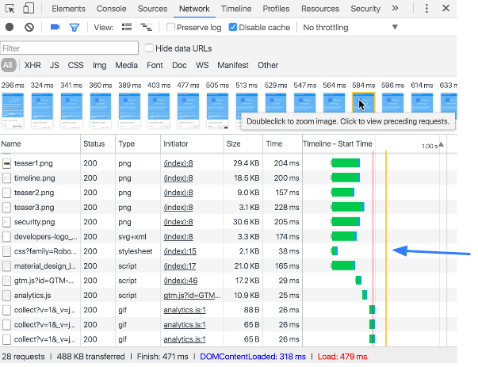

project_path: /web/tools/_project.yaml
book_path: /web/tools/_book.yaml
description: Measure the network performance of your web application using the Chrome DevTools Network panel.

{# wf_updated_on: 2016-12-28 #}
{# wf_published_on: 2015-04-13 #}

# Measure Resource Loading Times {: .page-title }




Warning: This page is deprecated. At the top of each section, there's a
link to an up-to-date page where you can find similar information.

Measure the network performance of your site using the
<strong>Network</strong> panel.

The **Network** panel records information about each network operation on
a page, including detailed timing data, HTTP request and response
headers, cookies, and more.

### TL;DR {: .hide-from-toc }
- Use the Network panel to record and analyze network activity.
- View load information in aggregate or for individual resources.
- Filter and sort how resources are displayed.
- Save, copy, and clear network recordings.
- Customize the Network panel to your needs.

## Network panel overview

<aside class="warning">
  <b>Warning:</b> This page is deprecated. See following sections for up-to-date
  information:
  <ul>
    <li><a href="reference#controls">Controls pane</a></li>
    <li><a href="reference#filters">Filters pane</a></li>
    <li><a href="reference#overview">Overview pane</a></li>
    <li><a href="reference#requests">Requests pane</a></li>
    <li><a href="reference#summary">Summary pane</a></li>
  </ul>
</aside>

The Network panel consists of five panes:

1. **Controls**. Use these options to control how the **Network** panel looks
   and functions.
2. **Filters**. Use these options to control which resources are displayed in
   the **Requests Table**. Tip: hold <kbd>Cmd</kbd> (Mac) or <kbd>Ctrl</kbd>
   (Window/Linux), and then click on a filter to select multiple filters at the
   same time.
3. **Overview**. This graph shows a timeline of when resources were retrieved.
   If you see multiple bars stacked vertically, it means that those resources
   were retrieved simultaneously.
4. **Requests Table**. This table lists out every resource that was retrieved.
   By default, this table is sorted chronologically, with the earliest
   resources at the top.
   Clicking on the name of a resource yields more information about it.
   Tip: right-click on any of the table headers except **Timeline** to
   add or remove columns of information.
5. **Summary**. At a glance this pane tells you the total number of requests,
   amount of data transferred, and load times.

The **Requests Table** displays the following columns by default. You can
[add and remove columns](#add-and-remove-table-columns).

* **Name**. The name of the resource.
* **Status**. The HTTP status code.
* **Type**. The MIME type of the requested resource.
* **Initiator**. The object or process that initiated the request. It can
  have one of the following values:
  * **Parser**. Chrome's HTML parser initiated the request.
  * **Redirect**. An HTTP redirect initiated the request.
  * **Script**. A script initiated the request.
  * **Other**. Some other process or action initiated the request,
    such as the user navigating to a page via a link, or by entering a
    URL in the address bar.
* **Size**. The combined size of the response headers (usually a
  few hundred bytes) plus the response body, as delivered by the server.
* **Time**. The total duration, from the start of the request to the
  receipt of the final byte in the response.
* **Timeline**. The Timeline column displays a visual waterfall of all
  network requests. Clicking the header of this column reveals a menu of
  additional sorting fields.

## Record network activity

<aside class="warning">
  <b>Warning:</b> This page is deprecated. See
  <a href="reference#record">Start or stop recording</a>
  for up-to-date information.
</aside>

When the **Network** panel is open, DevTools records all network activity
by default. To record, just reload a page while the panel is open, or wait
for network activity on the currently loaded page.

You can tell whether or not DevTools is recording via the
**record** button. When it's red
({:.inline}), DevTools is recording.
When it's grey ({:.inline}), DevTools
is not recording. Click this button to start or stop recording, or press
the keyboard shortcut <kbd>Cmd/Ctrl</kbd>+<kbd>e</kbd>.

## Capture screenshots during recording {:#filmstrip}

<aside class="warning">
  <b>Warning:</b> This page is deprecated. See
  <a href="reference#screenshots">Capture screenshots during recording</a>
  for up-to-date information.
</aside>

The **Network** panel can capture screenshots during a page load. This feature
is known as the **Filmstrip**.

Click on the **camera** icon to enable the Filmstrip. When the icon is grey,
the Filmstrip is disabled  ({:.inline}). When the icon is blue, it is
enabled ({:.inline}).

Reload the page to capture the screenshots. The screenshots are displayed
above the **Overview**.

When you hover over a screenshot, the **Timeline** displays a vertical yellow
line indicating when the frame was captured.

Double-click on a screenshot to view a zoomed version of the screenshot. While
a screenshot is zoomed, use the left and right arrows of your keyboard
to navigate between screenshots.

## View DOMContentLoaded and load event information

<aside class="warning">
  <b>Warning:</b> This page is deprecated. See
  <a href="reference#load">View load events</a>
  for up-to-date information.
</aside>

The **Network** panel highlights two events:
[`DOMContentLoaded`](https://developer.mozilla.org/en-US/docs/Web/Events/DOMContentLoaded) and
[`load`](https://developer.mozilla.org/en-US/docs/Web/Events/load).

`DOMContentLoaded` is fired when the initial markup of a page has been
parsed. It is displayed in two places on the **Network** panel:

1. The blue vertical bar in the **Overview** pane signifies the event.
2. In the **Summary** pane you can see the exact time of the event.

`load` is fired when a page has fully loaded. It is displayed in three places:

1. The red vertical bar in the **Overview** pane signifies the event.
2. The red vertical bar in the **Requests Table** signifies the event, too.
3. In the **Summary** pane you can see the exact time of the event.

## View details for a single resource

<aside class="warning">
  <b>Warning:</b> This page is deprecated. See
  <a href="reference#details">View details</a>
  for up-to-date information.
</aside>

Click on a resource name (under the **Name** column of the **Requests Table**)
to view more information about that resource.

The tabs available change depending on what type of resource you've selected,
but the four tabs below are most common:

* **Headers**. HTTP headers associated with the resource.
* **Preview**. Previews of JSON, image, and text resources.
* **Response**. HTTP response data (if any).
* **Timing**. A granular breakdown of the request lifecycle for the
  resource.

### View network timing

<aside class="warning">
  <b>Warning:</b> This page is deprecated. See
  <a href="reference#timing">Timing tab</a>
  for up-to-date information.
</aside>

Click the **Timing** tab to view a granular breakdown of the request
lifecycle for a single resource.

The lifecycle shows how much time is spent in the following categories:

<!-- the screenshot above and list below are redundant, but we include
     the text for SEO -->

* Queuing
* Stalled
* If applicable: DNS lookup, initial connection, SSL handshake
* Request sent
* Waiting (Time to first byte (TTFB))
* Content Download

You can also view this same information by hovering your mouse over a
resource within the **Timeline** graph.

{# include shared/related_guides.liquid inline=true list=page.related-guides.timing #}

Related Guides:

* [Understanding Resource Timing](understanding-resource-timing)

### View HTTP headers

<aside class="warning">
  <b>Warning:</b> This page is deprecated. See
  <a href="reference#headers">Headers tab</a>
  for up-to-date information.
</aside>

Clicking the **Headers** shows the headers for that resource.

The **Headers** tab displays the resource's request URL, HTTP method, and
response status code. Additionally, it lists the HTTP response and request
headers and their values, and any query string parameters.

You can view response headers, request headers, or query string parameters
in source or parsed format by clicking the `view source` or `view parsed`
link next to each section.

You can also view query string parameters in URL-encoded or decoded format by
clicking the `view URL encoded` or `view decoded` link next to that section.

### Preview a resource

<aside class="warning">
  <b>Warning:</b> This page is deprecated. See
  <a href="reference#preview">Preview tab</a>
  for up-to-date information.
</aside>

Click the **Preview** tab to view a preview of that resource. The **Preview**
tab may or may not display any useful information, depending on the type of
resource you've selected.

### View HTTP response content

<aside class="warning">
  <b>Warning:</b> This page is deprecated. See
  <a href="reference#response">Response tab</a>
  for up-to-date information.
</aside>

Click the **Response** tab to view the resource's unformatted HTTP response
content. The **Response** tab may or may not contain any useful information,
depending on the type of resource you've selected.

### View cookies

<aside class="warning">
  <b>Warning:</b> This page is deprecated. See
  <a href="reference#cookies">Cookies tab</a>
  for up-to-date information.
</aside>

Click the **Cookies** tab to view a table of cookies transmitted in the
resource's HTTP request and response headers. This tab is only available
when cookies are transmitted.

Below is a description of each of the columns in the table:

* **Name**. The cookie's name.
* **Value**. The cookie's value.
* **Domain**. The domain the cookie belongs to.
* **Path**. The URL path the cookie came from.
* **Expires / Max-Age**. The value of the cookie's expires or max-age
  properties.
* **Size**. The size of the cookie in bytes.
* **HTTP**. Indicates that the cookie should only be set by the browser in
  the HTTP request, and cannot be accessed with JavaScript.
* **Secure**. The presence of this attribute indicates that the cookie should
  only be transmitted over a secure connection.

### View WebSocket frames

<aside class="warning">
  <b>Warning:</b> This page is deprecated. See
  <a href="reference#frames">Frames tab</a>
  for up-to-date information.
</aside>

Click the **Frames** tab to view
[`WebSocket`](https://developer.mozilla.org/en-US/docs/Web/API/WebSockets_API)
connection information. This tab is only visible when the selected resource
initiated a `WebSocket` connection.

The list below describes each of the columns in the table on the **Frames**
tab:

* **Data**. The message payload. If the message is plain text, it's
  displayed here. For binary opcodes, this field displays the opcode's
  name and code. The following opcodes are supported:
  * Continuation Frame
  * Binary Frame
  * Connection Close Frame
  * Ping Frame
  * Pong Frame
* **Length**. The length of the message payload in bytes.
* **Time**. The time stamp when the message was created.

Messages are color-coded according to their type:

* Outgoing text messages are color-coded light-green.
* Incoming text messages are white.
* WebSocket opcodes are light-yellow.
* Errors are light-red.

**Notes about current implementation:**

* To refresh the **Frames** table after new messages arrive, click the
  resource name on the left.
* Only the last 100 `WebSocket` messages are preserved by the **Frames** table.

## View resource initiators and dependencies {:#initiators-dependencies}

<aside class="warning">
  <b>Warning:</b> This page is deprecated. See
  <a href="reference#initiators-dependencies">View initiators and
  dependencies</a> for up-to-date information.
</aside>

Hold <kbd>Shift</kbd> and hover over a resource to view its initiators
and dependencies. This section refers to the resource that you are
hovering over as the **target**.

The first resource above the target that is color-coded green is the initiator
of the target. If there is a second resource above that which is color-coded
green, that's the initiator of the initiator. Any resources below the target
that are color-coded red are dependencies of the target.

In the screenshot below, the target is `dn/`. The initiator of the target is
the script beginning with `rs=AA2Y`. The initiator of the initiator
(`rs=AA2Y`) is `google.com`. Last, `dn.js` is a dependency of the
target (`dn/`).

Keep in mind that for pages with lots of resources it's possible that you
may not be able to see all of the initiators or dependencies.

## Sort requests

<aside class="warning">
  <b>Warning:</b> This page is deprecated. See
  <a href="reference#sort-by-activity">Sort by activity phase</a>
  for up-to-date information.
</aside>

By default, the resources in the **Requests Table** are sorted by the start
time of each request, starting with the earliest requests at the top.

Click on the header of a column to sort the table by each resource's value
for that header. Click the same header again to change the sort order to
ascending or descending.

The **Timeline** column is unique from the others. When clicked, it displays
a menu of sort fields:

* **Timeline**. Sorts by the start time of each network request. This is
  the default sort, and is the same as sorting by the **Start Time** option.
* **Start Time**. Sorts by the start time of each network request (same
  as sorting by the **Timeline** option).
* **Response Time**. Sorts by each request's response time.
* **End Time**. Sorts by the time when each request completed.
* **Duration**. Sorts by the total time of each request. Select this
  filter to determine which resource takes the longest time to load.
* **Latency**. Sorts by the time between the start of the request and the
  beginning of the response. Select this filter to determine which resource
  takes the longest time to first byte (TTFB).

## Filter requests

<aside class="warning">
  <b>Warning:</b> This page is deprecated. See
  <a href="reference#filters">Filters panel</a>
  for up-to-date information.
</aside>

The **Network** panel provides numerous ways to filter which resources are
displayed. Click the **filters** button
({:.inline})
to hide or display the **Filters** pane.

Use the content type buttons to only display resources of the selected
content type.

Note: Hold <kbd>Cmd</kbd> (Mac) or <kbd>Ctrl</kbd> (Windows/Linux) and then click to enable multiple filters simultaneously.

The **filter** text field is deceptively powerful. If you enter an
arbitrary string in it, the **Network** panel only displays the resources whose
filenames match the given string.

The **filter** text field also supports various keywords that let you
sort resources by various properties, such as file size using the `larger-than`
keyword.

The list below describes all of the keywords.

* `domain`. Only display resources from the specified domain. You can use
  a wildcard character (`*`) to include multiple domains. For example, `*.com`
  displays resources from all domain names ending in `.com`. DevTools
  populates the autocomplete dropdown menu with all of the domains
  it has encountered.
* `has-response-header`. Show the resources that contain the specified
  HTTP response header. DevTools populates the autocomplete dropdown with
  all of the response headers that it has encountered.
* `is`. Use `is:running` to find `WebSocket` resources.
* `larger-than`. Show resources that are larger than the specified size,
  in bytes. Setting a value of `1000` is equivalent to setting a value of `1k`.
* `method`. Show resources that were retrieved over a specified HTTP method
  type. DevTools populates the dropdown with all of the HTTP methods it
  has encountered.
* `mime-type`. Show resources of a specified MIME type. DevTools populates the
  dropdown with all MIME types it has encountered.
* `mixed-content`. Show all mixed content resources (`mixed-content:all`) or
  just the ones that are currently displayed (`mixed-content:displayed`).
* `scheme`. Show resources retrieved over unprotected HTTP (`scheme:http`)
  or protected HTTPS (`scheme:https`).
* `set-cookie-domain`. Show the resources that have a `Set-Cookie` header
  with a `Domain` attribute that matches the specified value. DevTools
  populates the autocomplete with all of the cookie domains that it has
  encountered.
* `set-cookie-name`. Show the resources that have a `Set-Cookie` header
  with a name that matches the specified value. DevTools populates the
  autocomplete with all of the cookie names that it has encountered.
* `set-cookie-value`. Show the resources that have a `Set-Cookie` header
  with a value that matches the specified value. DevTools populates the
  autocomplete with all of the cookie values that it has encountered.
* `status-code`. Only show resources whose HTTP status code match the
  specified code. DevTools populates the autocomplete dropdown menu with all
  of the status codes it has encountered.

Some of the keywords above mention an autocomplete dropdown menu. To trigger
the autocomplete menu, type in the keyword followed by a colon. For example,
in the screenshot below typing `domain:` triggered the autocomplete dropdown.

## Copy, save, and clear network information

<aside class="warning">
  <b>Warning:</b> This page is deprecated. See following sections for up-to-date
  information:
  <ul>
    <li><a href="reference#copy">Copy one or all requests</a></li>
    <li><a href="reference#save-as-har">Save as HAR with content</a></li>
    <li><a href="reference#clear-cache">Clear browser cache</a></li>
    <li><a href="reference#clear-cookies">Clear browser cookies</a></li>
  </ul>
</aside>

Right-click within the **Requests Table** to copy, save, or
delete network information. Some of the options are context-sensitive, so
if you want to operate on a single resource, you need to right-click on
that resource's row. The list below describes each of the options.

* **Copy Response**. Copies the HTTP response of the selected resource to
  the system clipboard.
* **Copy as cURL**. Copies the network request of the selected resource as a
  [cURL](http://curl.haxx.se/){: .external } command string to the system clipboard.
  See [Copying requests as cURL commands](#copy-requests-as-curl-commands).
* **Copy All as HAR**. Copies all resources to the system clipboard as
  [HAR](https://en.wikipedia.org/wiki/.har){: .external } data.
  A HAR file contains a JSON data structure that describes the network
  "waterfall". Several [third-party](https://ericduran.github.io/chromeHAR/){: .external }
  [tools](https://code.google.com/p/harviewer/){: .external } can reconstruct the network
  waterfall from the data in the HAR file. See
  [Web Performance Power Tool: HTTP Archive
  (HAR)](https://www.igvita.com/2012/08/28/web-performance-power-tool-http-archive-har/)
  for more information.
* **Save as HAR with Content**. Saves all network data to an
  HAR file along with each page resource. Binary resources, including images,
  are encoded as Base64-encoded text.
* **Clear Browser Cache**. Clear the browser cache.
  **Tip**: You can also enable or disable the browser cache from the
  [**Network Conditions**][nc] drawer.
* **Clear Browser Cookies**. Clear the browser's cookies.
* **Open in Sources Panel**. Open the selected resource in the **Sources**
  panel.
* **Open Link in New Tab**. Opens the selected resource in a new tab. You
  can also double-click the resource name in the Network table.
* **Copy Link Address**. Copies the resource URL to the system clipboard.
* **Save**. Save the selected text resource. Only displayed on text
  resources.
* **Replay XHR**. Re-send the selected `XMLHTTPRequest`. Only displayed on XHR
  resources.

[nc]: /web/tools/chrome-devtools/profile/network-performance/network-conditions#network-conditions

### Copy one or all requests as cURL commands {: #curl }

<aside class="warning">
  <b>Warning:</b> This page is deprecated. See
  <a href="reference#copy">Copy one or all requests</a>
  for up-to-date information.
</aside>

[cURL](http://curl.haxx.se/){: .external } is a command line tool for making HTTP
transactions.

Right-click on a resource within the Requests Table, hover over
**Copy** and then select **Copy as cURL** to copy a string of cURL
requests for all resources that have been detected by the Network panel.

Select **Copy All as cURL** to copy a string of cURL requests for all
resources that have been detected by the Network panel.

When you copy all, filtering is ignored (e.g. if you filter the Network panel
to only display CSS resources and then press **Copy All as cURL**, you'll get
all the detected resources, not just the CSS).

## Customize the Network panel

<aside class="warning">
  <b>Warning:</b> This page is deprecated. See
  <a href="reference#request-rows">Use large or small requests rows</a>
  for up-to-date information.
</aside>

By default the **Requests Table** displays resources with small rows. Click
the **Use large resource rows** button
({:.inline})
to increase the size of each row.

Large rows enable some columns to display two text fields: a primary
field and a secondary field. The column header indicates the meaning of the
secondary field.

### Add and remove table columns

<aside class="warning">
  <b>Warning:</b> This page is deprecated. See following sections for up-to-date
  information:
  <ul>
    <li><a href="reference#columns">Show or hide columns</a></li>
    <li><a href="reference#custom-columns">Add custom columns</a></li>
  </ul>
</aside>

Right-click on any of the headers in the **Requests Table** to add or remove
columns.

### Preserve the network log upon navigation

<aside class="warning">
  <b>Warning:</b> This page is deprecated. See
  <a href="reference#preserve-log">Preserve log</a>
  for up-to-date information.
</aside>

By default, the network activity recording is discarded whenever you
reload the current page or load a different page.
Enable the **Preserve log** checkbox to save the network log across these
scenarios. New records are appended to the bottom of the **Requests Table**.

## Additional resources

To learn more optimizing the network performance of your application, see the following resources:

* Use [PageSpeed
  Insights](/speed/pagespeed/insights) to identify
  performance best practices that can be applied to your site, and
  [PageSpeed optimization
  tools](/speed/pagespeed/optimization) to
  automate the process of applying those best practices.
* [High Performance Networking in Google
  Chrome](https://www.igvita.com/posa/high-performance-networking-in-google-chrome/)
  discusses Chrome network internals and how you can take advantage of them
  to make your site faster.
* [How gzip compression
  works](/speed/articles/gzip) provides a
  high-level overview gzip compression and why it's a good idea.
* [Web Performance Best
  Practices](/speed/docs/best-practices/rules_intro)
  provides additional tips for optimizing the network performance of your web
  page or application.
