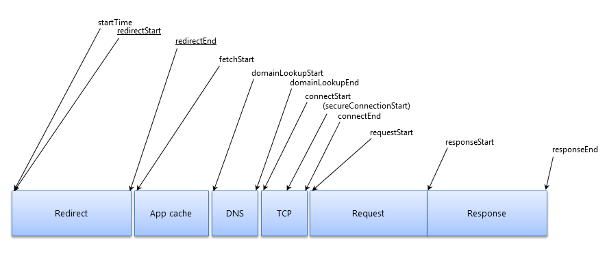
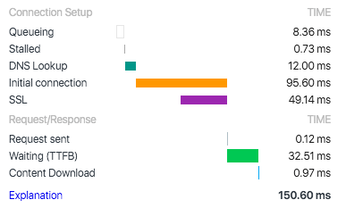
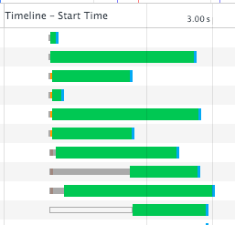
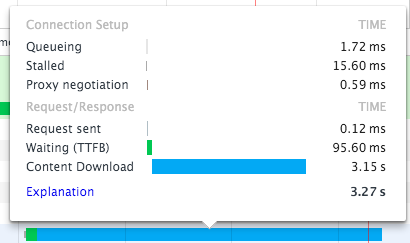

project_path: /web/tools/_project.yaml
book_path: /web/tools/_book.yaml
description: It is crucial to understand the phases in which resources are gathered over the network. This is the foundation for fixing load issues.

{# wf_published_on: 2016-12-29 #}
{# wf_updated_on: 2016-02-03 #}

# Understanding Resource Timing {: .page-title }



<aside class="note">
  <b>Note:</b> This page is deprecated. At the top of each section, there's a
  link to an up-to-date page where you can find similar information.
</aside>

It is crucial to understand the phases in which resources are gathered over the network. This is the foundation for fixing load issues.

### TL;DR {: .hide-from-toc }
- Understand the phases of resource timing.
- Know what each phase provides to the Resource Timing API.
- Realize different indicators of performance problems in the timeline graph, such as series of transparent bars or large green chunks.

All network requests are considered resources.
As they are retrieved over the network, resources have distinct lifecycles expressed in terms of resource timing.
The Network Panel uses the same [Resource Timing API](http://www.w3.org/TR/resource-timing) that is available to application developers.

Note: when using the Resource Timing API with cross origin resources, make
sure that all of the resources have CORS headers.

The Resource Timing API provides a rich level of detail about each individual asset's time to be received.
The primary phases of the request lifecycle are:

*   Redirect
    *   Immediately begins `startTime`.
    *   If a redirect is happening, `redirectStart` begins as well.
    *   If a redirect is occurring at the end of this phase then `redirectEnd` will be taken.
*   App Cache
    *   If it’s application cache fulfilling the request, a `fetchStart` time will be taken.
*   DNS
    *   `domainLookupStart` time is taken at the beginning of the DNS request.
    *   `domainLookupEnd` time is taken at the end of the DNS request.
* TCP
    *   `connectStart` is taken when initially connecting to the server.
    *   If TLS or SSL are in use then `secureConnectionStart` will start when the handshake begins for securing the connection.
    *   `connectEnd` is taken when the connection to the server is complete.
*   Request
    *   `requestStart` is taken once the request for a resource has been sent to the server.
*   Response
    *   `responseStart` is the time when the server initially responds to the request.
    *   `responseEnd` is the time when the request ends and the data is retrieved.

## Viewing in DevTools

<aside class="note">
  <b>Note:</b> This page is deprecated. See following sections for up-to-date
  information:
  <ul>
    <li><a href="reference#timing-breakdown">View timing breakdown</a></li>
    <li><a href="reference#timing">Timing tab</a></li>
  </ul>
</aside>

To view the full timing information for a given entry of the Network Panel you have three options.

1. Hover the timing graph under the timeline column. This will present a popup that shows the full timing data.
2. Click on any entry and open the Timing tab of that entry.
3. Use the Resource Timing API to retrieve the raw data from JavaScript.

<figure>
<figcaption>

  This code can be ran in the DevTools console.
  It will use the network timing API to retrieve all resources.
  Then it filters the entries looking for one with a name that contains "style.css".
  If found it will be returned.

<code>
  performance.getEntriesByType('resource').filter(item => item.name.includes("style.css"))
</code>
</figcaption>

</figure>

<dl>

  <dt class="queued"><strong>Queuing</strong></dt>
  <dd>
    A request being queued indicates that:
      <ul>
        <li>
        The request was postponed by the rendering engine because it's considered lower priority than critical resources (such as scripts/styles).
        This often happens with images.
        </li>
        <li>
        The request was put on hold to wait for an unavailable TCP socket that's about to free up.
        </li>
        <li>
        The request was put on hold because the browser only allows <a href="https://crbug.com/12066">six TCP connections</a> per origin on HTTP 1.
        </li>
        <li>
        Time spent making disk cache entries (typically very quick.)
        </li>
      </ul>
  </dd>

  <dt class="stalled"><strong> Stalled/Blocking</strong></dt>
  <dd>
    Time the request spent waiting before it could be sent.
    It can be waiting for any of the reasons described for Queueing.
    Additionally, this time is inclusive of any time spent in proxy negotiation.
  </dd>

  <dt class="proxy-negotiation"><strong> Proxy Negotiation</strong></dt>
  <dd>Time spent negotiating with a proxy server connection.</dd>

  <dt class="dns-lookup"><strong><abbr title="Domain Name System"> DNS</abbr> Lookup</strong></dt>
  <dd>
    Time spent performing the DNS lookup.
    Every new domain on a page requires a full roundtrip to do the DNS lookup.
  </dd>

  <dt class="initial-connection"><strong> Initial Connection / Connecting</strong></dt>
  <dd>Time it took to establish a connection, including <abbr title="Transmission Control Protocol">TCP</abbr> handshakes/retries and negotiating a <abbr title="Secure Sockets Layer">SSL</abbr>.</dd>

  <dt class="ssl"><strong> SSL</strong></dt>
  <dd>Time spent completing a SSL handshake.</dd>

  <dt class="request-sent"><strong> Request Sent / Sending</strong></dt>
  <dd>
    Time spent issuing the network request.
    Typically a fraction of a millisecond.
  </dd>

  <dt class="ttfb"><strong> Waiting (<abbr title="Time To First Byte">TTFB</abbr>)</strong></dt>
  <dd>
    Time spent waiting for the initial response, also known as the Time To First Byte.
    This time captures the latency of a round trip to the server in addition to the time spent waiting for the server to deliver the response.
  </dd>

  <dt class="content-download"><strong> Content Download / Downloading</strong></dt>
  <dd>Time spent receiving the response data.</dd>
</dl>

## Diagnosing Network Issues

<aside class="note">
  <b>Note:</b> This page is deprecated. See
  <a href="issues">Network Issues Guide</a>
  for up-to-date information.
</aside>

There are numerous possible issues that can be uncovered through the Network Panel.
Being able to find these requires a good understanding of how clients and servers communicate and the limitations imposed by the protocols.

### Queued or Stalled series

The most common issue seen is a series of items that are queued or stalled.
This indicates that too many resources are being retrieved from a single domain.
On HTTP 1.0/1.1 connections, Chrome enforces a maximum of six TCP connections per host.
If you are requesting twelve items at once, the first six will begin and the last half will be queued.
Once one of the original half is finished, the first item in the queue will begin its request process.

To fix this problem for traditional HTTP 1 traffic, you would need to implement [domain sharding](https://www.maxcdn.com/one/visual-glossary/domain-sharding-2/).
That is making multiple subdomains on your application to serve resources from.
Then split the resources being served evenly among the subdomains.

The fix for HTTP 1 connections does **not** apply to HTTP 2 connections.
In fact, it hurts them. If you have HTTP 2 deployed, don’t domain-shard your resources as it works against how HTTP 2 is engineered to operate.
In HTTP 2, there is a single TCP connection to the server that acts as a multiplexed connection.
This gets rid of the six connection limit of HTTP 1 and multiple resources can be transferred over the single connection simultaneously.

### Slow Time to First Byte

<small>AKA: lots of green</small>

A slow time to first byte (TTFB) is recognized by a high waiting time.
It is recommended that you have this [under 200ms](/speed/docs/insights/Server).
A high TTFB reveals one of two primary issues. Either:

1. Bad network conditions between client and server, or
2. A slowly responding server application

To address a high TTFB, first cut out as much network as possible.
Ideally, host the application locally and see if there is still a big TTFB.
If there is, then the application needs to be optimized for response speed.
This could mean optimizing database queries, implementing a cache for certain portions of content, or modifying your web server configuration.
There are many reasons a backend can be slow.
You will need to do research into your software and figure out what is not meeting your performance budget.

If the TTFB is low locally then the networks between your client and the server are the problem.
The network traversal could be hindered by any number of things.
There are a lot of points between clients and servers and each one has its own connection limitations and could cause a problem.
The simplest method to test reducing this is to put your application on another host and see if the TTFB improves.

### Hitting throughput capacity

<small>AKA: lots of blue</small>

If you see lots of time spent in the Content Download phases, then improving server response or concatenating won't help.
The primary solution is to send fewer bytes.
