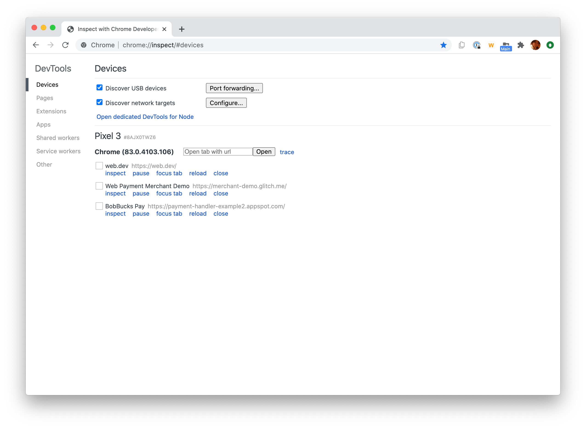
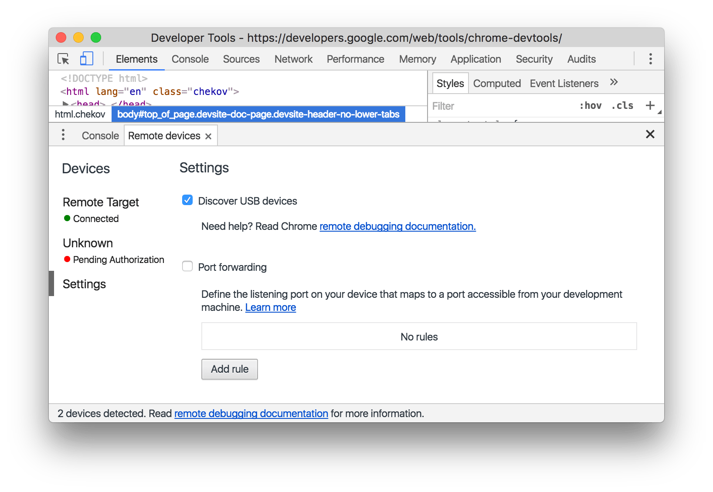
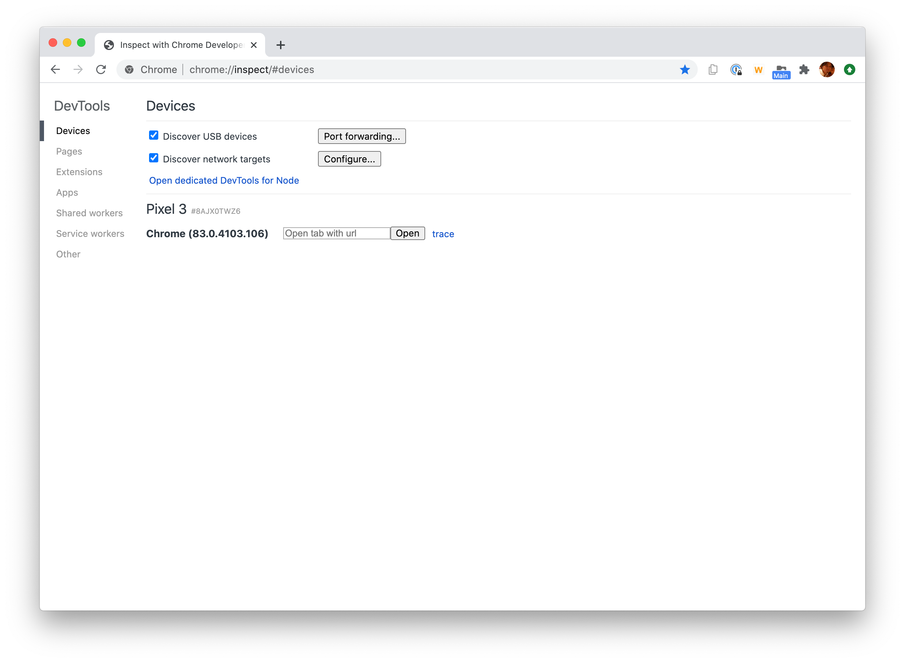

project_path: /web/tools/_project.yaml
book_path: /web/tools/_book.yaml
description: Remote debug live content on an Android device from a Windows, Mac, or Linux computer.

{# wf_updated_on: 2018-01-12 #}
{# wf_published_on: 2015-04-13 #}
{# wf_blink_components: Platform>DevTools #}

# Get Started with Remote Debugging Android Devices {: .page-title }



Remote debug live content on an Android device from your 
Windows, Mac, or Linux computer. This tutorial teaches you how to:

* Set up your Android device for remote debugging, and discover it from
  your development machine.
* Inspect and debug live content on your Android device from your development
  machine.
* Screencast content from your Android device onto a DevTools instance on your
  development machine.

<figure>
  
  <figcaption>
    <b>Figure 1</b>. Remote Debugging lets you inspect a page running on an Android device
    from your development machine.
  </figcaption>
</figure>

## Step 1: Discover your Android device {: #discover }

The workflow below works for most users. See [Troubleshooting: DevTools is not detecting the
Android device](#troubleshooting) for more help.

1. Open the **Developer Options** screen on your Android. See [Configure On-Device Developer
   Options](https://developer.android.com/studio/debug/dev-options.html){:.external}.
1. Select **Enable USB Debugging**.
1. On your development machine, open Chrome.
1. [Open DevTools](/web/tools/chrome-devtools/#open).
1. In DevTools, click the **Main Menu** ![Main Menu][main]{:.devtools-inline} 
   then select **More tools** > **Remote devices**. 

     <figure>
       
       <figcaption>
         <b>Figure 2</b>. Opening the <b>Remote Devices</b> tab via the <b>Main Menu</b>
       </figcaption>
     </figure>

[main]: /web/tools/chrome-devtools/images/three-dot.png
[open]: /web/tools/chrome-devtools/remote-debugging/imgs/open-remote-devices.png

1. In DevTools, open the **Settings** tab.

1. Make sure that the **Discover USB devices** checkbox is enabled.

     <figure>
       
       <figcaption>
         <b>Figure 3</b>. The <b>Discover USB Devices</b> checkbox is enabled
       </figcaption>
     </figure>

[discover]: /web/tools/chrome-devtools/remote-debugging/imgs/discover-usb-devices.png

1. Connect your Android device directly to your development machine using a USB
   cable. The first time you do this, you usually see that DevTools has detected an unknown
   device. If you see a green dot and the text **Connected** below the model name of
   your Android device, then DevTools has successfully established the connection to
   your device. Continue to [Step 2](#debug).

     <figure>
       
       <figcaption>
         <b>Figure 4</b>. The <b>Remote Devices</b> tab has successfully detected an unknown
         device that is pending authorization
       </figcaption>
     </figure>

[unknown]: /web/tools/chrome-devtools/remote-debugging/imgs/unknown-device.png

1. If your device is showing up as **Unknown**, accept the **Allow USB
   Debugging** permission prompt on your Android device. 

### Troubleshooting: DevTools is not detecting the Android device {: #troubleshooting }

* If you're using a USB hub, try connecting your Android device directly to your
  development machine instead.
* Try unplugging the USB cable between your Android device and development machine, and
  then plugging it back in. Do it while your Android and development machine screens
  are unlocked.
* If your development machine is running Windows, try manually installing the USB drivers for
  your Android device. See [Install OEM USB Drivers][drivers]{:.external}.
* If you don't see the **Allow USB Debugging** prompt on your Android device, try
  disconnecting and then re-connecting the USB cable while DevTools is in focus on
  your development machine and your Android homescreen is showing. In other words,
  sometimes the prompt doesn't show up when your Android or development machine screens
  are locked. Consider updating the display settings for your Android device and development
  machine so that they never go to sleep.
* Select **Revoke USB Debugging Authorizations** from the **Developer Options** screen on your
  Android device to reset it to a fresh state.
* Some combinations of Windows and Android devices (especially Samsung) require extra
  set up. See [Chrome DevTools Devices does not detect device when plugged in][SO]{:.external}.
* Make sure that your USB cable works. You should be able to inspect files on your Android device
  from your development machine.

If you find a solution that is not mentioned in this section or in [Chrome DevTools Devices
does not detect device when plugged in][SO], please add an answer to that Stack Overflow
question, or [open an issue on this tutorial's repository][issue]{:.external}!

[drivers]: https://developer.android.com/tools/extras/oem-usb.html
[SO]: https://stackoverflow.com/questions/21925992
[issue]: https://github.com/google/webfundamentals/issues/new?title=[Remote%20Debugging]

## Step 2: Debug content on your Android device from your development machine {: #debug }

1. Open Chrome on your Android device.
1. In the **Remote Devices** tab, click the tab that matches your Android device model name.
   At the top of this page, you see your Android device's model name, followed by its serial
   number. Below that, you can see the version of Chrome that's running on the device, with
   the version number in parentheses. Each open Chrome tab gets its own section. You can
   interact with that tab from this section. If there are any apps using WebView, you see a
   section for each of those apps, too. In <b>Figure 5</b> there are no tabs or WebViews open.

     <figure>
       
       <figcaption>
         <b>Figure 5</b>. A connected remote device
       </figcaption>
     </figure>

1. In the **New tab** text box, enter a URL and then click **Open**. The page opens
   in a new tab on your Android device.

1. Click **Inspect** next to the URL that you just opened. A new DevTools
   instance opens. The version of Chrome running on your Android device
   determines the version of DevTools that opens on your development machine.
   So, if your Android device is running a very old version of Chrome, the
   DevTools instance may look very different than what you're used to.

### More actions: reload, focus, or close a tab {: #more-actions }

Click **More Options** ![More Options][more]{:.devtools-inline} next to the
tab that you want to reload, focus, or close.

[more]: /web/tools/chrome-devtools/images/three-dot.png

<figure>
  
  <figcaption>
    <b>Figure 6</b>. The menu for reloading, focusing, or closing a tab
  </figcaption>
</figure>

### Inspect elements {: #inspect }

Go to the **Elements** panel of your DevTools instance, and hover over an
element to highlight it in the viewport of your Android device.

You can also tap an element on your Android device screen to select it in the
**Elements** panel. Click **Select Element** ![Select
Element][select]{:.devtools-inline} on your DevTools instance, and then tap
the element on your Android device screen. Note that **Select Element**
is disabled after the first touch, so you need to re-enable it every time
you want to use this feature.

[select]: imgs/select-element.png

### Screencast your Android screen to your development machine {: #screencast }

Click **Toggle Screencast** ![Toggle Screencast][screencast]{:.devtools-inline}
to view the content of your Android device in your DevTools instance.

[screencast]: imgs/toggle-screencast.png

You can interact with the screencast in multiple ways:

* Clicks are translated into taps, firing proper touch events on the device. 
* Keystrokes on your computer are sent to the device. 
* To simulate a pinch gesture, hold <kbd>Shift</kbd> while dragging. 
* To scroll, use your trackpad or mouse wheel, or fling with your mouse
  pointer.

Some notes on screencasts:

* Screencasts only display page content. Transparent portions of the screencast 
  represent device interfaces, such as the Chrome omnibox, the Android status 
  bar, or the Android keyboard.
* Screencasts negatively affect frame rates. Disable screencasting while
  measuring scrolls or animations to get a more accurate picture of your
  page's performance.
* If your Android device screen locks, the content of your screencast
  disappears. Unlock your Android device screen to automatically resume the
  screencast.
