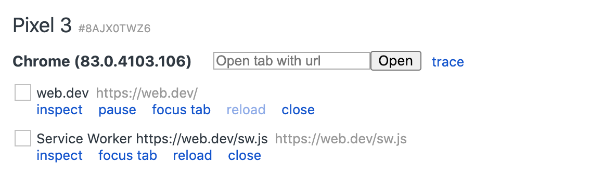

project_path: /web/tools/_project.yaml
book_path: /web/tools/_book.yaml
description: Remote debug live content on an Android device from a Windows,  Mac or Linux computer.

{# wf_updated_on: 2016-12-09 #}
{# wf_published_on: 2015-04-13 #}

# Get Started with Remote Debugging Android Devices {: .page-title }



Remote debug live content on an Android device from your 
Windows, Mac, or Linux computer. This tutorial teaches you how to:

* Set up your Android device for remote debugging, and discover it from
  your development machine.
* Inspect and debug live content on your Android device from your development
  machine.
* Screencast content from your Android device onto a DevTools instance on your
  development machine.

## Requirements {: #requirements }

* Chrome 32 or later installed on your development machine.
* [USB drivers][drivers] installed on your development machine, if you're using
  Windows. Ensure _Device Manager_ reports the correct USB driver.
* A USB cable to connect your Android device to your development machine.
* Android 4.0 or later.
* Chrome for Android installed on your Android device.

[drivers]: https://developer.android.com/tools/extras/oem-usb.html

## Step 1: Discover your Android device {: #discover }

1. On your Android device, select **Settings** > **Developer Options** >
   **Enable USB Debugging**. **Developer Options** is hidden by default on
   Android 4.2 and later. See [Enabling On-Device Developer Options][android]
   to learn how to enable it.

[android]: https://developer.android.com/studio/run/device.html#developer-device-options

1. On your development machine, open Chrome. You should be signed in to
   Chrome with one of your Google accounts. Remote debugging does not work in
   [Incognito Mode][incognito] or [Guest Mode][guest].

[guest]: https://support.google.com/chrome/answer/6130773
[incognito]: https://support.google.com/chrome/answer/95464

1. [Open DevTools](/web/tools/chrome-devtools/#open).

1. In DevTools, click the **Main Menu** ![Main Menu][main]{:.devtools-inline} 
   then select **More tools** > **Remote devices**. 

     ![Opening remote devices drawer][open]

[main]: /web/tools/chrome-devtools/images/three-dot.png
[open]: /web/tools/chrome-devtools/remote-debugging/imgs/open-remote-devices.png

1. In DevTools, click the **Settings** tab, if another tab is showing.

1. Make sure that **Discover USB devices** is enabled.

     ![Discover USB devices is enabled][discover]

[discover]: /web/tools/chrome-devtools/remote-debugging/imgs/discover-usb-devices.png

1. Connect your Android device directly to your development machine using a USB
   cable. Don't use any intermediate USB hubs. If this is your first time
   connecting your Android device to this development machine, your device
   shows up under **Unknown**, with the text **Pending Authorization** below
   it.

       ![Unknown device, pending authorization][unknown]

[unknown]: /web/tools/chrome-devtools/remote-debugging/imgs/unknown-device.png

1. If your device is showing up as **Unknown**, accept the **Allow USB
   Debugging** permission prompt on your Android device. **Unknown** is
   replaced with the model name of your Android device. The green circle
   and the **Connected** text indicate that you are all set to remotely
   debug your Android device from your development machine.

Note: If you have any issues during the discovery process, you 
can restart it by selecting **Settings** > **Developer Options** >
**Revoke USB Debugging Authorizations** on your Android device.

## Step 2: Debug content on your Android device from your development machine {: #debug }

1. If you don't already have Chrome open on your Android device, open it now.

1. Back in DevTools, click the tab that matches your device's
   model name. At the top of this page, you see your Android device's model
   name, followed by its serial number. Below that, you can see the version
   of Chrome that's running on the device, with the version number in
   parentheses. Each open Chrome tab gets its own section. You can interact
   with that tab from this section. If there are any apps using WebView, you
   see a section for each of those apps, too. The screenshot below does not
   have any tabs or WebViews open.

       ![Connected remote device][connected]

[connected]: /web/tools/chrome-devtools/remote-debugging/imgs/connected-remote-device.png

1. Next to **New tab**, enter a URL and then click **Open**. The page opens
   on a new tab on your Android device.

1. Click **Inspect** next to the URL that you just opened. A new DevTools
   instance opens. The version of Chrome running on your Android device
   determines the version of DevTools that opens on your development machine.
   So, if your Android device is running a very old version of Chrome, the
   DevTools instance may look very different than what you're used to.

### More actions: reload, focus, or close a tab {: #more-actions }

Click **More Options** ![More Options][more]{:.devtools-inline} next to the
tab that you want to reload, focus, or close.

[more]: /web/tools/chrome-devtools/images/three-dot.png

### Inspect elements {: #inspect }

Go to the **Elements** panel of your DevTools instance, and hover over an
element to highlight it in the viewport of your Android device.

You can also tap an element on your Android device screen to select it in the
**Elements** panel. Click **Select Element** ![Select
Element][select]{:.devtools-inline} on your DevTools instance, and then tap
the element on your Android device screen. Note that **Select Element**
is disabled after the first touch, so you need to re-enable it every time
you want to use this feature.

[select]: imgs/select-element.png

### Screencast from Android device to development machine {: #screencast }

Click **Toggle Screencast** ![Toggle Screencast][screencast]{:.devtools-inline}
to view the content of your Android device in your DevTools instance.

[screencast]: imgs/toggle-screencast.png

You can interact with the screencast in multiple ways:

* Clicks are translated into taps, firing proper touch events on the device. 
* Keystrokes on your computer are sent to the device. 
* To simulate a pinch gesture, hold <kbd>Shift</kbd> while dragging. 
* To scroll, use your trackpad or mouse wheel, or fling with your mouse
  pointer.

Some notes on screencasts:

* Screencasts only display page content. Transparent portions of the screencast 
  represent device interfaces, such as the Chrome omnibox, the Android status 
  bar, or the Android keyboard.
* Screencasts negatively affect frame rates. Disable screencasting while
  measuring scrolls or animations to get a more accurate picture of your
  page's performance.
* If your Android device screen locks, the content of your screencast
  disappears. Unlock your Android device screen to automatically resume the
  screencast.

## Feedback {: #feedback }

If you'd like to help us improve this tutorial, please answer the
questions below!



Did you complete the tutorial successfully?

<button class="gc-analytics-event"
   data-category="DevTools / Remote Debugging"
   data-label="Completed / Yes">Yes</button>
<button class="gc-analytics-event"
   data-category="DevTools / Remote Debugging"
   data-label="Completed / No">No</button>

Did the tutorial contain the information you were looking for?

<button class="gc-analytics-event"
   data-category="DevTools / Remote Debugging"
   data-label="Relevant / Yes">Yes</button>
<button class="gc-analytics-event"
   data-category="DevTools / Remote Debugging"
   data-label="Relevant / No">No</button>

