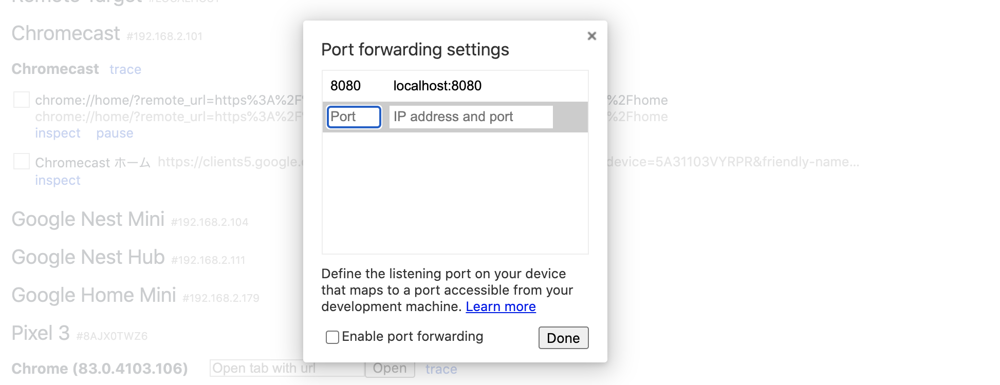
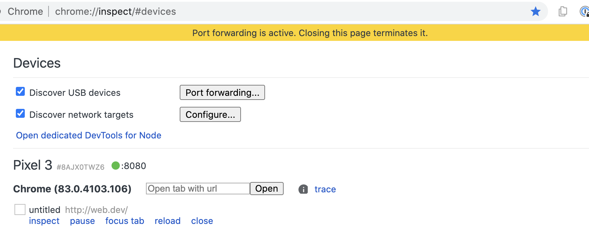

project_path: /web/tools/_project.yaml
book_path: /web/tools/_book.yaml
description: Host a site on a development machine web server, and then access the content from an Android device.

{# wf_updated_on: 2016-04-07 #}
{# wf_published_on: 2015-04-13 #}

# Access Local Servers {: .page-title }




Host a site on a development machine web server, then 
access the content from an Android device.

With a USB cable and Chrome DevTools, you can run a site from a development
machine and then view the site on an Android device. 

### TL;DR {: .hide-from-toc }
- Port forwarding enables you to view content from your development machine's web server on your Android device.
- If your web server is using a custom domain, you can set up your Android device to access the content at that domain with custom domain mapping.

## Set up port forwarding {:#port-forwarding}

Port forwarding enables your Android device to access content that's being
hosted on your development machine's web server. Port forwarding works by
creating a listening TCP port on your Android device that maps to a TCP port
on your development machine. Traffic between the ports travel through the USB
connection between your Android device and development machine, so
the connection doesn't depend on your network configuration.

To enable port forwarding:

1. Set up [remote debugging](.) between your development machine
   and your Android device. When you're finished, you should see your Android
   device in the left-hand menu of the **Inspect Devices** dialog and a 
   **Connected** status indicator. 
1. In the **Inspect Devices** dialog in DevTools, enable **Port forwarding**.
1. Click **Add rule**.

   
1. In the **Device port** textfield on the left, enter the `localhost` port 
   number from which you want to be able to access the site on your Android 
   device. For example, if you wanted to access the site from `localhost:5000` 
   you would enter `5000`.
1. In the **Local address** textfield on the right, enter the IP address or 
   hostname on which your site is running on your development machine's web
   server, followed by the port number. For example, if your site is running 
   on `localhost:7331` you would enter `localhost:7331`. 
1. Click **Add**.

Port forwarding is now set up. You can see a status indicator of the port
forward on the device's tab within the **Inspect Devices** dialog.

To view the content, open up Chrome on your Android device and go to 
the `localhost` port that you specified in the **Device port** field. For 
example, if you entered `5000` in the field, then you would go to 
`localhost:5000`. 

## Map to custom local domains {:#custom-domains}

Custom domain mapping enables you to view content on an Android device
from a web server on your development machine that is using a custom domain.

For example, suppose that your site uses a third-party JavaScript library
that only works on the whitelisted domain `chrome.devtools`. So, you create
an entry in your `hosts` file on your development machine to map this domain 
to `localhost` (i.e. `127.0.0.1 chrome.devtools`). After setting up custom 
domain mapping and port forwarding, you'll be able to view the site on your
Android device at the URL `chrome.devtools`. 

### Set up port forwarding to proxy server

To map a custom domain you must run a proxy server on your development 
machine. Examples of proxy servers are [Charles][charles], [Squid][squid], 
and [Fiddler][fiddler].

To set up port forwarding to a proxy:

1. Run the proxy server and note the port that it's using. **Note**: The 
   proxy server and your web server must run on different ports. 
1. Set up [port forwarding](#port-forwarding) to your Android device. For the
   **local address** field, enter `localhost:` followed by the port that your
   proxy server is running on. For example, if it's running on port `8000`,
   then you would enter `localhost:8000`. In the **device port** field enter 
   the number that you want your Android device to listen on, such as `3333`.

[charles]: http://www.charlesproxy.com/
[squid]: http://www.squid-cache.org/
[fiddler]: http://www.telerik.com/fiddler

### Configure proxy settings on your device

Next, you need to configure your Android device to communicate with the 
proxy server. 

1. On your Android device go to **Settings** > **Wi-Fi**.
1. Long-press the name of the network that you are currently connected to. 
   **Note**: Proxy settings apply per network.
3. Tap **Modify network**.
4. Tap **Advanced options**. The proxy settings display. 
5. Tap the **Proxy** menu and select **Manual**.
6. For the **Proxy hostname** field, enter `localhost`.
7. For the **Proxy port** field, enter the port number that you entered for
   **device port** in the previous section. 
8. Tap **Save**.

With these settings, your device forwards all of its requests to the proxy on 
your development machine. The proxy makes requests on behalf of your device, 
so requests to your customized local domain are properly resolved.

Now you can access custom domains on your Android device Android just as you 
would on the development machine. 

If your web server is running off of a non-standard port,
remember to specify the port when requesting the content from your Android
device. For example, if your web server is using the custom domain 
`chrome.devtools` on port `7331`, when you view the site from your Android
device you should be using the URL `chrome.devtools:7331`. 

**Tip**: To resume normal browsing, remember to revert the proxy settings on 
your Android device after you disconnect from the development machine.
