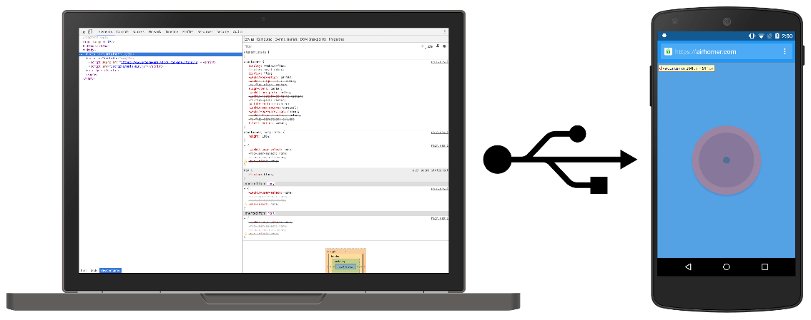
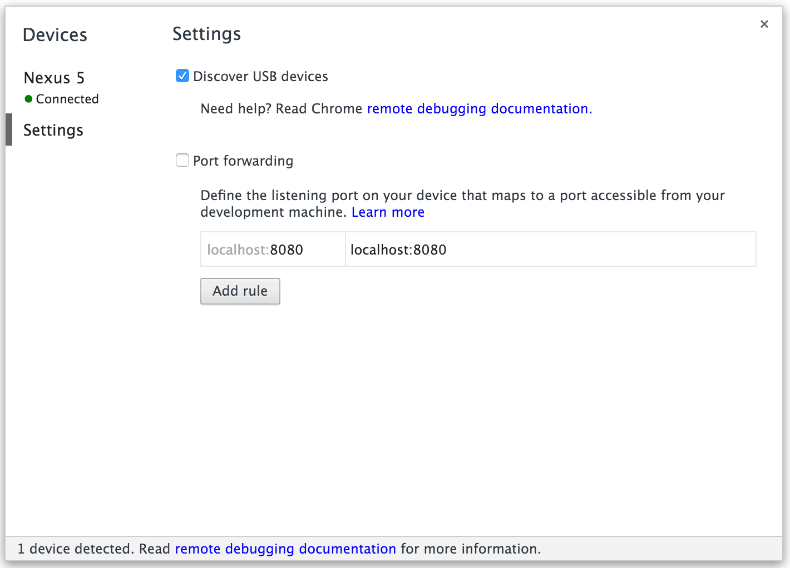
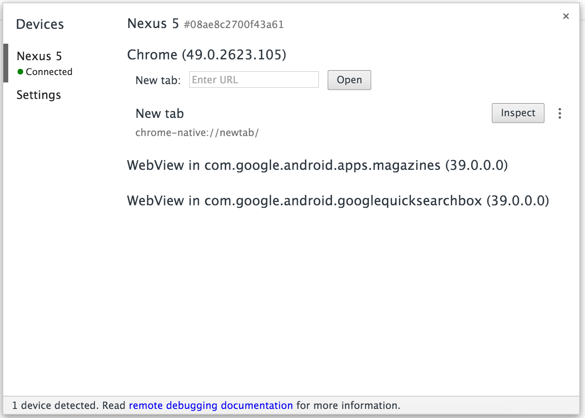
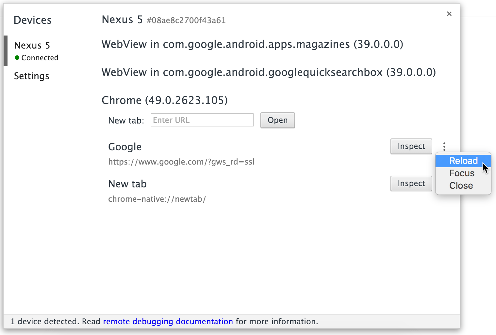
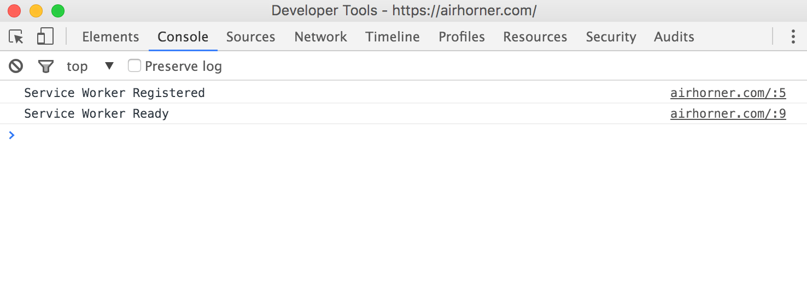
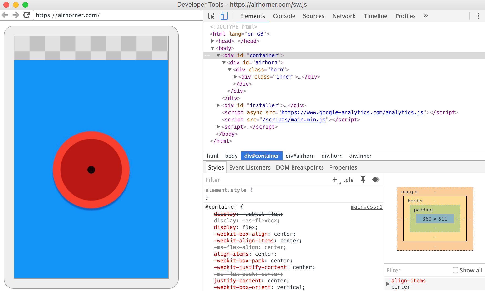

project_path: /web/_project.yaml
book_path: /web/tools/_book.yaml
description: Remote debug live content on an Android device from a Windows,  Mac or Linux computer.

{# wf_updated_on: 2016-04-06 #}
{# wf_published_on: 2015-04-13 #}

# Remote Debugging Android Devices {: .page-title }




Remote debug live content on an Android device from your 
Windows, Mac, or Linux computer.

## TL;DR
- Set up your Android device for remote debugging, and discover it from your development machine.
- Inspect and debug live content on your Android device from your development machine.
- Screencast content from your Android device into DevTools.

## Requirements

To begin remote debugging, you need:

* Chrome 32 or later installed on your development machine.
* [USB drivers][drivers] installed on your development machine, if you're using
  Windows. (Ensure _Device Manager_ reports the USB driver correctly)
* A USB cable to connect your Android device to your development machine.
* Android 4.0 or later.
* Chrome for Android installed on your Android device.

[drivers]: https://developer.android.com/tools/extras/oem-usb.html

## Enable USB debugging on your Android device

On your Android device, open up **Settings**, find the **Developer options**
section, and enable **USB debugging**. If you're running Android 4.2 or later
and you can't find **Developer options** you may need to [enable 
it](http://developer.android.com/tools/device.html#device-developer-options).

## Connect and discover your Android device

On your development machine, open Chrome. You should be logged in to one of 
your user profiles. Remote debugging does not work in incognito or guest mode.

Open DevTools and select **More tools** > **Inspect devices**. 

From here you can see the status of all connected remote devices. You don't
have any devices connected right now, so your dialog should look similar to the
following screenshot. Make sure that **Discover USB devices** is enabled. 

Connect your Android device to your development machine using a USB cable. You 
should connect your Android device directly to your developmen machine, not
through any intermediate hubs. 

If this is your first time connecting this Android device to this development
machine, you should see an unknown device that is pending authorization on
your Inspect Devices dialog.

If this is the case, then you need to open the **Allow USB debugging** prompt
on your Android device and grant the permissions. 

**Tip**: If you have encounter any issues during the discovery process, you 
can start the process anew by going back to **Developer options** and tapping 
**Revoke USB debugging authorizations**. 

After allowing USB debugging, you should see your device in the Inspect Devices
dialog. 

## Debug content on Android device from development machine

From the Inspect Devices dialog, select your device from the menu on the left.

From here you can see a variety of information about your connected Andoid 
device:

* At the top you can see the model name of your Android device followed by 
  its serial number (for example, `Nexus 5 #08ae8c2700f43a61`).
* If one or more Chrome tabs are open, then you'll see a **Chrome** heading
  followed by the version number of Chrome that's running (for example,
  `Chrome (49.0.2623.105)`). If no Chrome tabs are open, you won't see a 
  Chrome heading. 
* Underneath the **Chrome** heading, each open tab gets its own heading. 
  You can interact with that tab from this section. 
* If there are any running apps using [WebView][webview], you'll see a heading 
  for each app. 

To open a new Chrome tab, enter a URL in the textfield under the Chrome heading
and then click **Open**. A new tab automatically opens and loads the specified
URL. 

To reload, focus, or close an open tab, click the **more options** icon next
to the **inspect** button. 

To open up DevTools on your development machine and inspect or debug the live
content on your Android device, click the **Inspect** button next to the tab
that you want to investigate. A new instance of DevTools opens up on your
development machine. 

**Note**: The version of Chrome on your Android device determines the version 
of DevTools on your development machine used during remote debugging. So, the
DevTools window on your development machine may look different than what 
you're used to. 

When you hover over or select an element in the **Elements** panel, that
element is highlighted on your Android device. 

You can also tap on your Android device screen to select an element. First,
click on the **select element** 
({:.inline})
button in DevTools, and then tap on your
Android device screen. The element is selected in the **Elements** panel of 
DevTools. Note that the **select element** button is automatically disabled
after the first touch, so you need to re-enable it every time that you want 
to use this feature. 

[webview]: http://developer.android.com/reference/android/webkit/WebView.html

## Screencast from Android device to development machine

Enable the **toggle screencast** button 
({:.inline})
to view a screencast of the content on your Android device from within your 
DevTools window. 

Screencasts only display page content. Transparent portions of the screencast 
represent device interfaces, such as the Chrome omnibox, the Android status 
bar, or the Android keyboard. 

**Note**: Screencasts continuously capture frames, so you should disable 
your screencast if your test is sensitive to frame rates. 

You can interact with the screencast in multiple ways:

* Clicks are translated into taps, firing proper touch events on the device. 
* Keystrokes on your computer are sent to the device. 
* To simulate a pinch gesture, hold <kbd>Shift</kbd> while dragging. 
* To scroll, use your trackpad or mouse wheel, or fling with your mouse
  pointer.

