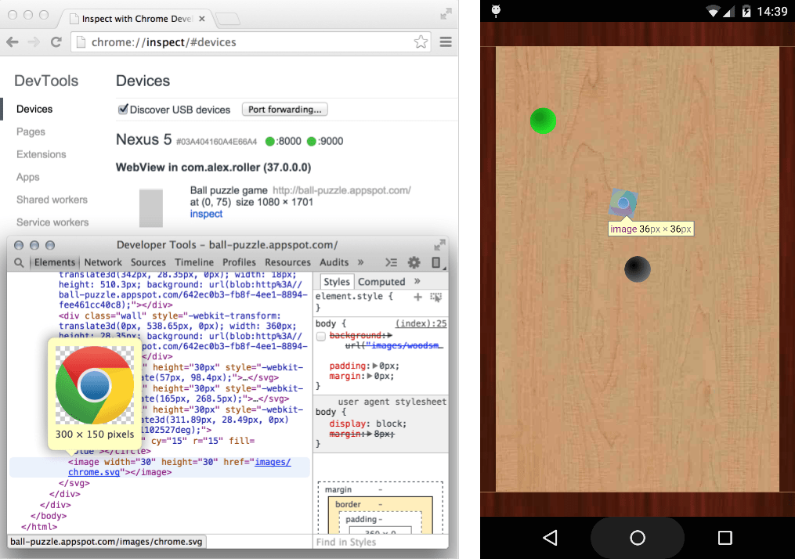

project_path: /web/tools/_project.yaml
book_path: /web/tools/_book.yaml
description: Debug WebViews in your native Android apps using Chrome Developer Tools.

{# wf_updated_on: 2015-07-29 #}
{# wf_published_on: 2015-04-13 #}

# Remote Debugging WebViews {: .page-title }



Debug WebViews in your native Android apps using Chrome Developer Tools.

On Android 4.4 (KitKat) or later,
use DevTools to debug WebView content in native Android applications.

### TL;DR {: .hide-from-toc }
- Enable WebView debugging in your native Android app; debug WebViews in Chrome DevTools.
- Access list of debug-enabled WebViews via <strong>chrome://inspect</strong>.
- Debugging WebViews is the same as debugging a web page through <a href='/web/tools/chrome-devtools/debug/remote-debugging'>remote debugging</a>.

## Configure WebViews for debugging

WebView debugging must be enabled from within your application. To enable WebView debugging, call the static method [setWebContentsDebuggingEnabled](https://developer.android.com/reference/android/webkit/WebView.html#setWebContentsDebuggingEnabled(boolean)) on the WebView class.

    if (Build.VERSION.SDK_INT >= Build.VERSION_CODES.KITKAT) {
        WebView.setWebContentsDebuggingEnabled(true);
    }
    

This setting applies to all of the application's WebViews.

**Tip**: WebView debugging is **not** affected by the state of the `debuggable` flag in the application's manifest. If you want to enable WebView debugging only when `debuggable` is `true`, test the flag at runtime.

    if (Build.VERSION.SDK_INT >= Build.VERSION_CODES.KITKAT) {
        if (0 != (getApplicationInfo().flags & ApplicationInfo.FLAG_DEBUGGABLE))
        { WebView.setWebContentsDebuggingEnabled(true); }
    }
    

## Open a WebView in DevTools

The **chrome://inspect** page displays a list of debug-enabled WebViews on your device.

To start debugging, click **inspect** below the WebView you want to debug. Use DevTools as you would for a remote browser tab.

The gray graphics listed with the WebView represent its size and position relative to the device's screen. If your WebViews have titles set, the titles are listed as well.

## Troubleshooting

Can't see your WebViews on the **chrome://inspect page**?

* Verify that WebView debugging is enabled for your app.
* On your device, open the app with the WebView you want to debug. Then, refresh the **chrome://inspect** page.
