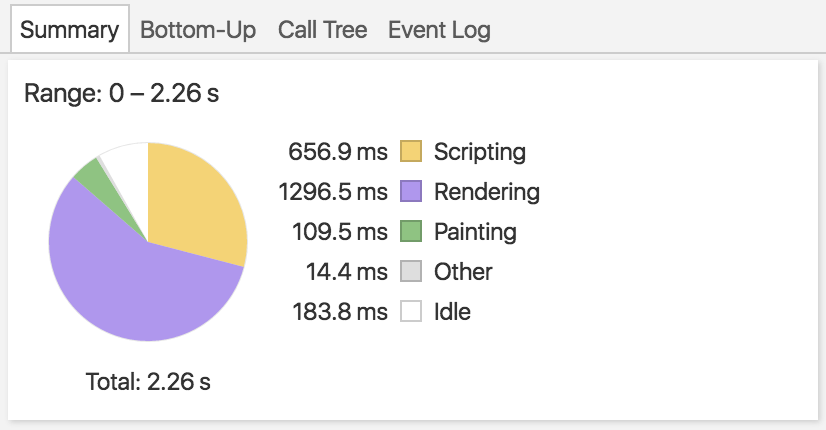
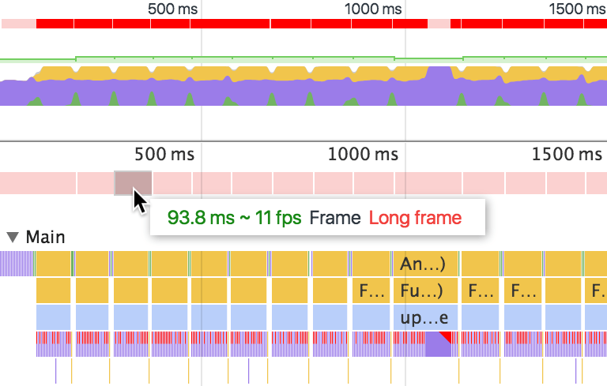
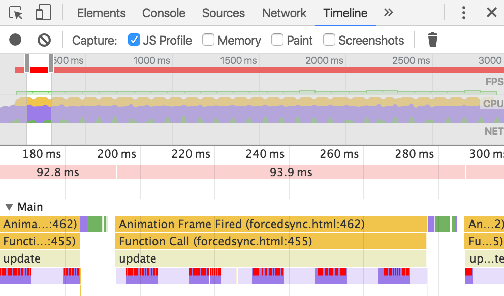
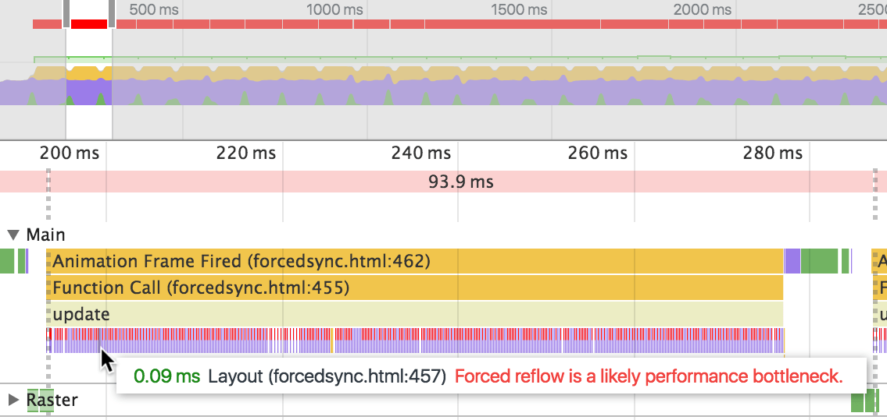
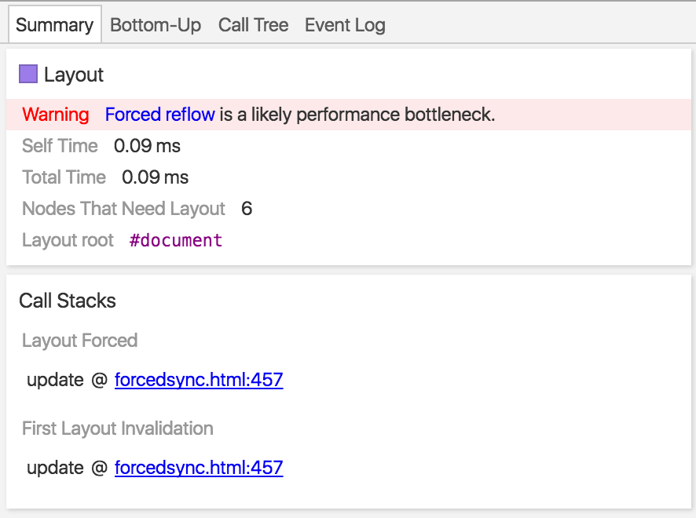
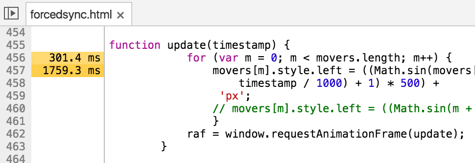
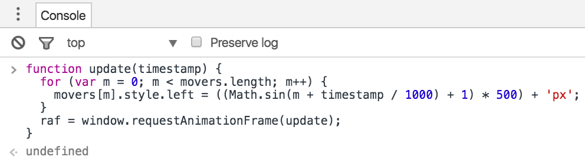
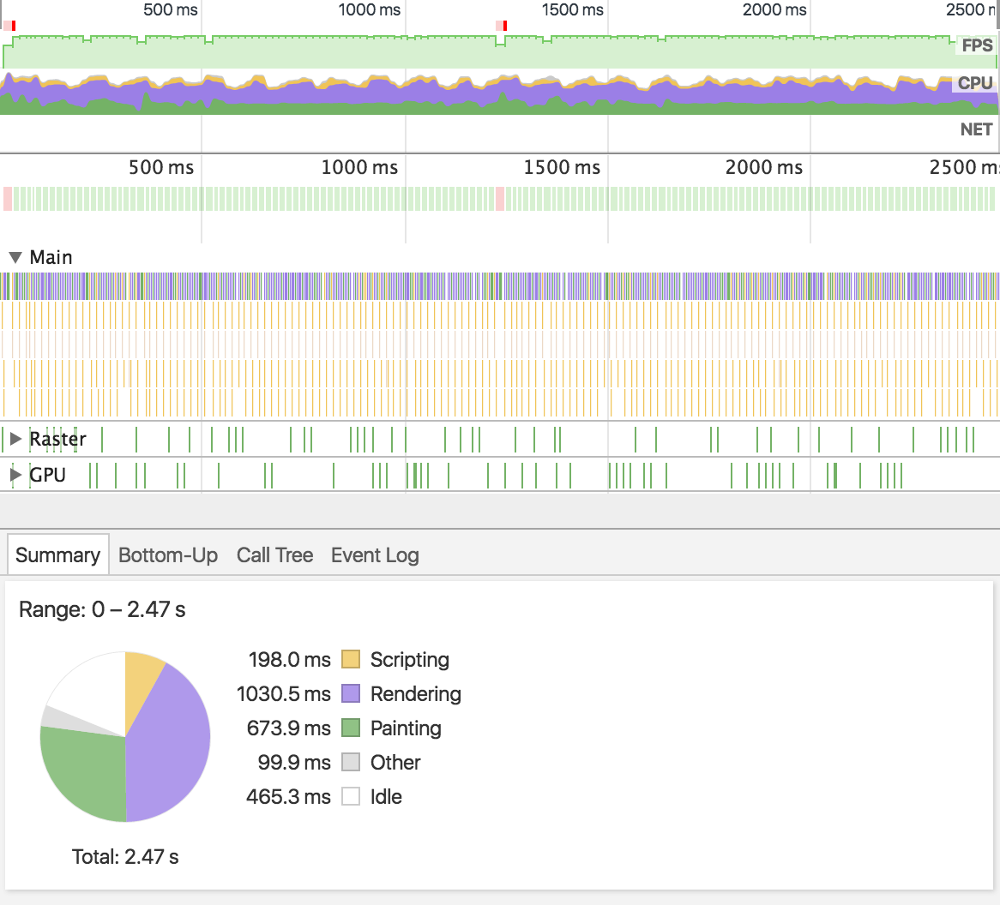

project_path: /web/tools/_project.yaml
book_path: /web/tools/_book.yaml
description: Follow along with this interactive guide to learn how to use  DevTools to diagnose forced synchronous layouts.

{# wf_updated_on: 2017-07-24 #}
{# wf_published_on: 2015-04-13 #}

# Diagnose Forced Synchronous Layouts {: .page-title }




Warning: This page is deprecated. See [Get Started With Analyzing Runtime
Performance](/web/tools/chrome-devtools/evaluate-performance) for an
up-to-date tutorial on forced synchronous layouts.

Learn how to use DevTools to diagnose forced synchronous 
layouts.

In this guide you learn how to debug [forced synchronous layouts][fsl] by 
identifying and fixing issues in a live demo.  The demo animates images 
using [`requestAnimationFrame()`][raf], which is the recommended approach for 
frame-based animation. However, there's a considerable amount of jank in the 
animation. Your goal is to identify the cause of the jank and fix the issue so 
that the demo runs at a silky-smooth 60 FPS. 

[fsl]: /web/fundamentals/performance/rendering/avoid-large-complex-layouts-and-layout-thrashing#avoid-forced-synchronous-layouts

[raf]: /web/fundamentals/performance/rendering/optimize-javascript-execution#use-requestanimationframe-for-visual-changes

## Gather data

First, you need to capture data so that you can understand exactly what happens
as your page runs. 

1. Open the [demo](https://googlesamples.github.io/web-fundamentals/tools/chrome-devtools/rendering-tools/forcedsync.html).
1. Open the **Timeline** panel of DevTools.
1. Enable the **JS Profile** option. When analyzing the flame chart later, this
   option will let you see exactly which functions were called. 
1. Click **Start** on the page to start the animation.
1. Click the **Record** button on the Timeline panel to start the Timeline
   recording. 
1. Wait two seconds.
1. Click the **Record** button again to stop the recording. 

When you are finished recording you should see something like the following
on the Timeline panel. 

## Identify problem

Now that you have your data, it's time to start making sense of it. 

At a glance, you can see in the **Summary** pane of your Timeline recording 
that the browser spent most of its time rendering. Generally speaking, if you
can [optimize your page's layout operations][layout], you may be able to reduce
time spent rendering. 

Now move your attention to the pink bars just below the **Overview** pane. 
These represent frames. Hover over them to see more information about the
frame.

The frames are taking a long time to complete. For smooth animations you want
to target 60 FPS. 

Now it's time to diagnose exactly what is wrong. Using your mouse, 
[zoom in][zoom] on a call stack. 

The top of the stack is an `Animation Frame Fired` event. The function that you
passed to `requestAnimationFrame()` is called whenever this event is fired.
Below `Animation Frame Fired` you see `Function Call`, and below that you 
see `update`. You can infer that a method called `update()` is the callback for
`requestAnimationFrame()`. 

Note: This is where the **JS Profile** option that you enabled earlier is 
useful. If it was disabled, you would just see `Function Call`, followed
by all the small purple events (discussed next), without details on exactly
which functions were called.

Now, focus your attention on all of the small purple events below the `update`
event. The top part of many of these events are red. That's a warning sign. 
Hover over these events and you see that DevTools is warning you that your 
page may be a victim of forced reflow. Forced reflow is just another name for 
forced synchronous layouts. 

Now it's time to take a look at the function which is causing all of the 
forced synchronous layouts. Click on one of the layout events to select it.
In the Summary pane you should now see details about this event. Click on the
link under **Layout Forced** (`update @ forcedsync.html:457`) to jump to
the function definition.

You should now see the function definition in the **Sources** panel. 

The `update()` function is the callback handler for 
`requestAnimationCallback()`. The handler computes each image's `left` property
based off of the image's `offsetTop` value. This forces the browser to perform
a new layout immediately to make sure that it provides the correct value. 
Forcing a layout during every animation frame is the cause of the janky
animations on the page. 

So now that you've identified the problem, you can try to fix it directly
in DevTools.

[layout]: /web/tools/chrome-devtools/profile/rendering-tools/analyze-runtime#layout
[zoom]: /web/tools/chrome-devtools/profile/evaluate-performance/timeline-tool#zoom

## Apply fix within DevTools

This script is embedded in HTML, so you can't edit it via the **Sources** panel
(scripts in `*.js` can be edited in the Sources panel, however). 

However, to test your changes, you can redefine the function in the Console.
Copy and paste the function definition from the HTML file into the DevTools
Console. Delete the statement that uses `offsetTop` and uncomment the one 
below it. Press `Enter` when you're done. 

Restart the animation. You can verify visually that it's much smoother now. 

## Verify with another recording

It's always good practice to take another recording and verify that the 
animation truly is faster and more performant than before. 

Much better.
