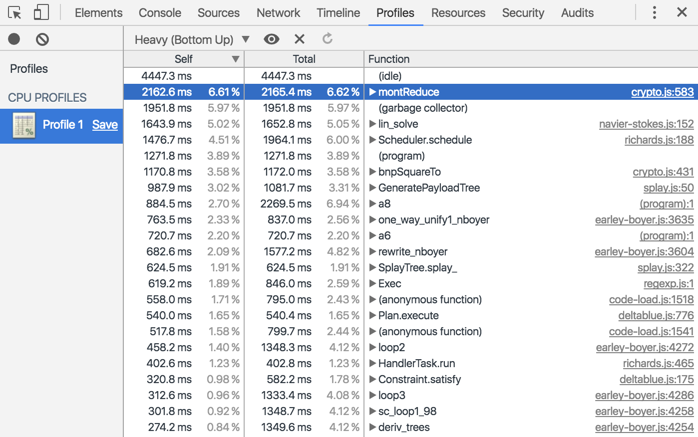
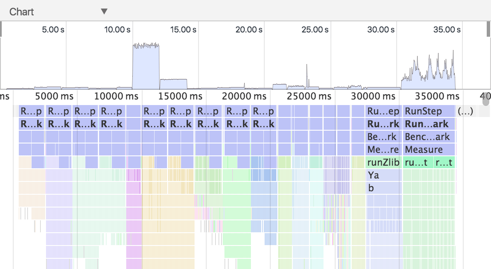
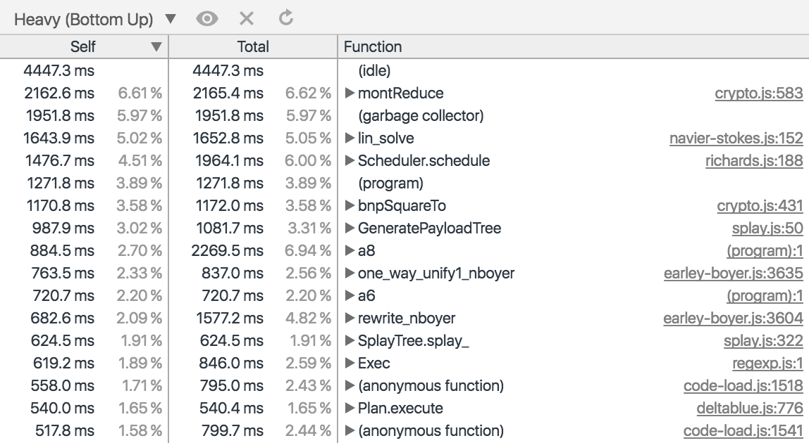
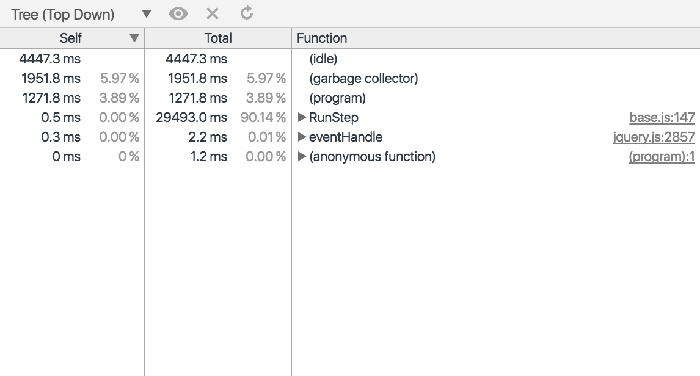
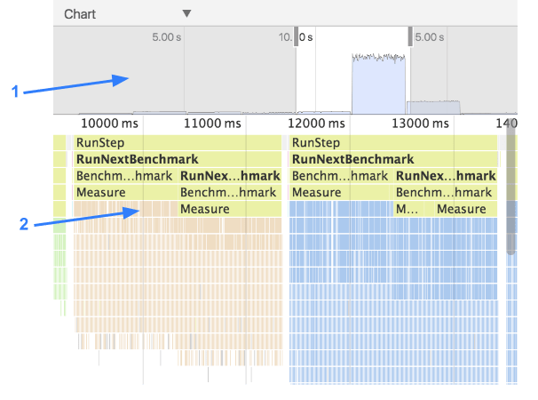
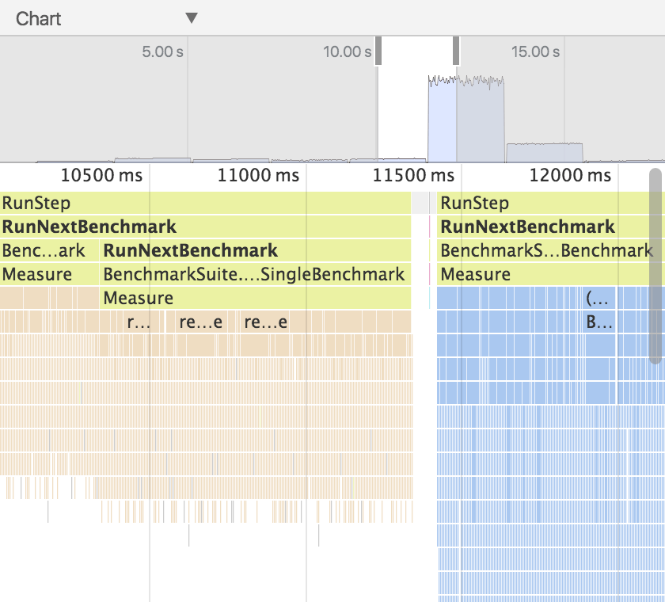
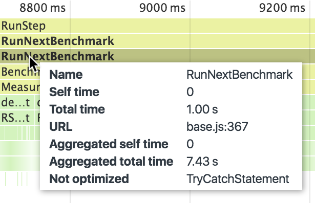

project_path: /web/tools/_project.yaml
book_path: /web/tools/_book.yaml
description: Identify expensive functions using the Chrome DevTools  CPU Profiler.

{# wf_updated_on: 2017-07-24 #}
{# wf_published_on: 2015-04-13 #}

# Speed Up JavaScript Execution {: .page-title }




Identify expensive functions using the Chrome DevTools CPU 
Profiler.

### TL;DR {: .hide-from-toc }
- Record exactly which functions were called and how long each took with the CPU Profiler.
- Visualize your profiles as a flame chart.

## Record a CPU profile {:#record-profile}

If you’re noticing jank in your JavaScript, collect a JavaScript CPU profile.
CPU profiles show where execution time is spent in your page’s functions.

1. Go to the **Profiles** panel of DevTools.
2. Select the **Collect JavaScript CPU Profile** radio button.
3. Press **Start**. 
4. Depending on what you are trying to analyze, you can either reload the 
   page, interact with the page, or just let the page run.
5. Press the **Stop** button when you are finished. 

You can also use the [Command Line API][profile] to record and group profiles 
from the command line.

[profile]: /web/tools/chrome-devtools/debug/command-line/command-line-reference#profilename-and-profileendname

## View CPU profile {:#view-profile}

When you finish recording, DevTools automatically populates the Profile panel
with the data from your recording. 

The default view is **Heavy (Bottom Up)**. This view enables you to see 
which functions had the most impact on performance and examine the calling
paths to those functions. 

### Change sort order {:#sort}

To change the sorting order, click on the dropdown menu next to the 
**focus selected function** icon
({:.inline}) 
and then choose one of the following options:

**Chart**. Displays a chronological flame chart of the recording.

**Heavy (Bottom Up)**. Lists functions by impact on performance and enables
you to examine the calling paths to the functions. This is the default view. 

**Tree (Top Down)**. Shows an overall picture of the calling structure, 
starting at the top of the call stack. 

### Exclude functions {:#exclude}

To exclude a function from your CPU profile, click on it to select it and 
then press the **exclude selected function** icon 
({:.inline}). The caller of the 
excluded function is charged with the excluded function's total time.

Click the **restore all functions** icon 
({:.inline})
to restore all excluded functions back into the recording.

## View CPU profile as Flame Chart {:#flame-chart}

The Flame Chart view provides a visual representation of the CPU profile over
time.

After [recording a CPU profile](#record-profile), view the recording as a 
flame chart by [changing the sort order](#sort) to **Chart**.

The flame chart is split into two parts:

1. **Overview**. A birds-eye view of the entire recording.
   The height of the bars correspond to the depth of 
   the call stack. So, the higher the bar, the deeper the call stack. 

2. **Call Stacks**. This is an in-depth view of the functions that were called 
   during the recording. The horizontal axis is time and vertical axis is 
   the call stack. The stacks are organized top-down. So, the function on top
   called the one below it, and so on. 

   Functions are colored randomly. There is no correlation to the colors used
   in the other panels. However, functions are always colored the same
   across invocations so that you can see patterns of executions. 

A tall call stack is not necessarily significant, it just means that a lot of
functions were called. But a wide bar means that a call took a long time to 
complete. These are candidates for optimization. 

### Zoom in on specific parts of recording {:#zoom}

Click, hold, and drag your mouse left and right across the overview to zoom in
on particular parts of the call stack. After you zoom, the call stack 
automatically displays the portion of the recording that you've selected.

### View function details {:#flame-chart-function-details}

Click on a function to view its definition in the **Sources** panel.

Hover over a function to display its name and timing data. The following
information is provided: 

*  **Name**. The name of the function.
*  **Self time**. How long it took to complete the current invocation of the 
   function, including only the statements in the function itself, not 
   including any functions that it called.
*  **Total time**. The time it took to complete the current invocation of 
   this function and any functions that it called.
*  **URL**. The location of the function definition in the form of 
   `file.js:100` where `file.js` is the name of the file where the function
   is defined and `100` is the line number of the definition.
*  **Aggregated self time**. Aggregate time for all invocations of the 
   function across the recording, not including functions called by this 
   function.
*  **Aggregated total time**. Aggregate total time for all invocations of 
   the function, including functions called by this function.
*  **Not optimized**. If the profiler has detected a potential optimization
   for the function it lists it here.

