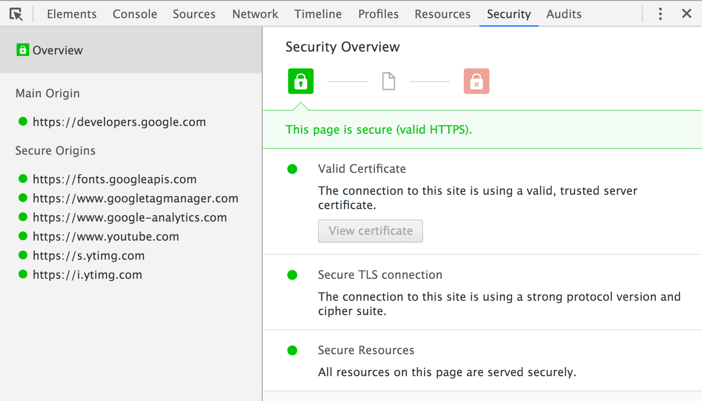
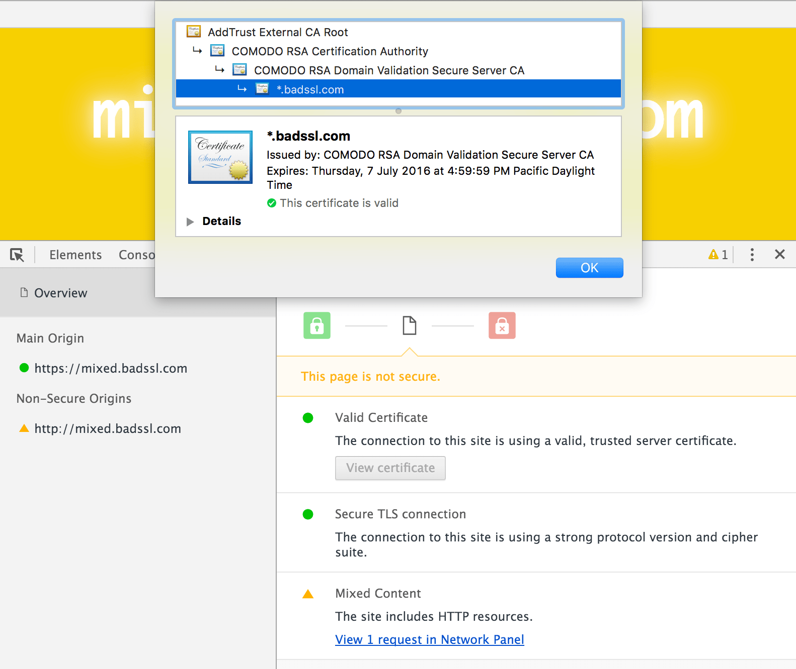
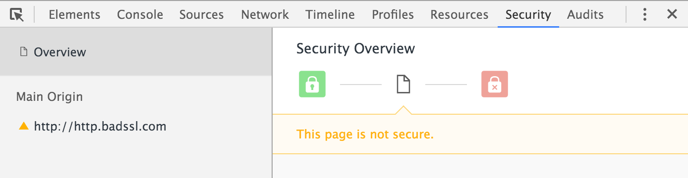
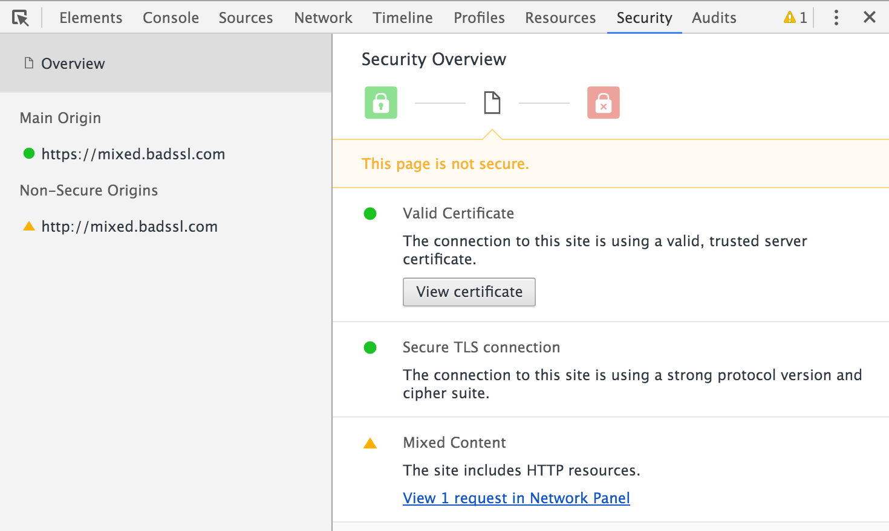
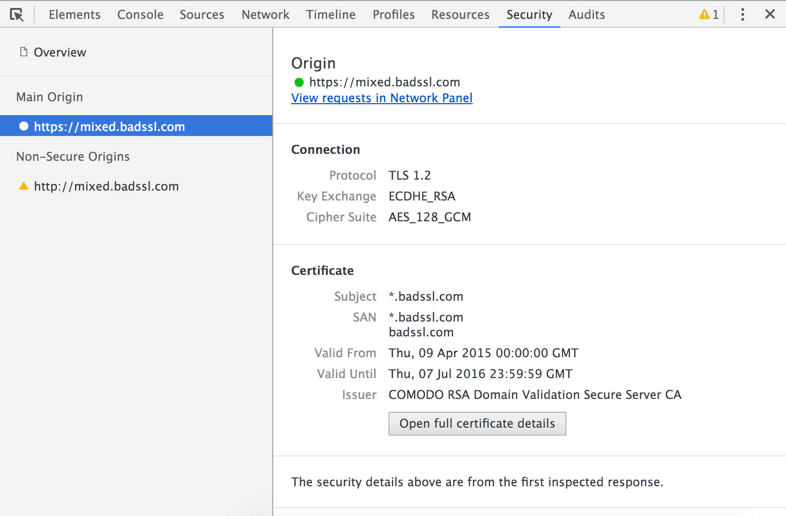
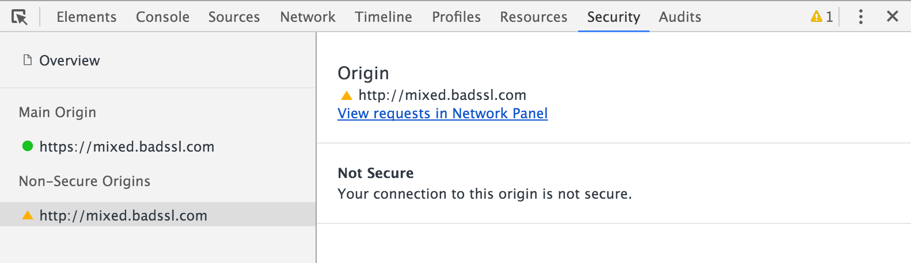
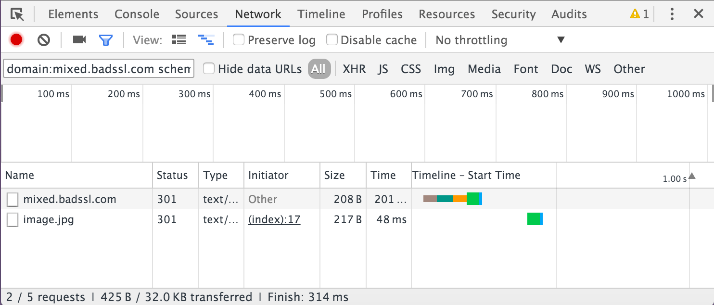

project_path: /web/tools/_project.yaml
book_path: /web/tools/_book.yaml
description: Use the Security Panel to ensure that all resources on your  site are protected with HTTPS.

{# wf_updated_on: 2016-03-09 #}
{# wf_published_on: 2015-12-21 #}

# Understand Security Issues {: .page-title }



HTTPS provides [critical security and data integrity][why-https] 
both for your websites and for the people that entrust your websites 
with their personal information. Use the Security Panel in Chrome DevTools 
to debug security issues and ensure that you have properly implemented 
HTTPS on your websites.

### TL;DR {: .hide-from-toc }
- Use the Security Overview to instantly find out whether the current page is secure or non-secure.
- Inspect individual origins to view connection and certificate details (for secure origins) or to find out exactly which requests are unprotected (for non-secure origins).

## Security Overview

To view the overall security of a page, open DevTools and go to the 
Security Panel. 

The first thing you see is the Security Overview. At a glance, the 
Security Overview tells you whether the page is secure. A secure page is 
indicated with the message `This page is secure (valid HTTPS).`

Click **View certificate** to view the server certificate for the 
[main origin][same-origin-policy]. 

A non-secure page is indicated with the message `This page is not secure.`

The Security Panel distinguishes between two types of non-secure pages. 
If the requested page is served over HTTP, then the main origin is flagged as 
not secure. 

If the requested page is retrieved over HTTPS, but the page then goes on 
to retrieve content from other origins using HTTP, then the page is still 
flagged as not secure. This is known as a [mixed content][mixed-content] 
page. Mixed content pages are only partially protected because the HTTP 
content is accessible to sniffers and vulnerable to man-in-the-middle attacks. 

Click **View request in Network Panel** to open up a filtered view of the 
Network Panel and see exactly which requests were served over HTTP. This shows 
all unprotected requests from all origins. 

## Inspect origins

Use the left panel to inspect an individual secure or non-secure origin. 

Click on a secure origin to view the connection and certificate details for 
that origin.

If you click on a non-secure origin, the Security Panel provides a link to a filtered view of the Network Panel. 

Click on the link to see exactly which requests from that origin were 
served over HTTP. 

[mixed-content]: https://developers.google.com/web/fundamentals/security/prevent-mixed-content/what-is-mixed-content
[same-origin-policy]: https://en.wikipedia.org/wiki/Same-origin_policy
[why-https]: https://developers.google.com/web/fundamentals/security/encrypt-in-transit/why-https
