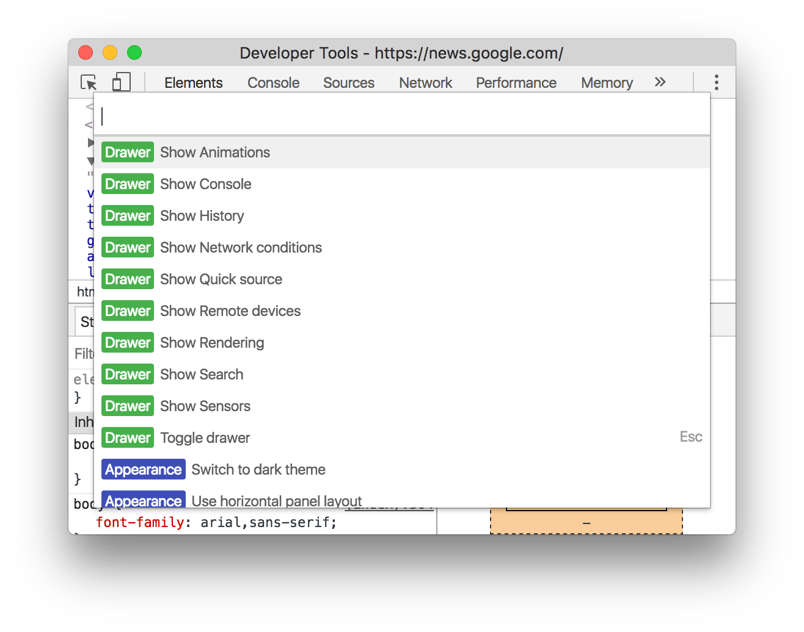
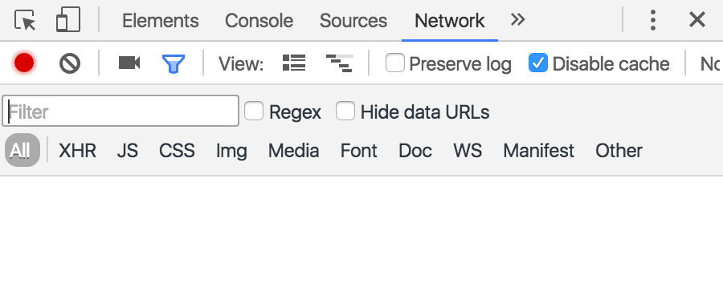
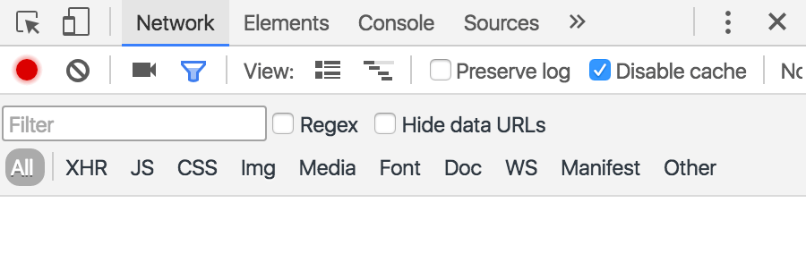
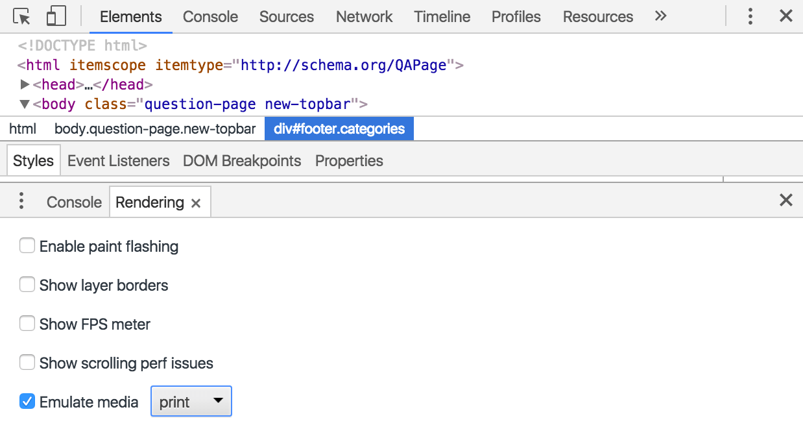

project_path: /web/_project.yaml
book_path: /web/tools/_book.yaml
description: Change the appearance of DevTools and access hidden features.

{# wf_updated_on: 2016-07-26 #}
{# wf_published_on: 2016-03-28 #}

# Configure and Customize DevTools {: .page-title }



Change the appearance of DevTools and access hidden 
features.

### TL;DR {: .hide-from-toc }
- Open the Main and Settings menus.
- Customize the appearance of DevTools.
- Access hidden features.

## Open the Main Menu {:#main-menu}

The **Main Menu** of DevTools is a dropdown menu for configuring how
DevTools looks, accessing additionals tools, opening the Settings, and more.

To open the Main Menu, click on the **Main Menu** button in the top-right
of the DevTools window.

## Open the Settings {:#settings}

To open the DevTools Settings, press <kbd>F1</kbd> while DevTools is in focus,
or [open the Main Menu](#main-menu) and then select **Settings**.

## Open the Command Menu {:#command-menu}

Press <kbd>Cmd</kbd>+<kbd>Shift</kbd>+<kbd>P</kbd> (Mac) or
<kbd>Ctrl</kbd>+<kbd>Shift</kbd>+<kbd>P</kbd> (Windows, Linux) to open the
Command Menu.

## Reorder panel tabs {:#panel-tabs}

Click, hold, and drag a panel tab to change its ordering. Your custom tab order
persists across DevTools sessions.

For example, by default the **Network** tab is usually the fourth to the left.

You can drag it to any position, such as the first to the left.

## Customize DevTools placement {:#placement}

You can dock DevTools on the bottom of the page, to right of the page, or 
you can open it in a new window. 

To change the DevTools' placement, [open the Main Menu](#main-menu) and select
the **Undock into separate window** 
({:.inline})
button, **Dock to bottom** 
({:.inline})
button, or 
**Dock to right** 
({:.inline})
button. 

## Use dark theme {:#dark-theme}

To use a dark DevTools theme, [open DevTools' Settings](#settings),
go to the **Preferences** page, find the **Appearance** section, and then
select **Dark** from the **Theme** dropdown menu.

## Open and close drawer tabs {:#drawer-tabs}

Press <kbd>Esc</kbd> to open and close the DevTools **Drawer**. The screenshot
below shows an example of the **Elements** panel while the **Console** Drawer
is open on the bottom.

From the Drawer you can execute commands in the Console, view the Animation 
Inspector, configure network conditions and rendering settings, search for 
strings and files, and emulate mobile sensors.

While the Drawer is open, click the three dot icon
({:.inline}) to the left of the 
**Console** tab and then select one of the dropdown menu options to open the
other tabs.

## Enable experiments {:#experiments}

When DevTools Experiments is enabled, a new page called **Experiments**
shows up in the DevTools Settings. From this page you can enable and disable
experimental features.

To enable Experiments, go to `chrome://flags/#enable-devtools-experiments`
and click **Enable**. Click the **Relaunch Now** button at the bottom of the
page. 

You should now see a new page called **Experiments** when you open DevTools
Settings.

## Emulate print media {:#emulate-print-media}

To view a page in print preview mode, [open the DevTools main 
menu](#main-menu), select **More Tools** > **Rendering Settings**, and then 
enable the **emulate media** checkbox with the dropdown menu set to **print**.

## Show HTML comments {: #show-html-comments }

To show or hide HTML comments in the **Elements** panel, [open
**Settings**](#settings), go to the **Preferences** panel, find the
**Elements** section, and then toggle the **Show HTML comments** checkbox.
