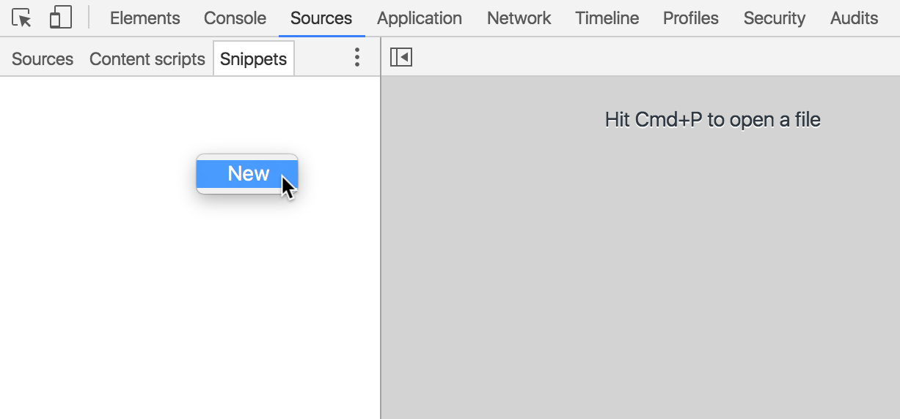
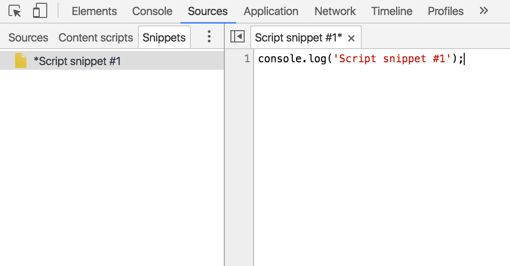
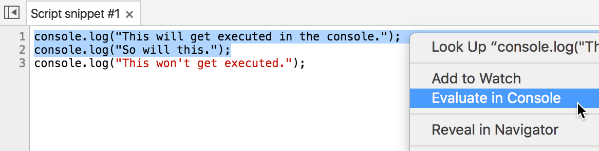
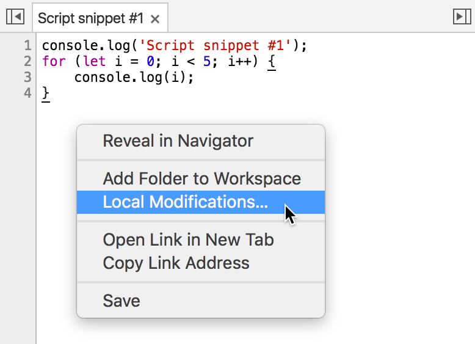
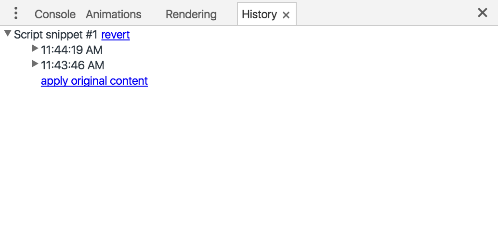

project_path: /web/tools/_project.yaml
book_path: /web/tools/_book.yaml
description: Snippets are small scripts that you can author and execute within the Sources panel of Chrome DevTools. You can access and run them from any page. When you run a snippet, it executes from the context of the currently open page.

{# wf_updated_on: 2016-06-26 #}
{# wf_published_on: 2015-10-12 #}

# Run Snippets Of Code From Any Page {: .page-title }



Snippets are small scripts that you can author and execute 
within the Sources panel of Chrome DevTools. You can access and run them 
from any page. When you run a snippet, it executes from the context of the 
currently open page.

If you have small utilities or debugging scripts which you find yourself 
using repeatedly on multiple pages, consider saving the scripts as snippets. 
You can also use snippets as an alternative to 
[bookmarklets](https://en.wikipedia.org/wiki/Bookmarklet).

### TL;DR {: .hide-from-toc }
- Snippets are small scripts that you can run from any page (similar to bookmarklets).
- Run portions of snippets in the Console with the "Evaluate in Console" feature.
- Remember that popular features from the Sources panel, like breakpoints, also work with snippets.

## Create snippet

To create a snippet, open the **Sources** panel, click on the **Snippets** tab,
right-click within the Navigator, and then select **New**.

Enter your code in the editor. When you have unsaved changes, your script
name has an asterisk next to it, like in the screenshot below. 
Press <kbd>Command</kbd>+<kbd>S</kbd> (Mac) or <kbd>Ctrl</kbd>+<kbd>S</kbd>
(Windows, Linux) to save your changes. 

## Run snippet

There are three ways to run your snippet: 

* Right-click on the snippet filename (in the pane on the left that lists
  all your snippets) and select **Run**.
* Click the **Run** button ({:.inline}).
* Press <kbd>Command</kbd>+<kbd>Enter</kbd> (Mac) or 
  <kbd>Ctrl</kbd>+<kbd>Enter</kbd> (Windows, Linux).

To evaluate a portion of your snippet in the Console, highlight the 
portion, right-click anywhere in the editor, and select **Evaluate in 
Console**, or use the keyboard shortcut 
<kbd>Command</kbd>+<kbd>Shift</kbd>+<kbd>E</kbd> (Mac) or
<kbd>Ctrl</kbd>+<kbd>Shift</kbd>+<kbd>E</kbd> (Windows, Linux).

## View local modifications

<!-- TODO apply revision content doesn't really work... -->

To view a diff of modifications you've made to a snippet, right-click in 
the editor (while the snippet is displayed) and select **Local modifications**.

A new tab named **History** pops up in the Console drawer.

Each of the timestamps represent a modification. Expand the carat next to
a timestamp to view a diff of the modifications at that point in time.
The **revert** link removes the revision history. As of June 27, 2016 the
**apply revision content** and **apply original content** links appear
to not work as intended.

## Set breakpoints

Just like other scripts, you can set breakpoints on snippets. See
[Pause Your Code With
Breakpoints](/web/tools/chrome-devtools/debug/breakpoints/breakpoints)
to learn how to add breakpoints from within the **Sources** panel.
