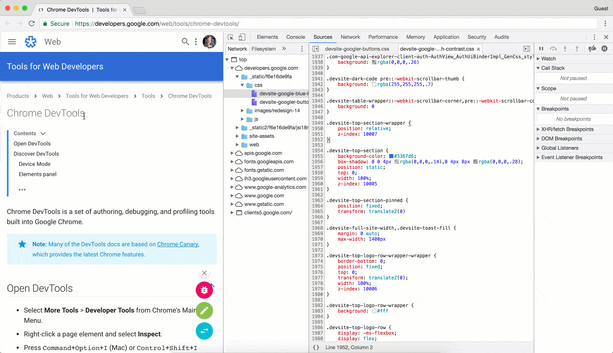

project_path: /web/tools/_project.yaml
book_path: /web/tools/_book.yaml
description: View and edit files, create Snippets, debug JavaScript, and set up Workspaces in the Sources panel of Chrome DevTools.

{# wf_blink_components: Platform>DevTools #}
{# wf_updated_on: 2018-05-03 #}
{# wf_published_on: 2018-01-09 #}



# Sources Panel Overview {: .page-title }



Use the Chrome DevTools **Sources** panel to:

* [View files](#files).
* [Edit CSS and JavaScript](#edit).
* [Create and save **Snippets** of JavaScript](#snippets), which you can run on any page.
  **Snippets** are similar to bookmarklets.
* [Debug JavaScript](#debug).
* [Set up a Workspace](#workspace), so that changes you make in DevTools get saved to the code on
  your file system.

## View files {: #files }

Use the **Network** pane to view all of the resources that the page has loaded.

<figure>
  
  <figcaption>
    <b>Figure 1</b>. The <b>Network</b> pane
  </figcaption>
</figure>

How the **Network** pane is organized:

* The top-level, such as `top` in <b>Figure 1</b>, represents an [HTML frame][frame].
  You'll find `top` on every page that you visit. `top` represents the main document
  frame.
* The second-level, such as `developers.google.com` in <b>Figure 1</b>, represents an
  [origin][origin].
* The third-level, fourth-level, and so on, represent directories and resources that
  were loaded from that origin. For example, in <b>Figure 1</b> the full path to the
  resource `devsite-googler-button` is
  `developers.google.com/_static/f6e16de9fa/css/devsite-googler-button`

[frame]: https://www.w3.org/TR/html401/present/frames.html
[origin]: https://www.w3.org/TR/2011/WD-html5-20110525/origin-0.html

Click a file in the **Network** pane to view its contents in the **Editor** pane. You
can view any type of file. For images, you see a preview of the image.

<figure>
  
  <figcaption>
    <b>Figure 2</b>. Viewing the contents of <code>jquery-bundle.js</code> in the <b>Editor</b>
    pane
  </figcaption>
</figure>

## Edit CSS and JavaScript {: #edit }

Use the **Editor** pane to edit CSS and JavaScript.  DevTools updates the
page to run your new code. For example, if you edit the `background-color` of an element, you'll
see that change take effect immediately.

<figure>
  
  <figcaption>
    <b>Figure 3</b>. Editing CSS in the <b>Editor</b> pane to change the background color of an
    element from blue to red
  </figcaption>
</figure>

CSS changes take effect immediately, no save needed. For JavaScript changes to take effect, press
<kbd>Command</kbd>+<kbd>S</kbd> (Mac) or <kbd>Control</kbd>+<kbd>S</kbd> (Windows, Linux).
DevTools doesn't re-run a script, so the only JavaScript changes that take effect are those that
you make inside of functions. For example, in <b>Figure 4</b> note how `console.log('A')` doesn't
run, whereas `console.log('B')` does. If DevTools re-ran the entire script after making the
change, then the text `A` would have been logged to the **Console**.

<figure>
  
  <figcaption>
    <b>Figure 5</b>. Editing JavaScript in the <b>Editor</b> pane
  </figcaption>
</figure>

DevTools erases your CSS and JavaScript changes when you reload the page. See
[Set up a Workspace](#workspace) to learn how to save the changes to your file
system.

## Create, save, and run Snippets {: #snippets }

Snippets are scripts which you can run on any page. Imagine that you repeatedly type out the
following code in the **Console**, in order to insert the jQuery library into a page, so that
you can run jQuery commands from the **Console**:

    let script = document.createElement('script');
    script.src = 'https://code.jquery.com/jquery-3.2.1.min.js';
    script.crossOrigin = 'anonymous';
    script.integrity = 'sha256-hwg4gsxgFZhOsEEamdOYGBf13FyQuiTwlAQgxVSNgt4=';
    document.head.appendChild(script);

Instead, you can save this code in a **Snippet** and run it with a couple of button clicks,
any time you need it. DevTools saves the **Snippet** to your file system.

<figure>
  
  <figcaption>
    <b>Figure 6</b>. A <b>Snippet</b> that inserts the jQuery library into a page
  </figcaption>
</figure>

To run a **Snippet**:

* Open the file via the **Snippets** pane, and click **Run** ![The Run button][run]{:.cdt-inl}.
* Open the [**Command Menu**][CM], delete the `>` character, type `!`, type the name of your
  **Snippet**, then press <kbd>Enter</kbd>.

[CM]: /web/tools/chrome-devtools/ui#command-menu
[run]: images/run-snippet.png

See [Run Snippets Of Code From Any Page][snip] to learn more.

[snip]: /web/tools/chrome-devtools/snippets

## Debug JavaScript {: #debug }

Rather than using `console.log()` to infer where your JavaScript is going wrong, consider using
the Chrome DevTools debugging tools, instead. The general idea is to set a breakpoint, which
is an intentional stopping place in your code, and then step through your code's execution,
one line at a time. As you step through the code, you can view and change the values of all
currently-defined properties and variables, run JavaScript in the **Console**, and more.

See [Get Started With Debugging JavaScript](/web/tools/chrome-devtools/javascript/) to learn the
basics of debugging in DevTools.

<figure>
  
  <figcaption>
    <b>Figure 7</b>. Debugging JavaScript
  </figcaption>
</figure>

## Set up a Workspace {: #workspace }

By default, when you edit a file in the **Sources** panel, those changes are lost when you
reload the page. **Workspaces** enable you to save the changes that you make in DevTools to
your file system. Essentially, this lets you use DevTools as your code editor.

See [Set Up Persistence With DevTools Workspaces][WS] to get started.

[WS]: /web/tools/setup/setup-workflow

## Feedback {: #feedback }





