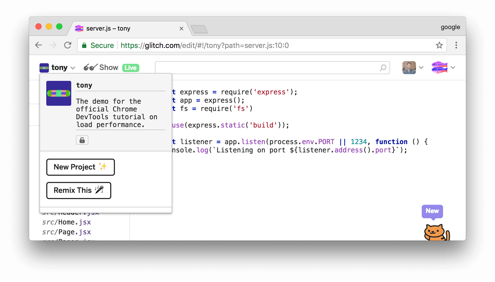
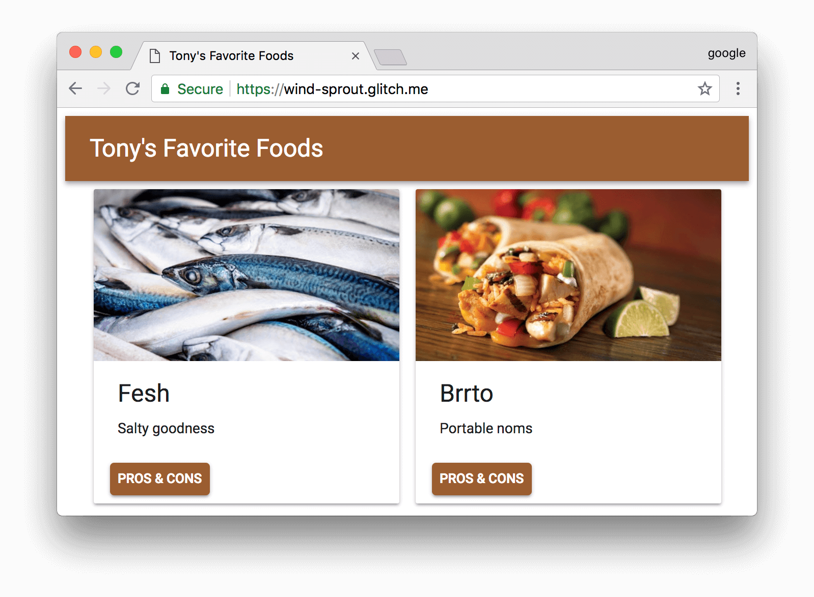
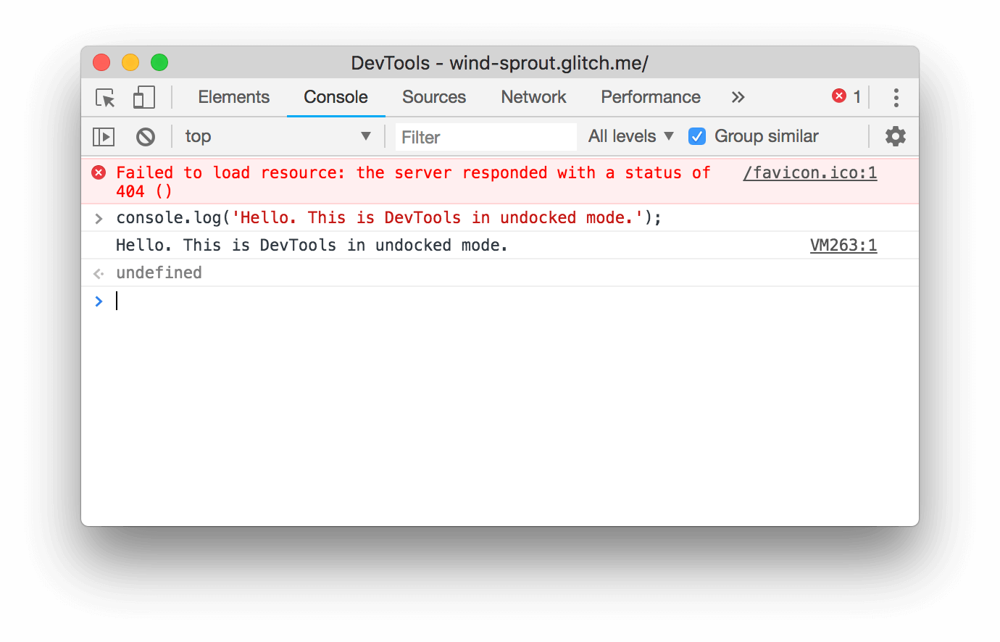
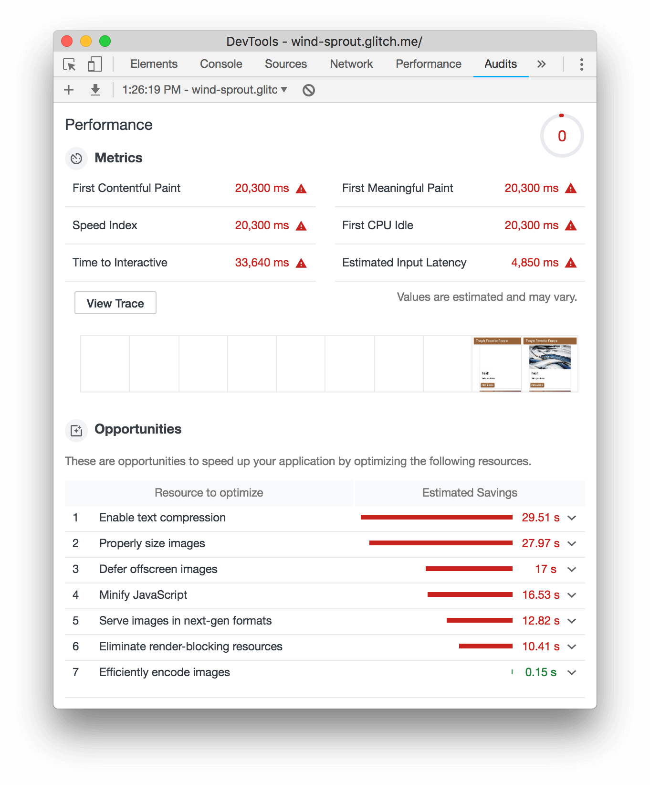

project_path: /web/tools/_project.yaml
book_path: /web/tools/_book.yaml
description: TODO

{# wf_updated_on: 2018-06-12 #}
{# wf_published_on: 2018-06-01 #}
{# wf_blink_components: Platform>DevTools #}

# Optimize Website Speed With Chrome DevTools {: .page-title }



## Goal of tutorial

This tutorial teaches you how to use Chrome DevTools to find ways to make your websites
load faster.

## Prerequisites

* You should have basic web development experience, similar to what's taught in this
  [Introduction to Web Development class][intro]{: .external target="_blank" rel="noopener" }.
* You don't need to know anything about load performance. You'll learn about it in this tutorial!

[intro]: https://www.coursera.org/learn/web-development#syllabus

## Introduction {: #intro }

This is Tony. Tony is very famous in cat society. He has built a website so that his fans can
learn what his favorite foods are. His fans love the site, but Tony keeps hearing complaints
that the site loads slowly. He has asked you to help him speed it up.

<figure>
  
  <figcaption>
    <b>Figure X</b>. Tony the cat
  </figcaption>
</figure>

## Step 1: Audit the site {: #audit }

Whenever you set out to improve a site's load performance, **always start with an audit**.
The audit has 2 important functions:

* It creates a baseline for you to measure subsequent changes against.
* It gives you actionable tips on what changes will have the most impact.

### Set up {: #setup }

1. Go to `chrome://version` to check what version of Chrome you're using. This tutorial was made with
   Chrome 68. If you're using an earlier or later version, some features may look different or not be available.
1. <a class="external gc-analytics-event" href="https://glitch.com/edit/#!/tony" target="_blank" rel="noopener"
   data-category="CTA" data-label="">Open the source code for the site</a>.
   This tab will be referred to as the *editor tab*.

     <figure>
       
       <figcaption>
         <b>Figure X</b>. The editor tab
       </figcaption>
     </figure>

1. Click **tony**. A menu appears.

     <figure>
       
       <figcaption>
         <b>Figure X</b>. The menu that appears after clicking <b>tony</b>
       </figcaption>
     </figure>

1. Click **Remix This**. The name of the project changes from **tony** to some randomly-generated name. You now
   have your own editable copy of the code. Later on, you'll make changes to this code.
1. Click **Show Live**. The demo opens in a new tab. This tab will be referred to as the *demo tab*.

     <figure>
       
       <figcaption>
         <b>Figure X</b>. The demo tab
       </figcaption>
     </figure>

1. Press <kbd>Command</kbd>+<kbd>Option</kbd>+<kbd>J</kbd> (Mac)
   <kbd>Control</kbd>+<kbd>Shift</kbd>+<kbd>J</kbd> (Windows, Linux, Chrome OS). Chrome DevTools opens up alongside
   the demo.

     <figure>
       
       <figcaption>
         <b>Figure X</b>. DevTools and the demo
       </figcaption>
     </figure>

For the rest of the screenshots in this tutorial, DevTools will be shown as a separate window. You
can do this by pressing <kbd>Command</kbd>+<kbd>Shift</kbd>+<kbd>P</kbd> (Mac) or
<kbd>Control</kbd>+<kbd>Shift</kbd>+<kbd>P</kbd> (Windows, Linux, Chrome OS) to open the Command Menu,
typing `Undock`, and then selecting **Undock into seperate window**.

<figure>
  
  <figcaption>
    <b>Figure X</b>. Undocked DevTools
  </figcaption>
</figure>

### Establish a baseline {: #baseline }

The baseline is a record of how the site performed before you made any performance improvements.

1. Click the **Audits** tab. It may be hidden behind the **More Panels**
   {:.inline-icon} button. There's a Lighthouse on this
   panel because the project that powers the Audits panel is called [Lighthouse](/web/tools/lighthouse).

     <figure>
       
       <figcaption>
         <b>Figure X</b>. The Audits panel
       </figcaption>
     </figure>

1. Match your audit configuration settings to those in **Figure X**.
1. Click **Run Audits**. After 10 to 30 seconds, the Audits panel shows you a report of the site's
   performance.

     <figure>
       
       <figcaption>
         <b>Figure X</b>. The Audits panel's report of the site's performance
       </figcaption>
     </figure>

### Understand your report {: #report }

The number at the top of your report is the overall performance score for the site. Later, as you make
changes to the code, you should see this number rise. A higher score means better performance.

<figure>
  
  <figcaption>
    <b>Figure X</b>. The overall performance score
  </figcaption>
</figure>

The **Metrics** section provides quantitative measurements of the site's performance. Each metric provides
insight into a different aspect of the performance. For example, **First Contentful Paint** tells you
when content is first painted to the screen, which is an important milestone in the user's perception of the
page load, whereas **First CPU Idle** marks when the main thread is quiet enough to handle user input, which
is essentially a proxy for when the user can first interact with the page.

<figure>
  
  <figcaption>
    <b>Figure X</b>. The Metrics section
  </figcaption>
</figure>

Hover over a metric to see a description of it, and click **Learn More** to read documentation about it.
 
<figure>
  
  <figcaption>
    <b>Figure X</b>. Hovering over the First Meaningful Paint metric
  </figcaption>
</figure>

Below **Metrics** is a collection of screenshots that show you how the page looked as it loaded.

<figure>
  
  <figcaption>
    <b>Figure X</b>. Screenshots of how the page looked while loading
  </figcaption>
</figure>

The **Opportunities** section provides specific tips on how to improve this particular page's load performance.

The **Diagnostics** section provides more information about factors that contribute to the page's load time.

The **Passed Audits** section shows you what the page is doing correctly.

## Step 2: Experiment {: #experiment }

The **Opportunites** section of your audit report gives you tips on how to improve the
page's performance. In this section, you implement each change to the codebase, and then
run an audit to measure how each isolated change affects load performance.

### Enable text compression {: #compression }

Your report says that enabling text compression is one of the top opportunities for
improving the page's performance.

Before you enable compression, here are a couple of ways you can manually check whether
text resources are compressed.

1. Click the **Network** tab.
1. Click **Use Large Request Rows**.
1. If you don't see the **Size** column, click the table header and then select **Size**.
1. Each **Size** cell shows two values. The top value is the size of the transferred resource.
   The bottom value is the size of the uncompressed resource. If the two values are the same,
   then the resource is not being compressed when it's sent over the network.

You can also check for compression by inspecting a resource's headers:

1. Click **bundle.js**.
1. Search the **Response Headers** section for a `content-encoding` header. When a
   resource is compressed, this header is usually set to `gzip`, `deflate`, or `br`.
   See [Directives][Directives]{:.external} for an explanation of these values.

[Directives]: https://developer.mozilla.org/en-US/docs/Web/HTTP/Headers/Content-Encoding#Directives

Now, enable text compression by adding a couple of lines of code:

1. In the editor tab, click **server.js**.
1. Add the following code:

     <pre>
       ...
       const fs = require('fs');
       <strong>const compresion = require('compression'); // This lib has already been installed for you.

       // Order matters.
       app.use(compression());</strong>
       app.use(express.static('build'));
       ...
     </pre>

1. Wait for Glitch to rebuild the site. The change is ready when you see **Show Live**
   again.

Use the workflows that you learned earlier to manually check that the compression is working:

1. Go back to the demo tab and reload the page. The **Size** column should show 2 different
   values for each text resource now.
1. Click **bundle.js**. The **Response Headers** section should now include a `content-encoding: gzip`
   header.

Audit the page again to measure what kind of impact text compression has on the page's load performance:

1. Click the **Audits** tab.
1. Click **Perform an audit**.
1. Click **Run audit**.

Woohoo! That looks like progress. Your overall performance score should have improved from roughly 0 to
11.

### Resize images {: #images }

Your new report says that properly sizing images is another big opportunity.

1. In your report, click **Properly size images** to see what images should be
   resized.

   It looks like all 4 are bigger than necessary.
1. Assume that you've already done a one-off resize of the images images. All that's left is to update the code
   to use the smaller versions of the images.
1. Open `src/model.js'.
1. Replace `const dir = 'big';` with `const dir = 'small';`. The new code has been deployed once you
   see **Show Live** again.
1. Audit the page again to see how this change improves load performance.

Looks like the change only has a minor affect on the overall performance score. However, one thing that the
score doesn't show is how much network data you're saving your users. The total size of the old photos was
around 5.3 megabytes, whereas now it's only about 0.18 megabytes for the new ones. Although users may not notice
much of a change in perceived load performance, they'll definitely notice the savings in their cell phone bill!

#### Resizing images in the real world

For a small app, doing a one-off resize of the images like this may be good enough. For a large
app, some more scalable solutions include:

* Resize images during the build process.
* Use `srcset` and create multiple sizes of each image during the build proces. At runtime, the browser
  takes care of choosing what size is best for the device it's running on. 
* Use an image CDN that lets you dynamically resize an image every time that you
  request it.

### Eliminate render-blocking resources {: #crp }

Your latest report now says that eliminating render-blocking resources is the biggest opportunity.

What is a render-blocking resource? It's an external JavaScript or CSS file that the browser must download,
parse, and execute before it can show the page to the user.

Sometimes this is unavoidable. For example, your app probably has some core JavaScript and CSS code that it
must run before it can display the page. But often, the page is blocked unnecessarily. For example, if you
have some JavaScript code that only runs on your contact page, then there's no reason to block the homepage's
load on that code.

The first goal of this section, therefore, is to determine whether the render-blocking resources for this
app are needed for the page load.

#### View unused code {: #coverage }

1. Click **Eliminate render-blocking resources** to see which resources are blocking first paint.

First, you need to see if the render-blocking resources are needed for the page load. If the page
needs these resources in order to display the page, then it's necessary for these resources to
be render-blocking. The Coverage tab can help with this analysis.

1. The jQuery file includes comments. You can reduce the file size by minifying this file.
1. ... All of those `webpack://` URLs seem to indicate that the site is using the development mode of
   webpack. You'll revisit this later.

#### Block requests {: #block }

It's unclear whether the resources are needed to load the page. The Request Blocking tab can show you
what happens when the resources aren't available. If the page still loads when the resources aren't
available, then there's no reason to block rendering while waiting for these resources.

1. Press <kbd>Command</kbd>+<kbd>Shift</kbd>+<kbd>P</kbd> (Mac) or
   <kbd>Control</kbd>+<kbd>Shift</kbd>+<kbd>P</kbd> (Windows, Linux, Chrome OS) to open the Command Menu.
1. Start typing `blocking` and then select **Show Request Blocking**. This UI lets you block resources.
   You're going to block the network requests for the 2 render-blocking resources, and then see if the
   site still loads correctly. If it does, then there's no reason for these resources to block 
1. Click **Add Pattern**, type `/libs/*`, and then press <kbd>Enter</kbd> to confirm.
1. Click **Remove all patterns** to remove the request blocks.

Another tool that can help you determine if a file is needed during page load is the Coverage tab. While
a page loads, the Coverage tab records what code from each file is executed.

In this particular case, it seems like the scripts aren't used whatsoever, so you can remove them
completely from the code.

1. ...

In your own code, you might discover resources that aren't required for page load, but are
needed later for page interactions. In these cases, you can mark the scripts with the `async`
property.

### Ship less JavaScript code {: #splitting }

### Do less JavaScript work {: #js }

## Summary {: #summary}

## Next steps {: #next-steps }

* Check out the rest of the audits. When you configured the Audits panel, you disabled the
  audits for best practices, progressive web apps, SEO, and accessibility. Re-enable these
  categories and then run an audit on your own site to learn how to improve these aspects
  of your site.
* Leave feedback. Please take a moment to leave feedback in the next section. I really do
  use the data to make better tutorials for you.

## Feedback {: #feedback }

TODO
