project_path: /web/tools/_project.yaml
book_path: /web/tools/_book.yaml
description: TODO

{# wf_updated_on: 2018-06-18 #}
{# wf_published_on: 2018-06-01 #}
{# wf_blink_components: Platform>DevTools #}

# Optimize Website Speed With Chrome DevTools {: .page-title }



## Goal of tutorial

This tutorial teaches you how to use Chrome DevTools to find ways to make your websites
load faster.

## Prerequisites

* You should have basic web development experience, similar to what's taught in this
  [Introduction to Web Development class][intro]{: .external target="_blank" rel="noopener" }.
* You don't need to know anything about load performance. You'll learn about it in this tutorial!

[intro]: https://www.coursera.org/learn/web-development#syllabus

## Introduction {: #intro }

This is Tony. Tony is very famous in cat society. He has built a website so that his fans can
learn what his favorite foods are. His fans love the site, but Tony keeps hearing complaints
that the site loads slowly. Tony has asked you to help him speed the site up.

<figure>
  
  <figcaption>
    <b>Figure X</b>. Tony the cat
  </figcaption>
</figure>

## Step 1: Audit the site {: #audit }

Whenever you set out to improve a site's load performance, **always start with an audit**.
The audit has 2 important functions:

* It creates a baseline for you to measure subsequent changes against.
* It gives you actionable tips on what changes will have the most impact.

### Set up {: #setup }

1. Go to `chrome://version` to check what version of Chrome you're using. This tutorial was made
   with Chrome 68. If you're using an earlier or later version, some features may look different
   or not be available.
1. <a class="external gc-analytics-event" href="https://glitch.com/edit/#!/tony" target="_blank"
   rel="noopener" data-category="CTA" data-label="">Open the
   source code for the site</a>. This tab will be referred to as the *editor tab*.

     <figure>
       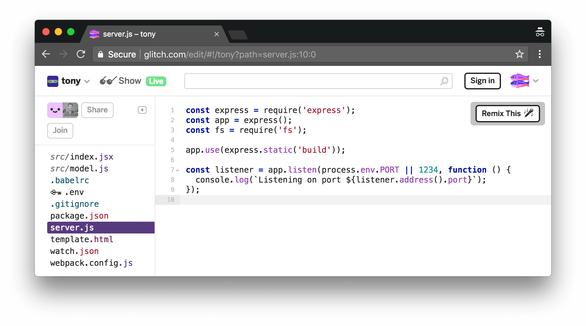
       <figcaption>
         <b>Figure X</b>. The editor tab
       </figcaption>
     </figure>

1. Click **tony**. A menu appears.

     <figure>
       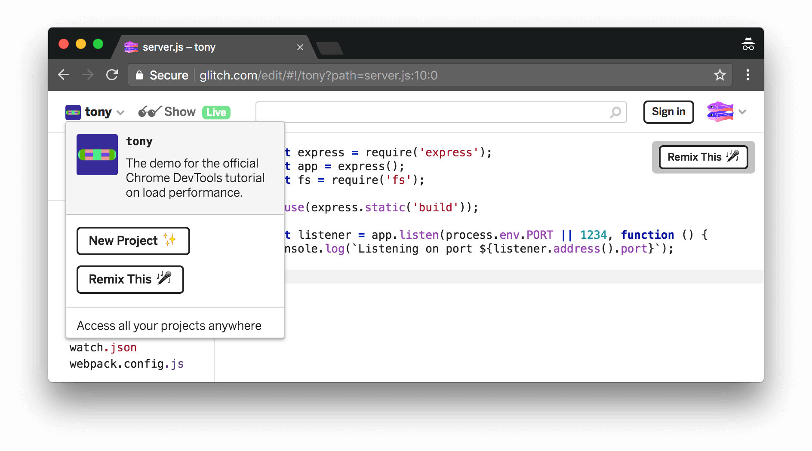
       <figcaption>
         <b>Figure X</b>. The menu that appears after clicking <b>tony</b>
       </figcaption>
     </figure>

1. Click **Remix This**. The name of the project changes from **tony** to some randomly-generated
   name. You now have your own editable copy of the code. Later on, you'll make changes to this
   code.
1. Click **Show Live**. The demo opens in a new tab. This tab will be referred to as the *demo
   tab*. It may take a while for the site to load.

     <figure>
       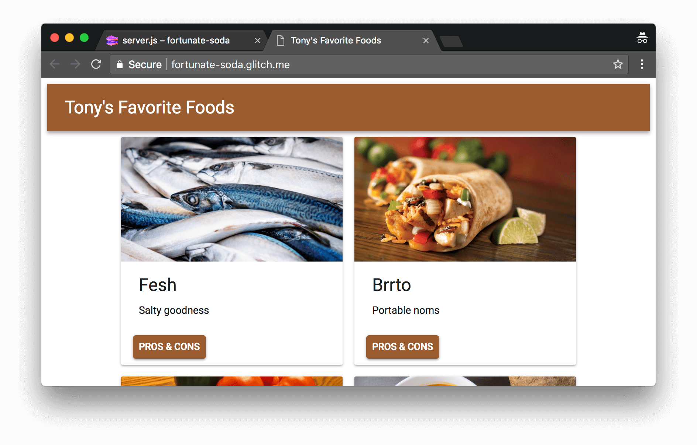
       <figcaption>
         <b>Figure X</b>. The demo tab
       </figcaption>
     </figure>

1. Press <kbd>Command</kbd>+<kbd>Option</kbd>+<kbd>J</kbd> (Mac)
   <kbd>Control</kbd>+<kbd>Shift</kbd>+<kbd>J</kbd> (Windows, Linux, Chrome OS). Chrome DevTools
   opens up alongside the demo.

     <figure>
       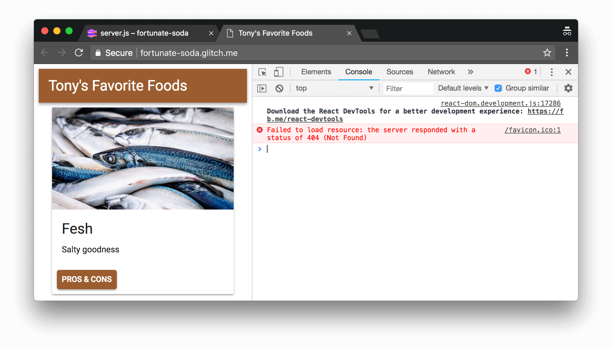
       <figcaption>
         <b>Figure X</b>. DevTools and the demo
       </figcaption>
     </figure>

For the rest of the screenshots in this tutorial, DevTools will be shown as a separate window. You
can do this by pressing <kbd>Command</kbd>+<kbd>Shift</kbd>+<kbd>P</kbd> (Mac) or
<kbd>Control</kbd>+<kbd>Shift</kbd>+<kbd>P</kbd> (Windows, Linux, Chrome OS) to open the Command
Menu, typing `Undock`, and then selecting **Undock into seperate window**.

<figure>
  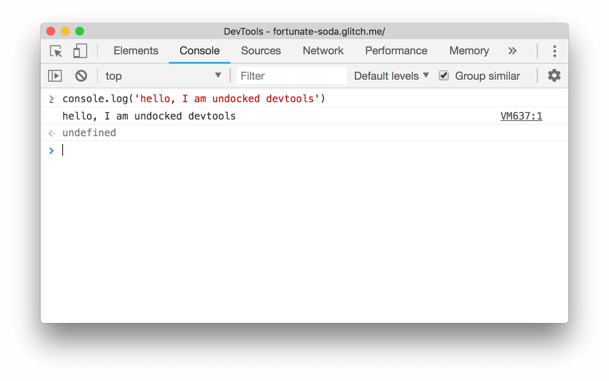
  <figcaption>
    <b>Figure X</b>. Undocked DevTools
  </figcaption>
</figure>

### Establish a baseline {: #baseline }

The baseline is a record of how the site performed before you made any performance improvements.

1. Click the **Audits** tab. It may be hidden behind the **More Panels**
   {:.inline-icon} button. There's a Lighthouse on this
   panel because the project that powers the Audits panel is called
   [Lighthouse](/web/tools/lighthouse).

     <figure>
       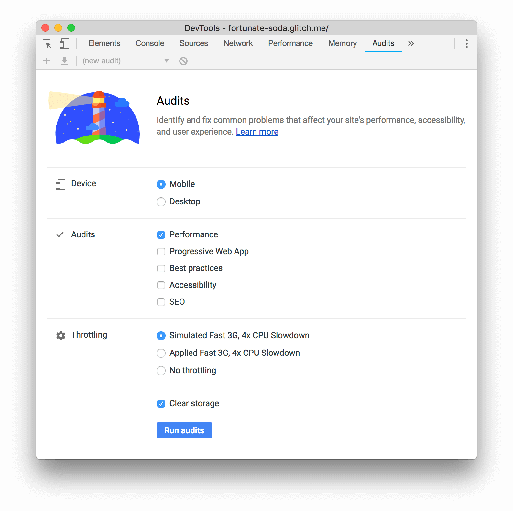
       <figcaption>
         <b>Figure X</b>. The Audits panel
       </figcaption>
     </figure>

1. Match your audit configuration settings to those in **Figure X**.
1. Click **Run Audits**. After 10 to 30 seconds, the Audits panel shows you a report of the site's
   performance.

     <figure>
       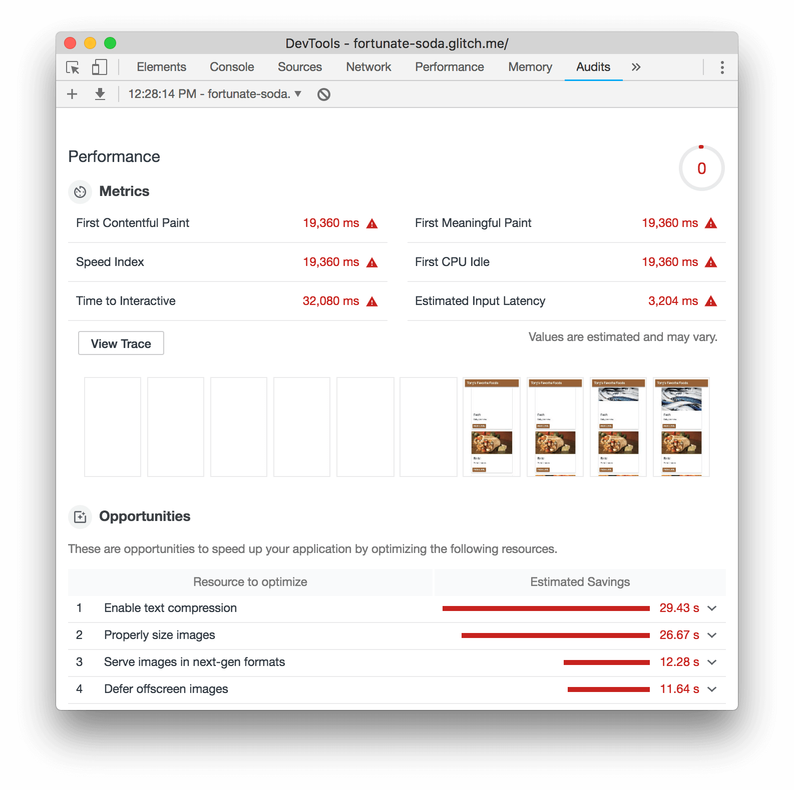
       <figcaption>
         <b>Figure X</b>. The Audits panel's report of the site's performance
       </figcaption>
     </figure>

#### Handling report errors {: #errors }

If you ever get an error in your Audits panel report, try running the demo tab from an
[incognito window][incognito]{:.external} with no other tabs open.

<figure>
  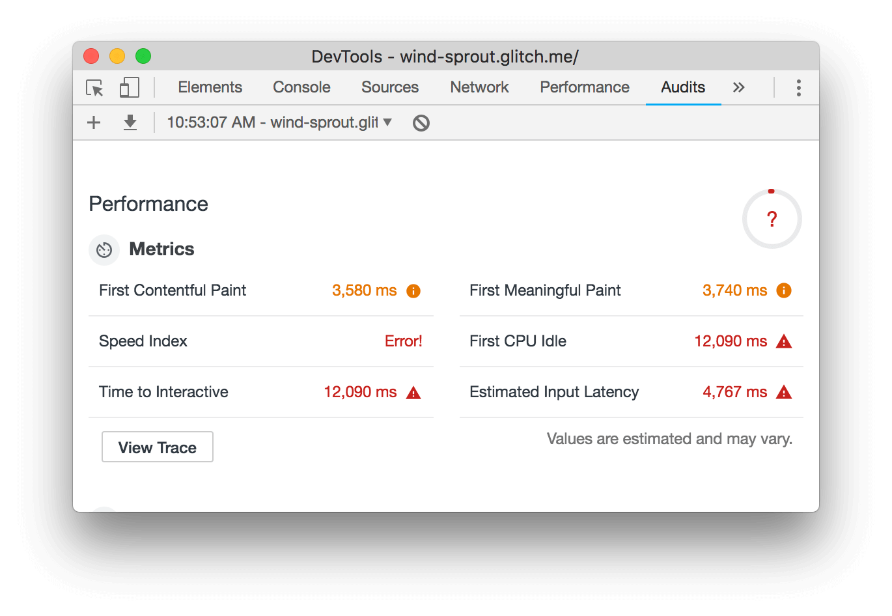
  <figcaption>
    <b>Figure X</b>. A report that errored
  </figcaption>
</figure>

[incognito]: https://support.google.com/chrome/answer/95464

### Understand your report {: #report }

The number at the top of your report is the overall performance score for the site. Later, as you
make changes to the code, you should see this number rise. A higher score means better performance.

<figure>
  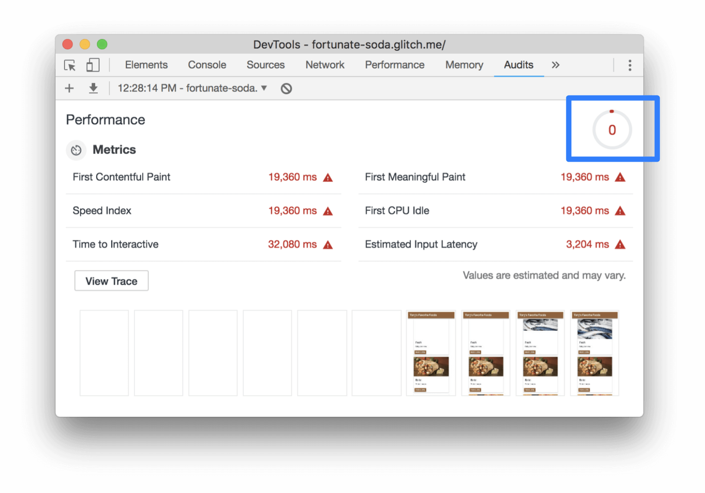
  <figcaption>
    <b>Figure X</b>. The overall performance score
  </figcaption>
</figure>

The **Metrics** section provides quantitative measurements of the site's performance. Each metric
provides insight into a different aspect of the performance. For example, **First Contentful Paint**
tells you when content is first painted to the screen, which is an important milestone in the user's
perception of the page load, whereas **First CPU Idle** marks when the main thread is quiet enough
to handle user input, which is essentially a proxy for when the user can first interact with the
page.

<figure>
  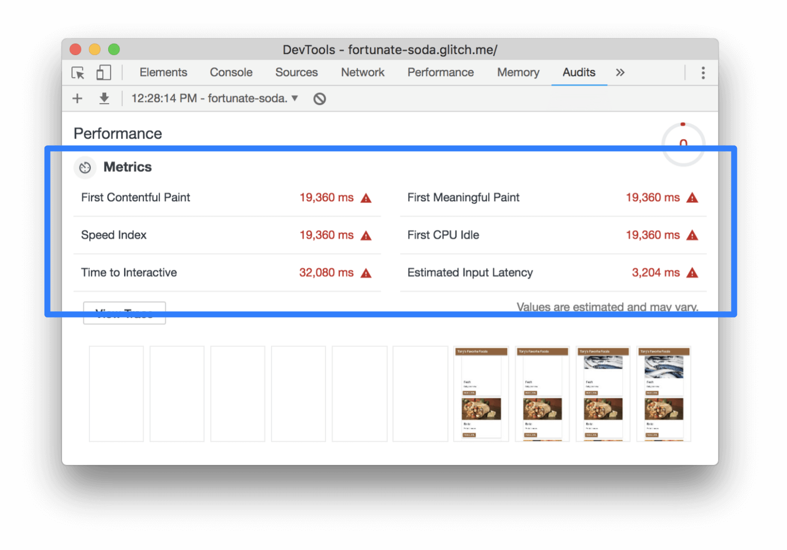
  <figcaption>
    <b>Figure X</b>. The Metrics section
  </figcaption>
</figure>

Hover over a metric to see a description of it, and click **Learn More** to read documentation
about it.
 
<figure>
  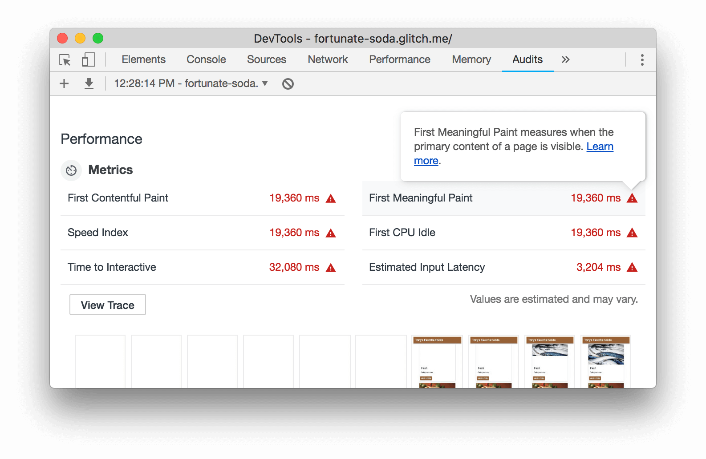
  <figcaption>
    <b>Figure X</b>. Hovering over the First Meaningful Paint metric
  </figcaption>
</figure>

Below Metrics is a collection of screenshots that show you how the page looked as it loaded.

<figure>
  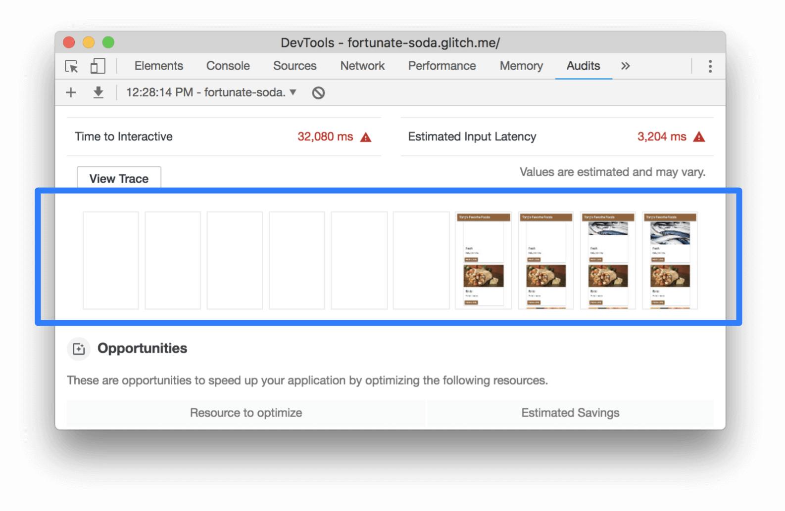
  <figcaption>
    <b>Figure X</b>. Screenshots of how the page looked while loading
  </figcaption>
</figure>

The **Opportunities** section provides specific tips on how to improve this particular page's
load performance.

<figure>
  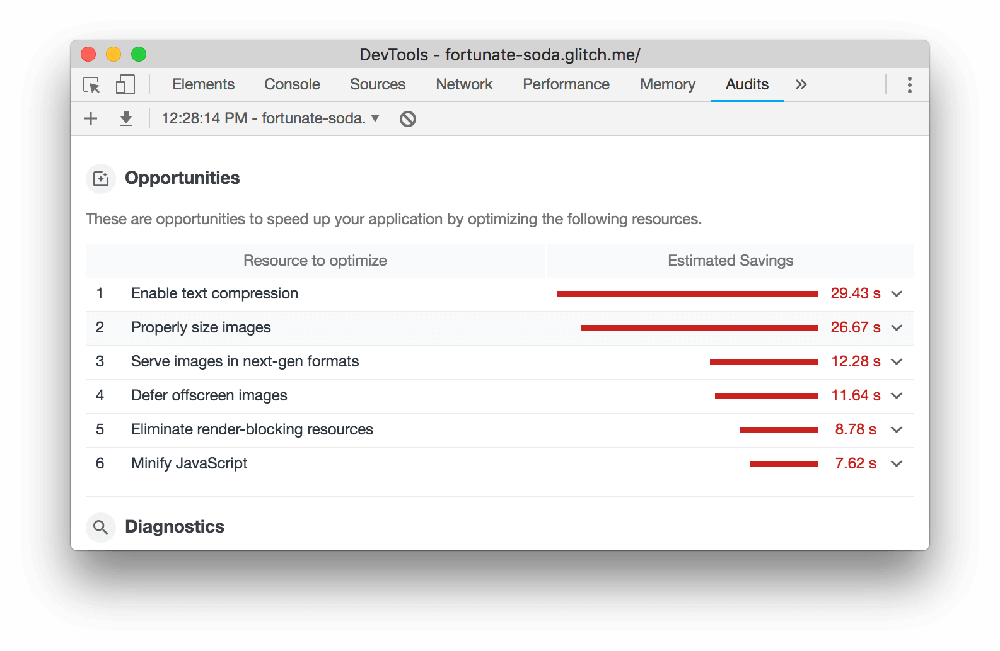
  <figcaption>
    <b>Figure X</b>. The Opportunities section
  </figcaption>
</figure>

Click an opportunity to learn more about it.

<figure>
  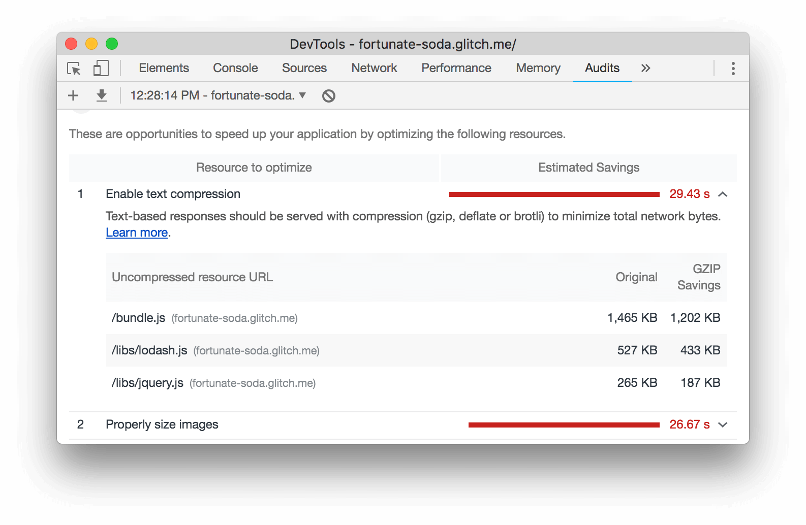
  <figcaption>
    <b>Figure X</b>. More information about the text compression opportunity
  </figcaption>
</figure>

Click **Learn More** to see documentation about why an opportunity is important, and specific
recommendations on how to fix it.

<figure>
  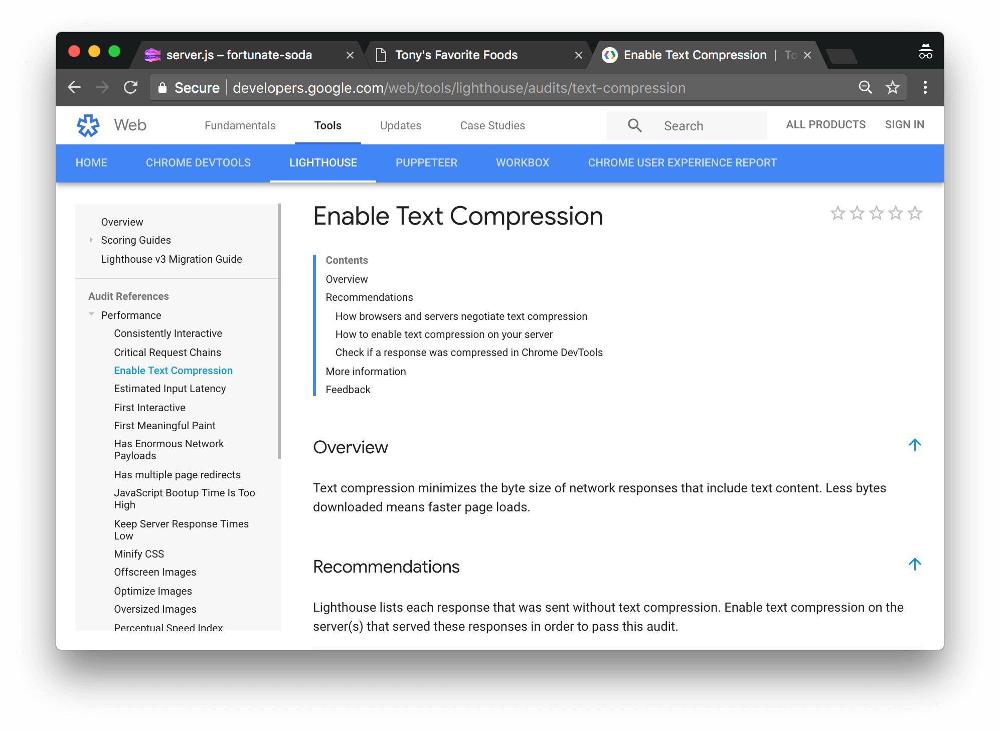
  <figcaption>
    <b>Figure X</b>. Documentation for the text compression opportunity
  </figcaption>
</figure>

The **Diagnostics** section provides more information about factors that contribute to the page's
load time.

<figure>
  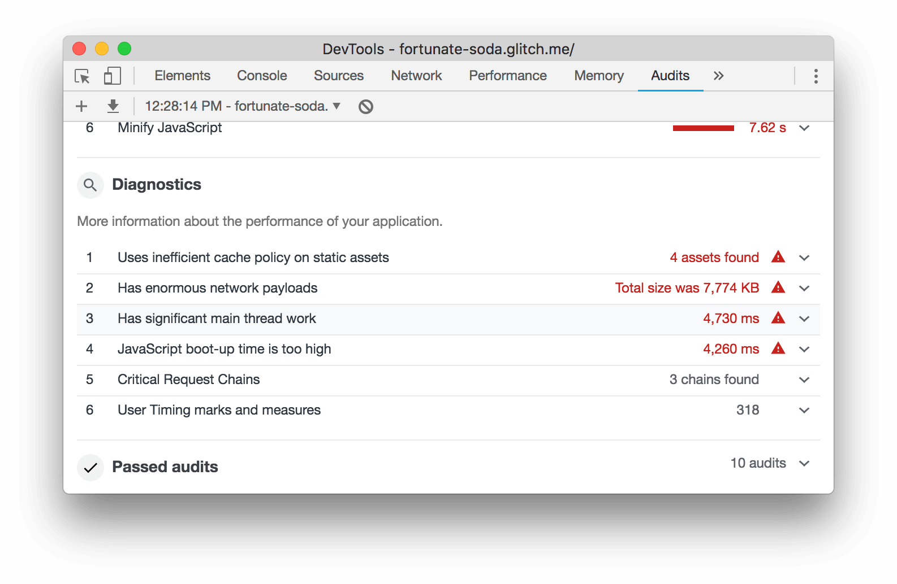
  <figcaption>
    <b>Figure X</b>. The Diagnostics section
  </figcaption>
</figure>

The **Passed Audits** section shows you what the site is doing correctly. Click to expand the
section.

<figure>
  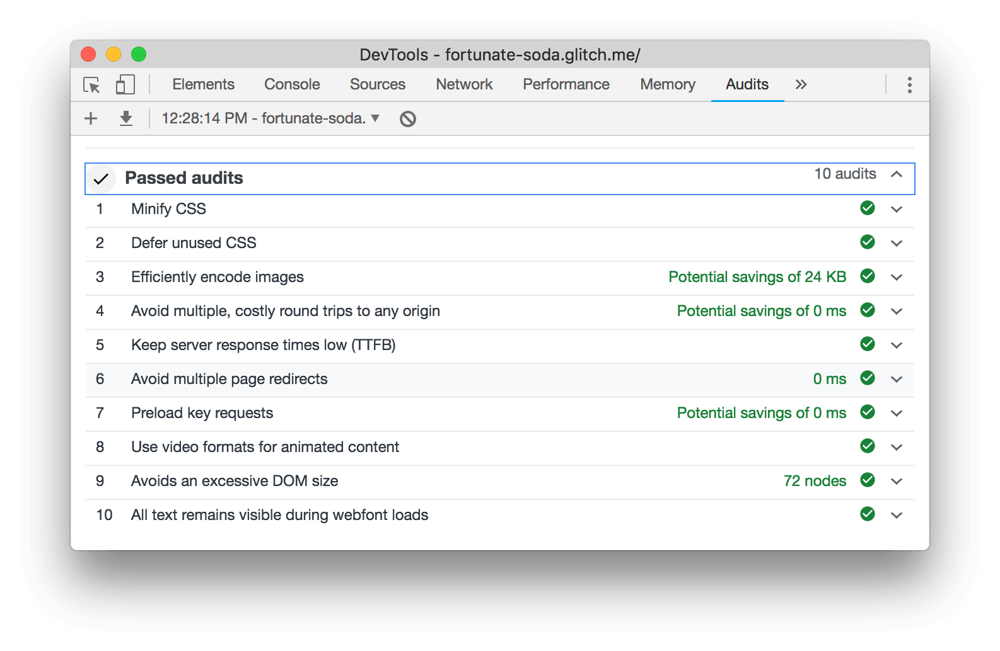
  <figcaption>
    <b>Figure X</b>. The Passed Audits section
  </figcaption>
</figure>

## Step 2: Experiment {: #experiment }

The Opportunites section of your audit report gives you tips on how to improve the
page's performance. In this section, you implement the recommended changes to the codebase,
auditing the site after each change to measure how it affects site speed.

### Enable text compression {: #compression }

Your report says that enabling text compression is one of the top opportunities for
improving the page's performance.

Before you enable compression, here are a couple of ways you can manually check whether
text resources are compressed.

1. Click the **Network** tab.

     <figure>
       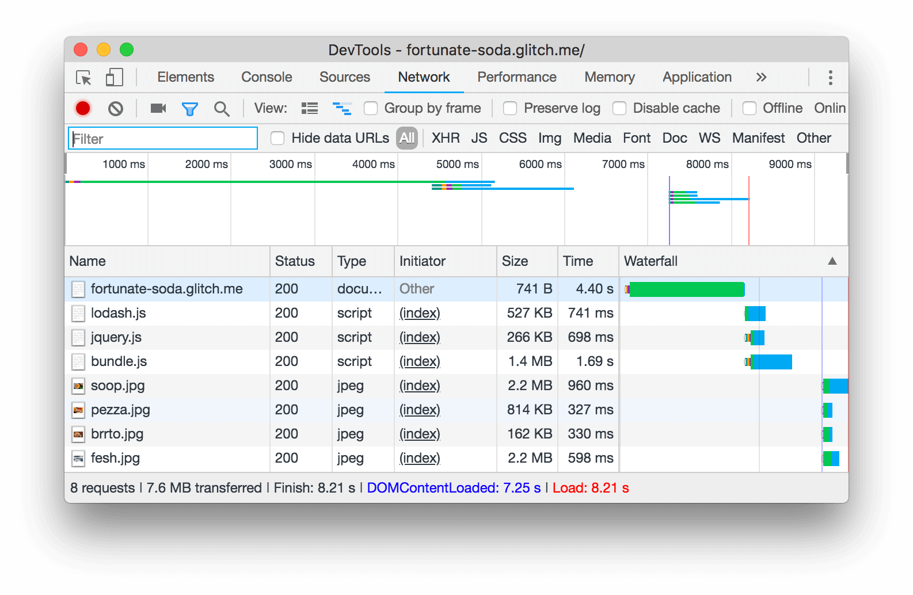
       <figcaption>
         <b>Figure X</b>. The Network panel
       </figcaption>
     </figure>

1. Click **Use Large Request Rows** ![Use Large Request Rows][large]{: .inline-icon }. The
   height of the rows in the table of network requests increases.

     <figure>
       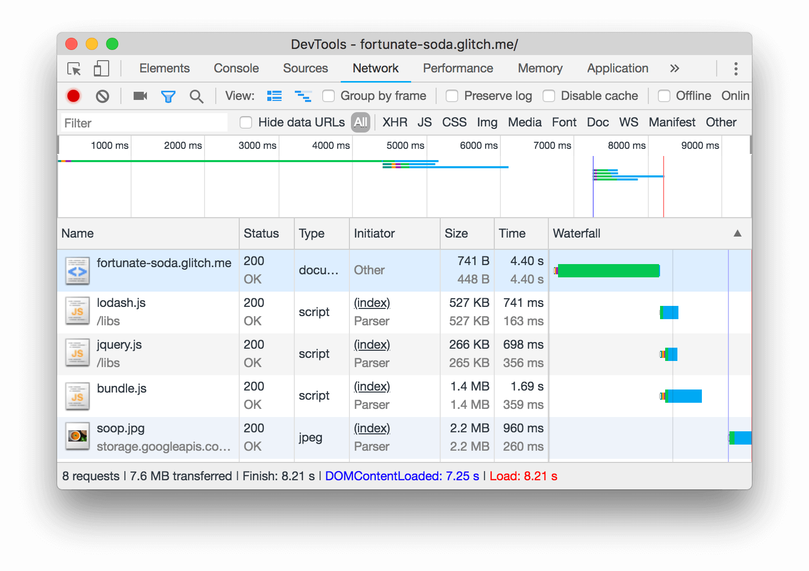
       <figcaption>
         <b>Figure X</b>. Large rows in the network requests table
       </figcaption>
     </figure>

[large]: /web/tools/chrome-devtools/network-performance/imgs/large-resource-rows-button.png

1. If you don't see the **Size** column in the table of network requests, click the table
   header and then select **Size**.

Each **Size** cell shows two values. The top value is the size of the downloaded resource.
The bottom value is the size of the uncompressed resource. If the two values are the same,
then the resource is not being compressed when it's sent over the network. For example, in
**Figure X** the top and bottom values for `bundle.js` are both `1.4 MB`.

You can also check for compression by inspecting a resource's HTTP headers:

1. Click **bundle.js**.
1. Click the **Headers** tab.

     <figure>
       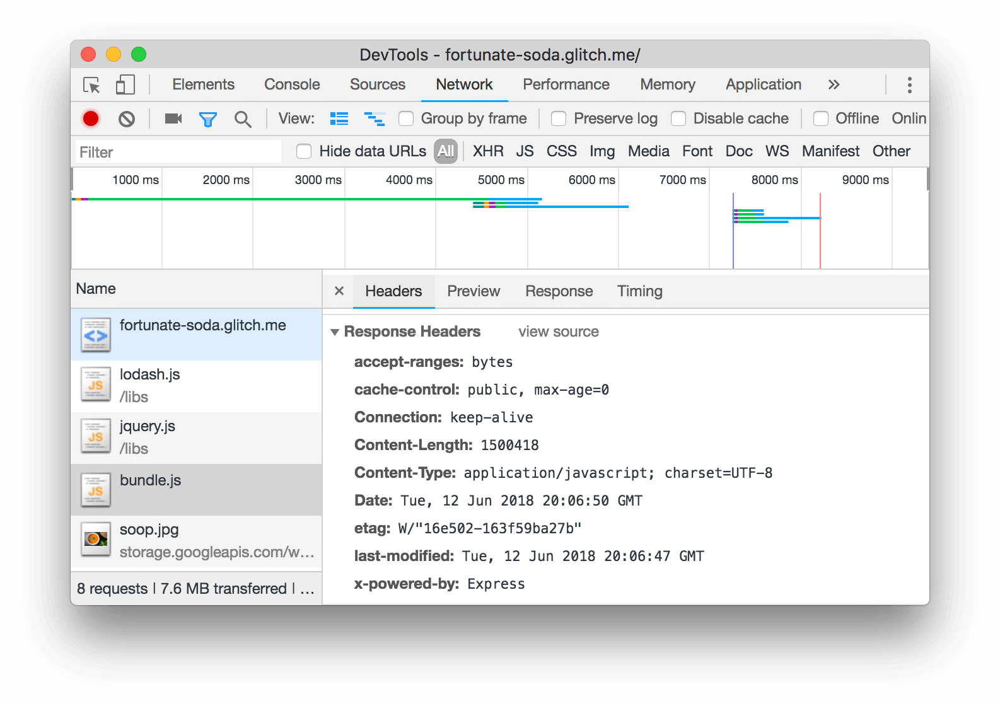
       <figcaption>
         <b>Figure X</b>. The Headers tab
       </figcaption>
     </figure>

1. Search the **Response Headers** section for a `content-encoding` header. You shouldn't see one,
   meaning that `bundle.js` was not compressed. When a resource *is* compressed, this header is
   usually set to `gzip`, `deflate`, or `br`. See [Directives][Directives]{:.external} for an
   explanation of these values.

[Directives]: https://developer.mozilla.org/en-US/docs/Web/HTTP/Headers/Content-Encoding#Directives

Enough with the explanations. Time to make some changes!
Enable text compression by adding a couple of lines of code:

1. In the editor tab, click **server.js**.

     <figure>
       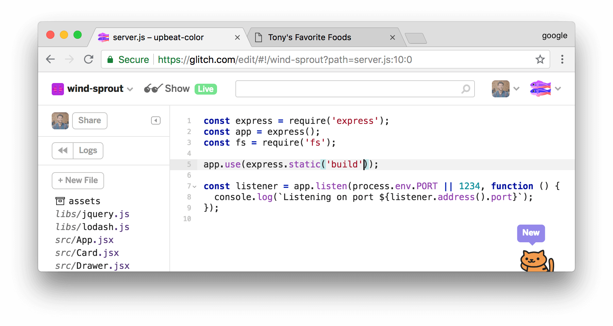
       <figcaption>
         <b>Figure X</b>. Editing <code>server.js</code>
       </figcaption>
     </figure>

1. Add the following code to **server.js**. Make sure to put `app.use(compression())` before
   `app.use(express.static('build'))`.

     <pre>
       ...
       const fs = require('fs');
       <strong>const compresion = require('compression');</strong>

       <strong>app.use(compression());</strong>
       app.use(express.static('build'));
       ...
     </pre>

     <aside class="note">
       <b>Note</b>: Usually, you'd have to install the <code>compression</code> package via
       something like <code>npm i -S compression</code>, but this has already been done for you.
     </aside>

1. Wait for Glitch to deploy the new build of the site. The fancy animation that you see next
   to **Logs** and **Show** means that the site is getting rebuilt and redeployed.
   The change is ready when you see **Show Live** again.

     <figure>
       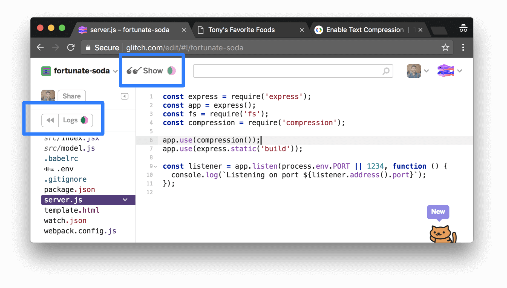
       <figcaption>
         <b>Figure X</b>. The animation that indicates that the site is getting built
       </figcaption>
     </figure>

Use the workflows that you learned earlier to manually check that the compression is working:

1. Go back to the demo tab and reload the page. The **Size** column should now show 2 different
   values for text resources like `bundle.js`. In **Figure X** the top value of `261 KB` for
   `bundle.js` is the size of the file that was sent over the network, and the bottom value of
   `1.4 MB` is the uncompressed file size.

     <figure>
       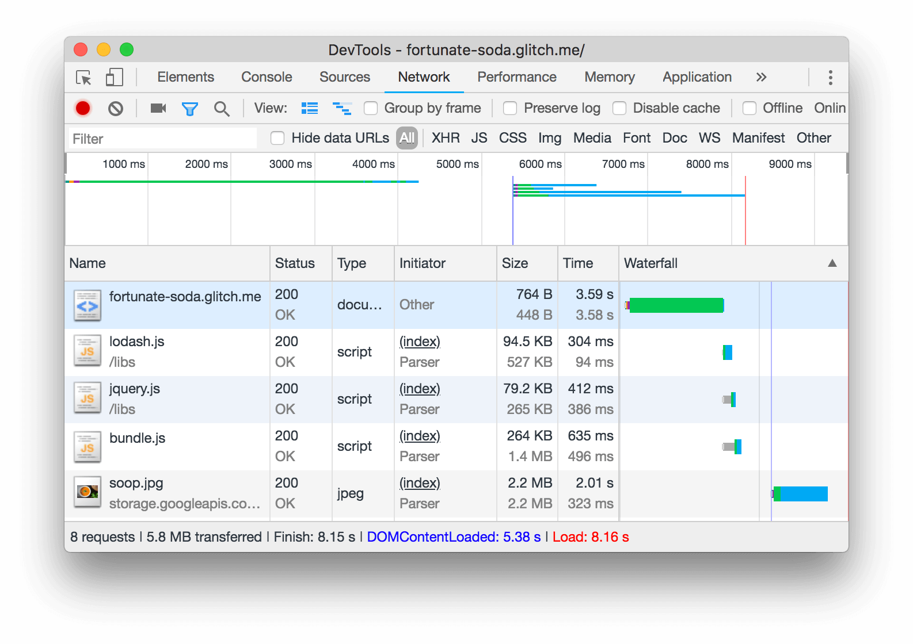
       <figcaption>
         <b>Figure X</b>. The Size column now shows 2 different values for text resources
       </figcaption>
     </figure>

1. The **Response Headers** section for `bundle.js` should now include a `content-encoding: gzip`
   header.

     <figure>
       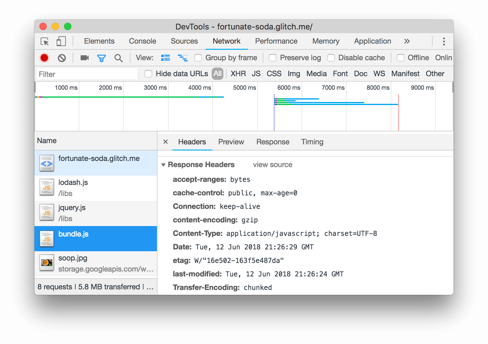
       <figcaption>
         <b>Figure X</b>. The Response Headers section now contains a 
         <code>content-encoding</code> header
       </figcaption>
     </figure>

Audit the page again to measure what kind of impact text compression has on the page's load
performance:

1. Click the **Audits** tab.
1. Click **Perform an audit** {: .inline-icon }.
1. Leave the settings the same as before.
1. Click **Run audit**.
  
     <figure>
       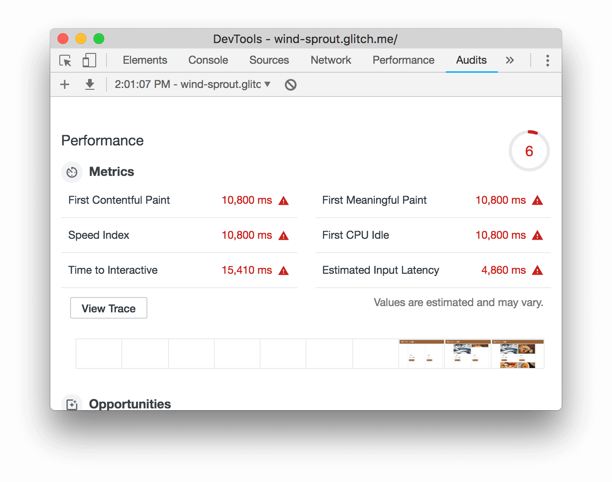
       <figcaption>
         <b>Figure X</b>. An Audits report after enabling text compression
       </figcaption>
     </figure>

Woohoo! That looks like progress. Your overall performance score should have increased,
meaning that the site is getting faster.

#### Text compression in the real world {: #real-world-compression }

Most servers really do have simple fixes like this for enabling compression! Just do a search
on how to configure whatever server you use to compress text.

### Resize images {: #images }

Your new report says that properly sizing images is another big opportunity.

1. In your report, click **Properly size images** to see what images should be
   resized. It looks like all 4 images are bigger than necessary.

     <figure>
       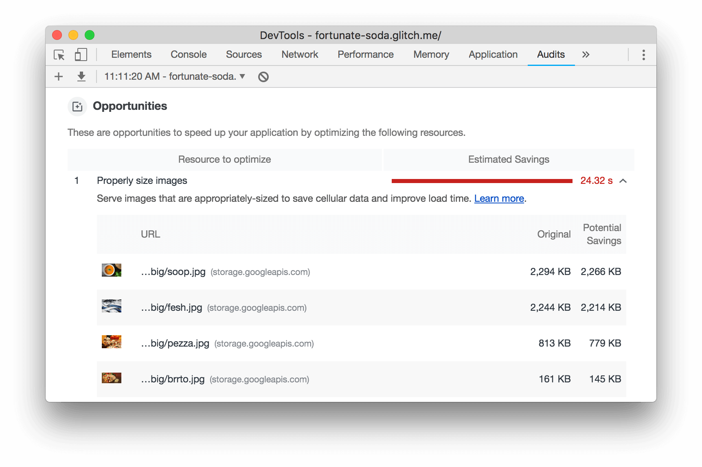
       <figcaption>
         <b>Figure X</b>. Details about the <i>Properly size images</i> opportunity
       </figcaption>
     </figure>

1. Back in the editor tab, open `src/model.js`.
1. Replace `const dir = 'big'` with `const dir = 'small'`.
1. Audit the page again to see how this change affects load performance.

     <figure>
       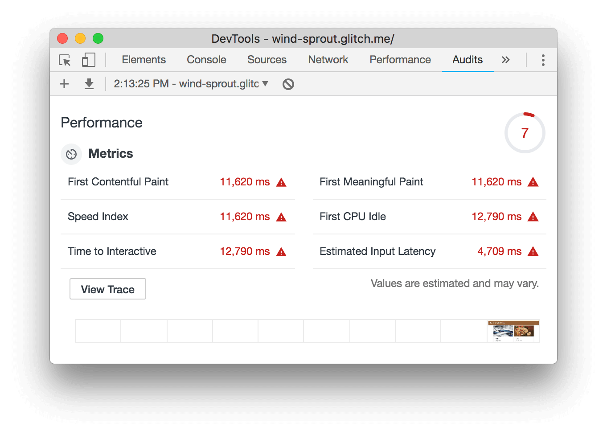
       <figcaption>
         <b>Figure X</b>. An Audits report after resizing images</code>
       </figcaption>
     </figure>

Looks like the change only has a minor affect on the overall performance score. However, one thing
that the score doesn't show clearly is how much network data you're saving your users. The total
size of the old photos was around 5.3 megabytes, whereas now it's only about 0.18 megabytes.

#### Resizing images in the real world {: #real-world-resizing }

For a small app, doing a one-off resize like this may be good enough. But for a
large app, this obviously isn't scalable. Here are some strategies for managing images in
large apps:

* Resize images during your build process.
* Create multiple sizes of each image during the build process and then use `srcset` in your code.
  At runtime, the browser takes care of choosing what size is best for the device it's running on. 
  See [Relative-sized images][relative].

[relative]: /web/fundamentals/design-and-ux/responsive/images#relative_sized_images

* Use an image CDN that lets you dynamically resize an image when you request it.

See [Essential Image Optimization][addy]{: .external target="_blank" rel="noopener" } by Addy
for more tips.

[addy]: https://images.guide/

### Eliminate render-blocking resources {: #render }

Your latest report says that eliminating render-blocking resources is now the biggest opportunity.

A render-blocking resource is an external JavaScript or CSS file that the browser must
download, parse, and execute before it can show the page. The goal is to only run the core
CSS and JavaScript code that is required to display the page properly.

The first task, then, is to find code that doesn't need to be executed on page load.

1. Click **Eliminate render-blocking resources** to see the resources that are blocking:
   `lodash.js` and `jquery.js`.

     <figure>
       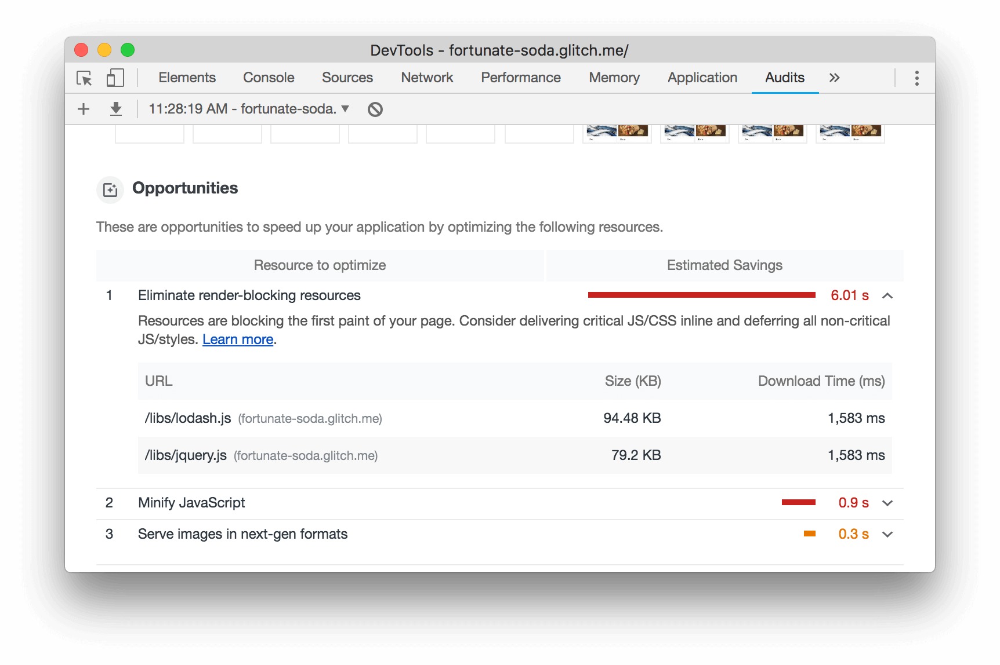
       <figcaption>
         <b>Figure X</b>. More information about the <i>Reduce render-blocking resources</i>
         opportunity
       </figcaption>
     </figure>

1. Press <kbd>Command</kbd>+<kbd>Shift</kbd>+<kbd>P</kbd> (Mac) or
   <kbd>Control</kbd>+<kbd>Shift</kbd>+<kbd>P</kbd> (Windows, Linux, Chrome OS) to open
   the Command Menu, start typing `Coverage`, and then select **Show Coverage**.

     <figure>
       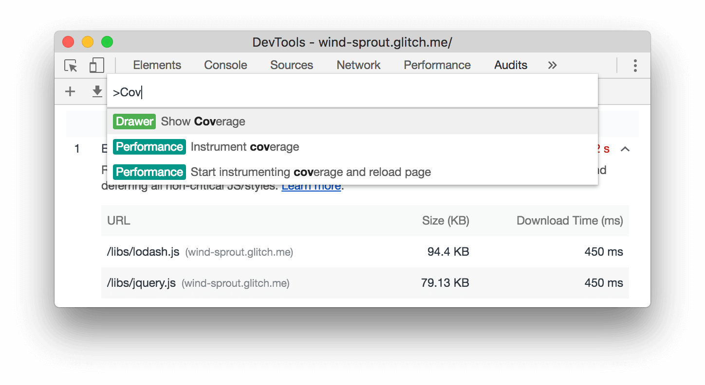
       <figcaption>
         <b>Figure X</b>. Opening the Command Menu from the Coverage tab
       </figcaption>
     </figure>

     <figure>
       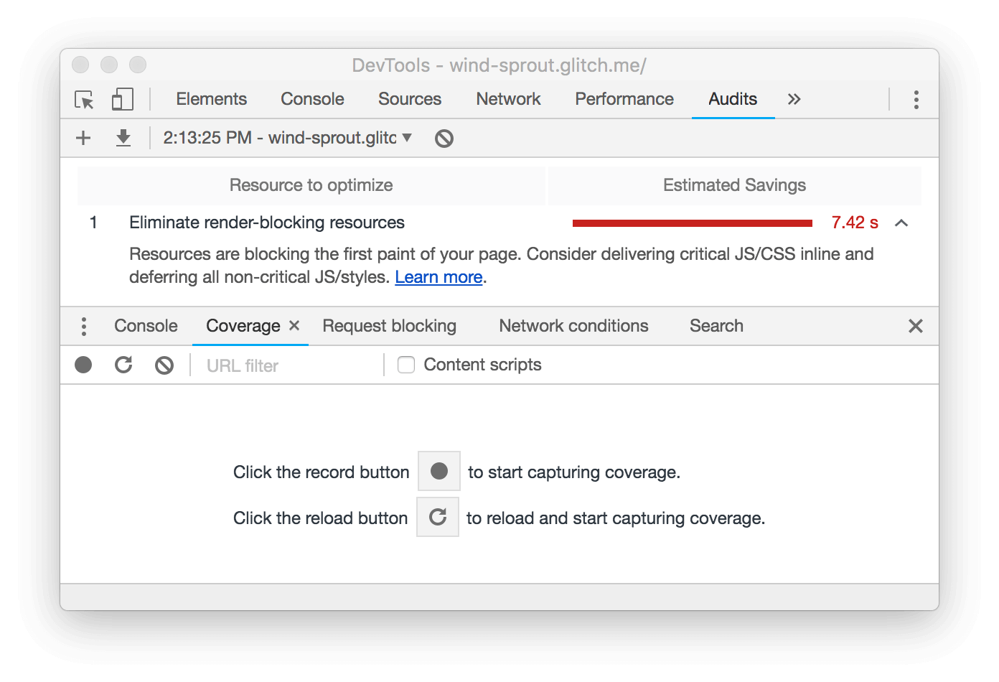
       <figcaption>
         <b>Figure X</b>. The Coverage tab
       </figcaption>
     </figure>

1. Click **Reload** {: .inline-icon }. The Coverage tab provides an
   overview of how much of the code in `bundle.js`, `jquery.js`, and `lodash.js` is being
   executed while the page loads.

     <figure>
       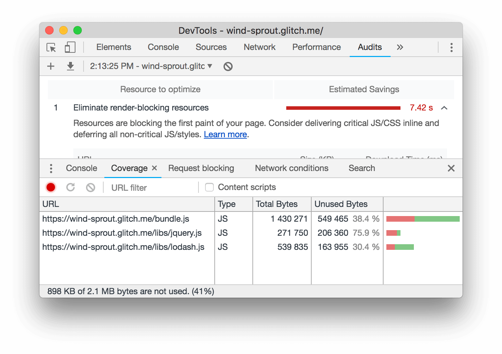
       <figcaption>
         <b>Figure X</b>. The Coverage report
       </figcaption>
     </figure>

1. Click the **jquery.js** row. DevTools opens the file in the Sources panel. A line of code was
   executed if it has a green bar next to it. A red bar means it was not executed, and is
   definitely not needed on page load.

     <figure>
       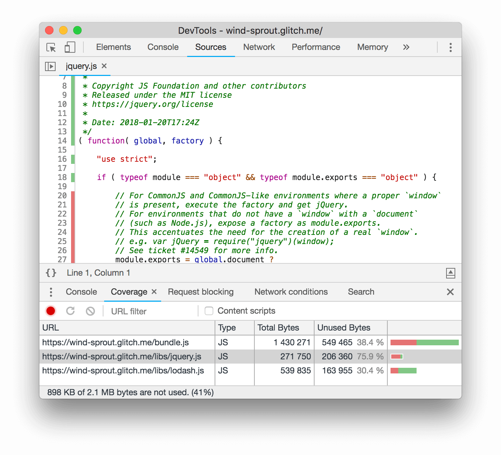
       <figcaption>
         <b>Figure X</b>. Viewing the jQuery file in the Sources panel
       </figcaption>
     </figure>

1. Scroll through the jQuery code a bit. Some of the lines that get "executed" are actually just
   comments. Running this code through a minifier that strips comments is another way to reduce
   the size of this file.

In short, when you're working with your own code, the Coverage tab can help you analyze your
code, line-by-line, and only ship the code that's needed for page load.

Are the `jquery.js` and `lodash.js` files even needed to load the page? The Request Blocking
tab can show you what happens when resources aren't available.

1. Click the **Network** tab.
1. Press <kbd>Command</kbd>+<kbd>Shift</kbd>+<kbd>P</kbd> (Mac) or
   <kbd>Control</kbd>+<kbd>Shift</kbd>+<kbd>P</kbd> (Windows, Linux, Chrome OS) to open the
   Command Menu again.
1. Start typing `blocking` and then select **Show Request Blocking**.

     <figure>
       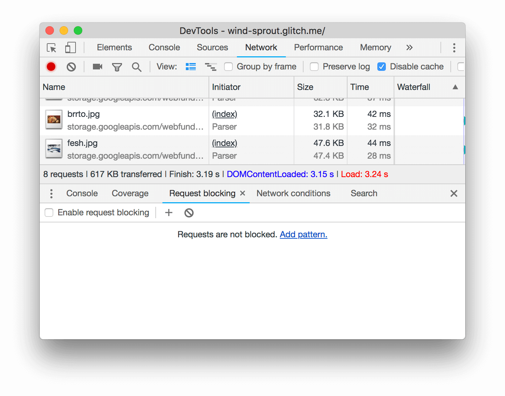
       <figcaption>
         <b>Figure X</b>. The Request Blocking tab
       </figcaption>
     </figure>

1. Click **Add Pattern** {:.inline-icon}, type `/libs/*`, and then
   press <kbd>Enter</kbd> to confirm.

     <figure>
       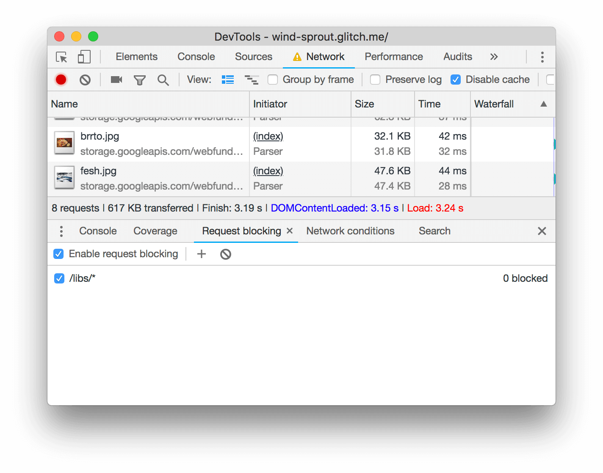
       <figcaption>
         <b>Figure X</b>. Adding a pattern to block any request to the <code>libs</code> directory
       </figcaption>
     </figure>

1. Reload the page. The page still loads and is interactive, so it looks like these 
   resources aren't needed whatsoever!

     <figure>
       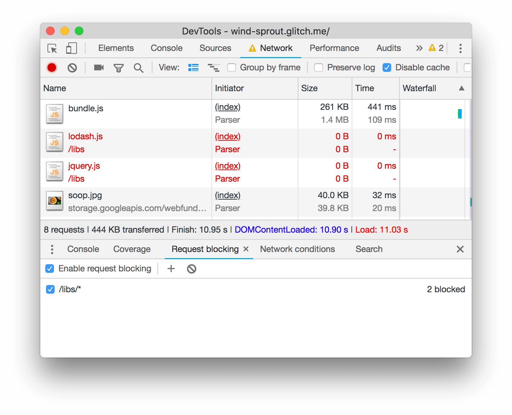
       <figcaption>
         <b>Figure X</b>. The Network panel shows that the requests have been blocked
       </figcaption>
     </figure>

1. Click **Remove all patterns** {: .inline-icon }
   to delete the `/libs/*` blocking pattern.

Now, remove the references to these files from the code and audit the page again:

1. Back in the editor tab, open `template.html`.
1. Delete ``.
1. Audit the page again from the **Audits** panel. Your overall score should have improved again.

     <figure>
       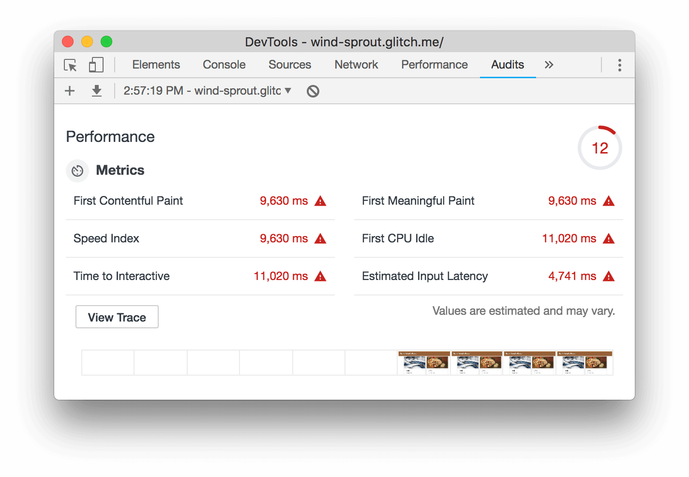
       <figcaption>
         <b>Figure X</b>. An Audits report after removing the render-blocking resources
       </figcaption>
     </figure>

#### Optimizing the Critical Rendering Path in the real-world {: #crp }

The [Critical Rendering Path][CRP] refers to the code that you need to load a page.
In general, you can speed up page load by only shipping critical code during the page load,
and then lazy-loading everything else.

[CRP]: /web/fundamentals/performance/critical-rendering-path/

* It's unlikely that you'll find scripts that you can remove outright, but you will often
  find that many scripts don't need to be requested during the page load, and can instead be
  requested asynchronously. See [Using async or defer][async].

[async]: /web/fundamentals/performance/optimizing-content-efficiency/loading-third-party-javascript/#use_async_or_defer

### Do less main thread work {: #main }

Your latest report shows some minor potential savings in the Opportunities section, but if
you look down in the Diagnostics section, it looks like the biggest bottleneck is too much
main thread activity. The main thread is where the browser does most of the work needed to
display a page, such as parsing and executing HTML, CSS, and JavaScript.

The goal is to use the Performance panel to analyze what work the main thread is doing while the
page loads, and find ways to defer unnecessary work.

1. Click the **Performance** tab.
1. Click **Capture Settings** {:.inline-icon}.
1. Set **Network** to **Slow 3G** and **CPU** to **6x slowdown**. Mobile devices typically have
   more hardware constraints than laptops or desktops, so these settings let you experience the
   page load as if you were using a less powerful device.
1. Click **Reload** {:.inline-icon}. DevTools reloads the page and
   then produces a visualization of all the work that the browser must do in order to display
   the page. This visualization will be referred to as the *trace*.

     <figure>
       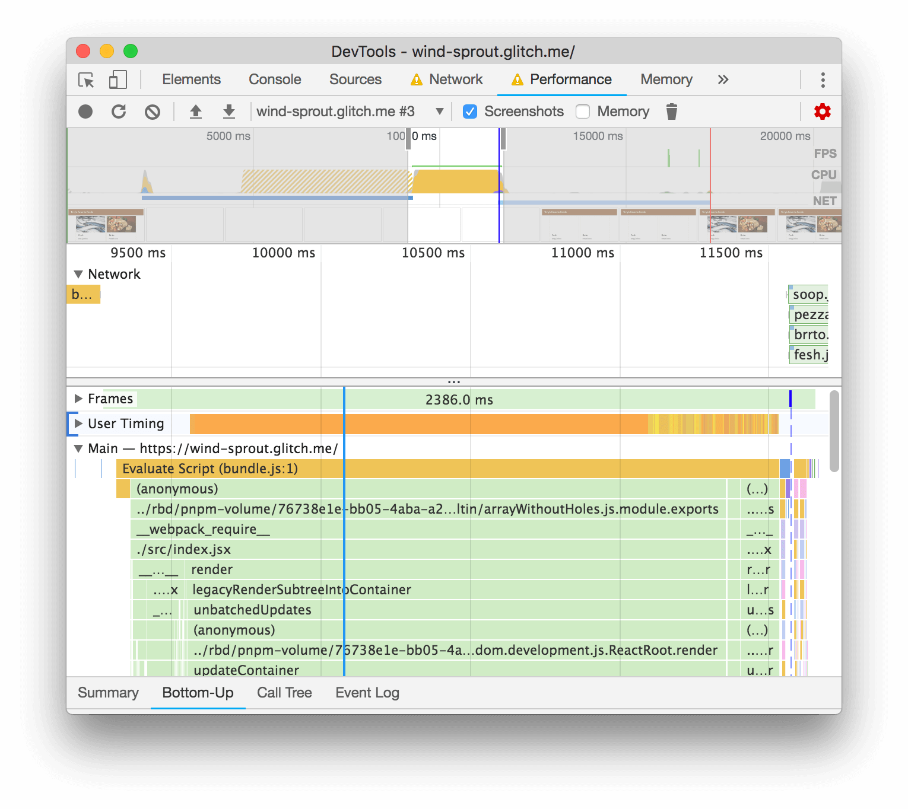
       <figcaption>
         <b>Figure X</b>. The Performance panel's trace of the page load
       </figcaption>
     </figure>

The trace shows activity chronologically, from left to right. The FPS, CPU, and NET charts
at the top give you an overview of frames per second, CPU activity, and network activity.
The wall of yellow that you see in **Figure X** means that the CPU was completely busy with
scripting activity. This is a clue that you may be able to speed up page load by doing less
JavaScript work.

<figure>
  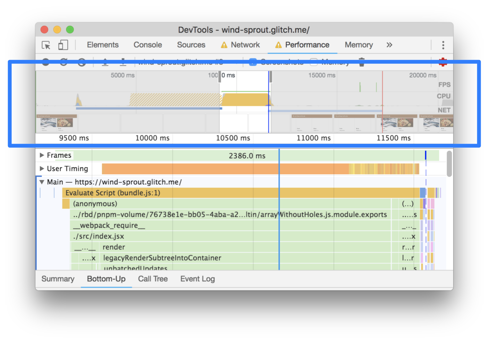
  <figcaption>
    <b>Figure X</b>. The Overview section of the trace
  </figcaption>
</figure>

Investigate the trace to find ways to do less JavaScript work:

1. Click the **User Timing** section to expand it. Based on the fact that there seems to be a
   bunch of [User Timing][UT]{:.external} measures from React, it seems like Tony's app is
   using the development mode of React. Switching to the production mode of React will probably
   yield some easy performance wins.

     <figure>
       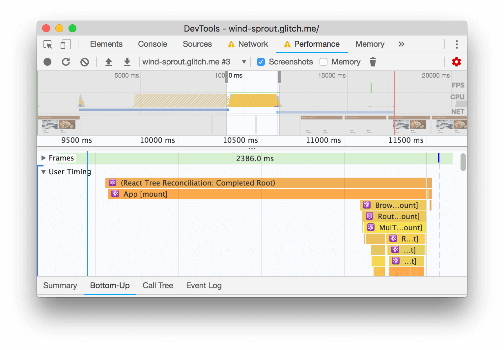
       <figcaption>
         <b>Figure X</b>. The User Timing section
       </figcaption>
     </figure>

1. Click **User Timing** again to collapse that section.
1. Browse the **Main** section. This section shows a chronological log of main thread activity,
   from left to right. The y-axis (top to bottom) shows why events occurred. For example, in
   **Figure X**, the `Evaluate Script` event caused the `(anonymous)` function to execute,
   which caused `../rbd/pnpm-volume/...` to execute, which caused `__webpack__require__` to
   execute, and so on.

     <figure>
       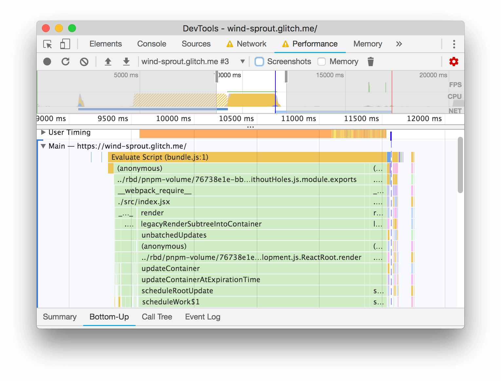
       <figcaption>
         <b>Figure X</b>. TODO
       </figcaption>
     </figure>

1. Scroll down to the bottom of the **Main** section. When you use a framework, most of the
   upper activity is caused by the framework, which is usually out of your control. The activity
   caused by your app is usually at the bottom. In this app, it seems like a function called
   `App` is causing a lot of calls to a `mineBitcoin` function.

     <figure>
       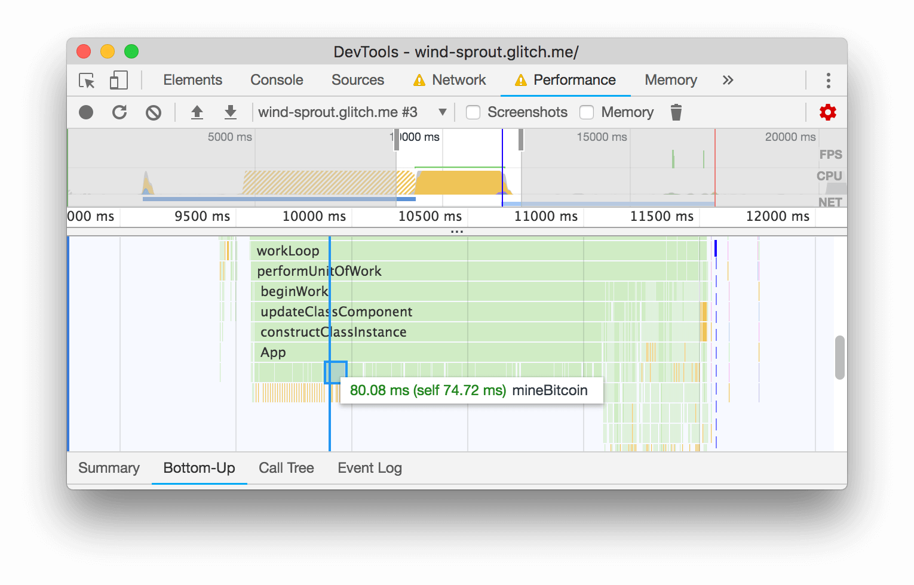
       <figcaption>
         <b>Figure X</b>. Hovering over the <code>mineBitcoin</code> activity
       </figcaption>
     </figure>

     <aside class="note">
       <b>Note</b> Although the calls that your framework makes are usually out of your control,
       sometimes you may structure your app in a way that causes the framework to run inefficiently.
       Restructuring your app to use the framework efficiently can be a way to do less main
       thread work. However, this requires a deep understanding of how your framework works, and
       what kind of changes you can make in your own code in order to use the framework more
       efficiently.
    </aside>

[UT]: https://developer.mozilla.org/en-US/docs/Web/API/User_Timing_API

1. Expand the **Bottom-Up** section. This tab breaks down what activities took up the most time.
1. If you don't see anything in the Botton-Up section, click the label for **Main** section.
   The Bottom-Up section only shows information for whatever activity, or group of activity, you
   have currently selected. For example, if you clicked on one of the `mineBitcoin` activities,
   the Bottom-Up section is only going to show information for that one activity.

The **Self Time** column shows you how much time was spent directly in each activity. This
column seems to confirm that the `mineBitcoin` function is taking up a lot of time.

<figure>
  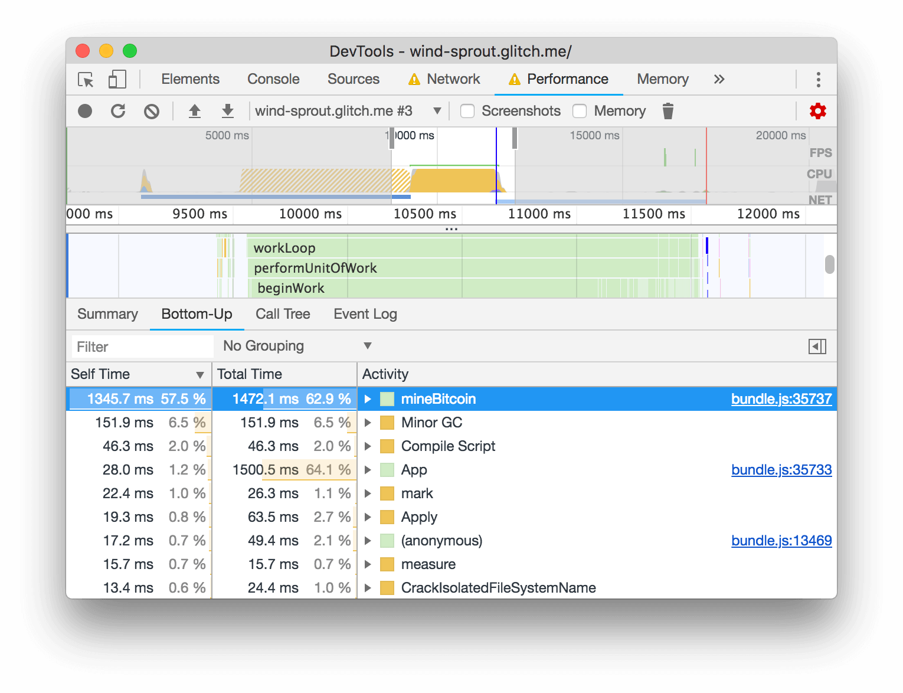
  <figcaption>
    <b>Figure X</b>. The Bottom-Up tab
  </figcaption>
</figure>

Time to see whether using production mode and reducing JavaScript activity speed up the page
load. Start with production mode:

1. In the editor tab, open `webpack.config.js`.
1. Change `"mode":"development"` to `"mode":"production"`.
1. Wait for the new build to deploy.
1. Audit the page again.

     <figure>
       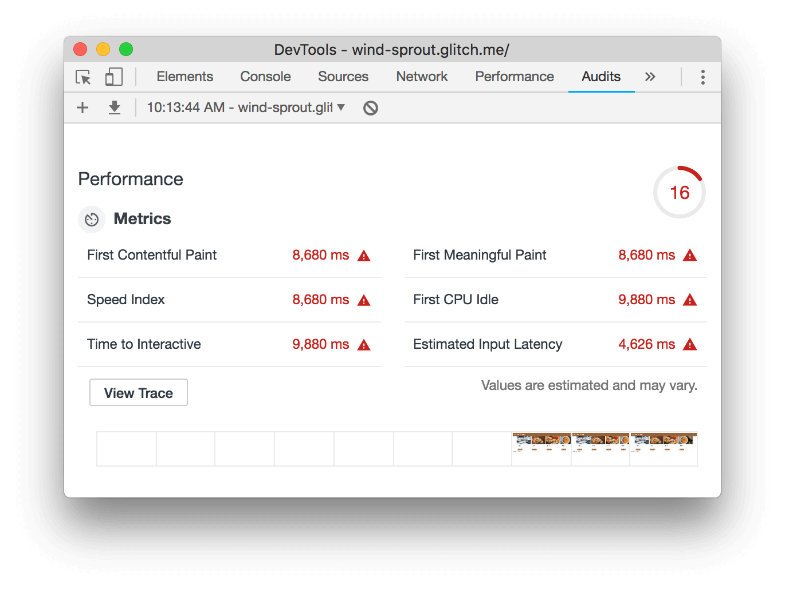
       <figcaption>
         <b>Figure X</b>. An Audits report after configuring webpack to use production mode
       </figcaption>
     </figure>

Reduce JavaScript activity by removing the call to `mineBitcoin`:

1. In the editor tab, open `src/App.jsx`.
1. Comment out the call to `this.mineBitcoin(1500)` in the `constructor`.
1. Wait for the new build to deploy.
1. Audit the page again.

     <figure>
       
       <figcaption>
         <b>Figure X</b>. An Audits report after removing unnecessary JavaScript work
       </figcaption>
     </figure>

Looks like that last change caused a massive jump in performance!

#### Doing less main thread work in the real world {: #TODO }

Although the calls that your framework makes are usually out of your control,
       sometimes you may structure your app in a way that causes the framework to run inefficiently.
       Restructuring your app to use the framework efficiently can be a way to do less main
       thread work. However, this requires a deep understanding of how your framework works, and
       what kind of changes you can make in your own code in order to use the framework more
       efficiently.

## A special thank you from Tony {: #thanks }

Tony's fans love how fast the site feels now, and he is very thankful for your help.
Click **Receive Gift** below to receive a special gift from Tony.






## Summary {: #summary}

* Whenever you set out to optimize a site's load performance, always start with an audit. The
  audit establishes a baseline, and gives you tips on how to improve.
* Make one change at a time, and audit the page after each change in order to see how that
  isolated change affects performance.

## Next steps {: #next-steps }

* Learn more about the theories of load performance.
* Check out the rest of the audits. When you configured the Audits panel, you disabled the
  audits for best practices, progressive web apps, SEO, and accessibility. Re-enable these
  categories and then run an audit on your own site to learn how to improve these aspects
  of your site.
* Leave feedback. Please take a moment to leave feedback in the next section. I really do
  use the data to make better tutorials for you.

## Feedback {: #feedback }






* File bugs on this doc in the [Web Fundamentals][WF]{:.external} repository.
* File bug reports at [Chromium Bugs](https://crbug.com){:.external}.
* Discuss features and changes on the [Mailing List][ML]{:.external}. Please don't use the mailing
  list for support questions. Use Stack Overflow, instead.
* Get help on how to use DevTools on [Stack Overflow][SO]{:.external}. Please don't file bugs
  on Stack Overflow. Use Chromium Bugs, instead.
* Tweet us at [@ChromeDevTools](https://twitter.com/chromedevtools).

[ML]: https://groups.google.com/forum/#!forum/google-chrome-developer-tools
[WF]: https://github.com/google/webfundamentals/issues/new
[SO]: https://stackoverflow.com/questions/tagged/google-chrome-devtools