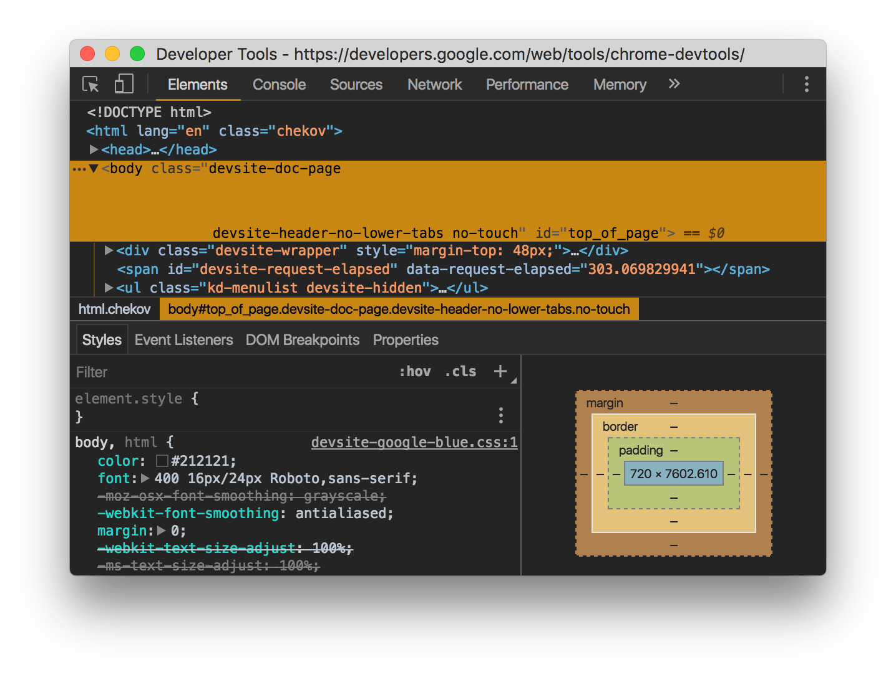

project_path: /web/tools/_project.yaml
book_path: /web/tools/_book.yaml
description: A reference on how to access and use common parts of the DevTools UI, and change the UI's appearance.

{# wf_updated_on: 2017-01-25 #}
{# wf_published_on: 2017-01-25 #}

# UI Reference {: .page-title }



This reference shows you how to:

* Access and use common parts of the Chrome DevTools UI, such as the main menu.
* Change the Chrome DevTools UI.

## Main Menu {:#main-menu}

Click **More** {:.devtools-inline} to open the
Main Menu.

<figure>
  
  <figcaption>
    <b>Figure 1</b>: The button for opening the Main Menu, outlined in blue.
  </figcaption>
</figure>

## Settings {:#settings}

To open Settings, do one of the following:

* Press <kbd>F1</kbd> while DevTools is in focus.
* Open the [Main Menu](#main-menu) and then select **Settings**.

<figure>
  
  <figcaption>
    <b>Figure 2</b>: DevTools settings.
  </figcaption>
</figure>

## Command Menu {:#command-menu}

To open the DevTools Command Menu, press 
<kbd>Cmd</kbd>+<kbd>Shift</kbd>+<kbd>P</kbd> (Mac) or
<kbd>Ctrl</kbd>+<kbd>Shift</kbd>+<kbd>P</kbd> (Windows, Linux).

The Command Menu uses a fuzzy search. For example, the exact command to switch
to the dark theme is `Switch to dark theme`, but typing `theme` filters out
the other commands just as well.

The list of commands that you see upon opening the Command Menu represents
all available commands.

<figure>
  
  <figcaption>
    <b>Figure 3</b>: The Command Menu.
  </figcaption>
</figure>

## Drawer {:#drawer-tabs}

Press <kbd>Escape</kbd> to open or close the Drawer.

<figure>
  
  <figcaption>
    <b>Figure 4</b>: A DevTools window, with the Drawer open at the bottom.
    The Console tab is open in the Drawer.
  </figcaption>
</figure>

Click **More** {:.devtools-inline} to open other
Drawer tabs.

<figure>
  
  <figcaption>
    <b>Figure 5</b>: The button for opening Drawer tabs, outlined in blue.
  </figcaption>
</figure>

## Change the DevTools UI

### Reorder panel tabs {:#panel-tabs}

Click and drag a panel tab to change its ordering. Your custom tab order
persists across DevTools sessions.

<figure>
  
  <figcaption>
    <b>Figure 6</b>: A DevTools window with a custom tab ordering. By default,
    the Network panel tab is usually the fourth from the left. In the
    screenshot, it's the first from the left.
  </figcaption>
</figure>

### Change DevTools placement {:#placement}

To change the placement of the DevTools window:

1. Open the [Main Menu](#main-menu).
1. Select **Undock into separate window**
   {:.devtools-inline}, **Dock
   to left** {:.devtools-inline}, **Dock to bottom** {:.devtools-inline}, or **Dock to right**
   {:.devtools-inline}.

Note: **Dock to left** was introduced in Chrome 58.

You can also change the placement of DevTools from the [Command
Menu](#command-menu). The names of the commands are the same as the options
mentioned above.

<figure>
  
  <figcaption>
    <b>Figure 7</b>: The DevTools window, docked to the left.
  </figcaption>
</figure>

## Use dark theme {:#dark-theme}

To set DevTools to a dark theme:

1. Open [Settings](#settings).
1. Click the **Preferences** tab.
1. Under the **Appearance** section, set **Theme** to **Dark**.

You can also set DevTools to dark theme from the [Command
Menu](#command-menu).

<figure>
  
  <figcaption>
    <b>Figure 8</b>: The dark theme of DevTools.
  </figcaption>
</figure>

## Experiments {:#experiments}

To enable DevTools experiments:

1. Go to [chrome://flags/#enable-devtools-experiments][experiments].
1. Click **Enable**.
1. Click **Relaunch Now**, at the bottom of the page.

The next time you open DevTools, there's a new page called **Experiments**
in [Settings](#settings).

[experiments]: chrome://flags/#enable-devtools-experiments
