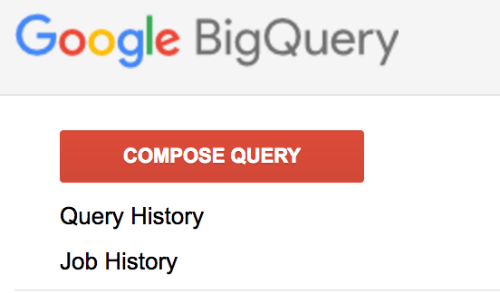

project_path: /web/tools/_project.yaml
book_path: /web/tools/_book.yaml

{# wf_updated_on: 2017-12-12 #}
{# wf_published_on: 2017-10-23 #}

# Chrome User Experience Report {: .page-title }

## Getting started {: #getting-started }

The Chrome User Experience Report is available to explore on 
[Google BigQuery](https://cloud.google.com/bigquery/), which is a part of the 
Google Cloud Platform (GCP). To get started, you'll need a Google account 
([sign up](https://accounts.google.com/SignUp)), a Google Cloud project that 
you will use to access the dataset, and basic knowledge of 
[SQL](https://cloud.google.com/bigquery/docs/reference/standard-sql/query-syntax#sql-syntax).

### Access the dataset {: #access-dataset }

The dataset is available at 
<https://bigquery.cloud.google.com/dataset/chrome-ux-report:all>. 
If you visit that page and get a prompt to create a project like the one below, 
continue with the following steps to create a new GCP project. Otherwise, 
you can skip to the next section and start querying the dataset.


<ol>
  <li>
    Navigate to 
    <a href="https://console.cloud.google.com/projectcreate">
      Google Cloud Platform
    </a>.
  </li>
  <li>Click <b>Create a Project</b>.</li>
  <li>
    Give your new project a name like “My Chrome UX Report” and click 
    <b>Create</b>.

    
  </li>
  <li>
    Provide your billing information if prompted — see 
    <a href="https://cloud.google.com/free/docs/frequently-asked-questions#why-credit-card">
      Why do I need to provide a credit card?
    </a>

Note: The Chrome User Experience Report is free to access and explore up to the 
limits of the 
<a href="https://cloud.google.com/bigquery/pricing#queries">free tier</a>, 
which is renewed monthly and provided by BigQuery. Additionally, new GCP users 
may be eligible for a 
<a href="https://cloud.google.com/free/docs/frequently-asked-questions#free-trial">signup credit</a> 
to cover expenses beyond the free tier.

  </li>
</ol>

Now you’re ready to start querying the dataset.

### Understanding the dataset schema {: #understanding-schema }

Refer to the 
[methodology documentation](/web/tools/chrome-user-experience-report/) for an 
overview of provided metrics, dimensions, and high-level overview of the schema. 
For a more hands-on view, now that you have the GCP project setup, navigate to 
<https://bigquery.cloud.google.com/table/chrome-ux-report:all.201710>.

The dataset is a collection of tables in the format `YYYYMM`. The schema for 
`201710` (October 2017) will be displayed, outlining the detailed structure of 
each row. 

### Query the dataset {: #query-dataset }

With access to the dataset, querying it is straightforward:

1. Navigate to [BigQuery](https://bigquery.cloud.google.com/dataset/chrome-ux-report:all).
1. Click **Compose Query** on top of the side panel.

1. Enter your query in the main panel.
1. Execute the query by clicking **Run Query**.

#### Example queries {: #example-queries }

Let’s start with a basic query to see if a particular origin is available in 
the dataset. Paste the query below into the query editor and click Run Query to 
execute it.


```sql
#standardSQL
SELECT DISTINCT origin
FROM `chrome-ux-report.all.201710`
WHERE origin LIKE '%://example.com'
```
[Run it on BigQuery](https://bigquery.cloud.google.com/savedquery/920398604589:00943c51adc044588842b2e8230d43ce)

Here’s how it works:

<table>
  <tr>
    <td><code>#standardSQL</code></td>
    <td>
      The first line is a directive that you want to use the 
      <a href="https://cloud.google.com/bigquery/docs/reference/standard-sql/">standard SQL</a> 
      syntax.
    </td>
  </tr>
  <tr>
    <td><code>SELECT</code></td>
    <td>The SELECT clause expresses the output of the query. In this example, 
    we’re looking for a list of origins which may be HTTP or HTTPS.</td>
  </tr>
  <tr>
    <td><code>FROM</code></td>
    <td>
      The FROM clause expresses the project, dataset, and table that you 
      want to query.
    </td>
  </tr>
  <tr>
    <td><code>WHERE</code></td>
    <td>
      Without the WHERE clause on Line 4, the example query would return all of 
      the distinct origins in the dataset. Since we’re only interested in a 
      particular origin, we can use the 
      <a href="https://cloud.google.com/bigquery/docs/reference/standard-sql/functions-and-operators#comparison-operators"><code>LIKE</code></a> 
      operator to compare each origin against a pattern. This query matches all 
      origins that end with “://example.com”. This is to account for a domain 
      that may support both HTTP and HTTPS.
    </td>
  </tr>
</table>

Once we know the origin we would like to examine more closely, we can dive 
deeper into the user experience data. Let’s write a query to visualize the 
distribution of the histogram.

```sql
#standardSQL
SELECT
  bin.start,
  SUM(bin.density) AS density
FROM (
  SELECT
    first_contentful_paint.histogram.bin AS bins
  FROM
    `chrome-ux-report.all.201710`
  WHERE
    origin = 'http://example.com')
CROSS JOIN
  UNNEST(bins) AS bin
GROUP BY
  bin.start
ORDER BY
  bin.start
```
[Run it on BigQuery](https://bigquery.cloud.google.com/savedquery/920398604589:bb17f33fa95348318e5c685551cbd93d)

The query above produces the data for the histogram by using the 
[`SUM`](https://cloud.google.com/bigquery/docs/reference/standard-sql/functions-and-operators#sum) 
function to add up the densities for each bin. This query also utilizes a 
nested query on Line 6 to select the first contentful paint 
([FCP](/web/fundamentals/glossary#FCP)) histogram’s bins and uses
[`UNNEST`](https://cloud.google.com/bigquery/docs/reference/standard-sql/query-syntax#unnest) 
on Line 13 to convert the bins from a single row of repeated bins into 
many rows of a single bin.

<table>
  <tr>
    <th>start</th>
    <th>density</th>
  </tr>
  <tr>
    <td>0</td>
    <td>20.85%</td>
  </tr>
  <tr>
    <td>200</td>
    <td>20.18%</td>
  </tr>
  <tr>
    <td>400</td>
    <td>16.54%</td>
  </tr>
  <tr>
    <td>600</td>
    <td>10.62%</td>
  </tr>
  <tr>
    <td>800</td>
    <td>7.18%</td>
  </tr>
  <tr>
    <td>1000</td>
    <td>4.83%</td>
  </tr>
  <tr>
    <td>1200</td>
    <td>3.46%</td>
  </tr>
  <tr>
    <td>1400</td>
    <td>3.21%</td>
  </tr>
  <tr>
    <td>1600</td>
    <td>2.51%</td>
  </tr>
  <tr>
    <td>…</td>
    <td>…</td>
  </tr>
</table>

Plug this data into your favorite visualization program and you’ll see a 
histogram similar to the one below.


Now that we have a way to look at the data, let’s write a couple of queries to 
compute additional summary metrics. For example, this histogram looks skewed 
towards the bins under 1000 ms, let’s compute the density sum for this range.

```sql
#standardSQL
SELECT
  SUM((
    SELECT
      SUM(bin.density)
    FROM
      UNNEST(first_contentful_paint.histogram.bin) bin
    WHERE
      bin.start < 1000
      AND origin = 'http://example.com')) AS density
FROM
  `chrome-ux-report.all.201710`
```
[Run it on BigQuery](https://bigquery.cloud.google.com/savedquery/920398604589:ed83e19409254d809cc82686c2ab26e1)

In the example above we’re adding all of the density values in the 
FCP histogram for “http://example.com” where the FCP bin’s start value is less 
than 1000 ms. The result is 0.7537, which indicates that ~75.4% of page loads 
experience the FCP in under a second.

We can go one step further and also segment the dataset via one of the provided 
dimensions. For example, we can use the 
[effective connection type dimension](#effective_connection_type) to understand 
how the above experience varies for users with different connection speeds.

```sql
#standardSQL
SELECT
  effective_connection_type.name AS ect,
  SUM((
    SELECT
      SUM(bin.density)
    FROM
      UNNEST(first_contentful_paint.histogram.bin) bin
    WHERE
      bin.end <= 1000
      AND origin = 'http://example.com')) AS density
FROM
  `chrome-ux-report.all.201710`
GROUP BY
  ect
ORDER BY
  density DESC

```
[Run it on BigQuery](https://bigquery.cloud.google.com/savedquery/226352634162:c5b7ee9ea0394728a821cf60f58737c2)

The result of this query shows the fraction of users that experience the FCP in 
under one second, split by effective connection type. On first glance, users on 
a 3G connection may have significantly worse performance, but it's important to 
remember that the resulting value is relative to the overall population; the 
reported value is also function of 3G population size, which may be lower — see 
[analysis tips & best practices](/web/tools/chrome-user-experience-report/#analysis_tips_best_practices) 
for more. If desired, we can normalize the value against the relative 
population size of each effective connection type.

Using these queries as a foundation, you’re ready to start mining the 
Chrome UX Report for insightful data. Should you need it, feel free to ask the 
<a href="https://groups.google.com/a/chromium.org/forum/#!forum/chrome-ux-report">discussion group</a> 
for help.
