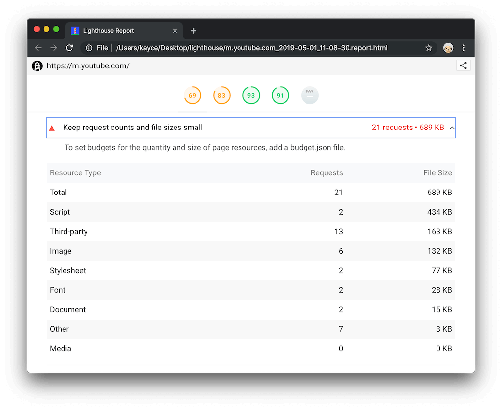
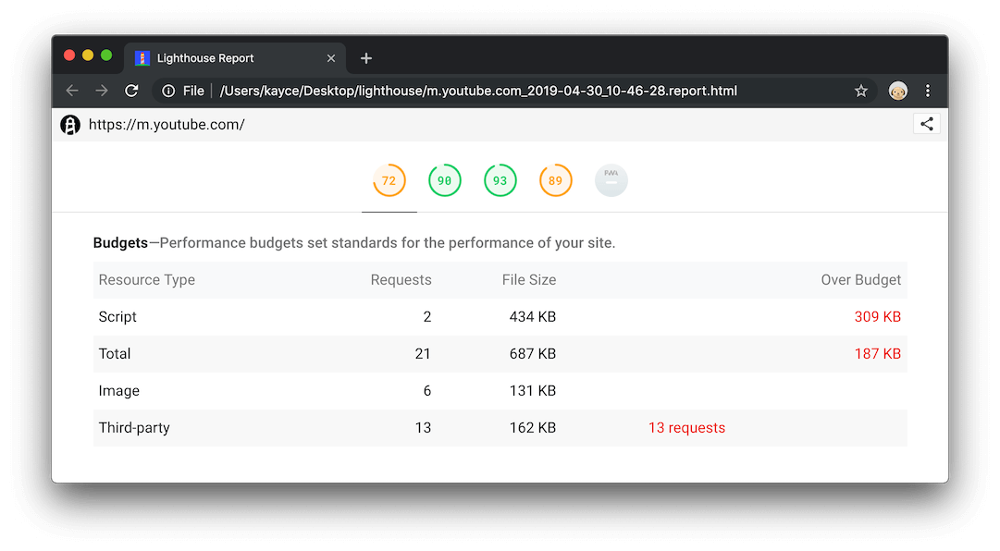

project_path: /web/tools/_project.yaml
description: Official documentation for the "Performance Budgets" and "Keep Request Counts Low And File Sizes Small" Lighthouse audits.
book_path: /web/tools/_book.yaml

{# wf_updated_on: 2019-05-06 #}
{# wf_published_on: 2019-05-06 #}
{# wf_blink_components: Platform>DevTools #}

# Performance Budgets (Keep Request Counts Low And File Sizes Small) {: .page-title }

## Overview {: #overview }

<aside class="note">
  The <b>Performance Budgets</b> and <b>Keep Request Counts And File Sizes Small</b> audits both
  link to this page.
</aside>

After putting in the hard work of improving your site performance, use a *performance budget* to prevent
your site performance from regressing over time.

The **Keep Request Counts Low And File Sizes Small** audit lists the total number of requests
and transfer size of scripts, images, and so on. This
audit is available in all Lighthouse runtime environments.

<figure>
  
  <figcaption>
    <b>Figure 1</b>. The <b>Keep Request Counts And File Sizes Small</b> audit.
  </figcaption>
</figure>

You can define a budget file to impose explicit limits on some or all of these resource types. After defining
your budget file the new **Over Budget** column tells you whether you're exceeding any of your self-defined limits.

<figure>
  
  <figcaption>
    <b>Figure 2</b>. A custom budget report.
  </figcaption>
</figure>

When you define a budget file, the **Performance Budgets** audit only reports on the resource types that you've specified.
But you can still access the information for the rest of the types from the **Keep Request Counts Low And File Sizes Small**
audit.

Example JSON output:

```json
"performance-budget": {
  "id": "performance-budget",
  "title": "Performance budget",
  "description": "Keep the quantity and size of network requests under the targets set by the provided performance budget. [Learn more](https://developers.google.com/web/tools/lighthouse/audits/budgets).",
  "score": null,
  "scoreDisplayMode": "informative",
  "details": {
    "type": "table",
    "headings": [
      {
        "key": "label",
        "itemType": "text",
        "text": "Resource Type"
      },
      {
        "key": "requestCount",
        "itemType": "numeric",
        "text": "Requests"
      },
      {
        "key": "size",
        "itemType": "bytes",
        "text": "Transfer Size"
      },
      {
        "key": "countOverBudget",
        "itemType": "text",
        "text": ""
      },
      {
        "key": "sizeOverBudget",
        "itemType": "bytes",
        "text": "Over Budget"
      }
    ],
    "items": [
      {
        "resourceType": "image",
        "label": "Image",
        "requestCount": 6,
        "size": 172522
      },
      {
        "resourceType": "script",
        "label": "Script",
        "requestCount": 2,
        "size": 446616
      },
      {
        "resourceType": "total",
        "label": "Total",
        "requestCount": 22,
        "size": 755199
      },
      {
        "resourceType": "third-party",
        "label": "Third-party",
        "requestCount": 13,
        "size": 207011,
        "countOverBudget": "3 requests"
      }
    ]
  }
},
```

See the following pages to learn more about performance budgets:

* [Start Performance Budgeting](https://addyosmani.com/blog/performance-budgets/){: .external }
* [Performance budgets 101](https://web.dev/performance-budgets-101/){: .external }
* [Your first performance budget](https://web.dev/your-first-performance-budget/){: .external }
* [Incorporate performance budgets into your build process](https://web.dev/incorporate-performance-budgets-into-your-build-tools/){: .external }

## Setup {: #setup }

Follow the instructions below to configure Lighthouse to report when you're over budget. As mentioned
before, this is only possible when running Lighthouse from the command line. The **Keep Request Counts Low
And File Sizes Small** audit is always available in all Lighthouse runtime environments and requires no configuration.

### Define a budget file {: #define }

By convention the budget file is usually called `budget.json` but you can call it whatever you like.
The example below sets the following budgets:

* 300 kilobytes for all scripts
* 100 kilobytes for all images
* 200 kilobytes for all third-party resources
* 1000 kilobytes total
* 10 network requests for third-party resources
* 50 network requests total

```json
[
  {
    "resourceSizes": [
      {
        "resourceType": "script",
        "budget": 300
      },
      {
        "resourceType": "image",
        "budget": 100
      },
      {
        "resourceType": "third-party",
        "budget": 200
      },
      {
        "resourceType": "total",
        "budget": 1000
      }
    ],
    "resourceCounts": [
      {
        "resourceType": "third-party",
        "budget": 10
      },
      {
        "resourceType": "total",
        "budget": 50
      }
    ]
  }
]
```

When you set a `resourceSizes` budget, you're specifying the maximum total transfer size for all
resources in that category. For example, in the code above there's a budget of 300 kilobytes for
`script` resources. If `main.js` is 200 kilobytes and `ads.js` is 150 kilobytes, you've exceeded
your budget.

The table below describes each of the `budget.json` properties.

<table>
  <tbody>
    <tr>
      <th>Name</th>
      <th>Type</th>
      <th>Valid Value(s)</th>
      <th>Description</th>
    </tr>
    <tr>
      <td><code>resourceSizes</code></td>
      <td>Array</td>
      <td>
        An array of objects. Each object must have a <code>resourceType</code> and <code>budget</code> property.
      </td>
      <td>
        The <code>budget</code> value specifies the total size limit in kilobytes for the category that's specified
        in <code>resourceType</code>.
      </td>
    </tr>
    <tr>
      <td><code>resourceCounts</code></td>
      <td>Array</td>
      <td>
        An array of objects. Each object must have a <code>resourceType</code> and <code>budget</code> property.
      </td>
      <td>
        The <code>budget</code> value specifies the total resource count limit for the category that's specified
        in <code>resourceType</code>.
      </td>
    </tr>
    <tr>
      <td><code>resourceType</code></td>
      <td>String</td>
      <td>
        <code>total</code>, <code>document</code>, <code>script</code>, <code>stylesheet</code>, <code>image</code>,
        <code>media</code>, <code>font</code>, <code>other</code>, or <code>third-party</code>.
      </td>
      <td>
        <code>total</code> measures all page resources. <code>document</code> measures HTML document requests.
        <code>other</code> includes any resource that does not match the other categories, including XHR or Fetch requests, 
        and data transfers over WebSocket connections. <code>third-party</code> measures all resources from third-party domains.
      </td>
    </tr>
    <tr>
      <td><code>budget</code></td>
      <td>Integer</td>
      <td>Any positive integer.</td>
      <td>
        Depending on context, the transfer size limit or resource count limit. 
      </td>
    </tr>
  </tbody>
</table>

### Pass the budget file as a flag {: #flags }

When running Lighthouse from the command line, pass the `--budget-path` (or `--budgetPath`) flag followed
by the path to your budget file in order to calculate whenever a category is over budget.

    lighthouse https://youtube.com --budget-path=budget.json

Pass the `--output=json` flag followed by `--output-path=report.json` to save your report results as JSON
in the current working directory.

    lighthouse https://youtube.com --budget-path=budget.json --output=json --output-path=report.json

If you were to assign your JSON report results to a variable named `report` you could access your
**Keep Request Counts And File Sizes Small** and **Performance Budgets** data from 
`report.audits['resource-summary']` and `report.audits['performance-budget']`, respectively.

## Recommendations {: #recommendations }

Explore the related audits and guides below to learn how to stay within your budget for each `resourceType`
category.

* `document`
    * [Uses An Excessive DOM Size](/web/tools/lighthouse/audits/dom-size)
    * [Enable Text Compression](/web/tools/lighthouse/audits/text-compression)
* `script`
    * [Reduce JavaScript payloads with code-splitting](https://web.dev/reduce-javascript-payloads-with-code-splitting/)
    * [Remove unused code](https://web.dev/remove-unused-code/)
    * [Minify and compress network payloads](https://web.dev/reduce-network-payloads-using-text-compression/)
    * [Enable Text Compression](/web/tools/lighthouse/audits/text-compression)
    * [JavaScript Bootup Time Is Too High](/web/tools/lighthouse/audits/bootup)
* `stylesheet`
    * [Defer non-critical CSS](https://web.dev/defer-non-critical-css/)
    * [Enable Text Compression](/web/tools/lighthouse/audits/text-compression)
    * [Minify CSS](/web/tools/lighthouse/audits/minify-css)
* `image`
    * [Use Imagemin to compress images](https://web.dev/use-imagemin-to-compress-images/)
    * [Replace animated GIFs with video](https://web.dev/replace-gifs-with-videos/)
    * [Use lazysizes to lazyload images](https://web.dev/use-lazysizes-to-lazyload-images/)
    * [Serve responsive images](https://web.dev/serve-responsive-images/)
    * [Serve images with correct dimensions](https://web.dev/serve-images-with-correct-dimensions/)
    * [Use WebP images](https://web.dev/serve-images-webp/)
    * [Optimize Images](/web/tools/lighthouse/audits/optimize-images)
* `media`
    * [Replace animated GIFs with video](https://web.dev/replace-gifs-with-videos/)

## More information {: #extra }

[src]: https://github.com/GoogleChrome/lighthouse/blob/master/lighthouse-core/audits/performance-budget.js

Sources:

* [Audit source][src]{: .external }

## Feedback {: #feedback }


