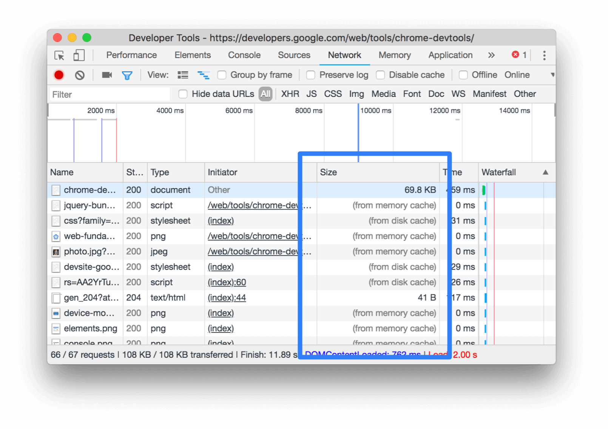
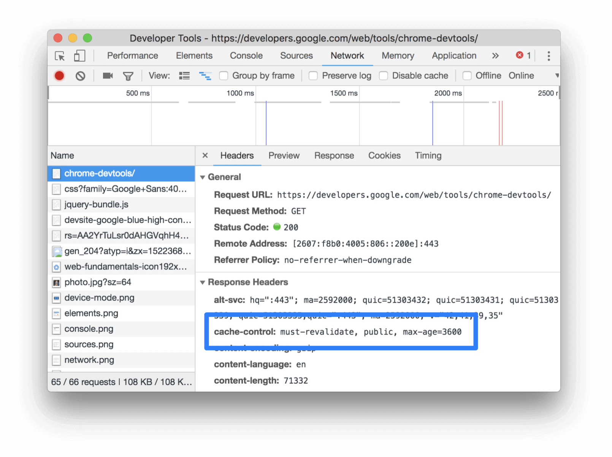

project_path: /web/tools/_project.yaml
book_path: /web/tools/_book.yaml
description: Reference documentation for the "Uses inefficient cache policy on static assets" Lighthouse audit.

{# wf_updated_on: 2018-07-23 #}
{# wf_published_on: 2018-03-29 #}
{# wf_blink_components: Platform>DevTools #}

# Uses inefficient cache policy on static assets  {: .page-title }

## Overview {: #overview }

HTTP caching can speed up your page load time on repeat visits.

When a browser requests a resource, the server providing the resource can tell the browser
how long it should temporarily store or "cache" the resource. For any subsequent request for that
resource, the browser uses its local copy, rather than going to the network to get it.

## Recommendations {: #recommendations }

Configure your server to return the `Cache-Control` HTTP response header.

     Cache-Control: max-age=86400

The `max-age` directive tells the browser how long it should cache the resource, in seconds.
`86400` corresponds to 1 day (60 seconds * 60 minutes * 24 hours).

There are many directives for customizing how the browser caches different resources. See the links
below for more guidance.

* [Defining optimal Cache-Control policy][Ilya]
* [Cache-Control specification][spec]{:.external}
* [Cache-Control (MDN)][MDN]{:.external}

[Ilya]: /web/fundamentals/performance/optimizing-content-efficiency/http-caching#defining_optimal_cache-control_policy
[spec]: https://www.w3.org/Protocols/rfc2616/rfc2616-sec14.html#sec14.9
[MDN]: https://developer.mozilla.org/en-US/docs/Web/HTTP/Headers/Cache-Control

Caution: Make sure to provide yourself a way to [invalidate and update
cached responses][Invalidate].

[Invalidate]: /web/fundamentals/performance/optimizing-content-efficiency/http-caching#invalidating_and_updating_cached_responses

The **Size** column in Chrome DevTools can help you verify that a resource has been cached.

<figure>
  
  <figcaption><b>Figure 1</b>. The <b>Size</b> column</figcaption>
</figure>

Chrome serves the most requested resources from the memory cache, which is very fast,
but is cleared when the browser is closed.

{# source: https://stackoverflow.com/a/48557278/1669860 #}

The **Headers** tab can help you verify a resource's `Cache-Control` header is set
as expected.

<figure>
  
  <figcaption>
    <b>Figure 2</b>. Inspecting the <code>Cache-Control</code> header via the <b>Headers</b> tab
  </figcaption>
</figure>

## More information {: #more-info }

Lighthouse considers a resource cache-able if:

* It's a font, image, media file, script, or stylesheet.
* It has a `200`, `203`, or `206` HTTP status code.
* It doesn't have an explicit no-cache policy.

Lighthouse then estimates how much network data you could have saved your users
if the resources had been cached. This estimate includes some calculations of
optimal cache duration for each resource, based on aggregate usage statistics reported
to Chrome. A longer duration is not necessarily better. Check out the audit source
for details. Ultimately, it's up to you to decide what the optimal cache duration is for
your resources.

Sources:

* [Audit source][src]{:.external}

[src]: https://github.com/GoogleChrome/lighthouse/blob/master/lighthouse-core/audits/byte-efficiency/uses-long-cache-ttl.js

## Feedback {: #feedback }


