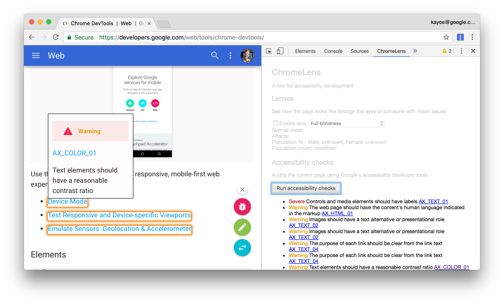

project_path: /web/_project.yaml
book_path: /web/tools/_book.yaml
description: Reference documentation for the "Background and Foreground Colors Have Sufficient Contrast Ratio" Lighthouse audit.

{# wf_updated_on: 2017-01-20 #}
{# wf_published_on: 2017-01-20 #}

# Background and Foreground Colors Have Sufficient Contrast Ratio  {: .page-title }

## Why the audit is important {: #why }

Some users with low vision have a difficult time sensing contrast. They don't
see many areas that are very bright or very dark. Everything looks about the
same brightness. If text doesn't have a high contrast ratio, these users
literally have trouble seeing it at all.

## How to pass the audit {: #how }

To find and fix each of element that does not have a sufficient contrast ratio:

1. Install [ChromeLens][CL].

1. Open DevTools.

1. Click the **ChromeLens** tab.

1. Click **Run Accessibility Checks**. ChromeLens outlines each element
   that fails a test.

1. Hover over the outlined elements to find the ones with insufficient
   contrast ratios.

     <figure>
       
         <b>Figure 1</b>: ChromeLens, after running accessibility checks. An
         element is being hovered over in order to view its issues.
       </figcaption>
     </figure>

1. Adjust the foreground or background color of the failing elements so that
   they have a contrast ratio of at least 4.5 to 1, which is the minimum
   recommended ratio. See [contrast ratio][CR] to calculate
   ratios.

[CL]: https://chrome.google.com/webstore/detail/chromelens/idikgljglpfilbhaboonnpnnincjhjkd
[CR]: http://leaverou.github.io/contrast-ratio/



This audit is powered by the aXe Accessibility Engine. See [Text elements
must have sufficient color contrast against the background][axe] for more
information.

[axe]: https://dequeuniversity.com/rules/axe/1.1/color-contrast


