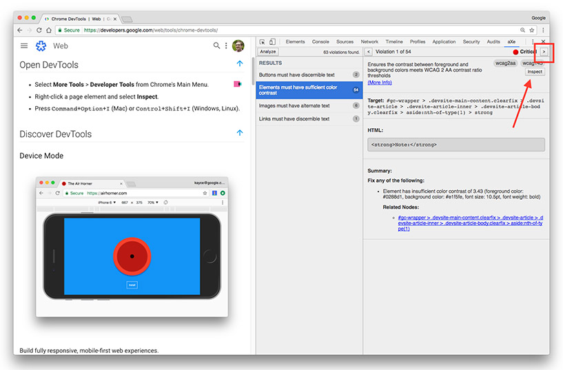

project_path: /web/tools/_project.yaml
book_path: /web/tools/_book.yaml
description: Reference documentation for the "Background and Foreground Colors Have Sufficient Contrast Ratio" Lighthouse audit.

{# wf_updated_on: 2017-07-24 #}
{# wf_published_on: 2017-01-20 #}

# Background and Foreground Colors Have Sufficient Contrast Ratio  {: .page-title }

## Why the audit is important {: #why }

Low-contrast text is difficult or impossible for many users to read.

See [Accessible Styles](/web/fundamentals/accessibility/accessible-styles) for more information.

## How to pass the audit {: #how }

To find and fix each of element that does not have a sufficient contrast ratio:

1. Install [aXe][AE].

1. Open DevTools.

1. Click the **aXe** tab.

1. Click **Analyze**. aXe generates a report highlighting any accessibility
   issues.

1. In the **Results** column, click on the field that says "Elements must have
   sufficient color contrast."

1. Click the **Inspect** button to locate the element in the DevTools. Click the
   next button to see more failing elements.

     <figure>
       
         <b>Figure 1</b>: aXe, showing contrast ratio results. The next button
         (which is easy to overlook) is highlighted by a red rectangle. The
         inspect button is indicated by a red arrow.
       </figcaption>
     </figure>

1. Adjust the foreground or background color of the failing elements so that
   they have a contrast ratio of at least 4.5 to 1, which is the minimum
   recommended ratio. See [contrast ratio][CR] to calculate
   ratios.

[AE]: https://chrome.google.com/webstore/detail/axe/lhdoppojpmngadmnindnejefpokejbdd?hl=en-US
[CR]: http://leaverou.github.io/contrast-ratio/



This audit is powered by the aXe Accessibility Engine. See [Text elements
must have sufficient color contrast against the background][axe] for more
information.

[axe]: https://dequeuniversity.com/rules/axe/1.1/color-contrast


