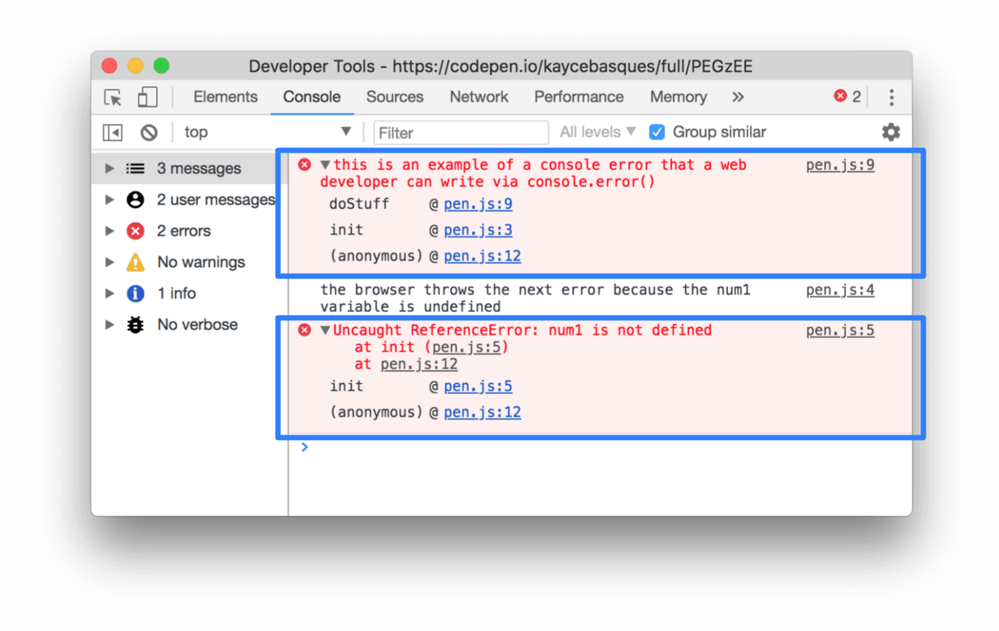

project_path: /web/tools/_project.yaml
book_path: /web/tools/_book.yaml
description: Reference documentation for the "Browser Errors Were Logged To The Console" Lighthouse audit.

{# wf_updated_on: 2017-12-21 #}
{# wf_published_on: 2017-12-21 #}
{# wf_blink_components: N/A #}

# Browser Errors Were Logged To The Console  {: .page-title }

## Overview {: #overview }

Most browsers ship with built-in developer tools. These developer tools usually include a
console. The console gives you information about a page while that page is running. Ultimately,
the messages you see in the console either come from the web developers who built the page,
or the browser itself. When someone logs a message to the console, they can
indicate the importance, or "severity level" of the message. An "error" message is an
important message representing an unresolved failure in the page. In other words,
when you see an error, the page isn't running as intended.

<figure>
  
  <figcaption><b>Figure 1</b>. An example of console errors in Chrome DevTools</figcaption>
</figure>

**Figure 1** shows two errors. The top one comes from a web developer, via a call to
[`console.error()`][error]. The bottom one comes from the browser, which indicates that a
variable used in one of the page's scripts does not exist.

[error]: /web/tools/chrome-devtools/console/console-reference#error

## Recommendations {: #recommendations }

Fix each of the errors that Lighthouse reports to ensure that your page runs as expected for
all of your users. If the cause of the error is not clear to you, copy the error text and
paste it into a search engine. If you can't find solutions to your problem, try asking a
question on [Stack Overflow][SO]{:.external}.

[SO]: https://stackoverflow.com

Chrome DevTools can help you track down the cause of the errors. Take the top error in
**Figure 1** for example. Clicking the `pen.js:9` link in the top-right of that error
shows you the code that caused that error. Below the text `this is an example of a console
error...` there is the [call stack][cs]{:.external} that caused the problematic code to
execute. The bottom function `(anonymous)` called the `init` function, which called the
`doStuff` function. Open the Chrome DevTools **Console** by pressing
<kbd>Command</kbd>+<kbd>Option</kbd>+<kbd>J</kbd> (Mac) or
<kbd>Control</kbd>+<kbd>Shift</kbd>+<kbd>J</kbd> (Windows, Linux). See [Using The
Console](/web/tools/chrome-devtools/console/) to learn more.

[cs]: https://en.wikipedia.org/wiki/Call_stack

If you can't fix the errors, at least consider wrapping them in
[`try...catch`][catch]{:.external} statements to explicitly indicate in the code that you're
aware of the issue. You can also use the `catch` block to handle the error situation more
gracefully.

[catch]: https://developer.mozilla.org/en-US/docs/Web/JavaScript/Reference/Statements/try...catch

## More information {: #more-info }

[Audit source][src]{:.external}

[src]: https://github.com/GoogleChrome/lighthouse/blob/master/lighthouse-core/audits/errors-in-console.js
