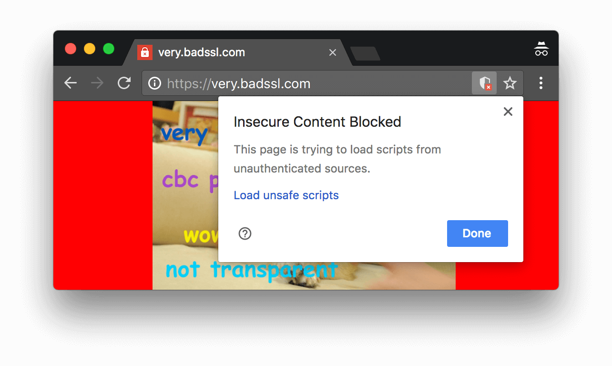
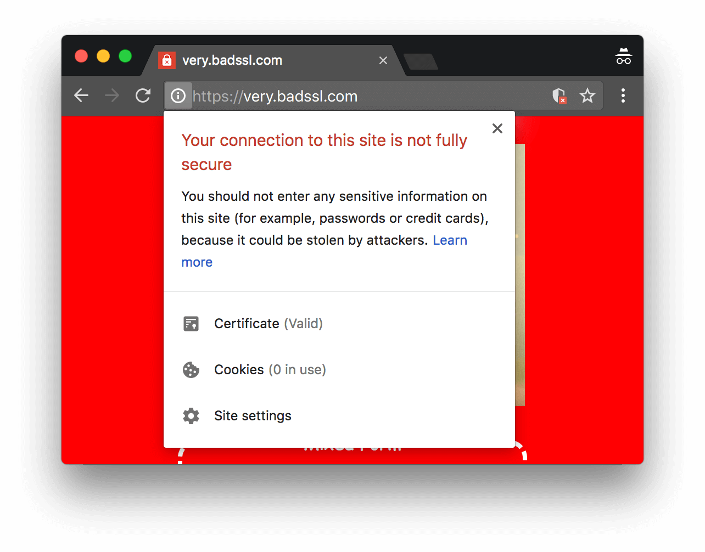

project_path: /web/tools/_project.yaml
book_path: /web/tools/_book.yaml
description: Reference documentation for the "Some Insecure Resources Can Be Upgraded To HTTPS" Lighthouse audit.

{# wf_updated_on: 2018-02-08 #}
{# wf_published_on: 2018-02-06 #}
{# wf_blink_components: Platform>DevTools #}

# Some Insecure Resources Can Be Upgraded To HTTPS  {: .page-title }

## Overview {: #overview }

When a secure (HTTPS) site requests an insecure (HTTP) resource, that is called a [mixed
content][MC] error. Some browsers block insecure resource requests by default. If your page
depends on these insecure resources, then your page might not work properly when they get blocked.

[MC]: /web/fundamentals/security/prevent-mixed-content/what-is-mixed-content

<figure>
  
  <figcaption>
    <b>Figure 1</b>. Google Chrome (version 66) blocking insecure content
  </figcaption>
</figure>

Also, browsers may warn users that your page is not fully secure.

<figure>
  
  <figcaption>
    <b>Figure 2</b>. Google Chrome (version 66) reporting that a page is not fully secure
  </figcaption>
</figure>

## How to use this audit {: #how-to-use }

This audit is not run by default in Lighthouse, and currently requires that you
have [Chrome Canary][CC] installed. To use it, you will need to run the
Lighthouse command-line tool. You can install Lighthouse using [npm][NPM]:

    npm install -g lighthouse

To run the audit, you can use the included `--mixed-content` flag:

    lighthouse --mixed-content http://www.example.com

This will create a new HTML report file in your current working directory.

[CC]: https://www.google.com/chrome/browser/canary.html
[NPM]: https://www.npmjs.com/get-npm

## Recommendations {: #recommendations }

For each URL that Lighthouse lists, modify your code to request that URL over HTTPS:

    https://example.com

Rather than HTTP:

    http://example.com

Even if you are not ready to fully upgrade your site to HTTPS yet, upgrading some URLS to
HTTPS can increase the security of your users and make it easier for you to avoid mixed
content warnings when you do upgrade to HTTPS in the future. See [Uses HTTPS][https] for
recommendations on how to upgrade your site to HTTPS.

Insecure resources which are not upgradeable to HTTPS may require other changes. Contact the
providers of these resources to explore your options.

[https]: /web/tools/lighthouse/audits/https#recommendations

## More information {: #more-info }

Lighthouse loads the page once to record the URL of each resource requested. Then, Lighthouse
loads the page again, but this time intercepts each request and tries to upgrade the URL to
use HTTPS. If the upgraded requests succeed, Lighthouse reports that request as upgradeable in
the audit results.

[Audit source][src]{:.external}

[src]: https://github.com/GoogleChrome/lighthouse/blob/master/lighthouse-core/audits/mixed-content.js
