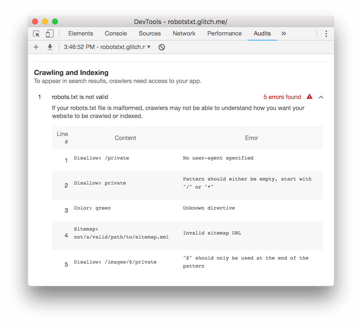

project_path: /web/tools/_project.yaml
book_path: /web/tools/_book.yaml
description: Reference documentation for the "robots.txt is not valid" Lighthouse audit.

{# wf_updated_on: 2018-07-23 #}
{# wf_published_on: 2018-07-23 #}
{# wf_blink_components: Platform>DevTools #}

# robots.txt is not valid  {: .page-title }

## Overview {: #overview }

The `robots.txt` file tells search engines what pages of your site they can crawl. An
invalid `robots.txt` may prevent search engines from crawling your site the way that you
intended them to, which could potentially cause your pages to show up less in search results.

## Recommendations {: #recommendations }

Mention that it applies to the entire site, whereas most audits only apply to the page.

Expand the **robots.txt is not valid** audit in your report to learn why your `robots.txt` file is
invalid.

<figure>
  
  <figcaption>
    <b>Figure X</b>. TODO
  </figcaption>
</figure>

* `No user-agent specified`.
* `Pattern should either be empty, start with "/" or "*"`
* `Unknown directive`. 
* `Invalid sitemap URL`.
* `"$" should only be used at the end of the pattern`.

## More information {: #more-info }

Does not ensure that your robots.txt is in the correct location.

Sources:

* [Audit source][src]{:.external}
* [Create a robots.txt file](https://support.google.com/webmasters/answer/6062596){:.external}
* [Robots.txt](https://moz.com/learn/seo/robotstxt){:.external}

[src]: https://github.com/GoogleChrome/lighthouse/blob/master/lighthouse-core/audits/seo/robots-txt.js

## Feedback {: #feedback }


