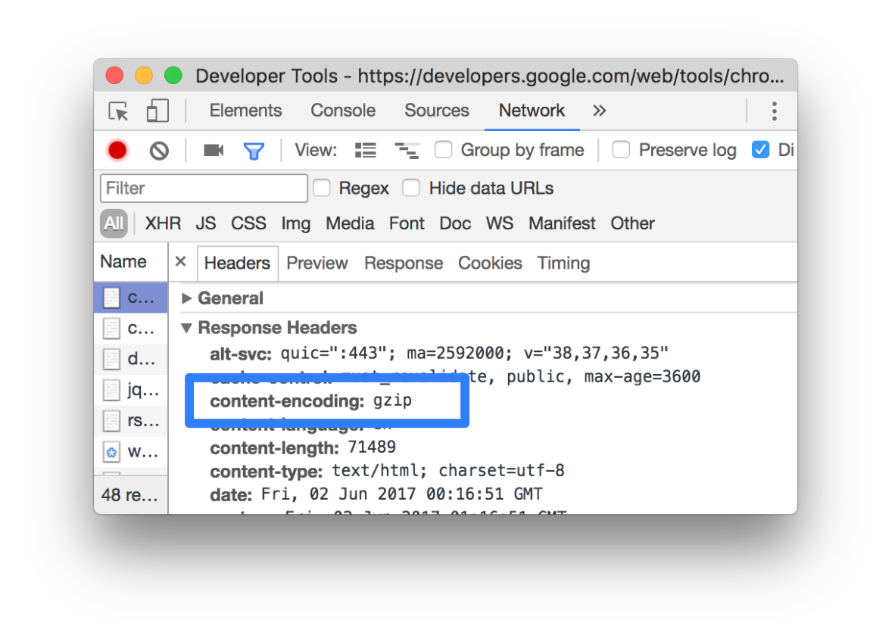

project_path: /web/tools/_project.yaml
book_path: /web/tools/_book.yaml
description: Reference documentation for the "Enable Text Compression" Lighthouse audit.

{# wf_updated_on: 2017-07-24 #}
{# wf_published_on: 2017-06-12 #}

# Enable Text Compression  {: .page-title }

## Why the audit is important {: #why }

Text compression minimizes the byte size of network responses that include text
content. Less bytes downloaded means faster page loads.

## How to pass the audit {: #how }

Lighthouse lists each response that was sent without text compression. Enable
text compression on the server(s) that served these responses in order to
pass this audit.

Note: The potential savings that Lighthouse lists are the potential savings
when the response is encoded with GZIP. If Brotli is used, even more savings
are possible.

### How browsers and servers negotiate text compression

When a browser requests a resource, it lists what text compression
encodings it supports in the `accept-encoding` request header. All modern
browsers do this. The server encodes the response in one of the formats that
the browser supports and indicates which format it used in the
`content-encoding` response header.

See [Optimizing Encoding and Transfer Size of Text-Based Assets][Ilya] to
learn more.

[Ilya]: /web/fundamentals/performance/optimizing-content-efficiency/optimize-encoding-and-transfer

### How to enable text compression on your server

Configure your server to compress the response with [Brotli][B], if the browser
supports it. Brotli is a newer compression format, but it's not universally
supported in browsers. Do a search for "how to enable Brotli compression in
`<server>`" to learn how to implement it, where `<server>` is the name of
your server.

[B]: https://opensource.googleblog.com/2015/09/introducing-brotli-new-compression.html

Use GZIP as a fallback to Brotli. GZIP is universally supported in all
modern browsers, but is less efficient than Brotli. See [Server Configs][SG]
for examples.

[SG]: https://github.com/h5bp/server-configs

### Check if a response was compressed in Chrome DevTools

To check if a server compressed a response:

1. Go to the **Network** panel in DevTools.
1. Click the request that caused the response you're interested in.
1. Click the **Headers** tab.
1. Check the `content-heading` header in the **Response Headers** section.

<figure>
  
  <figcaption>
    <b>Figure X</b>: The <code>content-encoding</code> response header
  </figcaption>
</figure>

To compare the compressed and de-compressed sizes of a response:

1. Go to the **Network** panel.
1. Enable large request rows. See [Use large request rows][lg].
1. Look at the **Size** column for the response you're interested in. The
   top value is the compressed size. The bottom value is the de-compressed
   size.

[lg]: /web/tools/chrome-devtools/network-performance/reference#request-rows



Lighthouse gathers all responses that:

* Have text-based resource types.
* Do not include a `content-encoding` header set to `br`, `gzip`, or
  `deflate`.

Lighthouse then compresses each of these with GZIP to compute the potential
savings.

Note: If the original size of a response is less than 1.4KB, or if the 
potential compression savings is less than 10% of the original size, then
Lighthouse does not flag that response in the results.

## Feedback {: #feedback }





