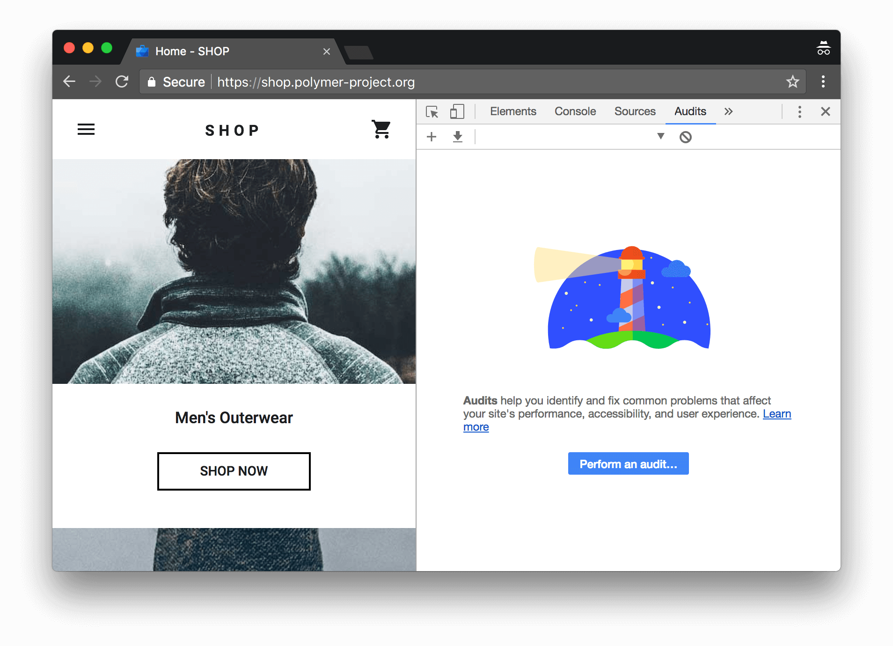
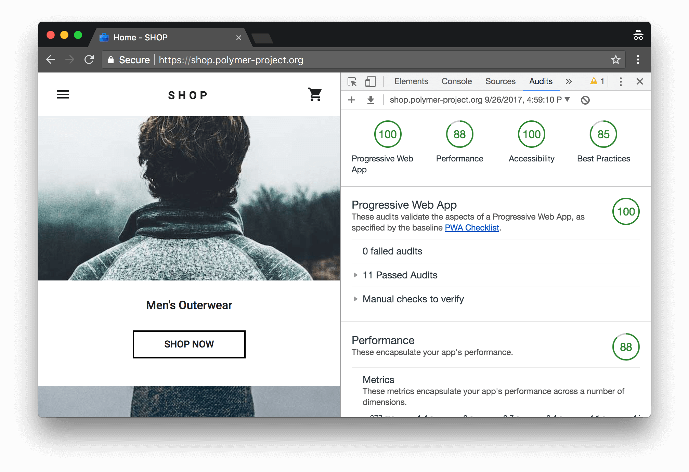
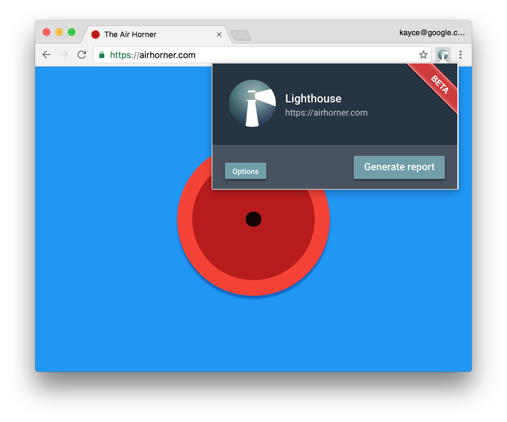
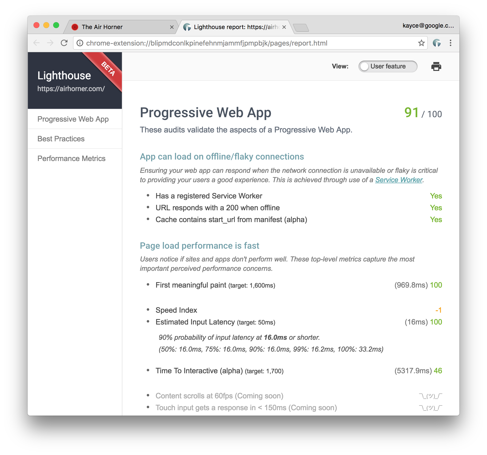
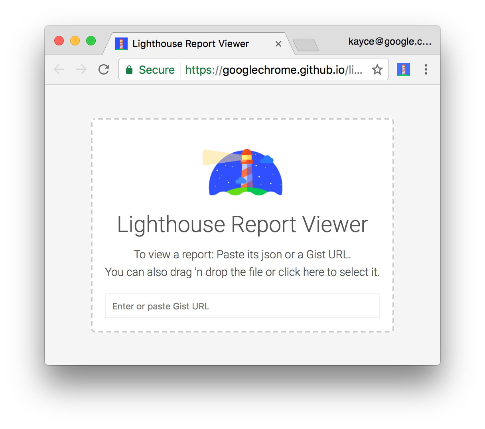

project_path: /web/tools/_project.yaml
book_path: /web/tools/_book.yaml
description: Learn how to set up Lighthouse to audit your web apps.

{# wf_updated_on: 2017-09-26 #}
{# wf_published_on: 2016-09-27 #}



# Lighthouse {: .page-title }

Lighthouse is an [open-source](https://github.com/GoogleChrome/lighthouse),
automated tool for improving the quality of web pages. You can run it against
any web page, public or requiring authentication. It has audits for performance,
accessibility, progressive web apps, and more.

You can run Lighthouse in Chrome DevTools, from the command line, or as a
Node module. You give Lighthouse a URL to audit, it runs a series of audits
against the page, and then it generates a report on how well the page did.
From there, use the failing audits as indicators on how to improve the page.
Each audit has a reference doc explaining why the audit is important, as
well as how to fix it.

  <a class="button button-primary lighthouse-primary-call-to-action gc-analytics-event"
     data-category="Lighthouse" data-action="click"
     data-label="Home / Run Lighthouse In DevTools"
     href="#devtools"
     title="Run Lighthouse in Chrome DevTools">
    Run Lighthouse In Chrome DevTools
  </a>
  <a class="button button-primary gc-analytics-event"
     data-category="Lighthouse" data-action="click"
     data-label="Home / File Bug"
     href="https://github.com/GoogleChrome/lighthouse/issues/new"
     title="File an issue or feature request" target="_blank">
    bug_report
    File an issue
  </a>

Check out the video below from Google I/O 2017 to learn more about how to use
and contribute to Lighthouse.

  <iframe class="devsite-embedded-youtube-video" data-video-id="NoRYn6gOtVo"
          data-autohide="1" data-showinfo="0" frameborder="0" allowfullscreen>
  </iframe>

## Get started {: #get-started }

Choose the Lighthouse workflow that suits you best:

* [In Chrome DevTools](#devtools). Easily audit pages that require authentication,
  and read your reports in a user-friendly format.
* [From the command line](#cli). Automate your Lighthouse runs via shell scripts.
* [As a Node module](#programmatic). Integrate Lighthouse into your continuous
  integration systems.

Note: Every Lighthouse workflow requires you to have an instance of Google Chrome
installed on your machine.

### Run Lighthouse in Chrome DevTools {: #devtools }

Lighthouse now powers the **Audits** panel of Chrome DevTools. To run a report:

1. Download [Google Chrome for Desktop][desktop].
1. In Google Chrome, go to the URL you want to audit. You can audit any URL on the web.
1. [Open Chrome DevTools](/web/tools/chrome-devtools/#open).
1. Click the **Audits** tab.

     <figure>
       
       <figcaption>
         <b>Figure 1</b>. To the left is the viewport of the page that will be
         audited. To the right is the <b>Audits</b> panel of Chrome DevTools, which
         is now powered by Lighthouse
       </figcaption>
     </figure>

1. Click **Perform an audit**. DevTools shows you a list of audit categories.
   Leave them all enabled.
1. Click **Run audit**. After 60 to 90 seconds, Lighthouse gives you a report
   on the page.

     <figure>
       
       <figcaption>
         <b>Figure 2</b>. A Lighthouse report in Chrome DevTools
       </figcaption>
     </figure>

### Install and run the Node command line tool {: #cli }

To install the Node module:

1. Download [Google Chrome for Desktop][desktop].
1. Install the current [Long-Term Support](https://github.com/nodejs/LTS)
   version of [Node](https://nodejs.org).
1. Install Lighthouse. The `-g` flag installs it as a global module.

        npm install -g lighthouse

To run an audit:

    lighthouse <url>

To see audit options:

    lighthouse --help

#### Run the Node module programmatically {: #programmatic }

See [Using programmatically][programmatic] for an example of running Lighthouse
programmatically, as a Node module.

[programmatic]: https://github.com/GoogleChrome/lighthouse/blob/master/docs/readme.md#using-programmatically

### Run Lighthouse as a Chrome Extension {: #extension }

Note: Unless you have a specific reason, you should use the Chrome DevTools workflow
rather than this Chrome Extension workflow. The DevTools workflow provides
the same benefits as the Extension workflow, with the added bonus of no installation
needed.

To install the extension:

1. Download [Google Chrome for Desktop][desktop].

1. Install the <a class="gc-analytics-event" data-category="Lighthouse"
   data-label="Home / Install Extension (Secondary CTA)" href="https://chrome.google.com/webstore/detail/lighthouse/blipmdconlkpinefehnmjammfjpmpbjk"
   title="Install Lighthouse Chrome Extension" target="_blank">Lighthouse
   Chrome Extension</a> from the Chrome Webstore.

[desktop]: https://www.google.com/chrome/browser/desktop/

To run an audit:

1. In Chrome, go to the page you want to audit.

1. Click **Lighthouse** ![Lighthouse][icon]{:.lighthouse-inline}. It should
   be next to the Chrome address bar. If not, open Chrome's main menu and
   access it at the top of the menu. After clicking, the Lighthouse
   menu expands.

     <figure>
       
       <figcaption>
         <b>Figure 3</b>. The Lighthouse menu
       </figcaption>
     </figure>

[icon]: images/lighthouse-icon-16.png

1. Click **Generate report**. Lighthouse runs its audits against the
   currently-focused page, then opens up a new tab with a report of the
   results.

     <figure>
       
       <figcaption>
         <b>Figure 4</b>. A Lighthouse report
       </figcaption>
     </figure>

## Share and view reports online {: #report-viewer }

Use the [Lighthouse Viewer][viewer] to view and share reports online.

<figure>
  
  <figcaption>
    <b>Figure 5</b>. The Lighthouse Viewer
  </figcaption>
</figure>

[viewer]: https://googlechrome.github.io/lighthouse/viewer/

### Share reports as JSON {: #json }

The Lighthouse Viewer needs the JSON output of a Lighthouse report. The
list below explains how to get the JSON output, depending on what
Lighthouse workflow you're using:

* **Chrome DevTools**. Click **Download Report** {:.cdt-inl}.
* **Command line**. Run:

    `lighthouse --output json --output-path <path/for/output.json>`

* **Chrome Extension**. Click **Export** > **Save as JSON**.

To view the report data:

1. Open the [Lighthouse Viewer][viewer] in Google Chrome.
1. Drag the JSON file onto the viewer, or click anywhere on the Viewer to
   open your file navigator and select the file.

### Share reports as GitHub Gists {: #gists }

If you don't want to manually pass around JSON files, you can also share your
reports as secret GitHub Gists. One benefit of Gists is free version control.

To export a report as a Gist from the Chrome Extension version of
Lighthouse:

1. Click **Export** > **Open In Viewer**. The report opens in the
   Viewer, located at `https://googlechrome.github.io/lighthouse/viewer/`.
1. In the Viewer, click **Share** ![Share][share]{: .lighthouse-inline}. The
   first time you do this, a popup asks permission to access your basic
   GitHub data, and to read and write to your Gists.

To export a report as a Gist from the CLI version of Lighthouse,
just manually create a Gist and copy-paste the report's JSON output
into the Gist. The Gist filename containing the JSON output must end in
`.lighthouse.report.json`. See [Share reports as JSON](#json) for an example of
how to generate JSON output from the command line tool.

To view a report that's been saved as a Gist:

* Add `?gist=<ID>` to the Viewer's URL, where `<ID>` is the ID of the Gist.

    `https://googlechrome.github.io/lighthouse/viewer/?gist=<ID>`

* Open the [Viewer][viewer], and paste the URL of a Gist into it.

[share]: images/share.png

## Contribute to Lighthouse {: #contribute }

Lighthouse is open source and [contributions are welcome](https://github.com/GoogleChrome/lighthouse/blob/master/CONTRIBUTING.md).
Check out the repository's [issue tracker](https://github.com/GoogleChrome/lighthouse/issues)
to find bugs that you can fix, or audits that you can create or improve upon.
The issues tracker is also a good place to discuss audit metrics, ideas for
new audits, or anything else related to Lighthouse.

[example]: https://github.com/justinribeiro/lighthouse-mocha-example/blob/master/test/lighthouse-tests.js
