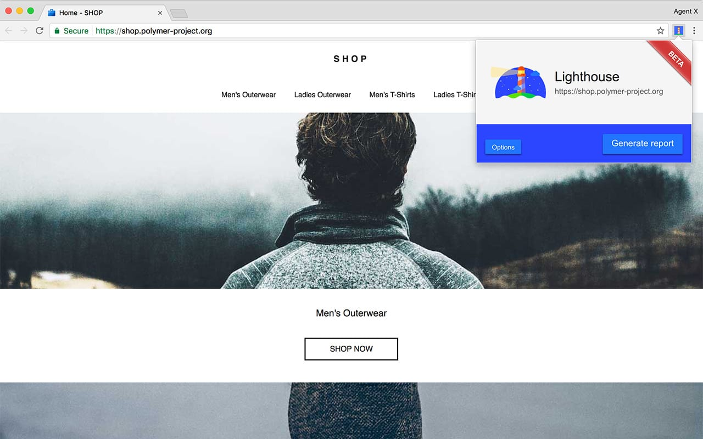
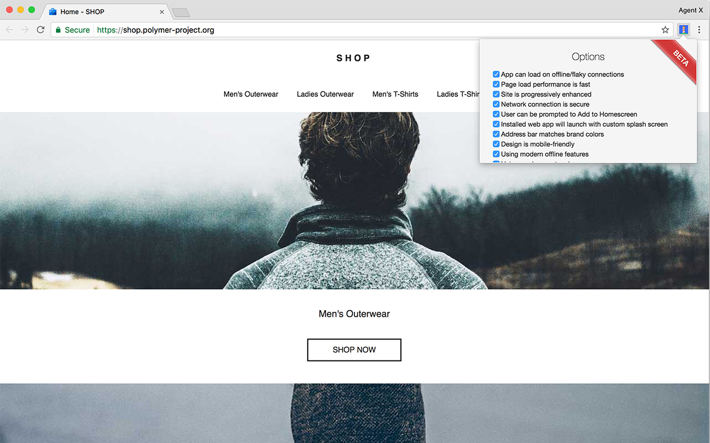
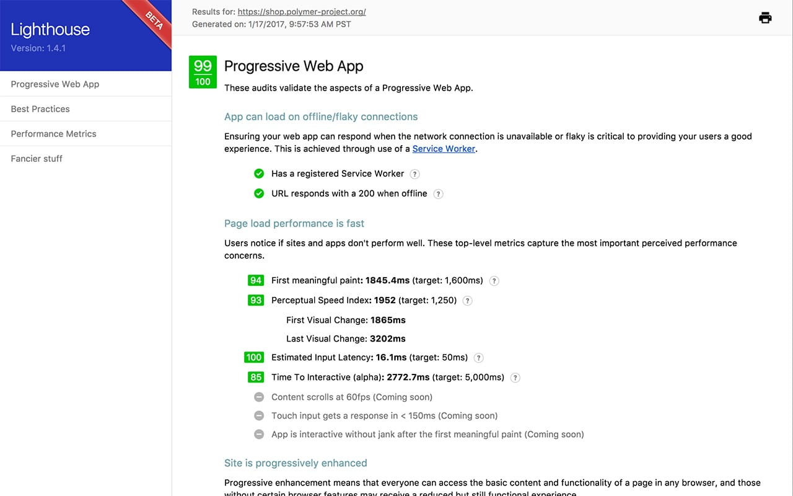
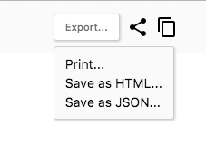

project_path: /web/_project.yaml
book_path: /web/tools/_book.yaml
description: Learn how to set up Lighthouse to audit and improve your web apps.

{# wf_updated_on: 2017-01-18 #}
{# wf_published_on: 2016-09-27 #}

# Lighthouse {: .page-title }

[Lighthouse](/web/tools/lighthouse/) is an
[open-source](https://github.com/GoogleChrome/lighthouse),
automated tool for improving the quality of your web apps.

Lighthouse can be run as a Chrome Extension, from the command line, or used
programmatically as a Node module. You give Lighthouse a URL that you
want to audit, it runs a barrage of tests against the page, and then it
generates a report on how well the page did. From here you can use the
failing tests as indicators on what you can do to improve your app.

  <a class="button button-primary lighthouse-install devsite-crx-install gc-analytics-event"
     data-category="lighthouse" data-action="install" data-label="blipmdconlkpinefehnmjammfjpmpbjk"
     href="https://chrome.google.com/webstore/detail/blipmdconlkpinefehnmjammfjpmpbjk"
     title="Install Lighthouse Chrome Extension" target="_blank">
    file_download
    Install Lighthouse
  </a>
  <a class="button button-primary gc-analytics-event"
     data-category="ligthhouse" data-action="bug"
     href="https://github.com/GoogleChrome/lighthouse/issues/new"
     title="File an issue or feature request" target="_blank">
    bug_report
    File an issue
  </a>

Note: Lighthouse currently has a large focus on Progressive Web App features,
such as [Add to Homescreen](/web/fundamentals/engage-and-retain/app-install-banners/)
and offline support. However, the overarching goal of the project is to provide
an end-to-end audit of all aspects of web app quality.

## Setting up Lighthouse

There are two primary ways to run Lighthouse, as a Chrome Extension, or as a command
line tool. The Chrome Extension provides a more user-friendly interface for
reading reports. The command line tool enables you to integrate Lighthouse into
continuous integration systems.

### Install the Chrome Extension

To install the extension, do the following:

1. Download Google Chrome 54 or later.
- Install the <a class="gc-analytics-event"
     data-category="crx-install" data-label="lighthouse-install-button"
     href="https://chrome.google.com/webstore/detail/lighthouse/blipmdconlkpinefehnmjammfjpmpbjk"
     title="Install Lighthouse Chrome Extension" target="_blank">
    file_download
    Lighthouse Chrome Extension</a> from the Chrome Webstore.

### Install the Node Command line tool

To install the Node module, do the following:

1. Install [Node](https://nodejs.org), version 5 or greater.
- Install Lighthouse as a global module:

        npm install -g lighthouse

Then, run Lighthouse against a URL to audit the page:

    lighthouse https://airhorner.com/

Pass the `--help` flag to see available options.

    lighthouse --help

Note: Lighthouse can also be used programmatically as a Node module. See
[this example][example] for how call Lighthouse to create custom reports, run
your own audits, and integrate with Mocha testing.

## Get started

### Chrome Extension

Go to the page that you want to audit.

Click on the Lighthouse icon ()in the Chrome toolbar. You should see a menu.

If you want to only run a subset of the audits, click the **Options** button
and disable the audits that you don't care about. Scroll down and press **OK**
to confirm your changes.

Click the **Generate report** button to run Lighthouse's tests against the
currently-open page.

When the audits are finished, Lighthouse opens up a new tab and displays a
report on the page's results.

## Online Report Viewer

The [Lighthouse Viewer](https://googlechrome.github.io/lighthouse/viewer/) is
a useful way for viewing and sharing reports, online.

There are several ways to view a report:

1. When viewing the HTML version of a report, click the "Export" button
in the top right corner of the report and choose "Open in Viewer".
2.  Drag and drop the JSON output of a Lighthouse run onto the app or click to
upload a report file. If you're a CLI user, run Lighthouse with the `--output=json` flag to
generate a json file that can be opened in the Viewer.
3. Add the `?gist=GISTID"` parameter to the URL of the Viewer.
4. Paste the URL of a [Github gist](https://gist.github.com/) that contains a Lighthouse json report onto the app.

{: .attempt-right}

The Viewer also lets you share reports with others. Reports can be shared
by clicking the share icon in the top right corner and signing in to Github.
Reports are stashed as secret gists in your account so you can easily delete or
update the report later on. Using Github for data storage also means free
version control.

## Contributing

Lighthouse is open source and [contributions are welcome](https://github.com/GoogleChrome/lighthouse/blob/master/CONTRIBUTING.md). Check out the
repository's [issues tracker](https://github.com/GoogleChrome/lighthouse/issues)
to find bugs that you can fix, or audits that you can create or improve upon.
The issues tracker is also a good place to discuss audit metrics, ideas for
new audits, or anything else related to Lighthouse.

[example]: https://github.com/justinribeiro/lighthouse-mocha-example/blob/master/test/lighthouse-tests.js
