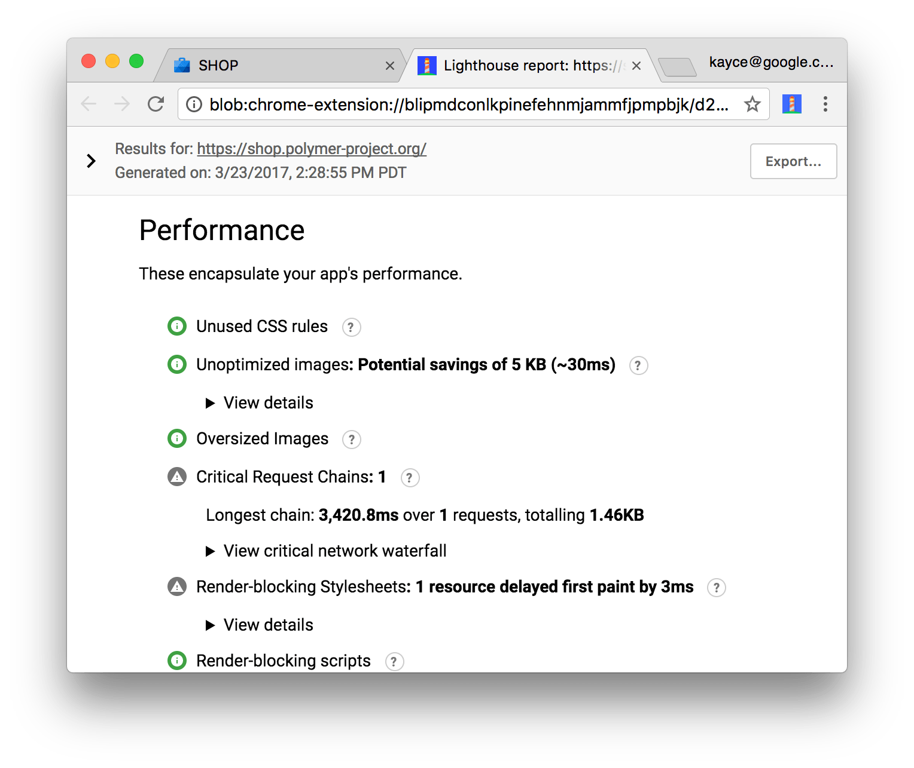

project_path: /web/_project.yaml
book_path: /web/tools/_book.yaml
description: Learn how to set up Lighthouse to audit your web apps.

{# wf_updated_on: 2016-09-27 #}
{# wf_published_on: 2016-09-27 #}

# Audit Web Apps With Lighthouse {: .page-title }

[Lighthouse](https://github.com/GoogleChrome/lighthouse) is an open-source,
automated tool for improving the quality of your web apps. You can run it as a
Chrome Extension or from the command line. You give Lighthouse a URL that you
want to audit, it runs a barrage of tests against the page, and then it
generates a report on how well the page did. From here you can use the
failing tests as indicators on what you can do to improve your app.

Note: Lighthouse currently has a large focus on Progressive Web App features, such as Add to Homescreen and offline support. However, the overarching goal of the project is to provide an end-to-end audit of all aspects of web app quality.

## Get started

There are two ways to run Lighthouse, as a Chrome Extension, or as a command
line tool. The Chrome Extension provides a more user-friendly interface for
reading reports. The command line tool enables you to integrate Lighthouse into
continuous integration systems.

### Chrome Extensions

Download Google Chrome 52 or later.

Install the [Lighthouse Chrome Extension](https://chrome.google.com/webstore/detail/lighthouse/blipmdconlkpinefehnmjammfjpmpbjk).

Go to the page that you want to audit.

Click on the Lighthouse icon () that is on the Chrome toolbar.

If you don't see the icon on your toolbar, it may be hidden in Chrome's
main menu.

After clicking on the icon, you should see a menu.

If you want to only run a subset of the audits, click the **Options** button
and disable the audits that you don't care about. Scroll down and press **OK**
to confirm your changes.

Click the **Generate report** button to run Lighthouse's tests against the
currently-open page.

When the audits are finished, Lighthouse opens up a new tab and displays a
report on the page's results.

### Command line tool

Install [Node](https://nodejs.org), version 5 or greater.

Install Lighthouse as a global Node module.

    npm install -g lighthouse

Run a Lighthouse audit against a page.

    lighthouse https://airhorner.com/

Pass the `--help` flag to see available input and output options.

    lighthouse --help

## Contribute

Lighthouse is open source and contributions are welcome. Check out the
repository's [issues tracker](https://github.com/GoogleChrome/lighthouse/issues)
to find bugs that you can fix, or audits that you can create or improve upon.
The issues tracker is also a good place to discuss audit metrics, ideas for
new audits, or anything else related to Lighthouse.
