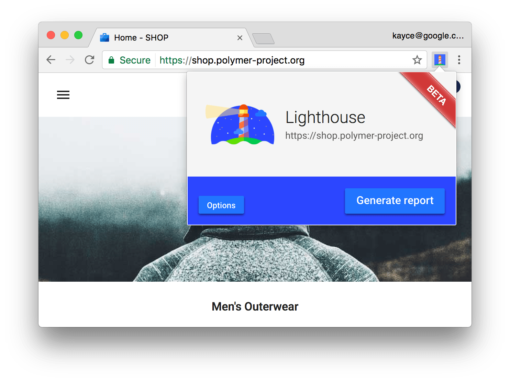
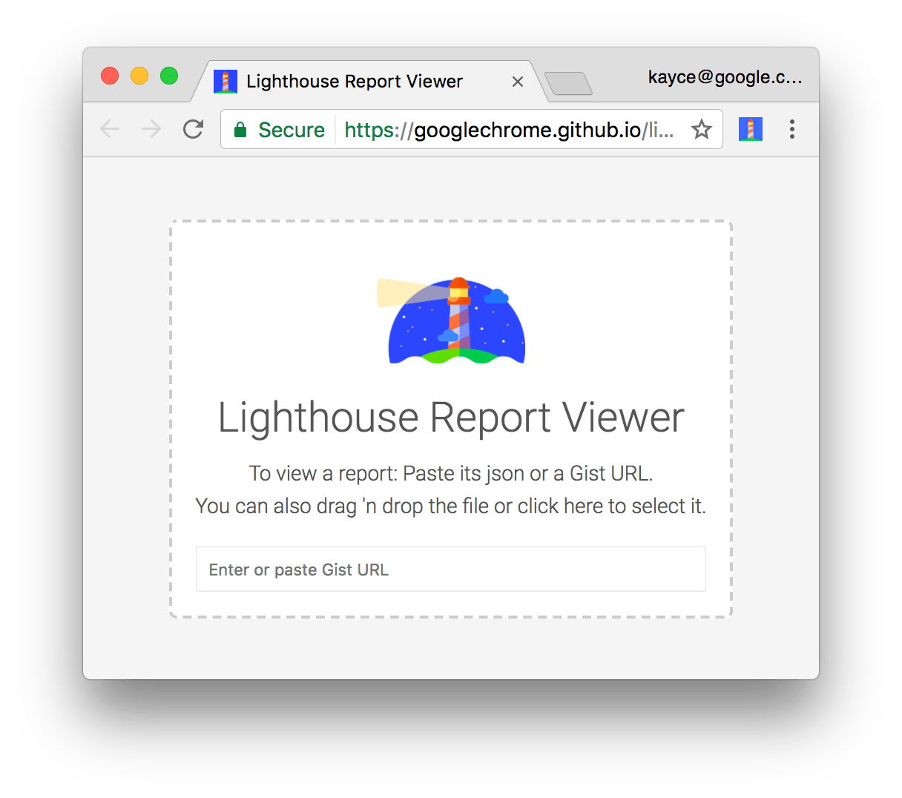

project_path: /web/tools/_project.yaml
book_path: /web/tools/_book.yaml
description: Learn how to set up Lighthouse to audit your web apps.

{# wf_updated_on: 2017-07-24 #}
{# wf_published_on: 2016-09-27 #}

# Lighthouse {: .page-title }

Lighthouse is an [open-source](https://github.com/GoogleChrome/lighthouse),
automated tool for improving the quality of web pages. You can run it against
any web page, public or requiring authentication. It has audits for performance,
accessibility, progressive web apps, and more.

You can run Lighthouse as a Chrome Extension, from the command line, or as a
Node module. You give Lighthouse a URL to audit, it runs a series of audits
against the page, and then it generates a report on how well the page did.
From there, use the failing audits as indicators on how to improve the page.
Each audit has a reference doc explaining why the audit is important, as
well as how to fix it.

  <a class="button button-primary lighthouse-install devsite-crx-install gc-analytics-event"
     data-category="Lighthouse" data-action="click"
     data-label="Home / Install Extension (Primary CTA)"
     href="https://chrome.google.com/webstore/detail/blipmdconlkpinefehnmjammfjpmpbjk"
     title="Install Lighthouse Chrome Extension" target="_blank">
    file_download
    Install Lighthouse
  </a>
  <a class="button button-primary gc-analytics-event"
     data-category="Lighthouse" data-action="click"
     data-label="Home / File Bug"
     href="https://github.com/GoogleChrome/lighthouse/issues/new"
     title="File an issue or feature request" target="_blank">
    bug_report
    File an issue
  </a>

## Get started {: #get-started }

There are two primary ways to run Lighthouse: as a Chrome Extension, or as a
command line tool. The Chrome Extension lets you audit logged-in pages and
provides a more user-friendly interface for reading reports. The command line
tool enables you to integrate Lighthouse into continuous integration systems.

  <iframe class="devsite-embedded-youtube-video" data-video-id="NoRYn6gOtVo"
          data-autohide="1" data-showinfo="0" frameborder="0" allowfullscreen>
  </iframe>

### Install and run the Chrome Extension {: #extension }

To install the extension:

1. Download [Google Chrome for Desktop][desktop].

1. Install the <a class="gc-analytics-event" data-category="Lighthouse"
   data-label="Home / Install Extension (Secondary CTA)" href="https://chrome.google.com/webstore/detail/lighthouse/blipmdconlkpinefehnmjammfjpmpbjk"
   title="Install Lighthouse Chrome Extension" target="_blank">Lighthouse
   Chrome Extension</a> from the Chrome Webstore.

[desktop]: https://www.google.com/chrome/browser/desktop/

To run an audit:

1. In Chrome, go to the page you want to audit.

1. Click **Lighthouse** ![Lighthouse][icon]{:.lighthouse-inline}. It should
   be next to the Chrome address bar. If not, open Chrome's main menu and
   access it at the top of the menu. After clicking, the Lighthouse
   menu expands.

     <figure>
       
       <figcaption>
         <b>Figure 1</b>. The Lighthouse menu
       </figcaption>
     </figure>

[icon]: images/lighthouse-icon-16.png

1. Click **Generate report**. Lighthouse runs its audits against the
   currently-focused page, then opens up a new tab with a report of the
   results.

     <figure>
       
       <figcaption>
         <b>Figure 2</b>. A Lighthouse report
       </figcaption>
     </figure>

### Install and run the Node command line tool {: #cli }

To install the Node module:

1. Download [Google Chrome for Desktop][desktop].
1. Install the current [Long-Term Support](https://github.com/nodejs/LTS)
   version of [Node](https://nodejs.org).
1. Install Lighthouse. The `-g` flag installs it as a global module.

        npm install -g lighthouse

To run an audit:

    lighthouse <url>

To see audit options:

    lighthouse --help

#### Run the Node module programmatically {: #programmatic }

See [Using programmatically][programmatic] for an example of running Lighthouse
programmatically, as a Node module.

[programmatic]: https://github.com/GoogleChrome/lighthouse#using-programmatically

## Share and view reports online {: #report-viewer }

Use the [Lighthouse Viewer][viewer] to view and share reports online.

<figure>
  
  <figcaption>
    <b>Figure 3</b>. The Lighthouse Viewer
  </figcaption>
</figure>

[viewer]: https://googlechrome.github.io/lighthouse/viewer/

### Share reports as JSON {: #json }

The Lighthouse Viewer needs the JSON output of a Lighthouse report.

* To get the JSON output of a report from the Chrome Extension version of
  Lighthouse, click **Export** > **Save as JSON**.
* To get the JSON output of a report from the command line tool, run:

    `lighthouse --output json --output-path <path/for/output.json>`

To view the report data, open the [Lighthouse Viewer][viewer] in Chrome,
and then drag the JSON file onto the viewer, or click anywhere on the Viewer to
open your file navigator and select the file.

### Share reports as GitHub Gists {: #gists }

If you don't want to manually pass around JSON files, you can also share your
reports as secret GitHub Gists. One benefit of Gists is free version control.

To export a report as a Gist from the Chrome Extension version of
Lighthouse:

1. Click **Export** > **Open In Viewer**. The report opens in the
   Viewer, located at `https://googlechrome.github.io/lighthouse/viewer/`.
1. In the Viewer, click **Share** ![Share][share]{: .lighthouse-inline}. The
   first time you do this, a popup asks permission to access your basic
   GitHub data, and to read and write to your Gists.

To export a report as a Gist from the CLI version of Lighthouse,
just manually create a Gist and copy-paste the report's JSON output
into the Gist. The Gist filename containing the JSON output must end in
`.lighthouse.report.json`. See [Share reports as JSON](#json) for an example of
how to generate JSON output from the command line tool.

To view a report that's been saved as a Gist:

* Add `?gist=<ID>` to the Viewer's URL, where `<ID>` is the ID of the Gist.

    `https://googlechrome.github.io/lighthouse/viewer/?gist=<ID>`

* Open the [Viewer][viewer], and paste the URL of a Gist into it.

[share]: images/share.png

## Contribute to Lighthouse {: #contribute }

Lighthouse is open source and [contributions are welcome](https://github.com/GoogleChrome/lighthouse/blob/master/CONTRIBUTING.md).
Check out the repository's [issues tracker](https://github.com/GoogleChrome/lighthouse/issues)
to find bugs that you can fix, or audits that you can create or improve upon.
The issues tracker is also a good place to discuss audit metrics, ideas for
new audits, or anything else related to Lighthouse.

[example]: https://github.com/justinribeiro/lighthouse-mocha-example/blob/master/test/lighthouse-tests.js
