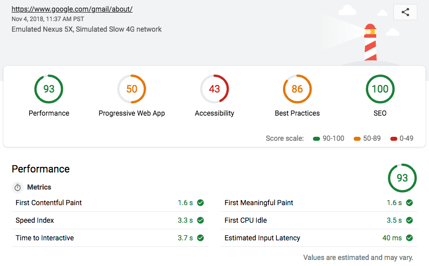

project_path: /web/tools/_project.yaml
book_path: /web/tools/_book.yaml
description: How scoring works in Lighthouse

{# wf_updated_on: 2018-11-04 #}
{# wf_published_on: 2018-05-04 #}
{# wf_blink_components: N/A #}

[details]: https://docs.google.com/spreadsheets/d/1Cxzhy5ecqJCucdf1M0iOzM8mIxNc7mmx107o5nj38Eo/edit#gid=0
[WikiHow]: https://www.wikihow.com/Calculate-Weighted-Average#Weighted_Averages_without_Percentages_sub

# Lighthouse Scoring Guide {: .page-title }

The scores that you see at the top of your Lighthouse report represent the page's score for
that particular category. This guide explains how Lighthouse calculates those scores.

<figure>
  
  <figcaption>
    <b>Figure 1</b>. The scores that you see next to <b>Progressive Web App</b>,
    <b>Performance</b>, <b>Accessibility</b>, <b>Best Practices</b>, and <b>SEO</b> at the
    top of your Lighthouse report represent your score for that category
  </figcaption>
</figure>

## The Performance score {: #perf }

Lighthouse returns a Performance score between 0 and 100. 0 is the lowest possible score. A 0
score usually indicates an error in Lighthouse. If you see a 0 score repeatedly, please
[file a bug on the Lighthouse repo][bug]{:.external}. 100 is the best possible score which
represents the 98th percentile, a top-performing site. A score of 50 represents the 75th 
percentile.

[bug]: https://github.com/GoogleChrome/lighthouse/issues/new/choose

### Which Performance audits contribute to your score {: #perf-audits }

In general, only the items in the Metrics section of the Performance category contribute
to your score. See [Scoring Details][details]{:.external} for the complete list.
The audits under Diagnostics and Opportunities do not contribute to your Performance score.

[FMP]: /web/tools/lighthouse/audits/first-meaningful-paint
[FI]: /web/tools/lighthouse/audits/first-interactive
[CI]: /web/tools/lighthouse/audits/consistently-interactive
[PSI]: /web/tools/lighthouse/audits/perceptual-speed-index
[EIL]: /web/tools/lighthouse/audits/estimated-input-latency

### How each Performance metric is scored {: #perf-scoring }

Each Performance audit that contributes to your score has its own scoring methodology.
Lighthouse maps each raw score to a number between 0 and 100. The scoring distribution is
a log normal distribution derived from the performance metrics of real website performance
data on HTTPArchive.

For example, the First Meaningful Paint (FMP) audit measures when a user perceives that the
primary content of a page is visible. The raw score for FMP represents the time duration between
the user initiating the page load and the page rendering its primary content. Based on real
website data, top-performing sites render FMP in about 1,220ms, so that metric value is mapped to
a Lighthouse score of 99.

### How the Performance score is weighted {: #perf-weighting }

The metrics that contribute to the Performance score are not equally weighted. See [Scoring
Details][details]{:.external} to see how each Performance audit is weighted. The heavier-weighted
audits have a larger impact on your overall Performance score. The weightings are based on
heuristics. The Lighthouse team is working on formalizing this approach through more field data.

The overall Performance score is a weighted average of these audits. See [Weighted Averages
Without Percentages][WikiHow]{:.external} to learn how weighted averages work.
See [Scoring Calculator][calculator]{:.external} to experiment with how getting different scores
in each audit affects your overall Performance score.

[calculator]: https://docs.google.com/spreadsheets/d/1dXH-bXX3gxqqpD1f7rp6ImSOhobsT1gn_GQ2fGZp8UU/edit?ts=59fb61d2#gid=283330180

### How the Performance score is color-coded {: #perf-color-coding }

The color-coding maps to these Performance score ranges:

* 0 to 49 (slow): Red
* 50 to 89 (average): Orange
* 90 to 100 (fast): Green

These color buckets were revised in Lighthouse [v3.1.1](https://github.com/GoogleChrome/lighthouse/releases).

### How to reduce fluctuations in your Performance score {: #perf-consistency }

When running Lighthouse on real sites, some variability in the Performance score is to be
expected. On each visit, a site may load different ads or scripts, and network conditions may
vary.

Anti-virus scanners, extensions, and other programs that interfere with page load can cause
large variations. Run Lighthouse without these programs to get more consistent results. Consider
running Lighthouse from a continuous integration system, or from a hosted service such as
[WebPageTest](https://webpagetest.org/easy){:.external}.

## The Progressive Web App score {: #pwa }

Lighthouse returns a Progressive Web App (PWA) score between 0 and 100. 0 is the worst possible
score, and 100 is the best.

The PWA audits are based on the [Baseline PWA Checklist][checklist],
which lists 14 requirements. Lighthouse has automated audits for 11 of the 14 requirements. The
remaining 3 can only be tested manually. Each of the 11 automated PWA audits are weighted
equally, so each one contributes approximately 9 points to your PWA score.

[checklist]: /web/progressive-web-apps/checklist#baseline

## The Accessibility score {: #a11y }

The Accessibility score is a weighted average of all the accessibility audits. See [Scoring
Details][details]{:.external} for a full list of how each audit is weighted. The heavier-weighted
audits have a bigger impact on your score.

Each accessibility audit is pass or fail. Unlike the Performance audits, a page doesn't get
points for partially passing an accessibility audit. For example, if some elements have
screenreader-friendly names, but others don't, that page gets a 0 for the
screenreader-friendly-names audit.

## The Best Practices score {: #best-practices }

Lighthouse returns a Best Practices score between 0 and 100. 0 is the worst possible score, and
100 is the best.

The Best Practices audits are equally weighted. To calculate how much each audit contributes
to your overall Best Practices score, count the number of Best Practices audits, then divide
100 by that number.

## Feedback {: #feedback .hide-from-toc }


