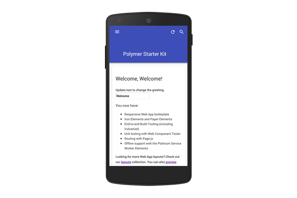

project_path: /web/_project.yaml
book_path: /web/tools/_book.yaml
description: Polymer Starter Kit.

# Polymer Starter Kit {: .page-title }

[Download Polymer Starter Kit](https://github.com/polymerelements/polymer-starter-kit/releases){: .button .button-primary .attempt-right }

Set up for success using Polymer in production.

Start your project with the Polymer Starter Kit to get the most out of 
the library, elements built with Polymer, and Polymer-related tools.

## What is the Polymer Starter Kit?

  <figure>
    
    <figcaption>
      <h3 class="mdl-typography--headline">Built for elements</h3>
      
Easily add in additional elements, either by building them yourself or installing them with bower. Browse the <a href="https://elements.polymer-project.org">catalog of elements built by the Polymer team</a> for inspiration.

    </figcaption>
  </figure>

  <figure>
    
    <figcaption>
      <h3 class="mdl-typography--headline">Tooled for production</h3>
      
Polymer starter kit links up all of the powerful Polymer-centric tooling out of the box to easily minify and vulcanize your app.

    </figcaption>
  </figure>

## Why use the Polymer Starter Kit?

### Components for nearly any app, out of the box

Get started quickly with the complete set of the same paper and iron elements used by Google products.

### Complete build chain

Build your app using a suite of gulp tasks that leverage the full range of Polymer-related tools, such as vulcanize, crisper, and more.

### Testing made easy

Test your app and all of its components using the built-in and pre-configured Web Component Tester.

### Flexible app theming

Easily theme your entire application, including the built-in elements, using app-level Custom CSS Properties.

### Framework-free, or framework-compatible

Build your app out of elements, or wire in an external framework to handle business logic. It's up to you!

### Responsive app layout boilerplate

Start off mobile-friendly with the included layout boilerplate.

### Live Browser Reloading

Reload the browser in real-time anytime an edit is made, without the need for an extension.

### Material design ready

Use the built-in paper elements to create a full material design-style app.

