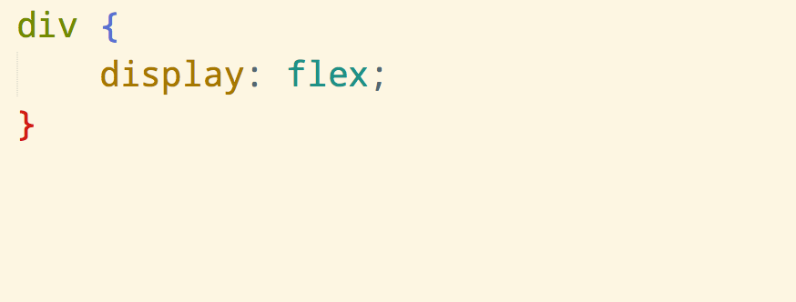
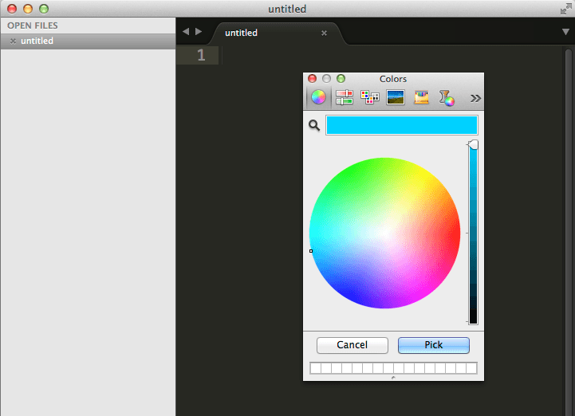
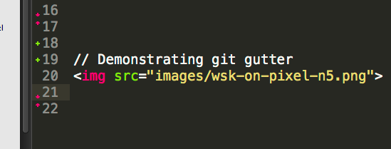
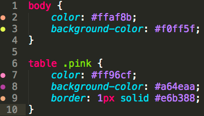

project_path: /web/tools/_project.yaml
book_path: /web/tools/_book.yaml
description: Your code editor is your main development tool; you use it to write and save lines of code. Write better code faster by learning your editor's shortcuts and installing key plugins.

{# wf_updated_on: 2015-04-13 #}
{# wf_published_on: 2014-05-28 #}

# Set Up Your Editor {: .page-title }




Your code editor is your main development tool; you use it to write and save lines of code. Write better code faster by learning your editor's shortcuts and installing key plugins.

### TL;DR {: .hide-from-toc }
- Choose an editor that lets you customize shortcuts and has lots of plugins to help you write better code.
- Make use of the package manager to make it easier to discover, install, and update plugins.
- Install plugins that help keep you productive during development; start with the recommendations in this guide.

## Install Sublime text editor

[Sublime](http://www.sublimetext.com/){: .external } is a great editor with a solid base level
of functionality which makes writing code a pleasure. You can install a package
manager that makes it easy to install plugins and add new functionality.

There are currently two download options for Sublime Text, either [version 2](http://www.sublimetext.com/2) or [version 3](http://www.sublimetext.com/3). Version 3 is pretty stable and will give you access to packages not available in Sublime Text 2, however you may find version 2 more reliable.

Note: Rob Dodson's <a href='http://robdodson.me/blog/2012/06/23/sublime-text-2-tips-and-shortcuts/'>blog post</a> on how to get to know and love Sublime is a great reference for getting the most out of your editor. The concepts are relevant to any text editor, not just Sublime.

## Why use a package manager?

Package managers make it easy to find, install, and keep packages & plugins
up-to-date.

You can install a Package Manager for Sublime  by following these instructions
[https://packagecontrol.io/installation](https://packagecontrol.io/installation).

You only need to do this once, after which see below for our recommended list of
plugins.

## Install plugins

Plugins help you stay more productive. What are the things you keep having to go
back out to other tools to do?

Linting - there's a plugin for that. Showing what changes haven't been committed
- there are plugins for that. Integration with other tools, such as GitHub,
there are plugins for that.

Package managers make it very easy to find, install, and update plugins:

1. In the Sublime Text editor, open your package manager (ctrl+shift+p).
2. Enter 'Install Package'.
3. Enter the name of the plugin you are looking for (or else browse all
   plugins).

Check out these [trending lists of Sublime Text
plugins](https://packagecontrol.io/browse). Here are the plugins we love and
recommend you install because they help you speed up your development:

### Autoprefixer

If you want a quick way to add vendor prefixes to your CSS, you can do so with
this handy plugin.

Write CSS, ignoring vendor prefixes and when you want to add them, hit
`ctrl+shift+p` and type `Autoprefix CSS`.

[We cover how you can automate this in your build
process](/web/tools/setup/setup-buildtools),
that way your CSS stays lean and you don't need to remember to hit
`ctrl+shift+p`.

### ColorPicker

Pick any color from the palette and add it to your CSS with `ctrl+shift+c`.

### Emmet

Add some useful keyboard shortcuts and snippets to your text editor. Check out
the video on [Emmet.io](http://emmet.io/){: .external } for an intro into what it can do (a
personal favorite is the 'Toggle Comment' command).

### HTML-CSS-JS prettify

This extension gives you a command to format your HTML, CSS and JS. You can even
prettify your files whenever your save a file.

### Git Gutter

Add a marker in the gutter wherever there is a change made to a file.

### Gutter Color

Note: This is only available in Sublime Text 3

Gutter Color shows you a small color sample next to your CSS.

The plugin requires ImageMagick. If you are on Mac OS X, we recommend trying the
installer from [CactusLabs](http://cactuslab.com/imagemagick/){: .external } (you may need to
restart your machine to get it working).

