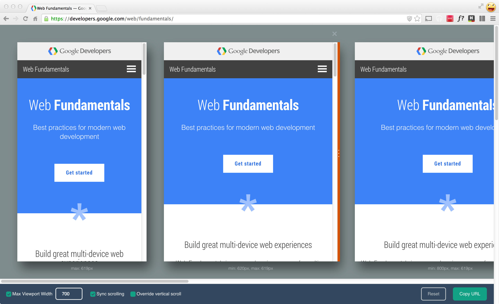
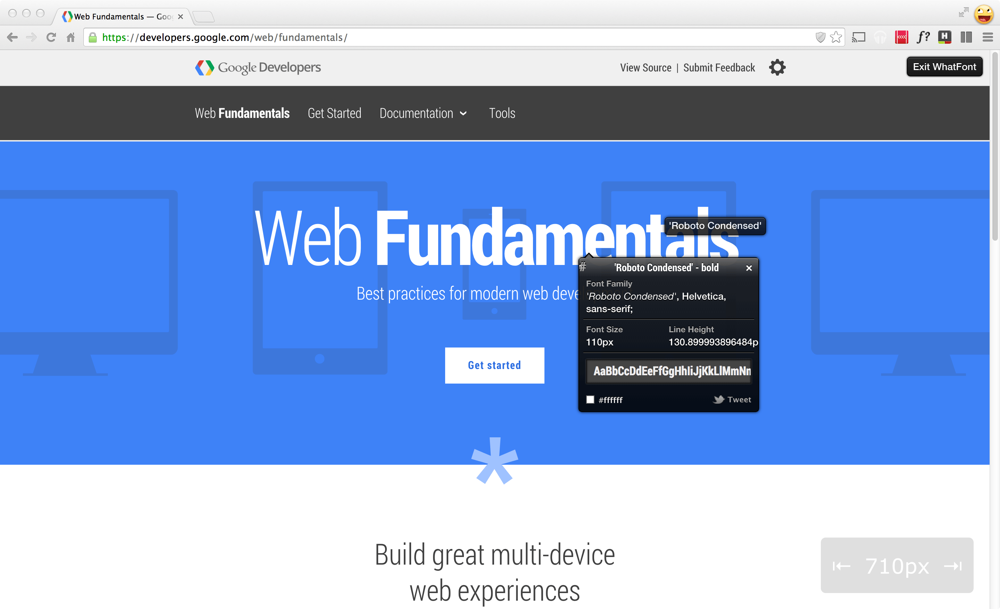

project_path: /web/tools/_project.yaml
book_path: /web/tools/_book.yaml
description: Out of the box, every desktop browser comes with a set of developer tools, you can extend and add to these with extensions or plugins for your browser.

{# wf_updated_on: 2015-04-13 #}
{# wf_published_on: 2015-04-13 #}

# Set Up Browser Extensions {: .page-title }




Out of the box, every desktop browser comes with a set of developer tools, you can extend and add to these with extensions or plugins for your browser.

Here are two Chrome Extensions that have some useful functionality to help with
debugging your designs.

## Emmet Re:View

Emmet Re:View is a tool which makes it easy to see what your site looks like at
each of your media queries and syncs the scrolling of all the pages. You can see
a demo of it [on their
site](http://re-view.emmet.io/).

[Download on the Chrome Web
Store](https://chrome.google.com/webstore/detail/emmet-review/epejoicbhllgiimigokgjdoijnpaphdp)

## What Font?

The last extension we use on a regular basis is *What Font?*. This Chrome Extension
will tell you the name of the font currently being used on the page. This is
really handy for debugging any web font issues.

[Download on the Chrome Web
Store](https://chrome.google.com/webstore/detail/whatfont/jabopobgcpjmedljpbcaablpmlmfcogm)

