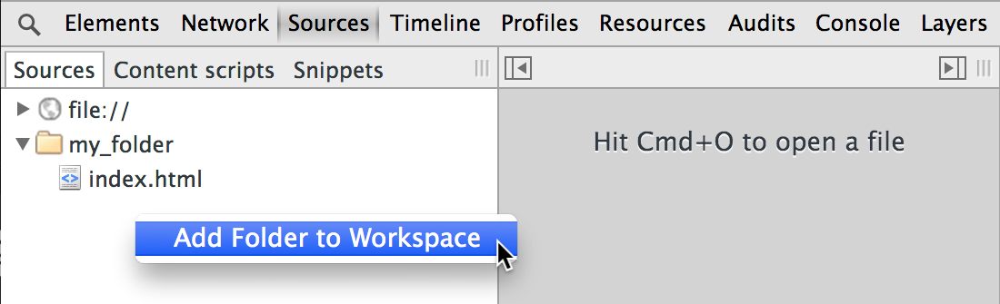
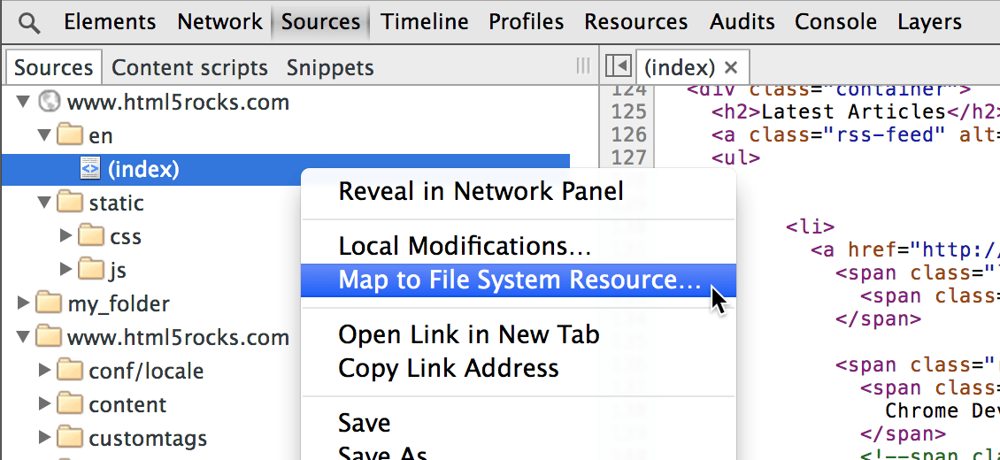
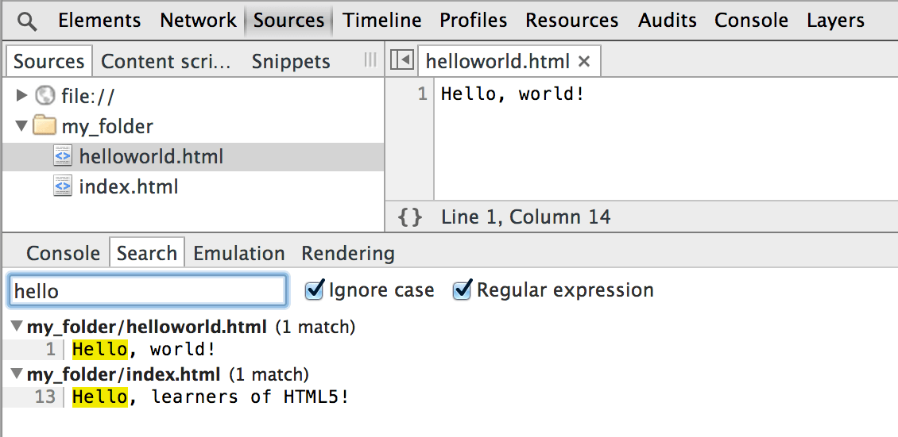

project_path: /web/tools/_project.yaml
book_path: /web/tools/_book.yaml
description: Set up persistent authoring in Chrome DevTools so you can both see your changes immediately and save those changes to disk.

{# wf_updated_on: 2017-07-24 #}
{# wf_published_on: 2015-07-08 #}

# Set Up Persistence with DevTools Workspaces {: .page-title }





Set up persistent authoring in Chrome DevTools so you can both see your changes immediately and save those changes to disk.

Chrome DevTools lets you change elements and styles
on a web page and see your changes immediately.
By default, refresh the browser and the changes go away
unless you've manually copied and pasted them to an external editor.

Workspaces lets you persist those changes to disk
without having to leave Chrome DevTools.
Map resources served from a local web server to files on a disk
and view changes made to those files as if they were being served.

### TL;DR {: .hide-from-toc }
- Don't manually copy changes to local files. Use workspaces to persist changes made in DevTools to your local resources.
- Stage your local files to your browser. Map files to URLs.
- Once persistent workspaces are set-up, style changes made in the Elements panel are persisted automatically; DOM changes aren't. Persist element changes in the Sources panel instead.

## Add local source files to workspace

To make a local folder's source files editable in the Sources panel:

1. Right-click in the left-side panel.
2. Select **Add Folder to Workspace**.
3. Choose location of local folder that you want to map.
4. Click **Allow** to give Chrome access to the folder. 

Typically, the local folder contains the site's original source files that were used to populate the site on the server. If you do not want to change those original files via the workspace, make a copy of the folder and specify it as the workspace folder instead.

## Stage persisted changes

You've already mapped your local folder to your workspace,
but the browser is still serving the network folder contents.
To automatically stage persistent changes in the browser,
map local files in the folder to a URL:

1. Right-click or Control+click on a file in the Sources left-side panel.
2. Choose **Map to File System Resource**.
3. Select the local file in the persistent workspace.
4. Reload the page in Chrome.

Thereafter,
Chrome loads the mapped URL,
displaying the workspace contents
instead of the network contents.
Work directly in the local files without having
to repeatedly switch between Chrome and an external editor.

## Limitations

As powerful as Workspaces are, there are some limitations you should be aware of.

* Only style changes in the Elements panel are persisted; changes to the DOM are not persisted.

* Only styles defined in an external CSS file can be saved. Changes to `element.style` or to inline styles are not persisted. (If you have inline styles, they can be changed on the Sources panel.)

* Style changes in the Elements panel are persisted immediately without an explicit save -- 
<kbd class="kbd">Ctrl</kbd> + <kbd class="kbd">S</kbd> or <kbd class="kbd">Cmd</kbd> + <kbd class="kbd">S</kbd> (Mac) -- if you have the CSS resource mapped to a local file.

* If you are mapping files from a remote server instead of a local server, when you refresh the page, Chrome reloads the page from the remote server. Your changes still persist to disk and are reapplied if you continue editing in Workspaces.

* You must use the full path to a mapped file in the browser. Even your index files must include .html in the URL, in order to see the staged version.

## Local file management

In addition to editing existing files,
you can also add and delete files
in the local mapped directory you’re using for Workspaces.

### Add file

To add a file:

1. Right-click a folder in the left Sources pane.
2. Select **New File**.
3. Type a name for the new file including its extension (e.g., `newscripts.js`) and press **Enter**; the file is added to the local folder.

### Delete file

To delete a file:

1. Right-click on the file in the left Sources pane.
2. Choose **Delete** and click **Yes** to confirm.

### Back up a file

Before making substantial changes to a file,
it's useful to duplicate the original for back-up purposes.

To duplicate a file:

1. Right-click on the file in the left Sources pane.
2. Choose **Make a Copy...**.
3. Type a name for the file including its extension (e.g., `mystyles-org.css`) and press **Enter**.

### Refresh

When you create or delete files directly in Workspaces,
the Sources directory automatically refreshes to show the file changes.
To force a refresh at any time, right-click a folder and choose **Refresh**.

This is also useful if you change files that are concurrently open in an external editor and want the changes to show up in DevTools. Usually DevTools catches such changes automatically, but if you want to be certain, just refresh the folder as described above.

### Search for files or text

To search for a loaded file in DevTools,
press <kbd class="kbd">Ctrl</kbd> + <kbd class="kbd">O</kbd> or <kbd class="kbd">Cmd</kbd> + <kbd class="kbd">O</kbd> (Mac)
to open a search dialog.
You can still do this in Workspaces,
but the search is expanded to both the remote loaded files
and the local files in your Workspace folder.

To search for a string across files:

1. Open the search window: click the **Show Drawer** button {:.inline} and then click the **Search**; or press
<kbd class="kbd">Ctrl</kbd> + <kbd class="kbd">Shift</kbd> + <kbd class="kbd">F</kbd> or <kbd class="kbd">Cmd</kbd> + <kbd class="kbd">Opt</kbd> + <kbd class="kbd">F</kbd> (Mac).
2. Type a string into the search field and press **Enter**.
3. If the string is a regular expression or needs to be case-insensitive, click the appropriate box.

The search results are shown in the Console drawer, listed by file name, with the number of matches in each file indicated. Use the **Expand** {:.inline} and **Collapse** {:.inline} arrows to expand or collapse the results for a given file.

