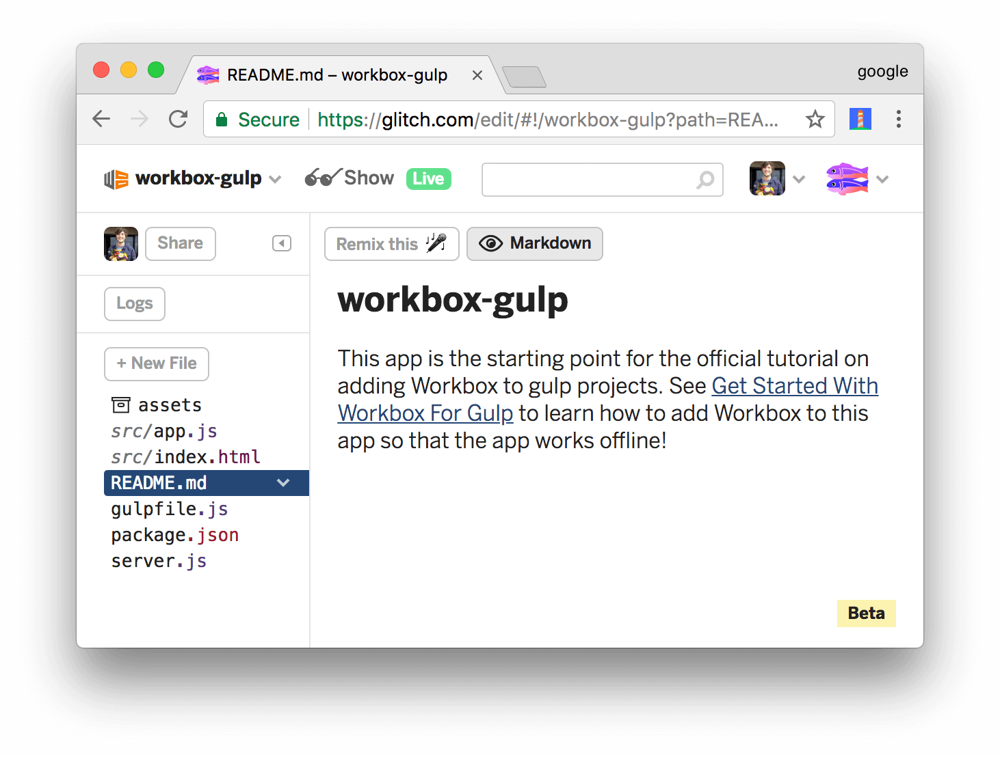

project_path: /web/tools/_project.yaml
book_path: /web/tools/_book.yaml
description: Learn how to make a gulp-based app work offline by adding Workbox to it.

{# wf_updated_on: 2018-03-06 #}
{# wf_published_on: 2017-11-17 #}

# Get Started With Workbox For Gulp {: .page-title }



In this tutorial, you use Workbox to make a simple web app work offline.

If you'd like a conceptual overview of Workbox before starting this tutorial,
see the [Overview](/web/tools/workbox/overview).

## Step 1: Set up your project {: #setup }

The project that you're going to add Workbox to is hosted on [Glitch][Glitch].
First, you need to set up Glitch so that you can edit your own copy of the
project.

[Glitch]: https://glitch.com/about/

1. Open the [demo](https://glitch.com/edit/#!/workbox-gulp).

     <figure>
       
       <figcaption>
         <b>Figure 1</b>. The starting point demo, hosted on Glitch
       </figcaption>
     </figure>

1. Click **workbox-gulp** at the top-left of the page. The **Project
   info and options** dropdown appears.
1. Click **Remix This**. Your browser redirects to an editable copy of
   the project.

<<_shared/try-initial.md>>

## Step 2: Install Workbox {: #install }

Next, you're going to add Workbox to the project to enable an offline
experience.

1. Re-focus the tab that shows you the source code of the project.
1. Click `package.json` to open that file.
1. Click **Add package**.
1. Type `workbox-build` within the **Add Package** text box, then
   click on the matching package to add it to the project.

     <aside class="note">**Note**: This is equivalent to running `npm install
     workbox-build`. In your own projects, you'll probably want to
     save Workbox as a [development dependency][devDependencies] instead by
     running `npm install workbox-build --save-dev`, since
     `workbox-build` is a build-time tool.</aside>

     <figure>
       
       <figcaption>
         <b>Figure 5</b>. Adding the <code>workbox-build</code> package
       </figcaption>
     </figure>

[devDependencies]: https://docs.npmjs.com/files/package.json#devdependencies
   
Every time you make a change to your code, Glitch automatically
re-builds and re-deploys your app. The tab running the live app automatically
refreshes, too.

## Step 3: Add Workbox to your Gulp build process {: #gulp }

Workbox is installed, but you're not using it in your gulp build process, yet.

1. Click `gulpfile.js` to open that file.
1. Import the Workbox plugin. The bold code is the code that you need to add to your project.

    <pre class="prettyprint">const gulp = require('gulp'),
        ...
        <strong>workbox = require('workbox-build');</strong>
    </pre>

1. Add a task to generate your service worker using Workbox.

    <pre class="prettyprint">gulp.task('build', () => {
      ...
    });

    <strong>gulp.task('generate-service-worker', () => {
      return workbox.generateSW({
        globDirectory: dist,
        globPatterns: [
          '\*\*/\*.{html,js}'
        ],
        swDest: \`${dist}/sw.js\`,
        clientsClaim: true,
        skipWaiting: true
      }).then(({warnings}) => {
        // In case there are any warnings from workbox-build, log them.
        for (const warning of warnings) {
          console.warn(warning);
        }
        console.info('Service worker generation completed.');
      }).catch((error) => {
        console.warn('Service worker generation failed:', error);
      });
    });</strong>

    gulp.task('default', (callback) => {
      ...
    });</pre>

1. Call the Workbox task as the second-to-last task in your build process (just before the
`callback`).
    
    <pre class="prettyprint">gulp.task('default', (callback) => {
      runSequence('clean', 'build', <strong>'generate-service-worker',</strong> callback);
    });</pre>

### Optional: How the config works {: #optional-config }

`gulpfile.js` determines how the app is built.

* The `clean` task deletes the output directory.
* The `build` task builds the app. In this case, it just copies the source files to the output
  directory.
* The `generate-service-worker` task creates your service worker code, using Workbox.
* The `default` task is the "master" task that ensures that all of the other tasks run in
  the proper order.

The object that you pass to `workbox.generateSW()` configures how Workbox runs.

<<_shared/config.md>>

<<_shared/register.md>>

## Step 5: Add runtime caching {: #runtime }

Runtime caching lets you store content that's not under your control
when your app requests it at runtime. For example, by runtime caching the
Hacker News content which this app relies on, you'll be able to provide
an improved offline experience for your users. When users visit the app
while offline, they'll be able to see the content from the last time
that they had an internet connection.

1. Re-focus the tab that shows you the source code of your project.
1. Open `gulpfile.js` again.
1. Add a `runtimeCaching` property to your Workbox configuration.
   `urlPattern` is a regular expression pattern telling Workbox which
   URLs to store locally. `handler` defines the caching strategy that Workbox
   uses for any matching URL. See [The Offline Cookbook][cookbook] for more
   on caching strategies.

    <pre class="prettyprint">gulp.task('generate-service-worker', () => {
      return workbox.generateSW({
        ...
        <strong>runtimeCaching: [{
          urlPattern: new RegExp('https://hacker-news.firebaseio.com'),
          handler: 'staleWhileRevalidate'
        }]</strong>
      }).then(({warnings}) => {
        ...</pre>

[cookbook]: /web/fundamentals/instant-and-offline/offline-cookbook/

<<_shared/try-complete.md>>

<<_shared/create.md>>

1. Open `gulpfile.js`.
1. Remove the `runtimeCaching`, `clientsClaim`, and `skipWaiting` properties.
   These are now handled in your service worker code.
1. Add the `swSrc` property to instruct Workbox to inject its code into a custom service worker. 

    <pre class="prettyprint">gulp.task('generate-service-worker', () => {
      return workbox.generateSW({
        globDirectory: dist,
        globPatterns: [
          '\*\*/\*.{html,js}'
        ],
        swDest: \`${dist}/sw.js\`,
        <strong>swSrc: \`${src}/sw.js\`,</strong>
      }).then(({warnings}) => {
        ...</pre>

1. Change `generateSW` to `injectManifest`.

    <pre class="prettyprint">gulp.task('generate-service-worker', () => {
      return workbox.<strong>injectManifest</strong>({
        ...</pre>

<<_shared/end.md>>
