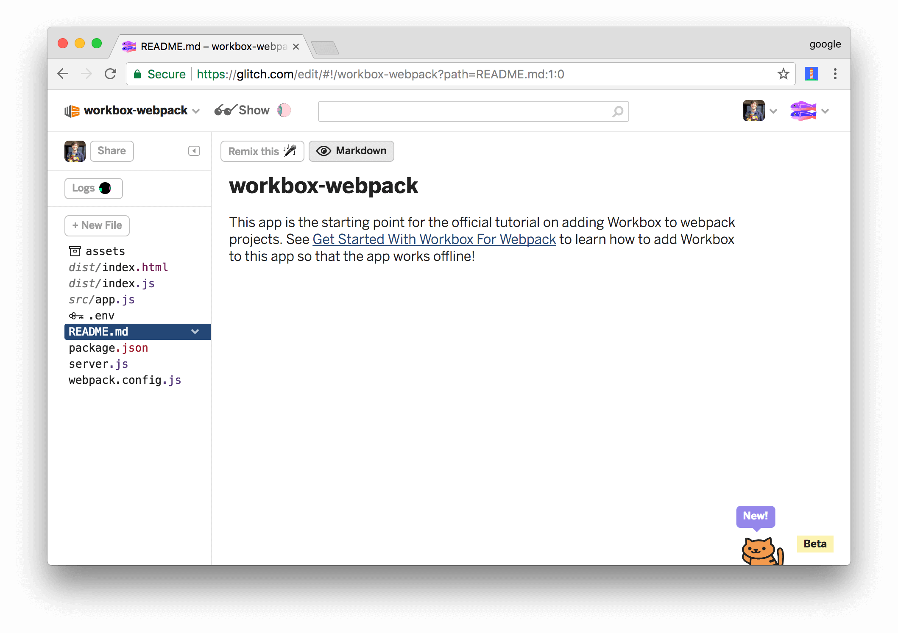
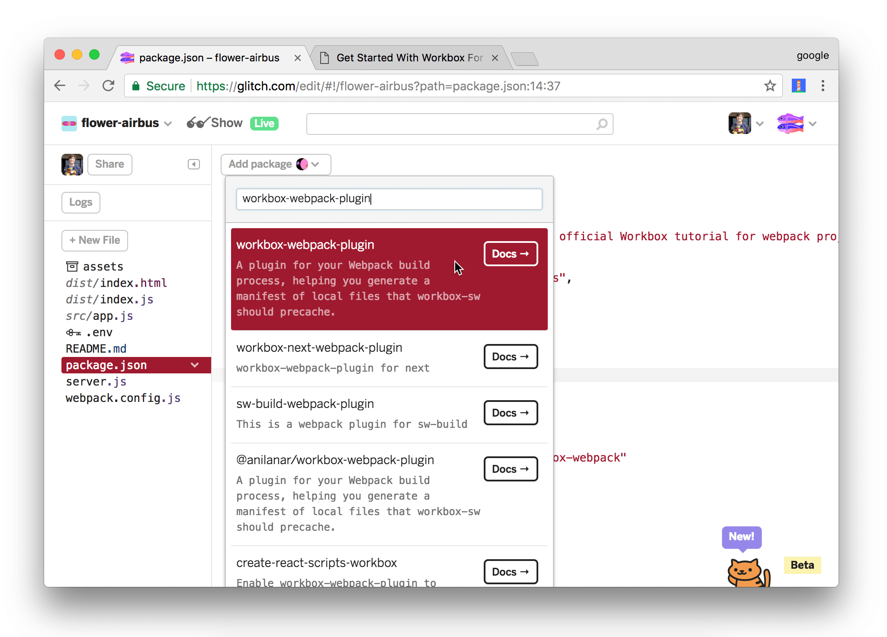

project_path: /web/tools/_project.yaml
book_path: /web/tools/_book.yaml
description: Learn how to make a webpack-based app work offline by adding Workbox to it.

{# wf_updated_on: 2017-10-31 #}
{# wf_published_on: 2017-10-31 #}

# Get Started With Workbox For Webpack {: .page-title }



In this tutorial, you use Workbox to make a simple web app work offline.

If you'd like a conceptual overview of Workbox before starting this tutorial,
see the [Overview](/web/tools/workbox/overview).

## Step 1: Set up your project {: #setup }

The project that you're going to add Workbox to is hosted on [Glitch][Glitch].
First, you need to set up Glitch so that you can edit your own copy of the
project.

[Glitch]: https://glitch.com/about/

1. Open the [demo](https://glitch.com/edit/#!/workbox-webpack).

     <figure>
       
       <figcaption>
         <b>Figure 1</b>. The starting point demo, hosted on Glitch
       </figcaption>
     </figure>

1. Click **workbox-webpack** at the top-left of the page. The **Project
   info and options** dropdown appears.
1. Click **Remix This**. Your browser redirects to an editable copy of
   the project.

### Try out the initial app {: #starting-point }

The client-side JavaScript in the app fetches the top 10 Hacker News (HN)
articles, and then populates the HTML with the content.

Note: This tutorial uses Google Chrome and Chrome DevTools to demonstrate how
the web app behaves when offline. You can use [any browser that supports
service workers](http://caniuse.com/#search=service%20workers).

1. Click **Show**. The live app appears in a new tab.

     <figure>
       
       <figcaption>
         <b>Figure 2</b>. The live app
       </figcaption>
     </figure>

1. In the tab that's running the live app, press
   <kbd>Command</kbd>+<kbd>Option</kbd>+<kbd>J</kbd> (Mac) or
   <kbd>Control</kbd>+<kbd>Shift</kbd>+<kbd>J</kbd> (Windows, Linux) to
   open DevTools.
1. Focus DevTools and press <kbd>Command</kbd>+<kbd>Shift</kbd>+<kbd>P</kbd>
   (Mac) or <kbd>Control</kbd>+<kbd>Shift</kbd>+<kbd>P</kbd> (Windows, Linux)
   to open the **Command Menu**.
1. Type `Offline`, select **Go offline**, then press <kbd>Enter</kbd>. Google
   Chrome now has no connection to the Internet in this tab.

     <figure>
       
       <figcaption>
         <b>Figure 3</b>. The <b>Go Offline</b> command
       </figcaption>
     </figure>

1. Reload the page. Google Chrome says that you're offline. In other words,
   the app doesn't work at all when offline.

     <figure>
       
       <figcaption>
         <b>Figure 4</b>. The initial app doesn't work at all when offline
       </figcaption>
     </figure>

1. Open the **Command Menu** again, type `Online`, and select **Go online**
   to restore your internet connection in this tab.
1. Reload the page.
1. Leave the tab running the live app open.

## Step 2: Install Workbox {: #install }

Next, you're going to add Workbox to the project to enable an offline
experience.

1. Re-focus the tab that shows you the source code of the project.
1. Click `package.json` to open that file.
1. Click **Add package**.
1. Type `workbox-webpack-plugin` within the **Add Package** text box, then
   click on the matching package to add it to the project.

     <aside class="note">**Note**: This is equivalent to running `npm install
     workbox-webpack-plugin`. In your own projects, you'll probably want to
     save Workbox as a [development dependency][devDependencies] instead by
     running `npm install workbox-webpack-plugin --save-dev`, since
     `workbox-webpack-plugin` is a build-time tool.</aside>

     <figure>
       
       <figcaption>
         <b>Figure 5</b>. Adding the <code>workbox-webpack-plugin</code>
         package
       </figcaption>
     </figure>

[devDependencies]: https://docs.npmjs.com/files/package.json#devdependencies
   
Every time you make a change to your code, Glitch automatically
re-builds and re-deploys your app. The tab running the live app automatically
refreshes, too.

## Step 3: Add Workbox to your Webpack build process {: #webpack }

Workbox is installed, but you're not using it in your webpack build process, yet.

1. Click `webpack.config.js` to open that file.
1. Import the Workbox plugin. The bold code is the code that you need to add to your project.

    <pre class="prettyprint">const path = require('path'),
        htmlPlugin = require('html-webpack-plugin'),
        cleanPlugin = require('clean-webpack-plugin'),
        dist = 'dist',
        <strong>workboxPlugin = require('workbox-webpack-plugin');</strong>
    </pre>

1. Call the Workbox plugin as the last step in `plugins`.

    <pre class="prettyprint">plugins: [
      new cleanPlugin([dist]),
      new htmlPlugin({
        filename: 'index.html',
        title: 'Get Started With Workbox For Webpack'
      }),
      <strong>new workboxPlugin({
        globDirectory: dist,
        globPatterns: ['\*\*/\*.{html,js}'],
        swDest: path.join(dist, 'sw.js'),
        clientsClaim: true,
        skipWaiting: true,
      })</strong>
    ]</pre>

### Optional: How the config works {: #optional-config }

`webpack.config.js` determines how the app is built.

* `cleanPlugin` deletes `dist`, which is the path to the output directory.
* `htmlPlugin` re-generates the HTML output and places it back in `dist`.
* `workboxPlugin` inspects the contents of `dist` and generates
  service worker code for caching the output. Since Workbox revisions
  each file based on its contents, Workbox should always be the last
  plugin you call.

The object that you pass to `workboxPlugin` configures how Workbox runs.

* `globDirectory` is where Workbox watches for changes. `globPatterns`
  is relative to this directory.

    <aside class="note">**Note**: A glob is a wildcard pattern. See [Glob Primer][Glob] to
    learn more.</aside>

[Glob]: https://github.com/isaacs/node-glob#glob-primer

* `globPatterns` is a glob of what files to precache. In plain English, the
  wildcard pattern `**/*.{html,js}` translates to "cache every HTML and JS
  file in `globDirectory`, or any of its sub-directories".
* `swDest` is where Workbox outputs the service worker that it generates.
* `clientsClaim` instructs the latest service worker to take control of all
  clients as soon as it's activated. See [clients.claim][claim].
* `skipWaiting` instructs the latest service worker to activate as soon as it enters
  the waiting phase. See [Skip the waiting phase][skip].

[skip]: /web/fundamentals/primers/service-workers/lifecycle#skip_the_waiting_phase
[claim]: /web/fundamentals/primers/service-workers/lifecycle#clientsclaim

## Step 4: Register and inspect the generated service worker {: #register }

Workbox has generated a service worker, but there's no reference to it from
your app, yet.

1. Click `src/index.js` to open that file.
1. Register your service worker at the bottom of `init()`.

    <pre class="prettyprint">function init() {
      let title = document.createElement('h1');
      title.textContent = 'Top 10 Hacker News Stories';
      document.body.appendChild(title);
      let list = document.createElement('ol');
      document.body.appendChild(list);
      fetchTop10().then(stories => renderTop10(stories));
      <strong>if ('serviceWorker' in navigator) {
        window.addEventListener('load', () => {
          navigator.serviceWorker.register('/sw.js').then(registration => {
            console.log('SW registered: ', registration);
          }).catch(registrationError => {
            console.log('SW registration failed: ', registrationError);
          });
        });
      }</strong>
    }</pre>

1. Re-focus the tab that's running the live version of your app.
1. Click the **Application** tab of DevTools.
1. Click the **Service Workers** tab.

     <figure>
       
       <figcaption>
         <b>Figure 6</b>. The Service Workers pane
       </figcaption>
     </figure>

1. Click **sw.js**, next to **Source**. DevTools displays the
   service worker code that Workbox generated. It should look close to this:

     <figure>
       
       <figcaption>
         <b>Figure 7</b>. The generated service worker code
       </figcaption>
     </figure>

### Try out the offline-capable app {: #try-incomplete }

Your app now sort-of works offline. Try it now:

1. In the live version of your app, use DevTools to go offline again.
   Focus DevTools and press <kbd>Command</kbd>+<kbd>Shift</kbd>+<kbd>P</kbd>
   (Mac) or <kbd>Control</kbd>+<kbd>Shift</kbd>+<kbd>P</kbd> (Windows, Linux)
   to open the **Command Menu**. Type `Offline`, select **Go offline**,
   then press <kbd>Enter</kbd>.
1. Reload the page. The title of the page appears, but the list of the top
   10 stories doesn't.
1. Click the **Network** tab in DevTools. The request for `topstories.json` is
   red, meaning that it failed. This is why the list isn't appearing. The app
   tries to make a request for
   `https://hacker-news.firebaseio.com/v0/topstories.json`, but the request
   fails since you're offline and you haven't instructed Workbox to cache
   this resource, yet.

     <figure>
       
       <figcaption>
         <b>Figure 8</b>. The incomplete offline experience
       </figcaption>
     </figure>

1. Use the **Command Menu** in DevTools to go back online.

### Optional: How the service worker code works {: #optional-generated }

The service worker code is generated based on the configuration that you
provide in `webpack.config.js`.

* `importScripts('workbox-sw.prod.v2.1.0.js')` imports Workbox's service
  worker library. You can inspect this file from the **Sources** panel of
  DevTools.

    <figure>
      
      <figcaption>
        <b>Figure 9</b>. The code for Workbox's service worker library
      </figcaption>
    </figure>

* The `fileManifest` array lists all of the resources that Workbox is
  precaching. This list is determined by the `globDirectory`
  and `globPatterns` properties that you define in `webpack.config.js`, as
  mentioned in the last section.
* Each resource has a `revision` property. This is how Workbox determines
  when to update a resource. Each time you build your app, Workbox generates
  a hash based on the contents of the resource. If the contents change, then
  the `revision` hash changes.
* When the service worker runs, it writes the `url` and `revision` of each
  resource to [IndexedDB][IDB] (IDB) if it doesn't exist. If the resource does
  exist, the service worker checks that the `revision` in its code matches the
  `revision` in IDB. If the hashes don't match, then the resource has changed,
  and therefore the service worker needs to download the updated resource and
  update the hash in IDB.

In sum, Workbox only re-downloads resources when they change, and ensures
that your app always caches the most up-to-date version of each resource.

[IDB]: https://developer.mozilla.org/en-US/docs/Web/API/IndexedDB_API

## Step 5: Add runtime caching {: #runtime }

Runtime caching lets you store content that's not under your control
when your app requests it at runtime. For example, by runtime caching the
Hacker News content which this app relies on, you'll be able to provide
an improved offline experience for your users. When users visit the app
while offline, they'll be able to see the content from the last time
that they had an internet connection.

1. Re-focus the tab that shows you the source code of your project.
1. Open `webpack.config.js` again.
1. Add a `runtimeCaching` property to your Workbox configuration.
   `urlPattern` is a regular expression pattern telling Workbox which
   URLs to store locally. *(Please note your regex will be matched
   against full URLs such as 'https://hacker-news.firebaseio.com' -
   not against partial URLs. This means you can cache both content from
   your site and content from external sites as well, as this example
   demonstrates.)* `handler` defines the caching strategy that Workbox
   uses for any matching URL. See [The Offline Cookbook][cookbook] for more
   on caching strategies.

    <pre class="prettyprint">new workboxPlugin({
      globDirectory: dist,
      globPatterns: ['**/*.{html,js}'],
      swDest: path.join(dist, 'sw.js'),
      clientsClaim: true,
      skipWaiting: true,
      <strong>runtimeCaching: [
        {
          urlPattern: new RegExp('https://hacker-news\.firebaseio\.com'),
          handler: 'staleWhileRevalidate'
        }
      ]</strong>
    })</pre>

[cookbook]: /web/fundamentals/instant-and-offline/offline-cookbook/

### Try out the complete offline experience {: #try-complete }

The app now provides a complete offline experience. Try it now:

1. Reload the live version of your app.
1. Use the DevTools **Command Menu** to go back offline.
1. Reload the app. The app now displays the content from the last time
   that you were online.

     <figure>
       
       <figcaption>
         <b>Figure 10</b>. The complete offline experience
       </figcaption>
     </figure>

1. Use the DevTools **Command Menu** to go back online.

## Step 6: Create your own service worker {: #inject }

Up until now, you've been letting Workbox generate your entire service
worker. If you've got a big project, or you want to customize how you cache
certain resources, or do custom logic in your service worker, such as add
support for push notifications, which you're going to add in this section,
then you need to create a custom service worker that calls Workbox instead.
Think of the service worker code you write as a template. You write your custom logic with
placeholder keywords that instruct Workbox where to inject its code.

1. Re-focus the tab containing your project source code.
1. Open `package.json`.
1. Click **Add Package**, type `workbox-sw`, then click on the matching package to install
   that library.
1. Write down the version number of `workbox-sw` that gets installed. You'll
   need it later.
1. Add the following line of code to the `init()` function in `app.js`.

    <pre class="prettyprint">function init() {
      let title = document.createElement('h1');
      title.textContent = 'Top 10 Hacker News Stories';
      document.body.appendChild(title);
      let list = document.createElement('ol');
      document.body.appendChild(list);
      fetchTop10().then(stories => renderTop10(stories));
      if ('serviceWorker' in navigator) {
        window.addEventListener('load', () => {
          navigator.serviceWorker.register('/sw.js').then(registration => {
            console.log('SW registered: ', registration);
            <strong>registration.pushManager.subscribe({userVisibleOnly: true});</strong>
          }).catch(registrationError => {
            console.log('SW registration failed: ', registrationError);
          });
        });
      }
    }</pre>

    <aside class="warning">**Warning**: For simplicity, this demo asks for permission to
    send push notifications as soon as the service worker is registered. Best practices
    strongly recommend against out-of-context permission requests like this in real apps.
    See [Permission UX][UX].</aside>

[UX]: /web/fundamentals/push-notifications/permission-ux

1. Click **New File**, enter `src/sw.js`, then press <kbd>Enter</kbd>.
1. Insert the following code into `src/sw.js`.

    <pre class="prettyprint"><strong>// TODO: Replace Xs.
    importScripts('/node_modules/workbox-sw/build/importScripts/workbox-sw.prod.vX.X.X.js');
    
    // Note: Ignore the error that Glitch raises about WorkboxSW being undefined.
    const workbox = new WorkboxSW({
      skipWaiting: true,
      clientsClaim: true
    });
    
    workbox.router.registerRoute(
      new RegExp('^https://hacker-news.firebaseio.com'),
      workbox.strategies.staleWhileRevalidate()
    );
    
    self.addEventListener('push', (event) => {
      const title = 'Get Started With Workbox For Webpack';
      const options = {
        body: event.data.text()
      };
      event.waitUntil(self.registration.showNotification(title, options));
    });

    workbox.precache([]);</strong></pre>

    <aside class="important">**Important**: `workbox.precache([])` is a placeholder keyword.
    At build-time, Workbox injects the list of files to cache into the array.</aside>

1. Replace each `X` in `importScripts('.../workbox-sw.prod.vX.X.X.js')` with
   the version number of `workbox-sw` in `package.json` that you noted earlier.
1. Open `webpack.config.json`.
1. Remove the `runtimeCaching`, `clientsClaim`, and `skipWaiting` properties from your Workbox
   plugin configuration. These are now handled in your service worker code.
1. Add the `swSrc` property to your Workbox plugin configuration in `webpack.config.json`
   to instruct Workbox to inject its code into a custom service worker. 

    <pre class="prettyprint">new workboxPlugin({
      globDirectory: dist,
      globPatterns: ['**/*.{html,js}'],
      <strong>swSrc: './src/sw.js',</strong>
      swDest: path.join(dist, 'sw.js')
    })</pre>

### Try out push notifications {: #try-push }

The app is now all set to handle push notifications. Try it now:

1. Re-focus the tab running the live version of your app.
1. Click **Allow** when Chrome asks you if you want to grant the app
   permission to send push notifications.
1. Go to back to the **Service Workers** tab in DevTools.
1. Enter some text into the **Push** text box, then click **Push**. Your operating system
   displays a push notification from the app.

     <figure>
       
       <figcaption>
         <b>Figure 11</b>. Simulating a push notification from DevTools
       </figcaption>
     </figure>

    <aside class="note">**Note**: If you don't see the **Push** text box, you're running an older
    version of Chrome. Click the **Push** link instead. DevTools sends a notification with the
    text `Test push message from DevTools`.</aside>

### Optional: How service worker injection works {: #optional-injection }

At the bottom of your custom service worker, you call `workbox.precache([])`. This is a
placeholder. At build-time, the Workbox plugin replaces the empty array with the list
of resources to precache. Your Workbox plugin configuration in `webpack.config.json` still
determines what resources get precached.

## Next steps {: #next-steps }

* Read the [Overview](/web/tools/workbox/overview) to learn more about the benefits that
  Workbox can provide to your project and how Workbox works.
* If you plan on building a custom service worker, it's helpful to understand [the service
  worker lifecycle](/web/fundamentals/primers/service-workers/lifecycle). See [Service Workers:
  An Introduction](/web/fundamentals/primers/service-workers/) to learn the basics of service
  workers.
* If you build projects with Workbox and run into questions or issues, [ask a question on
  Stack Overflow and tag it with `workbox`][SO].

[SO]: https://stackoverflow.com/questions/ask?tags=workbox
