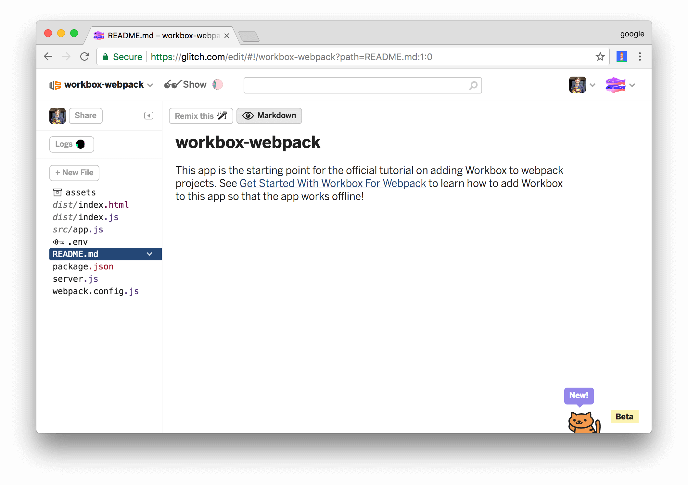

project_path: /web/tools/workbox/_project.yaml
book_path: /web/tools/workbox/_book.yaml
description: Learn how to make a webpack-based app work offline by adding Workbox to it.

{# wf_updated_on: 2018-03-19 #}
{# wf_published_on: 2017-10-31 #}
{# wf_blink_components: N/A #}

# Get Started With Workbox For Webpack {: .page-title }



In this codelab, you use Workbox to make a simple web app work offline.

If you'd like a conceptual overview of Workbox before starting this tutorial,
see the [overview](/web/tools/workbox/).

## Step 1: Set up your project {: #setup }

The project that you're going to add Workbox to is hosted on [Glitch][Glitch].
First, you need to set up Glitch so that you can edit your own copy of the
project.

[Glitch]: https://glitch.com/about/

1. Open the [demo](https://glitch.com/edit/#!/workbox-webpack).

     <figure>
       
       <figcaption>
         <b>Figure 1</b>. The starting point demo, hosted on Glitch
       </figcaption>
     </figure>

1. Click **workbox-webpack** at the top-left of the page. The **Project
   info and options** dropdown appears.
1. Click **Remix This**. Your browser redirects to an editable copy of
   the project.

<<_shared/try-initial.md>>

## Step 2: Install Workbox {: #install }

Next, you're going to add Workbox to the project to enable an offline
experience.

1. Re-focus the tab that shows you the source code of the project.
1. Click `package.json` to open that file.
1. Click **Add package**.
1. Type `workbox-webpack-plugin` within the **Add Package** text box, then
   click on the matching package to add it to the project.

     <aside class="note">**Note**: This is equivalent to running `npm install
     workbox-webpack-plugin`. In your own projects, you'll probably want to
     save Workbox as a [development dependency][devDependencies] instead by
     running `npm install workbox-webpack-plugin --save-dev`, since
     `workbox-webpack-plugin` is a build-time tool.</aside>

     <figure>
       
       <figcaption>
         <b>Figure 5</b>. Adding the <code>workbox-webpack-plugin</code>
         package
       </figcaption>
     </figure>

[devDependencies]: https://docs.npmjs.com/files/package.json#devdependencies

Every time you make a change to your code, Glitch automatically
re-builds and re-deploys your app. The tab running the live app automatically
refreshes, too.

## Step 3: Add Workbox to your Webpack build process {: #webpack }

Workbox is installed, but you're not using it in your webpack build process, yet.

1. Click `webpack.config.js` to open that file.
1. Import the Workbox plugin. The bold code is the code that you need to add to your project.

    <pre class="prettyprint">const path = require('path'),
        htmlPlugin = require('html-webpack-plugin'),
        cleanPlugin = require('clean-webpack-plugin'),
        dist = 'dist',
        <strong>workboxPlugin = require('workbox-webpack-plugin');</strong>
    </pre>

1. Call the Workbox plugin as the last step in `plugins`.

    <pre class="prettyprint">plugins: [
      new cleanPlugin([dist]),
      new htmlPlugin({
        filename: 'index.html',
        title: 'Get Started With Workbox For Webpack'
      }),
      <strong>new workboxPlugin.GenerateSW({
        swDest: 'sw.js',
        clientsClaim: true,
        skipWaiting: true,
      })</strong>
    ]</pre>

### Optional: How the config works {: #optional-config }

`webpack.config.js` determines how the app is built.

* `cleanPlugin` deletes `dist`, which is the path to the output directory.
* `htmlPlugin` re-generates the HTML output and places it back in `dist`.
* `workboxPlugin.GenerateSW` knows about the assets bundled by webpack, and generates
  service worker code for caching those files. Since Workbox revisions
  each file based on its contents, Workbox should always be the last
  plugin you call.

The object that you pass to `workboxPlugin.GenerateSW` configures how Workbox runs.

* `swDest` is where Workbox outputs the service worker that it generates. The parent directory for
  this file will be based on your `output.path` webpack configuration.
* `clientsClaim` instructs the latest service worker to take control of all
  clients as soon as it's activated. See [clients.claim][claim].
* `skipWaiting` instructs the latest service worker to activate as soon as it enters
  the waiting phase. See [Skip the waiting phase][skip].

[skip]: /web/fundamentals/primers/service-workers/lifecycle#skip_the_waiting_phase
[claim]: /web/fundamentals/primers/service-workers/lifecycle#clientsclaim

<<_shared/register.md>>

## Step 5: Add runtime caching {: #runtime }

Runtime caching lets you store content that's not under your control
when your app requests it at runtime. For example, by runtime caching the
Hacker News content which this app relies on, you'll be able to provide
an improved offline experience for your users. When users visit the app
while offline, they'll be able to see the content from the last time
that they had an internet connection.

1. Re-focus the tab that shows you the source code of your project.
1. Open `webpack.config.js` again.
1. Add a `runtimeCaching` property to your Workbox configuration.
   `urlPattern` is a regular expression pattern telling Workbox which
   URLs to store locally. *(When your app makes a network request at
   runtime, Workbox caches any request that matches the regular
   expression in `handler`, regardless of its origin. This means that
   you can cache content from external sites as well, as this example
   demonstrates.)* `handler` defines the caching strategy that Workbox
   uses for any matching URL. See [The Offline Cookbook][cookbook] for more
   on caching strategies.

    <pre class="prettyprint">new workboxPlugin.GenerateSW({
      swDest: 'sw.js',
      clientsClaim: true,
      skipWaiting: true,
      <strong>runtimeCaching: [{
        urlPattern: new RegExp('https://hacker-news.firebaseio.com'),
        handler: 'staleWhileRevalidate'
      }]</strong>
    })</pre>

[cookbook]: /web/fundamentals/instant-and-offline/offline-cookbook/

<<_shared/try-complete.md>>

## Step 6: Create your own service worker {: #inject }

Up until now, you've been letting Workbox generate your entire service
worker. If you've got a big project, or you want to customize how you cache
certain resources, or do custom logic in your service worker,
then you need to create a custom service worker that calls Workbox instead.
Think of the service worker code you write as a template. You write your custom logic with
placeholder keywords that instruct Workbox where to inject its code.

In this section, you add push notification support in your service worker. Since this is custom
logic, you need to write custom service worker code, and then inject the Workbox code into
the service worker at build-time.

1. Re-focus the tab containing your project source code.
1. Add the following line of code to the `init()` function in `app.js`.

    <pre class="prettyprint">function init() {
      ...
      if ('serviceWorker' in navigator) {
        window.addEventListener('load', () => {
          navigator.serviceWorker.register('/sw.js').then(registration => {
            console.log('SW registered: ', registration);
            <strong>registration.pushManager.subscribe({userVisibleOnly: true});</strong>
          }).catch(registrationError => {
            ...
          });
        });
      }
    }</pre>

    <aside class="warning">**Warning**: For simplicity, this demo asks for permission to
    send push notifications as soon as the service worker is registered. Best practices
    strongly recommend against out-of-context permission requests like this in real apps.
    See [Permission UX][UX].</aside>

[UX]: /web/fundamentals/push-notifications/permission-ux

1. Click **New File**, enter `src/sw.js`, then press <kbd>Enter</kbd>.
1. Add the following code to `src/sw.js`.

    <pre class="prettyprint">workbox.skipWaiting();
    workbox.clientsClaim();

    workbox.routing.registerRoute(
      new RegExp('https://hacker-news.firebaseio.com'),
      workbox.strategies.staleWhileRevalidate()
    );

    self.addEventListener('push', (event) => {
      const title = 'Get Started With Workbox';
      const options = {
        body: event.data.text()
      };
      event.waitUntil(self.registration.showNotification(title, options));
    });

    workbox.precaching.precacheAndRoute(self.__precacheManifest);</pre>

    <aside class="important">**Important**:
    `workbox.precaching.precacheAndRoute(self.__precacheManifest)` reads a list of URLs to precache
    from an externally defined variable, `self.__precacheManifest`. At build-time, Workbox injects
    code needed set `self.__precacheManifest` to the correct list of URLs.</aside>

1. Open `webpack.config.json`.
1. Remove the `runtimeCaching`, `clientsClaim`, and `skipWaiting` properties from your Workbox
   plugin configuration. These are now handled in your service worker code.
1. Change the `GenerateSW` to `InjectManifest` and add the `swSrc` property to instruct Workbox to
inject its code into a custom service worker.

    <pre class="prettyprint">new workboxPlugin.<strong>InjectManifest</strong>({
      <strong>swSrc: './src/sw.js',</strong>
      swDest: 'sw.js'
    })</pre>

<<_shared/end.md>>
