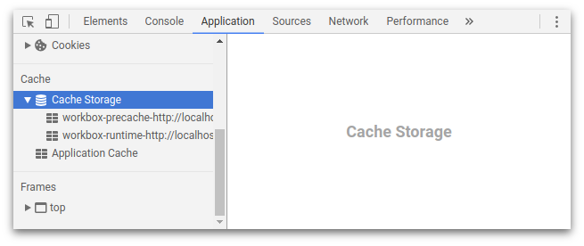
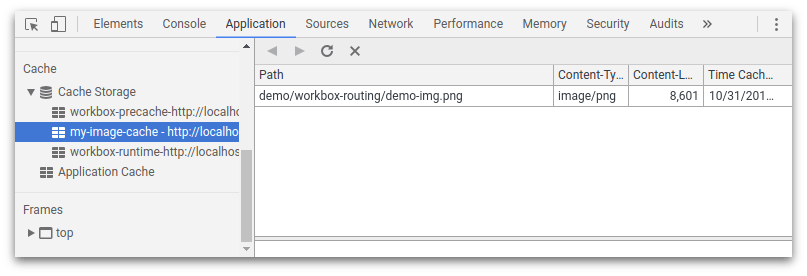
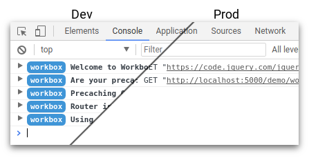
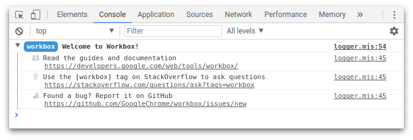
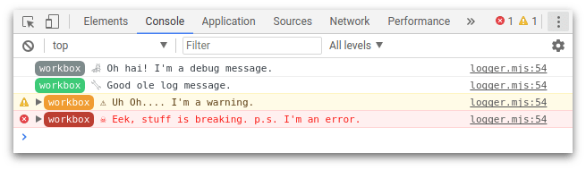

project_path: /web/tools/workbox/_project.yaml
book_path: /web/tools/workbox/_book.yaml
description: A guide on how to configure Workbox.

{# wf_updated_on: 2018-03-13 #}
{# wf_published_on: 2017-11-15 #}
{# wf_blink_components: N/A #}

# Configure Workbox {: .page-title }

Out of the box Workbox comes set up with some default values for cache
names and log levels. This guide will cover how you can change these values
and what will happen as a result.

## Configure Cache Names

As you start to use Workbox, you'll notice that caches are automatically created.



By default, Workbox will only create two caches, one for precaching and one
for runtime caching. Using `workbox-core` you can get the current cache names
like so:

```javascript
const precacheCacheName = workbox.core.cacheNames.precache;
const runtimeCacheName = workbox.core.cacheNames.runtime;
```

Both the precache and runtime cache names are made of three pieces of
information:

`<prefix>-<Cache ID>-<suffix>`

You can alter the cache names by altering all or some of these pieces of
information:

```javascript
workbox.core.setCacheNameDetails({
  prefix: 'my-app',
  suffix: 'v1'
});
```

The above would produce the cache names:

**Precache:** my-app-precache-v1

**Runtime:** my-app-runtime-v1

You can customize the entire cache name by parsing in a `precache` and
/ or `runtime` parameter.

```javascript
workbox.core.setCacheNameDetails({
  prefix: 'my-app',
  suffix: 'v1',
  precache: 'custom-precache-name',
  runtime: 'custom-runtime-name'
});
```

Note: We recommend changing the prefix for each of your projects. This
allows you to work on multiple projects using the same localhost port number
without mixing up the caches.

### Custom Cache Names in Strategies

Above discusses how to customize the **default cache names** used
for precaching and runtime caching, but it’s not uncommon to want
additional caches for specific uses, like a cache just for images.

In other parts of the Workbox API’s there will in an option to supply a
`cacheName` property as an option. For example, the
[runtime strategies](/web/tools/workbox/modules/workbox-strategies)
accepts a `cacheName` option. In these cases, the cache name will be used
exactly as you define, the prefix and suffix **will not be used**.

If you wanted to use a cache for images, you might configure a route like this:

```javascript
workbox.routing.registerRoute(
  /.*\.(?:png|jpg|jpeg|svg|gif)/g,
  workbox.strategies.CacheFirst({
    cacheName: 'my-image-cache',
  })
);
```

This will result in images being stored in a cache called `my-image-cache`.



### Custom Fetch Options in Strategies

When using a custom strategy for runtime caching, you might find the need to customize some aspects
of the outgoing requests. For instance, a request might not include credentials (i.e. cookies) by
default, but you happen to know that your use case requires credentials to be set.

To handle this scenario, you can pass in a configuration value named `fetchOptions` to a strategy's
constructor, corresponding to the
[`init` options](https://developer.mozilla.org/en-US/docs/Web/API/WindowOrWorkerGlobalScope/fetch#Parameters)
used in the underlying Fetch API. These options will then be applied to all outgoing requests
handled by that strategy.

For instance, to ensure that all of your outgoing requests matching a given third-party URL end up
using a credentials mode of 'include', you can set up the following route:

```javascript
workbox.routing.registerRoute(
  new RegExp('https://third-party\.example\.com/'),
  workbox.strategies.NetworkFirst({
    fetchOptions: {
      credentials: 'include',
    },
  })
);
```

Refer to the
[Fetch API documentation](https://developer.mozilla.org/en-US/docs/Web/API/WindowOrWorkerGlobalScope/fetch#Parameters)
for a full list of possible configuration values.

### Configure Debug Builds vs Production Builds

For each of the Workbox service worker libraries, there are two builds, one for
development and one for production.

- **Debug Builds:** Come un-minified, have additional logging and performs
rigorous assertion checking to make development as easy as possible.

- **Production Builds:** Are minified with any optional logging and logic
stripped from the build.

If you are using `workbox-sw`, it’ll automatically use development builds
whenever you are developing on a localhost origin, otherwise it’ll use
production builds.



You can override this behavior with the `debug` option. Setting to true will
force debug builds, setting to false will force production builds.

```javascript
// Force development builds
workbox.setConfig({ debug: true });

// Force production builds
workbox.setConfig({ debug: false });
```

If you are using the modules directly (via CDN of from npm modules), you can
switch between development and production builds by changing the file extension
between `<module>.dev.js` and `<module>.prod.js`.

## Configure Log Levels

Workbox will print messages to the console to help during development.



You can determine the level of a log from the color code:



You can alter the log level to show more or less logs by setting the log level,
like so:

```javascript
// The most verbose - displays all logs.
workbox.core.setLogLevel(workbox.core.LOG_LEVELS.debug);

// Shows logs, warnings and errors.
workbox.core.setLogLevel(workbox.core.LOG_LEVELS.log);

// Show warnings and errors.
workbox.core.setLogLevel(workbox.core.LOG_LEVELS.warn);

// Show *just* errors
workbox.core.setLogLevel(workbox.core.LOG_LEVELS.error);

// Silence all of the Workbox logs.
workbox.core.setLogLevel(workbox.core.LOG_LEVELS.silent);
```
