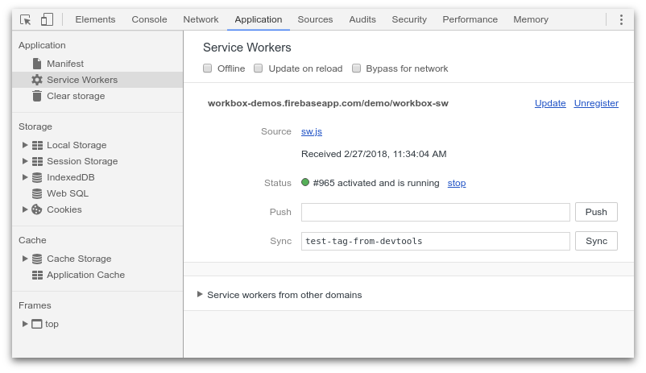
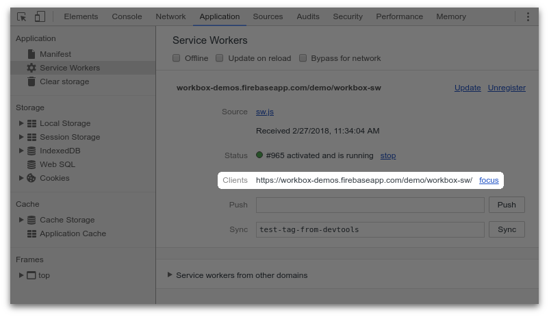

project_path: /web/tools/workbox/_project.yaml
book_path: /web/tools/workbox/_book.yaml
description: Frequently Asked Questions when developing with Workbox

{# wf_updated_on: 2018-02-28 #}
{# wf_published_on: 2018-02-28 #}
{# wf_blink_components: N/A #}

# FAQ {: .page-title }

## Why isn't my service worker being used? {#sw-scope}

This is a fairly common and easy problem to hit when working with service
workers.

You'll register the service worker, everything seems to work and files are
cached, but refreshing the page or going offline doesn't show your files
(i.e. the browser isn't using the files in the cache).

The reason this occurs is that the "scope" of your service worker doesn't
match your page.

*What is a service worker scope?* When you register a service worker, it
is given a “scope” which by default is the location of the service worker.
The scope restricts which pages are "controlled" by a service worker.

For example, if we register a service worker with this code:

```javascript
navigator.serviceWorker.register('/blog/sw.js');
```

The service worker will have a scope of `/blog/` as that is the path
of the service worker file.

This means that any webpage that starts with `/blog/`, will be controlled
by our service worker because the scopes match.

This is very common as every tends to put their javascript files in one
directory, for example `/scripts/sw.js`. The problem is that the scope for
this service worker would be `/scripts/` and is probably not the intended
behavior.

The normal solution is to move your service worker to the root of your site
`/sw.js`.

### How can I check if scope is the problem?

One quick way to tell if the scope of your service worker is the problem is
to use Chrome DevTools to see if your service worker is controlling any
window clients.

Open DevTools for your site and go to `Application > Service Workers`.

Find your service worker and look for a `Clients` entry.

If you don't see it (like the image below) then scoping is likely to be an
issue.



If the scoping is right, your web page should show up as a client, as shown
below.



### Can I alter the scope without moving the file?

You can alter the scope in a few different ways. For example, let's say
our service worker was served from `/sw.js` but we only want it to control
pages starting with `/blog/`. We can just register the service worker with
a scope option:

```javascript
navigator.serviceWorker.register('/sw.js', {scope: '/blog/'});
```

This tells the browser that this service worker should only control pages
that have a URL starting with `/blog/`. This changes from the default scope
which would be ‘/’.

One thing to note is that scopes must be made longer than the
location of the service worker file, but they can’t be shortened or
completely different from the location of the service worker file.

```javascript
// OK
navigator.serviceWorker.register(‘/blog/sw.js’, {scope: ‘/blog/article/’});

// Not OK because the scope is shorter than the path /blog/
navigator.serviceWorker.register(‘/blog/sw.js’, {scope: ‘/’});

// Not OK because the scope doesn't start with /blog/
navigator.serviceWorker.register(‘/blog/sw.js’, {scope: ‘/about/’});
```

There is however a way around this limitation, if the web server that
serves the service worker file includes a ‘Service-Worker-Allowed’
header, the header value can define the valid minimum scope.

```javascript
// OK when ‘Service-Worker-Allowed’ header is set to ‘/’
navigator.serviceWorker.register(‘/blog/sw.js’, {scope: ‘/’});
```
