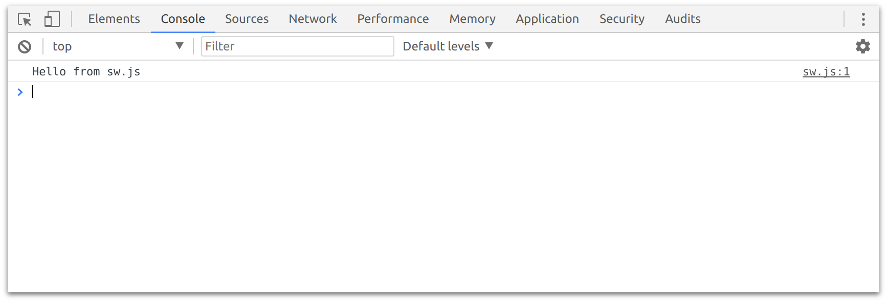
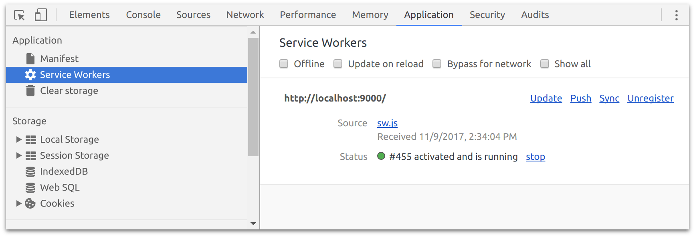
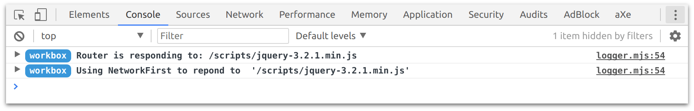
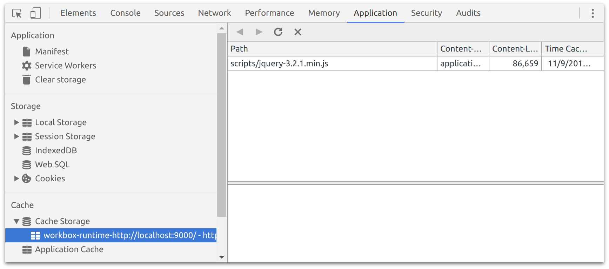

project_path: /web/tools/workbox/_project.yaml
book_path: /web/tools/workbox/_book.yaml
description:Get Started with Workbox.

{# wf_blink_components: N/A #}
{# wf_updated_on: 2020-01-15 #}
{# wf_published_on: 2017-11-15 #}

# Get Started {: .page-title }

This guide will show you how to get up and running with Workbox to route
common requests for a web page and demonstrate how to cache using a common
strategy.

Since most websites contain CSS, JavaScript and images, let’s look at how we
can cache and serve these files using a service worker and Workbox.

## Create and Register a Service Worker File

Before we can use Workbox, we need to create a service worker file and
register it from our web page.

Start by creating a file called `service-worker.js` at the root of your site and add a
console message to the file (this is so we can see it load).

```javascript
console.log('Hello from service-worker.js');
```

In your web page, register your new service worker file like so:



This tells the browser this is the service worker to use for the site.

If you refresh your page, you'll see the log from your service worker file.



Looking in the “Application” tab in Chrome DevTools, you should see your service
worker registered.



Note: Click the “Update on reload” checkbox to make it easier to develop with
your new service worker.

Now that we have a service worker registered, let’s look at how we can use
Workbox.

## Importing Workbox

There two ways to import Workbox into your service worker:

- Using the [workbox-sw](/web/tools/workbox/modules/workbox-sw) loader, which
  loads Workbox packages at runtime from our CDN.
- Using a [bundler](/web/tools/workbox/guides/using-bundlers) to include Workbox
  pages in your service worker at build time.

For quick experimentation and prototyping, loading Workbox from the CDN is
usually easiest. On the other hand, bundling your service worker is generally
recommended for more control and better integrations with existing tooling (for
example, editor integration or writing your service worker in TypeScript).

### From the CDN

To load Workbox from our CDN, update your service worker file to import the
`workbox-sw.js` file via the `importScripts()` method.

<pre class="prettyprint js">
importScripts('');

if (workbox) {
  console.log(`Yay! Workbox is loaded 🎉`);
} else {
  console.log(`Boo! Workbox didn't load 😬`);
}
</pre>

With this you should see the “Yay” message, which indicates that Workbox has
loaded successfully.


Now we can start using Workbox.

Warning: Importing `workbox-sw.js` will create a [`workbox`
object](/web/tools/workbox/modules/workbox-sw) inside of your service worker,
and that instance is responsible for importing all other helper libraries, based
on the features you use. Due to restrictions in the [service worker
specification](https://www.chromestatus.com/feature/5748516353736704), these
imports need to happen either inside of an `install` event handler, or
synchronously in the top-level code for your service worker. More details, along
with workarounds, can be found in the [`workbox-sw`
documentation](/web/tools/workbox/modules/workbox-sw#avoid_async_imports).

### Using a bundler

When loading Workbox from our CDN using the `workbox-sw` loader, a global
`workbox` object is created, and each of the individual Workbox packages can be
accessed via a property on the `workbox` global (e.g. `workbox.precaching`,
`workbox.routing`, or `workbox.backgroundSync`).

When using a bundler to create your service worker, you install the Workbox
packages you want to use from [npm](https://www.npmjs.com/), and then you use
`import` statements to directly reference the Workbox modules you want to use.
In this scenario there is no global `workbox` object. Instead, your bundler will
inline your imported Workbox modules directly into the service worker file it
generates. For example:

```javascript
import {precaching} from 'workbox-precaching';
import {registerRoute} from 'workbox-routing';
import {BackgroundSyncPlugin} from 'workbox-background-sync';

// Use the above modules somehow...
```

For more details see [Using Bundlers (webpack/Rollup) with
Workbox](/web/tools/workbox/guides/using-bundlers).

Alternatively, if you're using [webpack](https://webpack.js.org/) you can use
the [workbox-webpack-plugin](/web/tools/workbox/modules/workbox-webpack-plugin)
which handles bundling your service worker for you.

## Using Workbox

One of Workbox’s primary features is it’s routing and caching strategy
modules. It allows you to listen for requests from your web page and determine
if and how that request should be cached and responded to.

Let’s add a cache fallback to our JavaScript files. The easiest way to do this
is to register a route with Workbox that will match any `.js` files that are
requested, which we can do with a regular expression:

Note: the examples in this guide all use `import` syntax to load the various
Workbox modules. If you prefer to load Workbox from the CDN, see the
`workbox-sw` documentation for details on how to convert these code examples to
code that uses the `workbox` global.

```javascript
import {registerRoute} from 'workbox-routing';

registerRoute(
  /\.js$/,
  /* ... */
);
```

The above code tells Workbox that when a request is made, it should see if the
regular expression matches part of the URL, and if it does, do something with
that request. For this guide, that “do something” is going to be passing the
request through one of Workbox’s caching strategies.

If we want our JavaScript files to come from the network whenever possible,
but fallback to the cached version if the network fails, we can use the
“network first” strategy to achieve this.

```javascript
import {registerRoute} from 'workbox-routing';
import {NetworkFirst} from 'workbox-strategies';

registerRoute(
  /\.js$/,
  new NetworkFirst()
);
```

Add this code to your service worker and refresh the page. If your web page
has JavaScript files in it, you should see some logs similar to this:



Workbox has routed the request for any `.js` files and used the network first
strategy to determine how to respond to the request. You can look in the
caches of DevTools to check that the request has actually been cached.



Workbox provides a few caching strategies that you can use. For example, your
CSS could be served from the cache first and updated in the background or your
images could be cached and used until they're a week old, after which they’ll need
updating.

```javascript
import {registerRoute} from 'workbox-routing';
import {CacheFirst, StaleWhileRevalidate} from 'workbox-strategies';
import {ExpirationPlugin} from 'workbox-expiration';

registerRoute(
  // Cache CSS files.
  /\.css$/,
  // Use cache but update in the background.
  new StaleWhileRevalidate({
    // Use a custom cache name.
    cacheName: 'css-cache',
  })
);

registerRoute(
  // Cache image files.
  /\.(?:png|jpg|jpeg|svg|gif)$/,
  // Use the cache if it's available.
  new CacheFirst({
    // Use a custom cache name.
    cacheName: 'image-cache',
    plugins: [
      new ExpirationPlugin({
        // Cache only 20 images.
        maxEntries: 20,
        // Cache for a maximum of a week.
        maxAgeSeconds: 7 * 24 * 60 * 60,
      })
    ],
  })
);
```

## What Else Can Workbox Do?

Routing and caching strategies are performed by the `routing` and
`strategies` modules, but there are plenty of other modules, each offering
specific behaviors that you can use in your service worker.

You'll find a number of guides that cover other features of Workbox as well
as more information on configuring Workbox. Find a full list on the left, but
the next natural step is to enable precaching, which is the process of adding
files to the cache when your service worker loads.

<a href="./precache-files" class="button">Learn More About Precaching</a>
