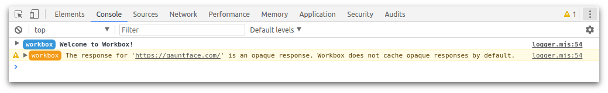

project_path: /web/tools/workbox/_project.yaml
book_path: /web/tools/workbox/_book.yaml
description: A guide on how to handle third party requests with Workbox.

{# wf_updated_on: 2020-01-15 #}
{# wf_published_on: 2017-11-15 #}
{# wf_blink_components: N/A #}

# Handle Third Party Requests {: .page-title }

A lot of websites will use files from a different origin. For example, if you
use Google Fonts, you’ll be importing the styles and fonts from
`https://fonts.googleapis.com/`. Any request for a file from a different
origin is known as a cross-origin request and these requests require special
handling in Workbox.

In this guide we are going to look at how a cross-origin request can be
different and what you can do in Workbox to support these requests.

## Cross-Origin Requests and Opaque Responses

One of the security mechanisms in browsers is that when a piece of JavaScript
requests a URL from a different origin, it’s prevented from being able to
access the body and many other details of the response.

When you get a response like this, it’s known as an "opaque response". Some
requests can be read in JavaScript if the server returns
[CORS headers](https://developer.mozilla.org/en-US/docs/Web/HTTP/CORS), but a
number of sites will not do this.

In service workers, you can make requests to third-parties and cache the
responses. For opaque responses, the contents of the Response will still
be hidden. You can’t even check the status code of the response. Because
of this, Workbox treats opaque responses differently.

You can learn more about opaque responses from this
[Stack Overflow Q&A](https://stackoverflow.com/questions/39109789/what-limitations-apply-to-opaque-responses).

### Remember to Opt-in to CORS Mode

If you're loading assets from a third party web server that *does* support CORS,
but you're unexpectedly getting back opaque responses, it could be due to how
your web app makes those cross-origin requests.

For example, the following HTML will trigger
[`no-cors` requests](https://fetch.spec.whatwg.org/#concept-request-mode) that
lead to opaque responses, even if the `example.com` server supports CORS:

```html
<link rel="stylesheet" href="https://example.com/path/to/style.css">

```

In order to explicitly trigger a
[`cors` request](https://fetch.spec.whatwg.org/#concept-request-mode), and get
back a non-opaque response, you need to explicitly opt-in to CORS mode by adding
the
[`crossorigin` attribute](https://developer.mozilla.org/en-US/docs/Web/HTML/CORS_settings_attributes)
to your HTML:

<pre class="prettyprint">
&lt;link <b>crossorigin="anonymous"</b> rel="stylesheet" href="https://example.com/path/to/style.css"&gt;
&lt;img <b>crossorigin="anonymous"</b> src="https://example.com/path/to/image.png"&gt;
</pre>

## Workbox Caches Opaque Response Sometimes

In general, Workbox will not cache opaque responses.

The reason for this is that it’s very easy to get into a bad state.

Let’s say a developer set up a route with a `CacheFirst` strategy.

```javascript
import {registerRoute} from 'workbox-routing';
import {CacheFirst} from 'workbox-strategies';

registerRoute(
  'https://cdn.google.com/example-script.min.js',
  new CacheFirst(),
);
```

This response would cache the opaque response and serve it up from that point
onwards. The problem is that if that request fails for any reason, Workbox
won’t be able to detect this and will continue to serve up the broken response.
The user will be in a broken state.

However, it’s not a bad thing to want to try and add some fault tolerance to
these requests so Workbox will allow opaque responses to be cached with the
`NetworkFirst` and `StaleWhileRevalidate` strategies. Since these strategies
regularly update the cached response, it’s much safer to cache them as
hopefully a bad request will be short lived and used rarely.

```javascript
import {registerRoute} from 'workbox-routing';
import {NetworkFirst, StaleWhileRevalidate} from 'workbox-strategies';

registerRoute(
  'https://cdn.google.com/example-script.min.js',
  new NetworkFirst(),
);

// OR

registerRoute(
  'https://cdn.google.com/example-script.min.js',
  new StaleWhileRevalidate(),
);
```

If you use another caching strategy and an opaque response is returned,
Workbox will log a warning letting you know that the response wasn’t cached.



## Force Caching of Opaque Responses

If you are certain that you want to cache an opaque response, you can configure
that behavior using a plugin. This example uses
[workbox-cacheable-response](/web/tools/workbox/modules/workbox-cacheable-response):

```javascript
import {registerRoute} from 'workbox-routing';
import {NetworkFirst, StaleWhileRevalidate} from 'workbox-strategies';
import {CacheableResponsePlugin} from 'workbox-cacheable-response';

registerRoute(
  'https://cdn.google.com/example-script.min.js',
  new CacheFirst({
    plugins: [
      new CacheableResponsePlugin({
        statuses: [0, 200]
      })
    ]
  }),
);
```

<a href="./using-plugins" class="button">Learn more about using plugins</a>

<aside markdown="1" class="warning">
<strong>Warning:</strong> This will cache a response that could be an error, which would then never
get updated!
</aside>
